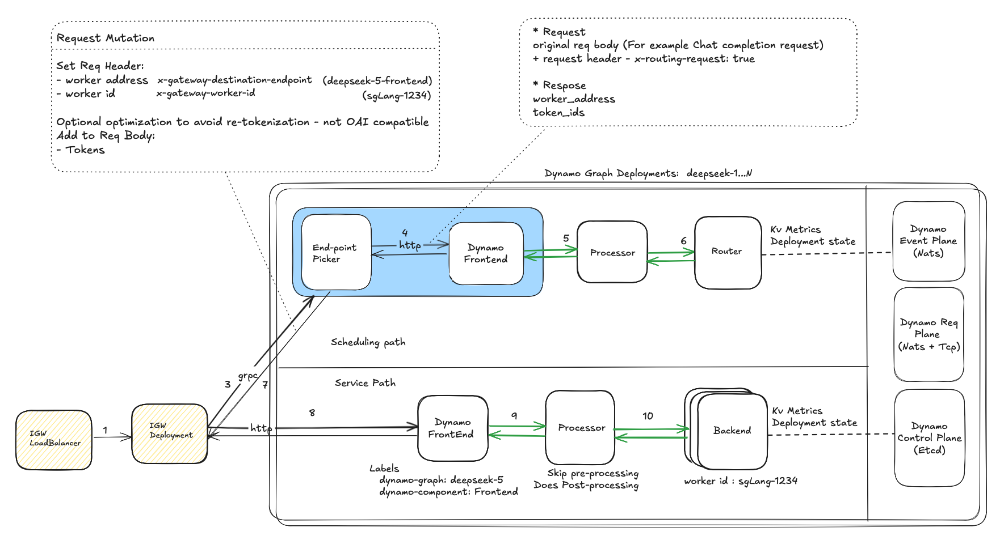

# Dynamo integration with Inference Gateway

**Status**: Draft

**Authors**: [Biswa Panda](https://github.com/biswapanda) 

**Category**: Architecture

**Replaces**: [Link of previous proposal if applicable] 

**Replaced By**: [Link of previous proposal if applicable] 

**Sponsor**: Itay, Maksim, Neelay

**Required Reviewers**: [Names of technical leads that are required for acceptance]

**Review Date**: [Date for review]

**Pull Request**: [Link to Pull Request of the Proposal itself]

**Implementation PR / Tracking Issue**: [Link to Pull Request or Tracking Issue for Implementation]

# Summary

This proposal outlines the integration of Dynamo components with the Gateway API Inference Extension. 

## Acronyms & Abbreviations

**EPP:** Endpoint Picker Protocol
**IGW:** Inference Gateway

## Goals

* Support Inference gataway concepts in Dynamo 
* Maintain backward compatibility with existing EPP functionality
* Reuse dynamo components

### Non Goals

* Replace existing EPP internal scheduling
* Modify core Gateway API specifications
* Change existing Dynamo worker interfaces significantly

## Requirements

### REQ 1 External Processing Integration

Dynamo EPP (Endpoint picker) **MUST** support calling LLM processors for request preprocessing and tokenization while maintaining the existing ext-proc interface.

### REQ 2 Flexible Routing Strategies

The system **SHOULD** support both external routing (via Dynamo Router) and internal EPP scheduling based on request configuration.

### REQ 4 Unified Dynamo deployment

Dynamo EPP and components (Processor, Router, Workers) **MUST** be deployable within Kubernetes through a unified helm chart to maintain version compatibility.

### REQ 5 Maintain compatibility with Inference Gateway protocols

Dynamo EPP **MUST** be compatible with Inference Gateway

# Proposal

## Architecture Overview

This architecture unifies Inference Gateway with Dynamo Graph deployment. See diagram below for detailed component interactions.



### Data flow

### Decision Points

#### EPP integration with Dynamo: plugin vs sidecar vs external callout service

##### sidecar container 
Pro
- Reduced network hops: Direct communication between EPP and Dynamo components within the same pod
- Lower latency: No network overhead for inter-component communication
- Simpler deployment and management: Deployed as a single unit, easier to manage lifecycle

Con
- Tightly coupled scaling: Scaling decisions for EPP and Frontend are coupled

##### external callout service
Pro
- completely isolated deployments 
- Each component can be deployed and scaled independently

Con
- Additional network hops: More latency due to network communication between services
- Service discovery complexity: Need to manage service endpoints and load balancing
- Additional network failure points in the request path

##### plugin
Pro
- Minimum number of network hops
- Simpler architecture without additional layer
- Lower latency for request processing

Con
- Dynamo runtime/component don't have native integration with golang
- Hard to scale across models
- Tight coupling with golang based implementation

## Problems
1. Currently EPP schedluling has tightly coupling with in-porcess preprocessing.
  It's hard to scale/maintain it accross different models.

2. double tokenization during scheduling and service path

## Guiding Principles

1. Composibiltiy: EPP should externalize scheduling decision to dynamo router
2. DRY: Aim to reduce duplications in preprocessing steps (tokenization, prompt template application)
3. Compatibility: Maintain full compatibility with inference gateway api
4. Reduce network hops to minimize tail latency

## Design constraints
- Dynamo componetns (processor, router) use dynamo native transport (two part json messsages over nats)
- Dynamo does not support co-scheduling in disaggregated mode. Currently request flow goes from decode to prefill.

## Current state of IGW and Dynamo

### Dynamo Graph deployment
A `Dynamo Graph` contains one or more `Dynamo Component`s and this one-to-many relation is reflected in corresponding Kubernetes deployment Kubernetes CRs DynamoGraphDeployment and DynamoComponentDeployments respectively.

Each dynamo component deployment creates a Kuberenetes deployment which manages component's pods.


| Module | Dynamo | IGW
| :---- | :---- |
| **Event Plane** | Push based KV/capacity related metric events using Nats | Scrapers populate Datastore with metrics for a pod (pull based)
| **Service Plane** | Custom nats/tcp based protocol, uses json serialization | Standard HTTP based protocol
| **Control Plane** | Planner is responsible for scaling decisions, Orchestration happens via operator | TODO


### Inference Gateway Request Flow:
```
HTTP Request
     │
     ▼
┌─────────────┐    Extract model name   ┌──────────────────┐
│   Gateway   │ ──────────────────────► │ InferenceModel   │
│ (HTTPRoute) │                         │ (Model Config)   │
└─────────────┘                         └──────────────────┘
     │                                           │
     │ Route to backend                          │ References
     ▼                                           ▼
┌─────────────┐    Smart routing via     ┌──────────────────┐
│InferencePool│ ◄─────────────────────── │ Endpoint Picker  │
│ (Compute)   │      EPP extension       │ Extension (EPP)  │
└─────────────┘                          └──────────────────┘
     │
     ▼
┌─────────────┐
│ Model Server│
│    Pods     │
└─────────────┘
```

## Deferred to Implementation
- Fallback mechanisms for failures
- Metrics and observability integration

# Alternate Solutions

## Alt 1 Direct Tokenizer Integration in golang based EPP (current EPP architecture)

**Pros:**
**Cons:**
- Less flexible for different models
- Harder to maintain separation of concerns

# Alt 2: Tokenization Extension Chain
Instead of embedding tokenization in EPP, create a dedicated tokenization extension that runs before EPP in the processing chain:

```
Client -> Tokenization Extension -> EPP ->  Model Server
```

Pro:
- Follows Gateway API's extensible processing chain philosophy
- Separates concerns
- Can be reused across different routing strategies

Con:
- complicated deployment
- Additional network hop
- More complex chain management

# Related Proposals
* [Gateway API Inference Extension Documentation](https://gateway-api-inference-extension.sigs.k8s.io/)
* [Envoy External Processing Filter](https://www.envoyproxy.io/docs/envoy/latest/configuration/http/http_filters/ext_proc_filter)
* [Gateway API Specification](https://gateway-api.sigs.k8s.io/)