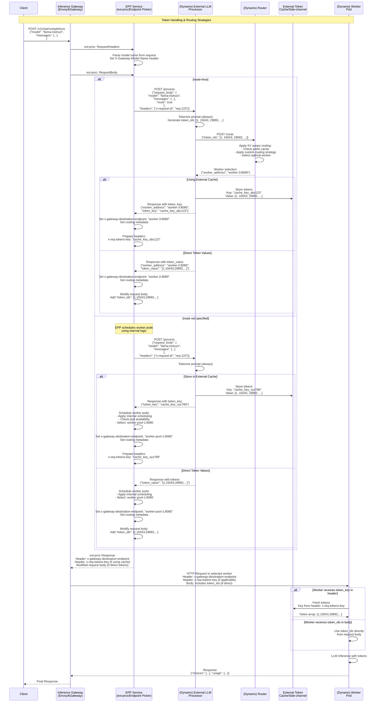

# Dynamo integration with Inference Gateway

**Status**: Draft

**Authors**: [Biswa Panda](https://github.com/biswapanda) 

**Category**: Architecture

**Replaces**: [Link of previous proposal if applicable] 

**Replaced By**: [Link of previous proposal if applicable] 

**Sponsor**: [Name of code owner or maintainer to shepard process]

**Required Reviewers**: [Names of technical leads that are required for acceptance]

**Review Date**: [Date for review]

**Pull Request**: [Link to Pull Request of the Proposal itself]

**Implementation PR / Tracking Issue**: [Link to Pull Request or Tracking Issue for Implementation]

# Summary

This proposal outlines the integration of Dynamo components with the Gateway API Inference Extension. 

The current Inference Gateway is tightly coupled with model's tokenizer. However use cases require:
1. **External Tokenization**: Preprocessing requests outside the gateway for specialized tokenization logic
2. **KV-Aware Routing**: Intelligent routing based on prefix cache status and token analysis
3. **Flexible side channel to offload tokens**: Support for both external cache and direct token passing strategies. This would be helpful for transfering large blob of tokens for VLMs (image/audio/video tokens)
4. **Unified Dynamo Architecture**: Consolidated deployment model for all processing components

## Terminology & Definitions

| Term | Definition |
| :---- | :---- |
| **Dynamo EPP** | Enhanced Endpoint Picker Protocol service with Dynamo integration |
| **Dynamo Processor** | Dynamo component responsible for request tokenization and preprocessing |
| **Dynamo Router** | Dynamo component responsible for KV aware Routing strategy |

## Acronyms & Abbreviations

**EPP:** Endpoint Picker Protocol
**IGW:** Inference Gateway

## Goals

* Integrate Dynamo Processor for request preprocessing and tokenization
* Enable KV-aware routing through Dynamo Router Service
* Support flexible token management (cache keys vs direct values)
* Provide unified deployment architecture for all Dynamo components
* Maintain backward compatibility with existing EPP functionality

### Non Goals

* Replace existing EPP internal scheduling completely
* Modify core Gateway API specifications
* Change existing worker pod interfaces significantly

## Current state of IGW and Dynamo

| Module | Dynamo | IGW
| :---- | :---- |
| **Event Plane** | Push based KV/capacity related metric events using Nats | Scrapers populate Datastore with metrics for a pod (pull based)
| **Service Plane** | Custom nats/tcp based protocol, uses json serialization | Standard HTTP based protocol
| **Control Plane** | Planner is responsible for scaling decisions, Orchestration happens via operator | TODO

## Requirements

### REQ 1 External Processing Integration

Dynamo EPP (Endpoint picker) **MUST** support calling LLM processors for request preprocessing and tokenization while maintaining the existing ext-proc interface.

### REQ 2 Flexible Routing Strategies

The system **SHOULD** support both external routing (via Dynamo Router) and internal EPP scheduling based on request configuration.

### REQ 4 Unified Dynamo deployment

Dynamo EPP and components (Processor, Router, Workers) **MUST** be deployable within Kubernetes through a unified helm chart to maintain version compatibility.

### REQ 5 Maintain compatibility with Inference Gateway protocols

Dynamo EPP **MUST** be compatible with Inference Gateway

# Proposal

## Problems
1. Tight coupling with golang based tokenizer:
  current llm-d based implementation has tight coupling between EPP and tokenizer. 
  It's hard to scale/maintain it accross different LLM/VLM architectures.
2. Larger tokens payload transfer from processor to worker: 
 VLM encoded tokens generated in pre-processing/encode steps could be much larger payload than original request's (image_url)[https://github.com/ai-dynamo/dynamo/tree/main/examples/multimodal#client]. Updating the request body with tokens will increase payload size of request.

## Guiding Principles

1. Composibiltiy: EPP should externalize scheduling decision to dynamo router
2. DRY: Aim to reduce duplications in preprocessing steps (tokenization, prompt template application)
3. Compatibility: Maintain full compatibility with inference gateway api

## Architecture Overview

This architecture unifies Inference Gateway with Dynamo Graph deployment. See diagram below for detailed component interactions.


### Dynamo Graph deployment
A `Dynamo Graph` contains one or more `Dynamo Component`s and this one-to-many relation is reflected in corresponding Kubernetes deployment Kubernetes CRs DynamoGraphDeployment and DynamoComponentDeployments respectively.

Each dynamo component deployment creates a Kuberenetes deployment which manages component's pods.


### Inference Gateway Request Flow:

```
HTTP Request
     │
     ▼
┌─────────────┐    Extract model name   ┌──────────────────┐
│   Gateway   │ ──────────────────────► │ InferenceModel   │
│ (HTTPRoute) │                         │ (Model Config)   │
└─────────────┘                         └──────────────────┘
     │                                           │
     │ Route to backend                          │ References
     ▼                                           ▼
┌─────────────┐    Smart routing via     ┌──────────────────┐
│InferencePool│ ◄─────────────────────── │ Endpoint Picker  │
│ (Compute)   │      EPP extension       │ Extension (EPP)  │
└─────────────┘                          └──────────────────┘
     │
     ▼
┌─────────────┐
│ Model Server│
│    Pods     │
└─────────────┘
```

### TODO: Sequence diagram

### TODO: headers and req/response message formats


## TODO: replace with simpler version


# Implementation Details

## Key Components

### Dynamo EPP (ext-proc)
- Integrates with Gateway via ext-proc protocol
- Parses model names and sets headers `X-Gateway-Model-Name` 
- Calls External LLM Processor for tokenization
- Handles both external and internal routing strategies

### Dynamo Processor
- Performs request tokenization
- Supports both routing modes (external via Router, internal via EPP)
- 
- Optional: Returns worker selection and dynamo backend framework (vLLM/Trtllm/sglang) agnostic request 

### Dynamo Router Service
- Implements KV-aware routing algorithms
- Analyzes token_ids for optimal worker selection based on prefix cache
- Called only when `route=true` is specified

### Dynamo Worker Pods
- Perform LLM inference with preprocessed tokens
- Support both token retrieval methods (cache keys, direct values)
- Maintain compatibility with existing worker interfaces
- exposes HTTP endpoint for direct intgerration with Inference gateway

### Token Cache / Side channel
- External storage system which provides a Key/Value store interface transfer token_ids from processor to worker
- Stores tokenized data with generated keys
- Enables efficient token sharing between components
- Optional component (direct token passing also supported)

## Configuration

### Environment Variables
- `EXTERNAL_LLM_PROCESSOR_ENDPOINT`: Dynamo External LLM Processor URL
- `USE_EXTERNAL_LLM_PROCESSOR`: Enable/disable external pre-processing (apply prompt templates/tokenization)
- `USE_EXTERNAL_LLM_ROUTER`: Enable/disable external routing (in this case it's Dynamo Router)

### Headers
- `X-Gateway-Model-Name`: Set by EPP from parsed model name in user request's body

## Deferred to Implementation

- Fallback mechanisms for external service failures
- Metrics and observability integration

# Implementation Phases

## Phase 1 Core Integration
**Supported API / Behavior:**
- External tokenization via Dynamo Processor
- External scheduling/routing using Dynamo Router

**Not Supported:**
- Pass tokens in request body

## Phase 2 Tokens transfer
**Supported API / Behavior:**
- Pass tokens in request body

# Related Proposals
* Gateway API Inference Extension Architecture
* EPP Architecture Proposal 
* Model Server Protocol

# Alternate Solutions

## Alt 1 Direct Tokenizer Integration in golang based EPP (current EPP architecture)

**Pros:**
- Simpler architecture without additional layer
- Lower latency for request processing
- Fewer network hops

**Cons:**
- Less flexible for different models
- Harder to maintain separation of concerns

**Reason Rejected:**
- Violates Gateway API integration principles
- Reduces portability across models
- Increases complexity/TCO by using golang based tokenizer

## Alt 2 Frontend+Processor as Sidecar 
**Pros:**
- Lesser network hops from IGW to worker
- Can use Zmq/IPC to avoid a network round trip through Nats

**Cons:**
- Harder to maintain separation of concerns
- Hard to scale Frontend+Processor (cpu bound) independent of workers (gpu bound)
- Added complexity at operator and bootstraping

## References

* [Gateway API Inference Extension Documentation](https://gateway-api-inference-extension.sigs.k8s.io/)
* [Envoy External Processing Filter](https://www.envoyproxy.io/docs/envoy/latest/configuration/http/http_filters/ext_proc_filter)
* [Gateway API Specification](https://gateway-api.sigs.k8s.io/)