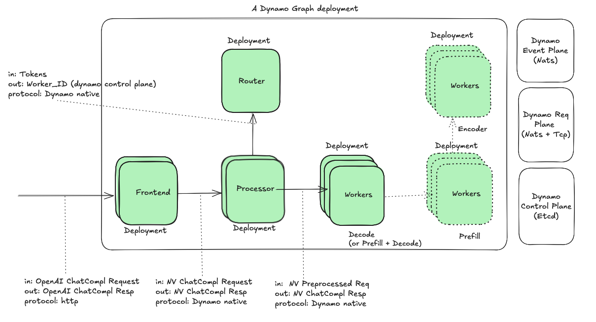

# Dynamo integration with Inference Gateway

**Status**: Draft

**Authors**: [Biswa Panda](https://github.com/biswapanda) 

**Category**: Architecture

**Replaces**: [Link of previous proposal if applicable] 

**Replaced By**: [Link of previous proposal if applicable] 

**Sponsor**: Itay, Maksim, Neelay

**Required Reviewers**: [Names of technical leads that are required for acceptance]

**Review Date**: [Date for review]

**Pull Request**: [Link to Pull Request of the Proposal itself]

**Implementation PR / Tracking Issue**: [Link to Pull Request or Tracking Issue for Implementation]

# Summary

This proposal outlines the integration of Dynamo components with the [Gateway API Inference Extension](https://gateway-api-inference-extension.sigs.k8s.io)

## Acronyms

**EPP:** Endpoint Picker Protocol
**IGW:** Inference Gateway

## Why 

1. `Model Aware Routing`
    Enables traffic management across multiple models and their replicas.  
    Manipulate incoming traffic. 

2. `Request scheduling`
    Schedule requests based on prefix cache match
    Route requests to different dynamo graph deployments based on SLA & priority

3. `Centralized control`
    Enables centralized path and management of: auth, RBAC, rate limiting, usage tracking etc.

## Goals

* Map Inference gateway concepts in Dynamo
* Maintain backward compatibility with existing EPP functionality
* extend IGW to use dynamo router
* Minimize network hops

### Non Goals

* Replace existing EPP internal scheduling
* Modify core Gateway API specifications
* Change existing Dynamo worker interfaces significantly

## Requirements

### REQ 1 External Processing Integration

Dynamo EPP (Endpoint picker) **MUST** support calling Frontend and processor for request preprocessing and scheduling while maintaining the existing ext-proc interface.

### REQ 2 Unified Dynamo deployment

Dynamo EPP and components (Frontend, Processor, Router, Workers) **MUST** be deployable within Kubernetes through a unified helm chart to maintain version compatibility.

### REQ 3 Maintain compatibility with Inference Gateway protocols

Dynamo EPP **MUST** be compatible with Inference Gateway API and concepts (InferencePool, InferenceModel)

# Proposal

## Architecture Overview

## Alt 1: Entire Dynamo Graph Deployment as a blackbox

Inference gateway routes requests to frontend pods.


- body based routing to different FE endpoints 


# Alt 2: Dynamo EPP integration with Router


### Data flow

1. The client sends an HTTP inference request to the Gateway.
2. Gateway receives the request and extracts the model name and relevant metadata.  
   Gateway consults the InferenceModel configuration to determine the inference pool (dynamo graph) to route the request.
3. Gateway calls EPP over grpc for worker scheduling based on envoy ext_proc protocol.
4. EPP forwards the request to Frontend sidecar
```yaml
Request: 
    - req header: set x-routing-request: true
    - req body: original request body (For example, Chat completion request)

Respose:
    worker_id: this is dynamo specific worker_id
    token_ids: (Optional) tokens generated from processor step
```
4. Dynamo Frontend accepts OAI request and forwards request through dynamo request plane (nats)
5. Dynamo Processor performs necessary pre-processing and generates tokens. It calls routers to decide worker_id.
6. Dynamo Router takes tokens as input and decides worker_id based on scheduling policies and KV metrics
7. EPP sets headers (x-gateway-destination-endpoint and x-gateway-worker-id)
Optional optimization: We can inject the tokens in request body to avoid recomputing tokens in service path.
Note: `tokens` key in request body is not OpenAI compatible.
```
Set Req Header: 
- `x-gateway-destination-endpoint`: worker address of the Dynamo frontend pod
- `x-gateway-worker-id`: Dynamo worker id of Backend LLM worker instance 

Add to Req Body (Optional):
- `tokens`
```
8. IGW forwards the request to appropriate Dynamo frontend based on request header `x-gateway-destination-endpoint`
Note: This could be ideally routed to Frontend service because Frontend/Processor deployment is decoupled from LLM workers.

9. Processor skips pre-processing 
- `tokens` in request body and skips pre-processing step
- `x-gateway-worker-id` in the request and skips call to router

10. Request is sent to LLM Backend and response is streamed back through 
- processor: Postprocessing steps
- Frontend: Change response shape from Dynamo native to OpenAI compatible response

**Notes:**
- All inter-component communication within Dynamo (Processor, Router, Workers) uses NATS with two-part JSON messages.
- Deployment is unified via a single Helm chart for version compatibility.

### Mapping Inference Pool/Model with Dynamo
1. There would be 1:1 mapping between an inference pool, a dynamo graph deployment and EPP deployment.
Reasoning: Dynamo Graph represents a cohesive deployment unit with compute resources. Each dynamo graph deployment should correspond to one Inference Pool. 

 This is the view from IGW perspective - 
```
┌─────────────────┐    ┌──────────────────┐    ┌─────────────────┐
│ Inference Model │    │ Inference Model  │    │ Inference Model │
│   (lora1)       │    │    (lora2)       │    │     (gemma)     │
└─────────┬───────┘    └─────────┬────────┘    └─────────┬───────┘
          └──────────────────────┼───────────────────────┘
                                 │ N:1
                    ┌────────────▼────────────┐
                    │    Inference Pool       │
                    └────────────┬────────────┘
                                 │ 1:1
                    ┌────────────▼────────────┐
                    │      Dynamo EPP         │
                    └────────────┬────────────┘
                                 │ 1:1
                    ┌────────────▼────────────┐
                    │ Dynamo Graph Deployment │
                    └─────────────────────────┘
```

2. EPP has 1:1 relation with Inference Pool and it's responsible for scheduling decisions within a dynamo graph.

3. Inference Model maps user-facing model names to backend implementations.  Multiple inference models can refer to same Inference Pool (Dynamo Graph).


### Decision Points

#### 1. EPP integration with Dynamo: plugin vs sidecar vs external callout service


##### sidecar container (Preferred)
Needs support in EPP to deploy a sidecar container and specify the port to request at.

Pro
- Reduced network hops: Direct communication between EPP and Dynamo components within the same pod
- Lower latency: No network overhead for inter-component communication
- Simpler deployment and management: Deployed as a single unit, easier to manage lifecycle

Con
- Tightly coupled scaling: Scaling decisions for EPP and Frontend are coupled
- Deployment of EPP is coupled with Dynamo sidecar image. Version upgrades should be done in-sync. 

##### external callout service
Pro
- completely isolated deployments 
- Each component can be deployed and scaled independently

Con
- Additional network hops: More latency due to network communication between services
- Service discovery complexity: Need to manage service endpoints and load balancing
- Additional network failure points in the request path

##### plugin
Pro
- Minimum number of network hops
- Simpler architecture without additional layer
- Lower latency for request processing

Con
- Dynamo runtime/component don't have native integration with golang
- Hard to scale across models
- Tight coupling with golang based implementation

## Problems
1. Currently EPP scheduling has tightly coupling with in-process preprocessing.
  It's hard to scale/maintain it across different models.

2. double tokenization during scheduling and service path

## Guiding Principles

1. Composability: EPP should externalize scheduling decision to dynamo router
2. DRY: Aim to reduce duplications in preprocessing steps (tokenization, prompt template application)
3. Compatibility: Maintain full compatibility with inference gateway api
4. Reduce network hops to minimize tail latency
5. EPP doesn't replace Dynamo's Router but delegates scheduling decisions to it, preserving Dynamo's scheduling logic

## Design constraints
- Dynamo components (processor, router) use dynamo native transport (two part json messages over nats)
- Dynamo does not support co-scheduling in disaggregated mode. Currently request flow goes from decode to prefill.
- An EPP can only be associated with a [single InferencePool](https://gateway-api-inference-extension.sigs.k8s.io/api-types/inferencepool)

## Current state of IGW and Dynamo

### Dynamo Graph deployment
A `Dynamo Graph` contains one or more `Dynamo Component`s and this one-to-many relation is reflected in corresponding Kubernetes deployment Kubernetes CRs DynamoGraphDeployment and DynamoComponentDeployments respectively.

Each dynamo component deployment creates a Kubernetes deployment which manages component's pods.



| Module | Dynamo | IGW
| :---- | :---- |
| **Event Plane** | Push based KV/capacity related metric events using Nats | Scrapers populate Datastore with metrics for a pod (pull based)
| **Service/Data Plane** | Custom nats/tcp based protocol, uses json serialization | Standard HTTP based protocol
| **Control Plane** | Planner is responsible for scaling decisions, Orchestration happens via operator | TODO


### Inference Gateway Request Flow:
```
HTTP Request
     │
     ▼
┌─────────────┐    Extract model name   ┌──────────────────┐
│   Gateway   │ ──────────────────────► │ InferenceModel   │
│ (HTTPRoute) │                         │ (Model Config)   │
└─────────────┘                         └──────────────────┘
     │                                           │
     │ Route to backend                          │ References
     ▼                                           ▼
┌─────────────┐    Smart routing via     ┌──────────────────┐
│InferencePool│ ◄─────────────────────── │ Endpoint Picker  │
│ (Compute)   │      EPP extension       │ Extension (EPP)  │
└─────────────┘                          └──────────────────┘
     │
     ▼
┌─────────────┐
│ Model Server│
│    Pods     │
└─────────────┘
```

## Deferred to Implementation
- Fallback mechanisms for failures
- Metrics and observability integration


**Pros:**
+ Simple to deploy
+ Gateway+EPP deployment is orthogonal to Dynamo cloud/graphs deployment

**Cons:**
- Unable to reuse Dynamo KV router component
- Metrics Service Protocol: Currently dynamo components are not MSP compatible

# Alt 2: Tokenization Extension Chain
Instead of embedding tokenization in EPP, create a dedicated tokenization extension that runs before EPP in the processing chain:

```
Client -> Tokenization Extension -> EPP ->  Model Server
```

Pro:
- Follows Gateway API's extensible processing chain philosophy
- Separates concerns
- Can be reused across different routing strategies

Con:
- complicated deployment
- Additional network hop
- More complex chain management

# Related Proposals
* [Gateway API Inference Extension Documentation](https://gateway-api-inference-extension.sigs.k8s.io/)
* [Envoy External Processing Filter](https://www.envoyproxy.io/docs/envoy/latest/configuration/http/http_filters/ext_proc_filter)
* [Gateway API Specification](https://gateway-api.sigs.k8s.io/)