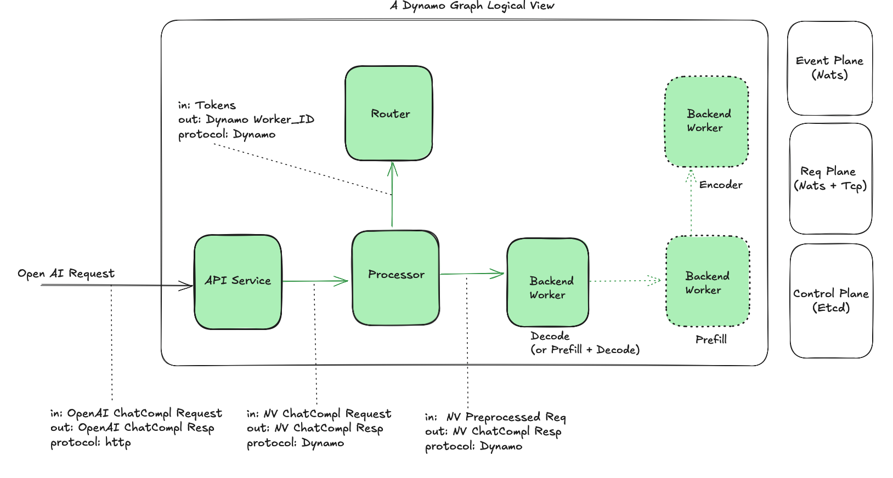

# Dynamo integration with Inference Gateway

**Status**: Draft

**Authors**: [Biswa Panda](https://github.com/biswapanda) 

**Category**: Architecture

**Sponsor**: Itay, Maksim, Neelay

**Required Reviewers**: 

**Review Date**: [Date for review]

**Pull Request**: [Link to Pull Request of the Proposal itself]

**Implementation PR / Tracking Issue**: [Link to Pull Request or Tracking Issue for Implementation]

# Summary

This proposal outlines the integration of [Dynamo](https://docs.nvidia.com/dynamo/latest/architecture/architecture.html#high-level-architecture-and-key-benefits) with the [Gateway API Inference Extension](https://gateway-api-inference-extension.sigs.k8s.io) to enable seamless model routing, request scheduling, and centralized control of inference workloads by mapping Inference Gateway concepts to Dynamo components.

## Dynamo Introduction

### Components and process boundary:
Dynamo is a modular inference system with distinct logical components:

**Frontend** runs these 3 components in a single process. It doesn't require accelerator resources.
1. **API Service**: The entry point for OpenAI-compatible requests

2. **Processor**: Handles tokenization and preprocessing

3. **Router**: Makes scheduling decisions based on KV metrics

**Backend** Process requires accelerator resources and hosts `Worker` component.

4. **Workers**: Backend components responsible for managing LLM engines running on accelerators. 
           Workers execute inference tasks using underlying engines such as vLLM, TRT-LLM, or SGLang.


Each Dynamo graph deployment creates a Kubernetes deployment which manages component's pods.

* Dynamo Graph (logical view)


* Dynamo Graph (deployment view)


| Module | Dynamo | IGW |
| :---- | :---- | :---- |
| **Service/Data Plane** | Custom NATS/TCP based protocol, uses JSON serialization | Standard HTTP-based protocol |
| **Event Plane** | Push-based KV/capacity related metric events using NATS | Scrapers populate Datastore with metrics for a pod (pull-based) |
| **Control Plane** | Planner is responsible for scaling decisions, Orchestration happens via operator | todo: need information |


### Disaggregated Serving
In Dynamo's disaggregated serving, the initial request is handled by the decode stage, and if prefill is required, it is performed remotely by the Prefill worker. 

Currently, Dynamo does not support co-scheduling Prefill/Decode or Prefill -> decode flow.


### Communication
Dynamo uses a custom protocol for intra-component communication. It is based on NATS and two-part JSON messages.


## IGW (Inference Gateway) Introduction

1. **Model Aware Routing**
    IGW enables traffic management across multiple base and LoRA models.  

2. **Request scheduling**
    IGW schedules requests based on various policies at the `endpoint picker` extension.
    Routes requests to the best LLM worker instance based on various data sources (runtime stats data) and input (SLO).

3. **Centralized control**
    Enables centralized management of: auth, RBAC, rate limiting, usage tracking etc. in the Gateway layer.

## Goals

* Map Inference Gateway concepts to Dynamo
* Maintain backward compatibility with existing EPP functionality
* Extend IGW to use Dynamo router
* Minimize network hops

### Non Goals

* Replace existing EPP internal scheduling
* Modify core Gateway API specifications
* Change existing Dynamo worker interfaces significantly
* LoRA support in Dynamo

## Requirements

### REQ 1 External Processing Integration

Dynamo EPP (Endpoint picker) **MUST** support scheduling request in dynamo while maintaining the existing ext-proc interface.

### REQ 2 Unified Dynamo deployment

Dynamo EPP and components (Frontend, Workers) **MUST** be deployable within Kubernetes through a unified Helm chart to maintain version compatibility.

### REQ 3 Maintain compatibility with Inference Gateway protocols

Dynamo EPP **MUST** be compatible with Inference Gateway API and concepts (InferencePool, InferenceModel).

# Proposal

## Architecture Overview

## Alt 1: Entire Dynamo Graph Deployment as a blackbox

EPP routes request to Frontend pod/sidecar
- multiple models in same k8s namespace
- shared frontend


multiple models in different k8s namespace
uses BBR to inject model name header
- multiple models in same k8s namespace
- Each model has it's dedicated frontend


# Alt 2: Dynamo EPP integration with Router


### Data flow

1. The client sends an HTTP inference request to the Gateway.
2. Gateway receives the request and extracts the model name and relevant metadata.  
   Gateway consults the InferenceModel configuration to determine the inference pool (Dynamo graph) to route the request.
3. Gateway calls EPP over gRPC for worker scheduling based on Envoy ext_proc protocol.
4. EPP forwards the request to Frontend sidecar
```yaml
Request: 
    - req header: set x-routing-request: true
    - req body: original request body (For example, Chat completion request)

Response:
    worker_id: this is Dynamo specific worker_id
    token_ids: (Optional) tokens generated from processor step
```
5. Dynamo Frontend accepts OAI request and forwards request through Dynamo request plane (NATS)
6. Dynamo Processor performs necessary pre-processing and generates tokens. It calls routers to decide worker_id.
7. Dynamo Router takes tokens as input and decides worker_id based on scheduling policies and KV metrics
8. EPP sets headers (x-gateway-destination-endpoint and x-gateway-worker-id)
Optional optimization: We can inject the tokens in request body to avoid recomputing tokens in service path.
Note: `tokens` key in request body is not OpenAI compatible.
```
Set Req Header: 
- `x-gateway-destination-endpoint`: worker address of the Dynamo frontend pod
- `x-gateway-worker-id`: Dynamo worker id of Backend LLM worker instance 

Add to Req Body (Optional):
- `tokens`
```
9. IGW forwards the request to appropriate Dynamo frontend based on request header `x-gateway-destination-endpoint`
Note: This could be ideally routed to Frontend service because Frontend/Processor deployment is decoupled from LLM workers.

10. Processor skips pre-processing 
- `tokens` in request body and skips pre-processing step
- `x-gateway-worker-id` in the request and skips call to router

11. Request is sent to LLM Backend and response is streamed back through 
- Processor: Post-processing steps
- Frontend: Change response shape from Dynamo native to OpenAI compatible response

**Notes:**
- All inter-component communication within Dynamo (Processor, Router, Workers) uses NATS with two-part JSON messages.
- Deployment is unified via a single Helm chart for version compatibility.

### Mapping Inference Pool/Model with Dynamo
1. There would be a 1:1 mapping between an inference pool, a Dynamo graph deployment and EPP deployment.
Reasoning: Dynamo Graph represents a cohesive deployment unit with compute resources. Each Dynamo graph deployment should correspond to one Inference Pool. 

 This is the view from IGW perspective - 
```
┌─────────────────┐    ┌──────────────────┐    ┌─────────────────┐
│ Inference Model │    │ Inference Model  │    │ Inference Model │
│   (lora1)       │    │    (lora2)       │    │     (gemma)     │
└─────────┬───────┘    └─────────┬────────┘    └─────────┬───────┘
          └──────────────────────┼───────────────────────┘
                                 │ N:1
                    ┌────────────▼────────────┐
                    │    Inference Pool       │
                    └────────────┬────────────┘
                                 │ 1:1
                    ┌────────────▼────────────┐
                    │      Dynamo EPP         │
                    └────────────┬────────────┘
                                 │ 1:1
                    ┌────────────▼────────────┐
                    │ Dynamo Graph Deployment │
                    └─────────────────────────┘
```

2. EPP has a 1:1 relationship with Inference Pool and it's responsible for scheduling decisions within a Dynamo graph.

3. Inference Model maps user-facing model names to backend implementations. Multiple inference models can refer to the same Inference Pool (Dynamo Graph).


### Decision Points

#### 1. EPP integration with Dynamo: plugin vs sidecar vs external callout service


##### Sidecar container (Preferred)
Needs support in EPP to deploy a sidecar container and specify the port to request at.

**Pros**
- Reduced network hops: Direct communication between EPP and Dynamo components within the same pod
- Lower latency: No network overhead for inter-component communication
- Simpler deployment and management: Deployed as a single unit, easier to manage lifecycle

**Cons**
- Tightly coupled scaling: Scaling decisions for EPP and Frontend are coupled
- Deployment of EPP is coupled with Dynamo sidecar image. Version upgrades should be done in-sync. 

##### External callout service
**Pros**
- Completely isolated deployments 
- Each component can be deployed and scaled independently

**Cons**
- Additional network hops: More latency due to network communication between services
- Service discovery complexity: Need to manage service endpoints and load balancing
- Additional network failure points in the request path

##### Plugin
**Pros**
- Minimum number of network hops
- Simpler architecture without additional layer
- Lower latency for request processing

**Cons**
- Dynamo runtime/component don't have native integration with Golang
- Hard to scale across models
- Tight coupling with Golang-based implementation

## Problems
1. Currently EPP scheduling has tight coupling with in-process preprocessing.
  It's hard to scale/maintain it across different models.

2. Double tokenization during scheduling and service path

## Guiding Principles

1. **Composability**: EPP should externalize scheduling decisions to Dynamo router
2. **DRY**: Aim to reduce duplications in preprocessing steps (tokenization, prompt template application)
3. **Compatibility**: Maintain full compatibility with Inference Gateway API
4. **Reduce network hops** to minimize tail latency
5. **EPP doesn't replace Dynamo's Router** but delegates scheduling decisions to it, preserving Dynamo's scheduling logic

## Design constraints
- Dynamo components (Processor, Router) use Dynamo native transport (two-part JSON messages over NATS)
- Dynamo does not support co-scheduling in disaggregated mode. Currently request flow goes from decode to prefill.
- An EPP can only be associated with a [single InferencePool](https://gateway-api-inference-extension.sigs.k8s.io/api-types/inferencepool)

## Current state of IGW and Dynamo

### Inference Gateway Request Flow:
```
HTTP Request
     │
     ▼
┌─────────────┐    Extract model name   ┌──────────────────┐
│   Gateway   │ ──────────────────────► │ InferenceModel   │
│ (HTTPRoute) │                         │ (Model Config)   │
└─────────────┘                         └──────────────────┘
     │                                           │
     │ Route to backend                          │ References
     ▼                                           ▼
┌─────────────┐    Smart routing via     ┌──────────────────┐
│InferencePool│ ◄─────────────────────── │ Endpoint Picker  │
│ (Compute)   │      EPP extension       │ Extension (EPP)  │
└─────────────┘                          └──────────────────┘
     │
     ▼
┌─────────────┐
│ Model Server│
│    Pods     │
└─────────────┘
```

## Deferred to Implementation
- Fallback mechanisms for failures
- Metrics and observability integration


## Follow up questions

1. Is EPP considered stateless? How do we achieve EPP HA/Fault-tolerance?
  Dynamo Router is stateful (in-memory prefix tree).
  Coupling Dynamo frontend as a sidecar with EPP might bring scaling challenges.

2. Multiple models: InferenceModel and body-based routing 
   Can we enable body-based routing as a stage in EPP or composable at IGW level?

# Related Proposals
* [Gateway API Inference Extension Documentation](https://gateway-api-inference-extension.sigs.k8s.io/)
* [Envoy External Processing Filter](https://www.envoyproxy.io/docs/envoy/latest/configuration/http/http_filters/ext_proc_filter)
* [Gateway API Specification](https://gateway-api.sigs.k8s.io/)