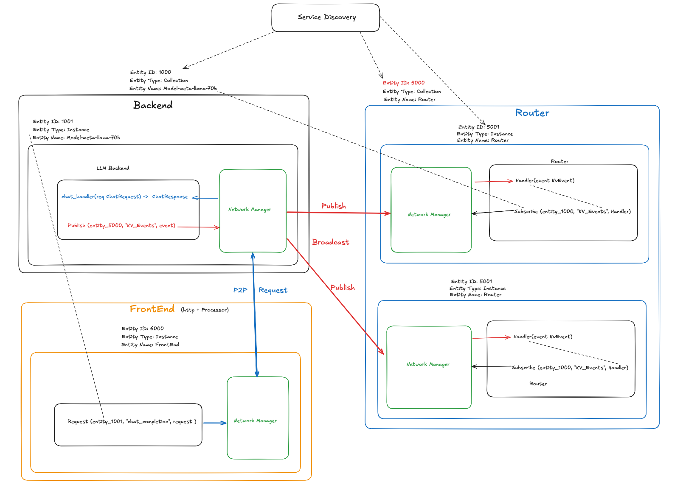
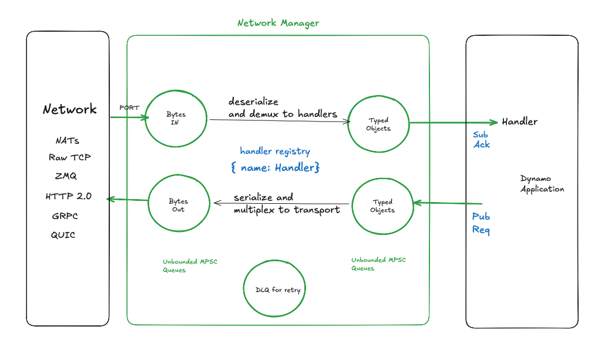

# Dynamo runtime: Transport Agnostic Dynamo Pipelines

## Overview

High level goal is to decouple the NATs transport from the dynamo runtime. 

- introduce abstractions for current NATs usages (e.g. KV router, event plane, request plane & object store, etc) which can be used to plug different implementations.

- deprecate NATs object store and reduce dependencies on NATs.

## Requirements
- deliver messages across dynamo instances with at least once delivery guarantee.
- switch between transports at runtime.
- support long term architecure goals for Dynamo GA

### Transport Agnostic API

Dynamo communication primitives needs to support:
- peer-to-peer (req/reply: request plane) and scoped broadcasts (event plane)
- communication regimes: single process, single node (multi process) and multi-node
- transport options: NATs, Raw TCP, ZMQ, HTTP SSE, GRPC, UCX active messaging

### Deprecate NATs Object store usage
 - Router snapshots are stored in NATs object store.
 - Model files are stored in NATs object store.

### Long term architectural goals: 
Support:

- separation of Frontend (3-in-1 across in-process, same node or remote node)

- HTTP based endpoint for one off usage of a component (KV router, etc)

- batching/muxing messages for Req/Responses:
  - we can see a perf benefit by batching multiple requests together over a network round-trip.

- Simplify `dynamo namespace` usage and process heirarchy (namespace, component, etc)
  - `dynamo namespace` is causing unnecessaary cognitive complexity for end-users. 
  - Support mapping to more meaningful Grove concepts like PodClique, PodCliqueSet, etc.

## Usage Patterns

More details in [NATs use cases](#nats-use-cases)

| Plane         | Purpose / Protocol                                                                 | Delivery Guarantee / Notes                                                                                 | Current NATs Usage Example                                  |
|---------------|------------------------------------------------------------------------------------|------------------------------------------------------------------------------------------------------------|-------------------------------------------------------------|
| Request Plane | Protocol for request context, control messages, and request cancellation           | At least once (with idempotent handlers); supports request/reply, cancellation, and timeouts               | Service stats collection, direct requests                   |
| Event Plane   | Delivery of KV events and other system events                                      | At least once (preferred); events are idempotent, redelivered messages are ignored                         | KV router event publishing/consumption                      |
| Metrics       | Collection and reporting of runtime/service metrics                                | At least once (metrics can be aggregated, duplicate-safe)                                                  | Service stats, health checks                                |
| Object Store  | Ephemeral storage for model files and artifacts                                    | At least once (object upload/download, may use JetStream Object Store)                                     | Model file storage, file upload/download                    |

**Notes:**
- All planes should support pluggable transports (NATs, ZMQ, HTTP SSE, GRPC, UCX, etc).
- At least once delivery is preferred for reliability; consumers must be idempotent.
- Request Plane requires protocol for cancellation and context propagation.
- Object Store usage via NATs is being deprecated in favor of more direct or persistent solutions.


## Proposal



### Transport Agnostic API

Use unique identifiers to identify the target entity.

`DynamoEntityID`: a unique address for each dynamo process.
  - An Opaque `u128` identifier that uniquely identifies a single instance or collection of instances (component, namespace, etc)
  - each dynamo process has a unique DynamoEntityID and can be used to communicate with other dynamo processes.
  - can be used to identify the target and establish connection by `DynamoNetworkManager`.
  - discovery service api can be used to find participating dynamo entities.
  - dynamo application will use communication primitives: (publish, subscribe, request) and this ID to route messages to the target in transport agnostic manner.

`DynamoNetworkManager`: manages communication between dynamo processes.
 - manages listening ports and client connections to remote peers
 - responsible for serializing and deserializing messages for different transports
 - responsible for handling timeout error, retry and cancellation for request/reply pattern
 - responsible for sending and receiving messages
 - Handles remote peer connections: in-process, local host or remote host

High level`DynamoNetworkManager` API:

```

publish(id: DynamoEntityID, topic: str, message: InputType) -> Result<(), Error>

subscribe(id: DynamoEntityID, topic: str, handler: fn(message: InputType) -> Result<(), Error>) -> Result<(), Error>

request(id: DynamoEntityID, topic: str, message: InputType) -> Future<Result<OutputType, Error>>
```




#### DynamoEntityID

Inspired by inode and ProcessID from Operating System and Grove concepts.

Uniquely identify a single instance or collection of instances (component, namespace, etc)


```rust
pub struct DynamoEntityId {
    pub id: u128,
    pub entity_type: EntityType,
    pub name: Option<Arc<String>>, // Optional human-readable name for debugging and logging
    pub children: Vec<DynamoEntityId>, // Optional children for collection of instances
}

impl DynamoEntityId {
    /// Create from name with automatic hashing
    pub fn from_name(name: &str, entity_type: EntityType) -> Self {
        Self {
            id: hash_name(name),
            name: Some(Arc::new(name.to_string())),
            entity_type: entity_type,
            children: Vec::new(),
        }
    }
}

enum EntityType {
    Instance,
    Collection,
}
```

`EntityType`: single instance or collection of instances (currently component, namespace, etc)

`name`: String (optional)
- Human-readable identifiers for debugging and logging
- Configuration files (YAML/JSON)
- Command-line interfaces
- Logging and observability


TODO: 
- map these ids cleanly to grove concepts like PodClique/PodCliqueSet/PodCliqueSet
- show a diagram of the entity hierarchy


### Object Store Interface

// Todo: add clean interface for object store

### Implementation 
- Phase 1
	* degraded feature set
		* not use KV router if they want. Best effort 
	* nats
		* No HA guarantees for router
		* Operate without high availability w/ single router
- Phase 2
   * explore transports 
	 * durability
	 * exactly once delivery

## Guiding principles

### Generic Messaging Protocol
Decouple messaging protocol from the underlying transport like Raw TCP, ZMQ or (HTTP, GRPC, and UCX active message).

Phased approach: start with Nats, ZMQ and HTTP SSE. 
Later, incrementally expand to support more advanced transports, ensuring that the protocol remains adaptable to requirements.

### Handshake and Closure Protocols: 
Robust handshake and closure protocols, using sentinels and message headers to signal the end of stream or cancellation.
A common semantic for closing requests and handling errors, will be generalized across different transports.

### Multipart Message Structure
Use a multipart message structure, inspired by ZMQ's native multipart support, to encapsulate headers, body, and control signals (such as closure control signals or error notifications). 

### Better Python-Rust Interoperability and Data class generation

Improve Python-Rust interoperability, focusing on auto-generating Python data classes from Rust structs using Pydantic. 
This way message schemas are aligned and we can reduce manual coding and serialization errors.


## Additional notes

## NATs use cases

### 1. NatsQueue python binding
- **Location**: `lib/bindings/python/rust/llm/nats.rs` (`NatsQueue`)
- **Functionality**:
- Deprecated: We don't use `NatsQueue` python binding anymore. We use `NatsQueue` rust binding instead.
- We can remove the python binding and the associated tests to simplify the codebase.

### 2. JetStream-backed Queue/Event Bus
- **Location**: `lib/runtime/src/transports/nats.rs` (`NatsQueue`)
- **Functionality**:
  - Stream creation per subject pattern `{stream_name}.*`
  - Publisher-only, worker-group, and broadcast consumer modes
  - Durable consumers with pull-based consumption
  - Administrative operations (purge, consumer management)

### 3. Event Publishing for KV Router
- **Location**: `lib/llm/src/kv_router/publisher.rs`
- **Functionality**:
  - Publishes KV cache events from ZMQ or direct sources
  - Uses `EventPublisher` trait to send events

### 4. Event Consumption for KV Router
- **Location**: `lib/llm/src/kv_router/subscriber.rs`
- **Functionality**:
  - Consumes `RouterEvent` messages via durable consumers
  - Handles state snapshots and stream purging

### 5. Object Store (JetStream Object Store)
- **Location**: `lib/runtime/src/transports/nats.rs`
- **Functionality**:
  - File upload/download operations
  - Typed data serialization with bincode
  - Bucket management and cleanup

### 6. Key-Value Store (JetStream KV)
- **Location**: `lib/runtime/src/storage/key_value_store/nats.rs`
- **Functionality**:
  - Implements `KeyValueStore` trait
  - CRUD operations with conflict resolution
  - Watch streams for real-time updates

### 7. Request/Reply Pattern
- **Location**: `lib/runtime/src/transports/nats.rs`
- **Functionality**:
  - Service stats collection via broadcast requests
  - Each service responds once to stats queries

### 8 KVBM Nats usage (todo)


## Message Delivery Guarantees

### At least once delivery (preferred)
- No message loss is possible.
- Message is delivered at least once to the consumers
- consumers should be idempotent and be able to handle duplicate messages.

### Exactly once delivery
- needs stateful tracking of messages and ack/nack coordination to ensure exactly once delivery.

### At most once delivery
- Message loss is possible.