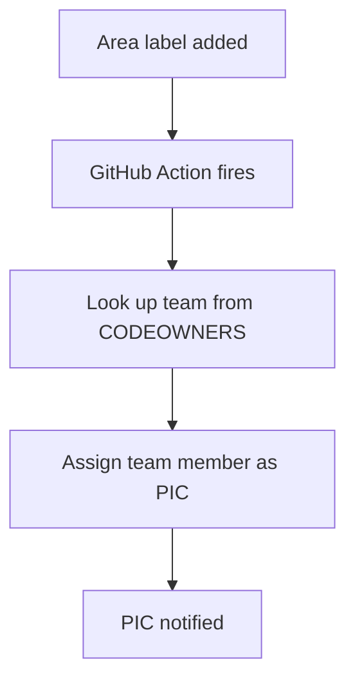

# DEP Area Taxonomy and Team Ownership — DRAFT

> **Status**: Draft — pending engineering management review before team creation.
>
> This document is a companion to
> [DEP: GitHub Issues as DEPs](./0000-dep-issues-as-deps.md). It
> proposes the specific area taxonomy, CODEOWNERS team mappings, and
> initial team membership for DEP area ownership.

## Area Taxonomy

Each area maps to a GitHub team. The team owns the area's code
paths in CODEOWNERS and serves as the PIC group for DEPs in that
area. When a DEP is filed, one member of the group is assigned as
PIC for that specific DEP.

| Area | Label | Team | Key Paths |
|------|-------|------|-----------|
| External API | `external-api` | @ai-dynamo/external-api | lib/llm/src/http/, lib/llm/src/grpc/ |
| Frontend | `frontend` | @ai-dynamo/frontend | components/src/dynamo/frontend/ |
| Router | `router` | @ai-dynamo/router | components/src/dynamo/router/, lib/llm/src/kv_router/ |
| Backend: vLLM | `backend-vllm` | @ai-dynamo/backend-vllm | components/src/dynamo/vllm/ |
| Backend: TRT-LLM | `backend-trtllm` | @ai-dynamo/backend-trtllm | components/src/dynamo/trtllm/ |
| Backend: SGLang | `backend-sglang` | @ai-dynamo/backend-sglang | components/src/dynamo/sglang/ |
| KV/Memory | `kv-memory` | @ai-dynamo/kv-memory | lib/memory/, lib/runtime/src/transports/ |
| Multimodal | `multimodal` | @ai-dynamo/multimodal | examples/multimodal/ |
| Planner | `planner` | @ai-dynamo/planner | components/src/dynamo/planner/ |
| Core Platform | `core-platform` | @ai-dynamo/core-platform | lib/runtime/, lib/bindings/ |
| Observability | `observability` | @ai-dynamo/observability | deploy/observability/ |
| Fault Tolerance | `fault-tolerance` | @ai-dynamo/fault-tolerance | tests/fault_tolerance/ |
| Inference Gateway | `gateway` | @ai-dynamo/gateway | deploy/inference-gateway/ |
| DevOps | `devops` | @ai-dynamo/devops | .github/, container/ |
| Documentation | `docs` | @ai-dynamo/docs | docs/, fern/, *.md |
| Process | `process` | @ai-dynamo/process | CODEOWNERS, CONTRIBUTING.md, .github/ISSUE_TEMPLATE/ |
| K8s | `k8s` | @ai-dynamo/dynamo-deploy-codeowners | deploy/helm/, deploy/snapshot/ |
| DGDR | `dgdr` | @ai-dynamo/dgdr | deploy/operator/ |
| XPU / Intel | `xpu` | @ai-dynamo/intel-hardware-support | TBD |

The three backend teams (vLLM, TRT-LLM, SGLang) coordinate on
cross-backend design parity — shared APIs, common patterns, and
feature matrix alignment.

K8s / DGDR and XPU / Intel are emerging areas that may evolve
into co-maintained areas with external contributors.

## Proposed Team Membership

New teams to create (2-3 members each):

| Team | Proposed Members |
|------|-----------------|
| @ai-dynamo/external-api | Graham King, Ryan McCormick |
| @ai-dynamo/frontend | Graham King |
| @ai-dynamo/router | Rudy Pei, Graham King |
| @ai-dynamo/backend-vllm | Alec Flowers, Guan Luo |
| @ai-dynamo/backend-trtllm | Yuewei Na, Indrajit Bhosale, Tanmay Verma |
| @ai-dynamo/backend-sglang | Ishan Dhanani, William Arnold |
| @ai-dynamo/kv-memory | Rudy Pei, Ziqi Fan |
| @ai-dynamo/multimodal | Ryan McCormick, Kris Hung, Krishnan Prashanth, Ayush Agarwal |
| @ai-dynamo/planner | Hongkuan Zhou, Hannah Zhang |
| @ai-dynamo/core-platform | Graham King, Rudy Pei, Tzu-Ling Kan |
| @ai-dynamo/observability | Neelay Shah, Keiven Chang |
| @ai-dynamo/fault-tolerance | Jacky Hui, Tzu-Ling Kan, Schwinn Saereesitthipitak |
| @ai-dynamo/gateway | Anna Tchernych, Tushar Sharma |
| @ai-dynamo/docs | Neal Vaidya, Kristen Kelleher, Dan Gil |
| @ai-dynamo/process | Neelay Shah, Dan Gil, David Zier |
| @ai-dynamo/dgdr | Hannah Zhang, Julien Mancuso, Hongkuan Zhou |
| @ai-dynamo/intel-hardware-support | TBD |

Existing teams that serve as area owners (no changes needed):

* `@ai-dynamo/devops` — DevOps area
* `@ai-dynamo/dynamo-deploy-codeowners` — K8s area

Membership derived from `git log` commit analysis per area path.
Subject to manager approval before team creation.

## Coexistence with Existing Teams

Area teams coexist with the existing language/role-based teams
(`dynamo-rust-codeowners`, `python-codeowners`,
`dynamo-deploy-codeowners`, `Devops`). The existing teams continue
to handle code review; the area teams handle DEP ownership. Both
appear in CODEOWNERS for the same paths:

```
/components/src/dynamo/router/  @ai-dynamo/dynamo-rust-codeowners  @ai-dynamo/router
```

## How PIC Assignment Works



Before automation exists, the Friday triage assigns PICs manually.
The automation is a convenience, not a prerequisite.

No separate `PICS.md` is needed. The area label on a DEP
determines which team owns it, and the team assigns one member as
PIC for that DEP.
