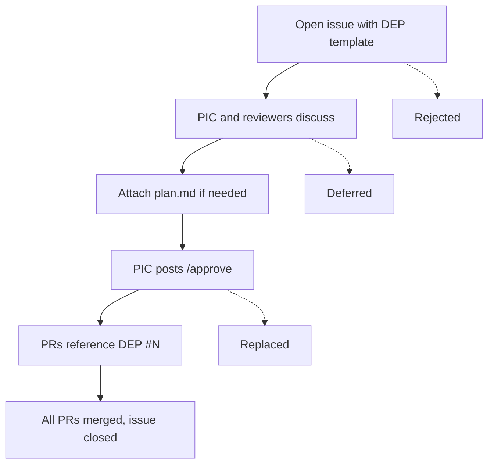
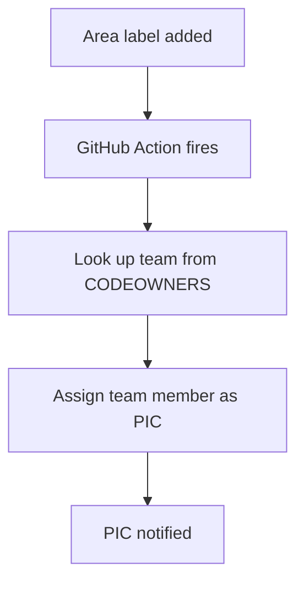
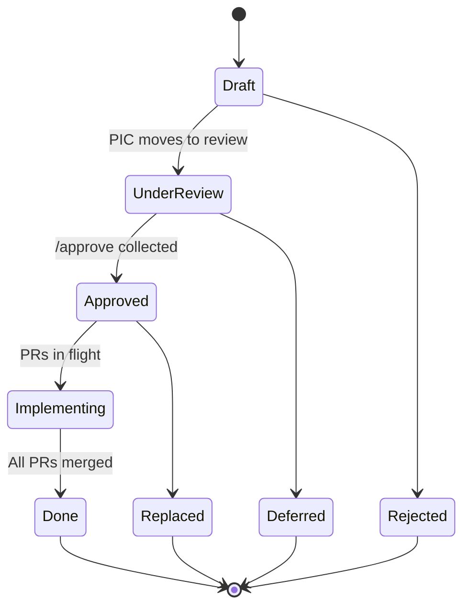
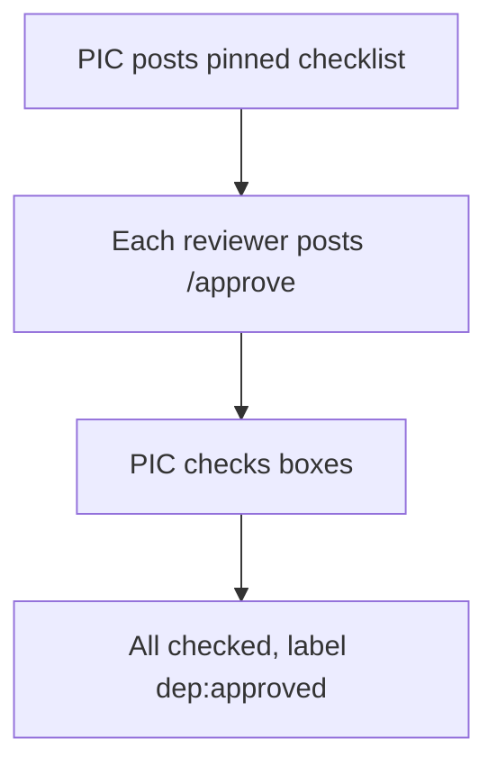
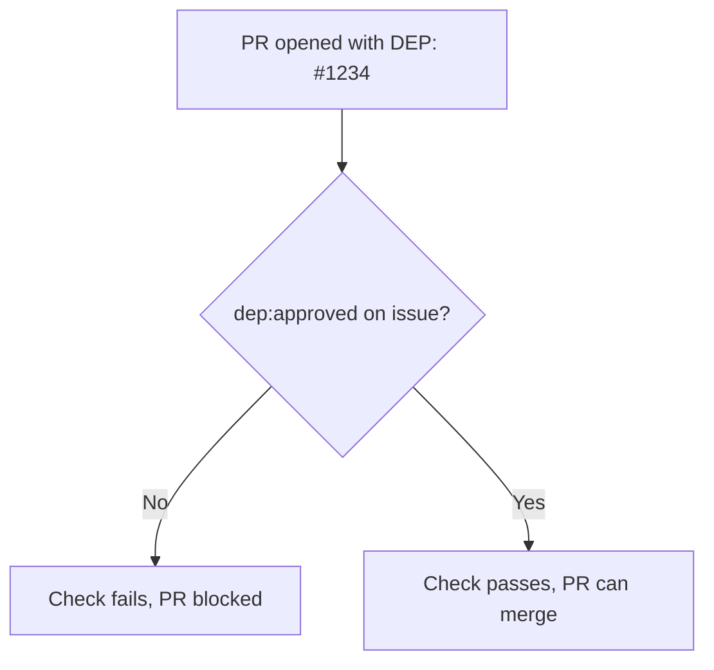

# GitHub Issues as DEPs

**Status**: Draft

**Authors**: [nnshah1](https://github.com/nnshah1)

**Category**: Process

**Extends**: [DEP-0000: Dynamo Enhancement Proposals](./0000-dep-process.md),
[DEP Process Improvements](./0000-dep-process-improvements.md)

**Replaces**: N/A

**Replaced By**: N/A

**Sponsor**: [nnshah1](https://github.com/nnshah1)

**Required Reviewers**: TBD

**Review Date**: TBD

**Pull Request**: TBD

**Implementation PR / Tracking Issue**: TBD

# Summary

Use GitHub Issues on `ai-dynamo/dynamo` as the primary artifact for
Dynamo Enhancement Proposals. The issue body is the spec. Implementation
plans, approvals, discussion, and PR tracking all live on the same
issue. The issue number is the DEP number. This replaces the
fork/branch/PR workflow on a separate enhancements repository while
preserving the governance model (PICs, areas, triage cadence) from the
DEP Process Improvements proposal.

# Motivation

The DEP process as defined in [DEP-0000](./0000-dep-process.md) has
been successful in fostering thoughtful design when used. The
[DEP Process Improvements](./0000-dep-process-improvements.md) proposal
introduces area-based ownership with PICs, a weekly triage cadence, and
agent-friendly tooling to address adoption gaps.

Both proposals retain a markdown-file-in-a-separate-repo workflow for
the DEP artifact itself. This proposal argues that the artifact should
change: a GitHub Issue on the main code repository is a better home
for design proposals than a markdown file in a separate repository.

Three observations motivate this:

**1. Context switching kills adoption.** Engineers work in
`ai-dynamo/dynamo` — that's where PRs are opened, issues are filed,
and CI runs. The enhancements repo is a separate destination that
requires a fork, a branch, a file copy, and a PR. This friction is why
67% of enhancement PRs remain open with minimal engagement.

**2. The spec, the plan, and the implementation are artificially
separated.** A DEP in the enhancements repo has no native link to the
implementation PRs in the main repo. Cross-repo references
(`ai-dynamo/enhancements#N`) work but don't create automatic backlinks.
The decision trail is scattered across two repos.

**3. Agents work better with issues than with files in a separate
repo.** `gh issue create`, `gh issue comment`, and `gh issue edit` are
simple, stateless operations. Cloning a second repo, copying a
template, committing, and pushing is a multi-step workflow that's
fragile for agents. Issues are the native API surface for GitHub
automation.

## Goals

* **Single pane of glass** — Spec, plan, discussion, approvals, and
  implementation PRs all visible from one issue on the main repo.

* **Lower barrier to propose** — Filing a GitHub issue is simpler than
  forking a repo, copying a template, and opening a PR.

* **Auditable decisions** — Every approval, revision, and discussion
  point is a timestamped, immutable comment in a linear timeline.

* **Agent-native workflow** — All DEP operations (create, plan, approve,
  status) are expressible as `gh` CLI commands.

* **Preserve governance** — PICs, areas, triage cadence, and review
  standards from the DEP Process Improvements proposal apply unchanged.

## Non Goals

* Changing what requires a DEP — the thresholds from DEP-0000 and the
  improvements proposal remain the same.

* Defining the CODEOWNERS structure — that's a separate DEP.

* Building complex automation — the workflow should work with labels
  and conventions before any GitHub Actions are added.

## When Is a DEP Required?

A DEP is required when a change meets any of these criteria:

* **Affects multiple components** — e.g., a router change that also
  modifies the frontend's request path
* **Introduces or modifies a public API** — new endpoints, changed
  request/response contracts, or deprecations
* **Alters communication plane architecture** — transport layers,
  discovery mechanisms, or event-plane protocols
* **Affects backend integration contracts** — changes to the interface
  that backends must implement

These thresholds are derived from the Dynamo Governance proposal
(pending merge). PICs apply this test when reviewing incoming PRs to
determine whether a `DEP: #N` reference is needed.

## Requirements

### REQ 1 Issue as Spec

The GitHub Issue **MUST** be the DEP. The issue body contains the spec
summary, or for detailed proposals the author attaches a `dep.md` file
to the issue. Two issue templates **MUST** be provided: full and
lightweight.

### REQ 2 Plan as Attachment

Implementation plans **MUST** be separate from the spec. The author
attaches a `plan.md` file to an issue comment. Plans **MUST NOT** be
embedded in the issue body.

### REQ 3 Label-Based Lifecycle

DEP status **MUST** be tracked via labels (`dep:draft`,
`dep:under-review`, `dep:approved`, `dep:implementing`, `dep:done`,
`dep:deferred`, `dep:rejected`, `dep:replaced`). Issue open/closed
state **MUST** align with the lifecycle: open for active states, closed
for terminal states.

### REQ 4 PIC Assignment via Area Labels

Each DEP **MUST** have an area label (`frontend`, `router`,
etc.). The area label determines the responsible team. PIC assignment
**SHOULD** be automated via GitHub Action when an area label is added.

### REQ 5 Approval

The PIC posts `/approve` to approve a DEP and changes the status label.
For DEPs with multiple required reviewers, a pinned approval checklist
**SHOULD** track reviewer status. For straightforward DEPs, the PIC's
`/approve` is sufficient.

### REQ 6 Merge Gating

Implementation PRs **SHOULD** include either `DEP: #N` (referencing
the DEP issue) or `DEP: N/A` in the PR body. PRs that reference a DEP
**SHOULD** be gated on the DEP issue having the `dep:approved` label.
PRs without a DEP reference **MUST NOT** be gated.

Missing references surface in a weekly gap report — large `feat:` PRs
that merged without a `DEP:` line are flagged for retroactive review.

### REQ 7 Revision Traceability

Substantive spec revisions **SHOULD** be preceded by a revision comment
documenting what changed and why. Plan revisions **SHOULD** be posted as
new `plan.md` attachments rather than edits to the original.

## Minimal Viable DEP

The simplest path through the process — what a lightweight DEP looks
like when you strip away all optional ceremony:

```
1. Open issue using lightweight template (3 fields: summary, motivation, proposal)
2. PIC assigned via area label
3. Discussion in comments
4. PIC posts /approve, changes label to dep:approved
5. PR references issue (DEP: #N), merges
6. Issue closed
```

No checklist, no pinned comment, no plan.md, no revision tracking.
Just: propose, discuss, approve, implement, close.

# Proposal

## End-to-End Workflow

The complete lifecycle of a DEP, from idea to implementation:



## Issue Anatomy

### Lightweight DEP

```
┌──────────────────────────────────────────────────────────┐
│ DEP (light): Add retry backoff to frontend        #567   │
│ Labels: dep:approved  frontend  dep:lightweight           │
│ Assignees: @frontend-pic                                 │
├──────────────────────────────────────────────────────────┤
│                                                          │
│ ISSUE BODY                                               │
│ ──────────                                               │
│ ## Summary                                               │
│ Add exponential backoff to frontend retry logic...       │
│ ## Motivation                                            │
│ Retries currently hammer backends during outages...      │
│ ## Proposal                                              │
│ Use exponential backoff with jitter, max 30s...          │
│                                                          │
├──────────────────────────────────────────────────────────┤
│                                                          │
│ @frontend-pic — Mar 21                                   │
│ /approve                                                 │
│                                                          │
│ 🔗 PR #568 — Add retry backoff (merged)                 │
│                                                          │
└──────────────────────────────────────────────────────────┘
```

### Full DEP

```
┌──────────────────────────────────────────────────────────┐
│ DEP: KV-Aware Router Scheduling Overhaul          #1234  │
│ Labels: dep:approved  router  dep:implementing            │
│ Assignees: @router-pic                                   │
├──────────────────────────────────────────────────────────┤
│                                                          │
│ ISSUE BODY                                               │
│ ──────────                                               │
│ ## Summary                                               │
│ Redesign the KV-aware router to support...               │
│ ## Motivation                                            │
│ Current router doesn't account for...                    │
│                                                          │
│ (Full spec in attached dep.md)                           │
│ 📎 dep.md                                               │
│                                                          │
├──────────────────────────────────────────────────────────┤
│                                                          │
│ COMMENT TIMELINE                                         │
│ ─────────────────                                        │
│                                                          │
│ @author — Mar 17                                         │
│ Implementation plan attached.                            │
│ 📎 plan.md                                              │
│                                                          │
│ 📌 @router-pic — Mar 15                                 │
│ ## Approval Status                                       │
│ - [x] @router-pic (PIC) — approved Mar 18               │
│ - [x] @reviewer1 — approved Mar 19                      │
│ - [x] @reviewer2 — approved Mar 20                      │
│                                                          │
│ @router-pic — Mar 18                                     │
│ /approve                                                 │
│                                                          │
│ @reviewer1 — Mar 19                                      │
│ /approve                                                 │
│                                                          │
│ @reviewer2 — Mar 20                                      │
│ /approve                                                 │
│                                                          │
│ 🔗 PR #1301 — Refactor scheduler interface (merged)     │
│ 🔗 PR #1315 — Implement consistent hashing (open)       │
│                                                          │
└──────────────────────────────────────────────────────────┘
```

## PIC Assignment by Area

Each area maps to a GitHub team. The team owns the area's code
paths in CODEOWNERS and serves as the PIC group for DEPs in that
area. When a DEP is filed, one member of the group is assigned as
PIC for that specific DEP.

The specific area taxonomy, team mappings, and proposed membership
are defined in a companion document:
[DEP Area Taxonomy and Team Ownership](./0000-dep-area-taxonomy.md)
(draft — pending engineering management review).

No separate `PICS.md` is needed. The area label on a DEP
determines which team owns it, and the team assigns one member as
PIC for that DEP.

**How PIC assignment works:**



Before automation exists, the Friday triage assigns PICs manually.
The automation is a convenience, not a prerequisite.

## Cross-Cutting DEPs

Cross-cutting is not a standing area with a dedicated team. When a
DEP spans multiple areas:

1. The author applies labels for all affected areas
2. The TPM assigns a **lead PIC** (typically from the most-affected
   area's team) and tracks cross-area review
3. The lead PIC coordinates review with **consulted PICs** from
   other affected areas
4. All consulted PICs **MUST** post `/approve` or `/defer` before
   the lead PIC can approve
5. Core Maintainers are available for escalation if PICs disagree

## Issue Templates

### Full DEP Template (`dep.yml`)

```yaml
name: Dynamo Enhancement Proposal (DEP)
description: Propose a new feature, architecture change, or process improvement
title: "DEP: "
labels: ["dep:draft"]
body:
  - type: textarea
    id: summary
    attributes:
      label: Summary
      description: One-paragraph summary of the proposal
    validations:
      required: true
  - type: textarea
    id: motivation
    attributes:
      label: Motivation
      description: Why is this change needed? What problem does it solve?
    validations:
      required: true
  - type: textarea
    id: proposal
    attributes:
      label: Proposal
      description: Detailed description of the proposed change
    validations:
      required: true
  - type: textarea
    id: alternates
    attributes:
      label: Alternate Solutions
      description: What other approaches were considered and why were they not chosen?
    validations:
      required: false
  - type: textarea
    id: requirements
    attributes:
      label: Requirements
      description: Specific requirements (use MUST/SHOULD per RFC-2119)
    validations:
      required: false
  - type: textarea
    id: references
    attributes:
      label: References
      description: Links to related documents, prior art, external resources
    validations:
      required: false
```

### Lightweight DEP Template (`dep-light.yml`)

For smaller changes that don't warrant a full DEP:

```yaml
name: Lightweight DEP
description: Quick proposal for smaller changes
title: "DEP (light): "
labels: ["dep:draft", "dep:lightweight"]
body:
  - type: textarea
    id: summary
    attributes:
      label: Summary
    validations:
      required: true
  - type: textarea
    id: motivation
    attributes:
      label: Motivation
    validations:
      required: true
  - type: textarea
    id: proposal
    attributes:
      label: Proposal
    validations:
      required: true
```

The PIC can escalate a lightweight DEP to full — the author adds the
missing sections to the issue body and the PIC removes the
`dep:lightweight` label.

## DEP Lifecycle



| State | Issue Open? | Label | Meaning |
|-------|-------------|-------|---------|
| Draft | Open | `dep:draft` | Author is still writing |
| Under Review | Open | `dep:under-review` | Awaiting PIC/reviewer approval |
| Approved | Open | `dep:approved` | Spec accepted, implementation can proceed |
| Implementing | Open | `dep:implementing` | PRs in flight |
| **Done** | **Closed** | `dep:done` | All implementation PRs merged |
| **Deferred** | **Closed** | `dep:deferred` | Parked — may revisit later |
| **Rejected** | **Closed** | `dep:rejected` | Not proceeding |
| **Replaced** | **Closed** | `dep:replaced` | Superseded by another DEP |

Key: **Approved ≠ closed.** The issue stays open through
implementation so it serves as the tracking hub. It only closes when
the work is done or reaches another terminal state.

## Approval Mechanism

### Default: PIC Approval

Most DEPs need only one approval — the PIC's.


### Multi-Reviewer (when needed)

For cross-cutting or high-impact DEPs, the PIC can request additional
reviewers using a pinned checklist:



**Why `/approve` comments work:**

- Comments are **timestamped**, **attributed**, and **searchable**
- `/approve` is searchable: `gh search issues --repo ai-dynamo/dynamo "/approve" in:comments`
- Posting `/approve` is lower friction than a PR review

## Merge Gating



- PRs **without** a `DEP: #N` reference are **not gated** — business
  as usual for bug fixes and small changes
- This is **opt-in enforcement**: only PRs that claim to implement a
  DEP get checked
- The GitHub Action is ~30 lines of YAML — no complex infrastructure

## Revision Traceability

### Spec Revisions

Before making a substantive edit to the issue body, the author posts
a comment:

```markdown
## Spec Revision — 2026-03-16

**What changed**: Added consistent hashing to the routing proposal
**Why**: @reviewer1 feedback — better load distribution under skewed workloads

Updating the issue body now.
```

The **issue body is always the current truth**. The **comment trail is
the changelog**. Minor edits (typos, formatting) don't need a revision
comment.

### Plan Revisions

Attach a new `plan.md` in a new comment rather than editing the
original. Every version of the plan is preserved as a distinct
attachment.

### Approval After Revision

If a substantive spec revision occurs after approval, the PIC
**SHOULD** re-request approval from affected reviewers. For DEPs
with a pinned checklist, the PIC resets it and notifies reviewers.

### Trade-off Acknowledgment

This convention-based approach is less rigorous than git diffs — it
relies on authors following the convention. The mitigations are:

- PIC triage catches drift at weekly checkpoints
- The approval re-request convention catches post-approval changes
- For DEPs where full diff-level traceability is critical, the author
  can maintain a companion markdown file in a PR for line-level review,
  with the issue remaining the tracking hub

## Agent Workflow

All DEP operations are expressible as `gh` CLI commands, making the
workflow native for AI agents:

| Operation | Command |
|-----------|---------|
| Create DEP | `gh issue create --repo ai-dynamo/dynamo --title "DEP: ..." --body "..." --label dep:draft --label <area>` |
| Attach dep.md | Upload `dep.md` to the issue body (drag-and-drop or GitHub API) |
| Read spec | `gh issue view <N> --repo ai-dynamo/dynamo` |
| Read discussion | `gh issue view <N> --repo ai-dynamo/dynamo --comments` |
| Attach plan | `gh issue comment <N>` with `plan.md` attached |
| Approve | `gh issue comment <N> --body "/approve"` |
| Change status | `gh issue edit <N> --add-label dep:approved --remove-label dep:under-review` |
| List DEPs | `gh issue list --repo ai-dynamo/dynamo --label dep:draft` |
| Search DEPs | `gh search issues --repo ai-dynamo/dynamo "label:dep:* KV router"` |

Claude Code skills (`/dep-create`, `/dep-status`, `/dep-triage`)
encode these patterns. See the Agent Skills section below for details.

### Making DEPs Work for Agents

Four conventions make DEPs discoverable and enforceable by AI
coding agents without requiring the agent to search for them:

1. **DEPs should generate rules files** — When a DEP is approved,
   distill its requirements into a `.cursor/rules/` or `.claude/`
   rule scoped to the relevant files. An agent working on the router
   automatically picks up router DEP constraints. The DEP is the
   source of truth; the rule is the delivery mechanism.

2. **READMEs should index relevant DEPs** — Any README (component,
   module, top-level) should link to the DEPs that apply to that
   area. Agents read READMEs when exploring code, so this is
   zero-friction discovery.

3. **Code should reference DEPs** — Key modules that implement a
   DEP should have a module-level reference, e.g.,
   `// Design: DEP-0014 (Error Standardization)`. Agents see it
   in-context and can pull the full DEP. Lightweight, greppable.

4. **Structured requirements block** — A machine-readable YAML
   block alongside prose requirements:

```yaml
requirements:
  - id: REQ-1
    summary: Area-based ownership
    level: MUST
    areas: [all]
    verifiable: true
```

## Collaboration

Issue body editing is single-writer: only the author (and repo admins)
can edit it, there's no concurrent editing, and no merge conflict
resolution. This is the main tradeoff versus markdown files in a repo
or Google Docs.

**What works well on issues:**

- Anyone can comment — discussion, suggestions, and plans are
  inherently collaborative
- PIC manages labels, assignees, and approval status
- The comment timeline creates a natural review loop: reviewer suggests
  in a comment, author incorporates into the issue body

**What doesn't work well:**

- Two people can't edit the spec simultaneously
- No "suggest changes" mechanism like PR line comments
- Issue body edit history exists but is buried and has no diff view

**Recommended patterns by collaboration intensity:**

| Intensity | Pattern |
|-----------|---------|
| **Low** (most DEPs) | Author writes spec in issue body, incorporates comment feedback. Works fine. |
| **Medium** | Spec co-authored in a Google Doc or HackMD. Issue body contains the summary and links to the shared doc. |
| **High** (complex cross-cutting specs) | Spec lives as `dep.md` in a branch where multiple contributors submit PRs. Issue body summarizes and links to the branch/file. |

The issue body always contains at minimum a **summary of the proposal**
and a **link to the full spec** when it lives elsewhere. The issue
remains the single source of truth for status, approvals, and
discussion — the spec can be co-authored wherever the team works best.

## Portability and Migration Risk

**Repo rename** (e.g., `ai-dynamo/dynamo` → `ai-dynamo/dynamo-v2`):
GitHub automatically redirects. All issues, PRs, labels, and projects
stay intact. Issue numbers preserved. Old links redirect.

**Repo transfer** (e.g., move to a different org): GitHub preserves
all issues, PRs, labels, milestones, and projects. Old URLs redirect.

**Repo deletion**: Issues are lost — but so is git history. This is
catastrophic regardless of where DEPs live.

**Backup**: `gh issue list --state all --label "dep:*" --json
number,title,body,comments,labels` exports everything. Periodic
backups are trivial via GitHub Actions. Rehydration via `gh issue
create` is scriptable.

# Implementation Phases

## Phase 0: Bootstrap (no code changes)

**Release Target**: Immediate

**Actions:**

- Create labels on `ai-dynamo/dynamo`: `dep:draft`,
  `dep:under-review`, `dep:approved`, `dep:implementing`, `dep:done`,
  `dep:deferred`, `dep:rejected`, `dep:replaced`, `dep:lightweight`,
  and area labels (`frontend`, `router`, etc.)
- Add issue templates: `dep.yml` and `dep-light.yml` to
  `.github/ISSUE_TEMPLATE/`
- Create GitHub teams per area (see PIC Assignment table)
- Update CODEOWNERS with area-team path mappings
- Disable blank issues (force template use)
- Both workflows coexist — authors can use issues or the enhancements
  repo

## Phase 1: Default to Issues

**Release Target**: 2 weeks after Phase 0

**Actions:**

- New DEPs default to issues on `ai-dynamo/dynamo`
- Add `DEP: #N` / `DEP: N/A` field to `feat:` PR template (soft
  gate — missing references surface in a weekly gap report)
- Add GitHub Action for merge gating (check `dep:approved` label)
- Add GitHub Action for PIC auto-assignment on area label
- Publish Claude Code skills for issue-based workflow
- Weekly DEP status (age, stall rate by area) feeds into the
  execution meeting
- Complex approved specs can optionally attach a markdown file

## Phase 2: Migration and Archive

**Release Target**: 4 weeks after Phase 0

**Actions:**

- Backfill existing 13+ DEPs as issues via `gh` script
- Set up GitHub Projects board for DEP kanban view
- Archive `enhancements` repo as read-only reference
- Set up periodic backup Action

## Phase 3: Agent Integration

**Release Target**: 6 weeks after Phase 0

**Actions:**

- Generate `.cursor/rules/` files from approved DEPs
- Add DEP index links to component READMEs
- Add `// Design: DEP-NNNN` references to key implementation files
- Add YAML requirements blocks to DEP templates
- Collapse agent skills to 3: `/dep-create`, `/dep-status`,
  `/dep-triage`

# Agent Skills

Three consolidated skills replace the previous ten, covering the
full DEP lifecycle from a `gh` CLI perspective:

## /dep-create

*Covers: dep-create, dep-retroactive, dep-issue-create*

Creates new DEPs or retroactive DEPs for existing implementations.
Detects context (PR-based vs issue-based) and adapts.

```
/dep-create                          # Interactive DEP creation
/dep-create --retroactive PR#123     # Create DEP for merged PR
/dep-create --from-pr PR#456         # Extract DEP from in-flight PR
```

## /dep-status

*Covers: dep-status, dep-related, dep-issue-status*

Queries DEP status, finds related DEPs, and generates status
reports.

```
/dep-status                          # List all active DEPs
/dep-status #123                     # Status of specific DEP
/dep-status --area router            # DEPs affecting router area
/dep-status --stalled                # No activity >14 days
```

## /dep-triage

*Covers: dep-triage, dep-review, dep-issue-approve, dep-issue-plan*

Triage and review workflows for PICs and TPM.

```
/dep-triage                          # Generate triage report
/dep-triage --area backend-vllm      # Triage for specific area
/dep-triage --approve #123           # PIC approval workflow
/dep-triage --plan #123              # Generate implementation plan
```

# Alternate Solutions

## Alt 1: Markdown Files in Separate Repository (Current Process)

**Pros:**

- Line-level review via PR diffs
- Full git history of spec evolution
- Familiar to the team (13+ DEPs filed this way)

**Cons:**

- Context switching between repos
- Cross-repo references don't create automatic backlinks
- Higher barrier to entry (fork/branch/commit/PR)
- 67% of enhancement PRs stall — the friction contributes
- Fragile for agents (multi-step git workflow)

**Reason Not Recommended:**

- The governance is sound; the artifact and hosting are the friction
  points. Moving to issues on the main repo preserves the governance
  while removing the friction.

## Alt 2: PR Description as DEP (Main Repo)

**Pros:**

- Lives on the main repo
- PRs have native approval mechanism

**Cons:**

- Conflates the design decision (spec) with the code change
- Editing PR description doesn't notify reviewers
- PR approval is one signal for both "design approved" and "code ready"
- A closed/merged PR disappears from view
- Long specs in PR descriptions are hard to read

**Reason Rejected:**

- A PR is the wrong artifact for a design decision. It conflates
  approval of the spec with approval of the code. Issues cleanly
  separate the two.

## Alt 3: Keep Enhancements Repo, Use Issues There

**Pros:**

- Separates DEPs from code issues (no noise)
- Issues still simpler than markdown + PR

**Cons:**

- Still a separate repo — context switching remains
- Cross-repo references to implementation PRs
- Contributors must watch a second repo

**Reason Rejected:**

- Partial improvement. If we're moving to issues, we should also
  eliminate the repo separation. The `dep:*` label prefix and a
  Projects board handle the noise concern on the main repo.

# Related Proposals

* [DEP-0000: Dynamo Enhancement Proposals](./0000-dep-process.md) —
  The original process definition
* [DEP Process Improvements](./0000-dep-process-improvements.md) —
  PIC model, area ownership, triage cadence (this proposal extends it)
* CODEOWNERS Restructuring (future DEP) — Area-based code ownership

# Background

## Why Issues Over Files

The insight behind this proposal is that a DEP is fundamentally a
**decision record with a lifecycle**, not a **document**. Issues are
GitHub's native primitive for tracking things with lifecycles — they
have states, labels, assignees, milestones, timelines, and
cross-references. Markdown files are GitHub's native primitive for
documents — they have content, history, and diffs.

The current process uses a document primitive for a lifecycle concern,
then bolts on lifecycle tracking (GitHub Issues for backlog, frontmatter
for status). This proposal uses the lifecycle primitive directly and
accepts the document trade-offs (no line-level review, buried edit
history) as acceptable given the mitigations.

## References

* [DEP-0000: Dynamo Enhancement Proposals](./0000-dep-process.md)
* [DEP Process Improvements](./0000-dep-process-improvements.md)
* [Kubernetes KEP Process](https://github.com/kubernetes/enhancements/blob/master/keps/sig-architecture/0000-kep-process/README.md)
* [Rust RFC Process](https://github.com/rust-lang/rfcs/blob/master/text/0002-rfc-process.md)

## Terminology & Definitions

| Term | Definition |
| :--- | :--- |
| **Area** | A functional subdivision of the Dynamo project used to organize DEPs and assign ownership |
| **PIC** | Pilot In Charge — the designated owner of a DEP area |
| **Spec** | The issue body — the current-truth design document |
| **Plan** | An implementation plan attached as `plan.md` to an issue comment |
| **Terminal State** | A DEP status indicating the proposal is no longer active: done, deferred, rejected, or replaced |
| **Lightweight DEP** | A DEP using the reduced template for smaller changes |
