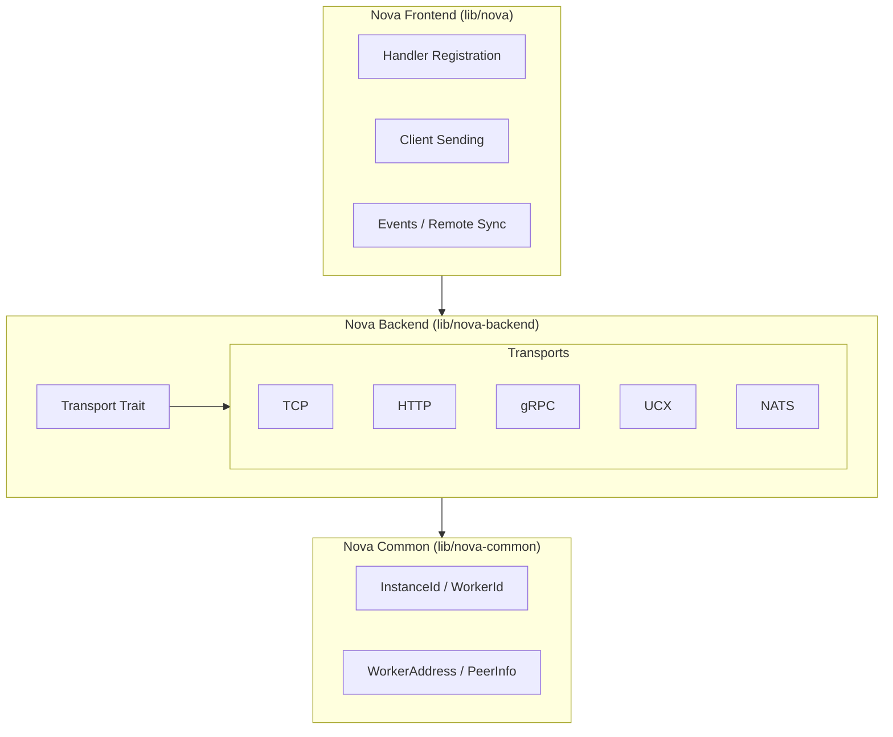
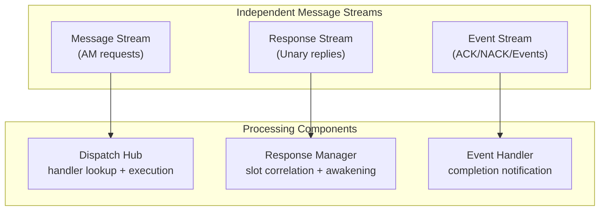
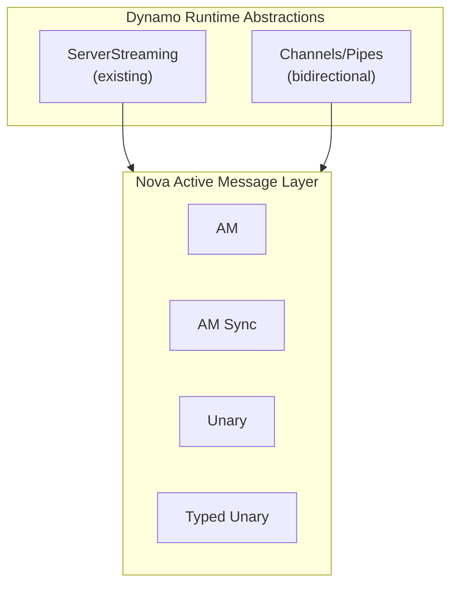

# Nova: Active Messaging as a Foundational Network Primitive

**Status**: Draft

**Authors**: [@ryanolson](https://github.com/ryanolson)

**Category**: Architecture

**Replaces**: N/A

**Replaced By**: N/A

**Sponsor**: [TBD]

**Required Reviewers**: [@grahamking](https://github.com/grahamking), [@biswapanda](https://github.com/biswapanda)

**Review Date**: [TBD]

**Pull Request**: [TBD]

**Implementation PR / Tracking Issue**: [TBD]

# Summary

Nova provides a transport-agnostic active messaging layer that serves as the foundational network primitive for dynamo. By adopting the active message paradigm proven in HPC systems like UCX
and GASNet, Nova enables multiple communication patterns (unary, streaming, bidirectional) to be built on a single, well-optimized foundation. This DEP documents the rationale for active
messaging as Nova's core abstraction and defines how the dynamo runtime can leverage Nova to move beyond the current ServerStreaming-only paradigm.

# Motivation

## Problem Statement

The current dynamo runtime network stack was designed around a single communication paradigm: **ServerStreaming**. The `AsyncEngine` abstraction assumes a single request message triggers a
streaming response, which is implemented by:

1. Receiving a message attached to a handler
2. The handler coordinating execution of a user-defined function
3. Creating a response stream (TCP socket)
4. Marshalling a stream of responses from the handler to that network stream

While this pattern works well for LLM inference (prompt in, tokens out), it is insufficient for dynamo's broader needs:

| Pattern | Current Support | Use Case |
|---------|-----------------|----------|
| **ServerStreaming** | Yes | LLM inference, batch results |
| **Unary (Request/Response)** | Awkward | Health checks, metadata queries, KVBM lookups |
| **ClientStreaming** | No | Batch uploads, aggregation |
| **Bidirectional Streaming** | No | KVBM search coordination, NIXL descriptor exchange |

**Specific Issues:**

1. **Unary Overhead**: Using ServerStreaming for request/response patterns constructs a full TCP stream for a single response - significant overhead for sub-millisecond operations like KV cache
lookups.

2. **Pattern Inflexibility**: The `unified_server.rs` interface (`RequestPlaneServer` trait) only supports registering ServerStreaming handlers. The transport implementations (HTTP, TCP, NATS)
are tightly coupled to this single pattern.

3. **KVBM Requirements**: Distributed KV Block Manager requires bidirectional communication streams for search queries and NIXL descriptor exchange with a coordinating "actor" - impossible with
current abstractions.

## Why Active Messaging?

Active messaging is a communication model where **messages carry both data and a handler identifier**, triggering execution at the destination. This paradigm, proven in HPC systems for over 30
years, provides an ideal foundation for building higher-level communication patterns.

### HPC Heritage

**UCX (Unified Communication X)** exposes an active message interface as its primary abstraction:
- Tagged send/recv (MPI-style) is built on active messages
- Eager protocol: data delivered immediately to handler callback
- Rendezvous protocol: descriptor delivered, data fetched via `ucp_am_recv_data_nbx()`
- Both protocols use the same AM foundation with different completion semantics

**GASNet** uses active messages as its core primitive:
- RMA (Remote Memory Access) operations built on AM
- Split-phase communication enables computation/communication overlap
- "Latency tolerance becomes a programming/compiling concern" rather than hardware limitation

### Benefits for Dynamo

1. **Computation/Communication Overlap**: Handlers execute asynchronously on receipt, enabling pipeline parallelism without blocking

2. **Minimal Dispatch Overhead**: Handler address in message header enables direct dispatch - no matching queues, no synchronization overhead

3. **Foundation for All Patterns**:
   - Unary = AM with response correlation
   - Streaming = AM that establishes channel
   - Fire-and-forget = pure AM
   - Events = AM with completion notification

4. **Transport Agnosticism**: Define a handler once, trigger it from any transport (TCP, gRPC, UCX, NATS) that can reach the target

5. **Zero-Copy Potential**: With eager protocol, receiver gets pointer to network buffer; with rendezvous, data placed directly in application buffer

## Goals

* **Transport Agnosticism**: Single handler definition works across all transport implementations with minimal performance overhead
* **Pattern Flexibility**: Enable unary, streaming, and bidirectional patterns on the same foundation
* **Sub-10us Latency**: For local/same-rack communication, achieve single-digit microsecond latencies for fire-and-forget AM
* **KVBM Enablement**: Provide primitives that KVBM can use directly without dynamo runtime abstractions
* **Runtime Integration**: Enable dynamo runtime to build higher-level abstractions (ServerStreaming, channels) on Nova

### Non Goals

* **Sub-5us Spin-Locked Performance**: Applications requiring sub-5us latency with spin-locked completion queues should use direct UCX/ibverbs/DOCA. Nova accepts scheduling overhead for
transport abstraction benefits.
* **Discovery Protocol**: This DEP does not specify peer discovery. `WorkerAddress` and `PeerInfo` are designed to be key-value store friendly for external discovery integration.
* **Wire Protocol Specification**: Transport-specific wire formats are implementation details, not part of this specification.

## Requirements

### REQ 1: Handler Registration

Nova **MUST** support registering handlers by name with the following semantics:
- **AM Handler**: Fire-and-forget, no response expected
- **AM Sync Handler**: Acknowledgment (ACK/NACK) returned to sender
- **Unary Handler**: Single response with payload returned to sender
- **Typed Unary Handler**: Automatic serialization/deserialization of request and response

### REQ 2: Transport Abstraction

Nova **MUST** provide a `Transport` trait that abstracts over network implementations. Transports **MUST** support:
- Message send with handler name routing
- Response correlation for unary patterns
- Event/ACK delivery for synchronization

### REQ 3: Dispatch Modes

Handlers **SHOULD** support configurable dispatch modes:
- **Inline**: Execute on dispatcher task for minimal latency
- **Spawn**: Execute on separate task for isolation and backpressure

### REQ 4: Response Correlation

Unary patterns **MUST** use efficient response correlation that:
- Embeds correlation ID in message (no separate lookup)
- Handles ABA problem for concurrent slot reuse
- Bounds memory usage (slot arena with generation counters)

### REQ 5: Address Portability

`WorkerAddress` **MUST** be an opaque, serializable type suitable for:
- Storage in external key-value stores
- Transport-independent peer identification
- Lazy transport endpoint resolution

# Proposal

## Active Message Architecture

Nova's architecture consists of three layers:



## Handler Types and Semantics

### Fire-and-Forget (AM Handler)

```rust
NovaHandler::am_handler("process_event", |ctx: Context| {
    // Process ctx.payload
    // Return value is for error handling only - NOT sent to sender
    Ok(())
}).build()
```

**Semantics**: Message delivered, handler executed, no response. Sender continues immediately after send completes.

### Synchronous Completion (AM Sync)

```rust
NovaHandler::am_handler_async("sync_operation", |ctx: Context| async {
    // Perform operation
    Ok(())  // Sender receives ACK
    // or Err(...) // Sender receives NACK
}).build()
```

**Semantics**: Sender awaits ACK/NACK indicating handler completion status.

### Unary (Request/Response)

```rust
NovaHandler::unary_handler("lookup", |ctx: Context| {
    let key = ctx.payload;
    let value = lookup(key)?;
    Ok(Some(value))  // Response sent to sender
}).build()
```

**Semantics**: Single request, single response. Response correlation via embedded ID.

### Typed Unary (Automatic Serialization)

```rust
NovaHandler::typed_unary::<LookupRequest, LookupResponse>("typed_lookup", |ctx| {
    let key = &ctx.input.key;  // Already deserialized
    let value = lookup(key)?;
    Ok(LookupResponse { value })  // Auto-serialized
}).build()
```

**Semantics**: JSON serialization/deserialization handled automatically.

## Three-Stream Architecture

Nova separates message types into independent streams for parallel processing:



Benefits:
- Independent backpressure per stream type
- Response processing doesn't block message dispatch
- Event completions have dedicated fast path

## Transport Abstraction

The `Transport` trait enables pluggable network implementations:

```rust
pub trait Transport: Send + Sync {
    fn key(&self) -> TransportKey;
    fn address(&self) -> WorkerAddress;
    fn register(&self, peer_info: PeerInfo) -> Result<(), TransportError>;

    fn send_message(
        &self,
        instance_id: InstanceId,
        header: Vec<u8>,
        payload: Vec<u8>,
        message_type: MessageType,
        on_error: Arc<dyn TransportErrorHandler>,
    );

    fn start(&self, ...) -> BoxFuture<'_, Result<()>>;
    fn shutdown(&self);
}
```

**Transport Priority**: Nova backend maintains ordered transport preferences. Fast transports (UCX) preferred over slower (HTTP) when both are available.

## Performance Characteristics

| Pattern | Expected Latency | Notes |
|---------|-----------------|-------|
| AM Fire-and-Forget | 5-20us | Depends on transport |
| AM Sync (ACK) | 10-40us | Round-trip for ACK |
| Unary | 10-50us | Round-trip with payload |
| Direct UCX | <5us | Bypass Nova for ultra-low latency |

## Integration with Dynamo Runtime

The dynamo runtime can layer higher abstractions on Nova:



**KVBM Direct Usage**: KVBM will use Nova directly for maximum efficiency, bypassing runtime abstractions when needed for bidirectional communication patterns.

# Implementation Details

## Response Correlation: Slot Arena

Nova uses a bounded slot arena for response correlation:

```rust
pub struct ResponseId(u128);
// Layout: worker_id (64-bit) | slot_index (16-bit) | generation (48-bit)
```

- **65536 slots maximum**: Bounded memory usage
- **Generation counter**: Prevents ABA problem when slots are recycled
- **Embedded in message**: No separate lookup table needed

## Handler Execution: GAT-Based Polymorphism

To avoid `async_trait` boxing overhead for synchronous handlers:

```rust
pub trait HandlerExecutor<C, T>: Send + Sync {
    type Future<'a>: Future<Output = Result<T>> + Send + 'a;
    fn execute<'a>(&'a self, ctx: C) -> Self::Future<'a>;
}

// Sync handler: Future = Ready<Result<T>> (no allocation!)
// Async handler: Future = BoxFuture<'a, Result<T>>
```

## Address Encoding

`WorkerAddress` uses MessagePack-encoded transport endpoints:

```rust
// Conceptually: HashMap<TransportKey, TransportEndpoint>
// Encoded as opaque Bytes for portability
pub struct WorkerAddress(Bytes);

impl WorkerAddress {
    pub fn available_transports(&self) -> Vec<TransportKey>;
    pub fn get_entry(&self, key: &str) -> Option<Bytes>;
}
```

# Alternate Solutions

## Alt 1: Extend Existing AsyncEngine

**Pros:**
- Minimal changes to existing code
- Familiar abstractions for current users

**Cons:**
- AsyncEngine fundamentally assumes streaming response
- Would require significant refactoring to support unary
- Transport coupling remains

**Reason Rejected:** The fundamental assumption of streaming response is baked into AsyncEngine's design. Retrofitting would be more complex than the clean-slate approach with Nova.

## Alt 2: gRPC-Only Communication

**Pros:**
- Well-understood, widely adopted
- Built-in support for all patterns (unary, streaming, bidirectional)
- Good tooling and debugging support

**Cons:**
- gRPC overhead too high for sub-10us latency targets
- Cannot leverage UCX/RDMA without custom transport
- Protobuf compilation required

**Reason Rejected:** gRPC's overhead is acceptable for external APIs but too high for internal hot-path communication like KVBM operations. A gRPC only solution eliminates numerous optimization from the NVIDIA networking team that can provide custom optimization for specific problems.

## Alt 3: Direct UCX Everywhere

**Pros:**
- Maximum performance
- Proven in HPC workloads

**Cons:**
- UCX not available/desired in all deployments
- Significant learning curve
- No transport abstraction

**Reason Rejected:** Not all customers want UCX dependency. Nova provides UCX as one transport option while supporting alternatives for different deployment contexts.

# Background

## Active Messages: Historical Context

Active messages were introduced by von Eicken et al. at UC Berkeley in 1992 as "a mechanism for integrated communication and computation." The key insight was that **messages should carry
handler addresses**, allowing the receiver to immediately begin processing without explicit matching or synchronization.

This paradigm became foundational in HPC:
- **Split-C** (1993): Used AM for PUT/GET with split-phase synchronization
- **GASNet** (2002): AM-based communication layer for PGAS languages
- **UCX** (2014): Modern AM interface with eager/rendezvous protocol support

## UCX Active Message Protocol

UCX's active message interface demonstrates how AM serves as a foundation:

```c
// Send active message
ucs_status_t ucp_am_send_nbx(ep, id, header, header_len,
                              buffer, count, param, req);

// Receive callback (eager)
ucs_status_t am_recv_cb(void *arg, const void *header, size_t header_len,
                        void *data, size_t length, ...);

// Receive callback (rendezvous)
// - data is descriptor, not actual data
// - call ucp_am_recv_data_nbx() to fetch
```

The eager vs rendezvous decision is automatic based on message size (`UCX_RNDV_THRESH`), but both use the same AM handler registration.

## References

* [Active Messages: a Mechanism for Integrated Communication and Computation](https://people.eecs.berkeley.edu/~culler/papers/p256-von_eicken.pdf) - von Eicken et al., 1992
* [GASNet Communication System](https://gasnet.lbl.gov/) - Lawrence Berkeley National Laboratory
* [UCX Active Messages](https://ucfconsortium.org/wp-content/uploads/2021/02/Mikhail_Brinskii_UCX_Active_Messages.pdf) - UCF Consortium, 2020
* [UCX Programming Guide](https://docs.nvidia.com/doca/archive/doca-v1.5.1/ucx-programming-guide/index.html) - NVIDIA Documentation
* [Network-accelerated Active Messages](https://arxiv.org/html/2509.07431v1) - arXiv, 2025

## Terminology & Definitions

| Term | Definition |
|------|------------|
| **Active Message** | A message that carries a handler identifier, triggering execution at the destination |
| **Eager Protocol** | Data delivered immediately with the message; receiver processes in callback |
| **Rendezvous Protocol** | Descriptor delivered first; receiver fetches data to application buffer |
| **Split-Phase** | Communication pattern where initiation and completion are separate operations |
| **Transport** | Network implementation (TCP, UCX, gRPC, etc.) abstracted by Nova |

## Acronyms & Abbreviations

**AM**: Active Message

**GAT**: Generic Associated Types (Rust language feature)

**HPC**: High-Performance Computing

**KVBM**: KV Block Manager

**NIXL**: NVIDIA Inference eXchange Library

**PGAS**: Partitioned Global Address Space

**RDMA**: Remote Direct Memory Access

**RMA**: Remote Memory Access

**UCX**: Unified Communication X
