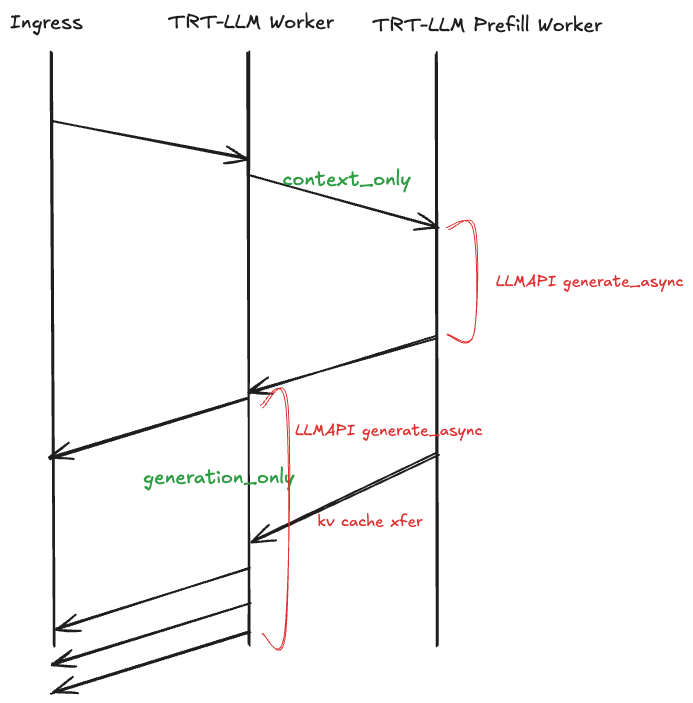
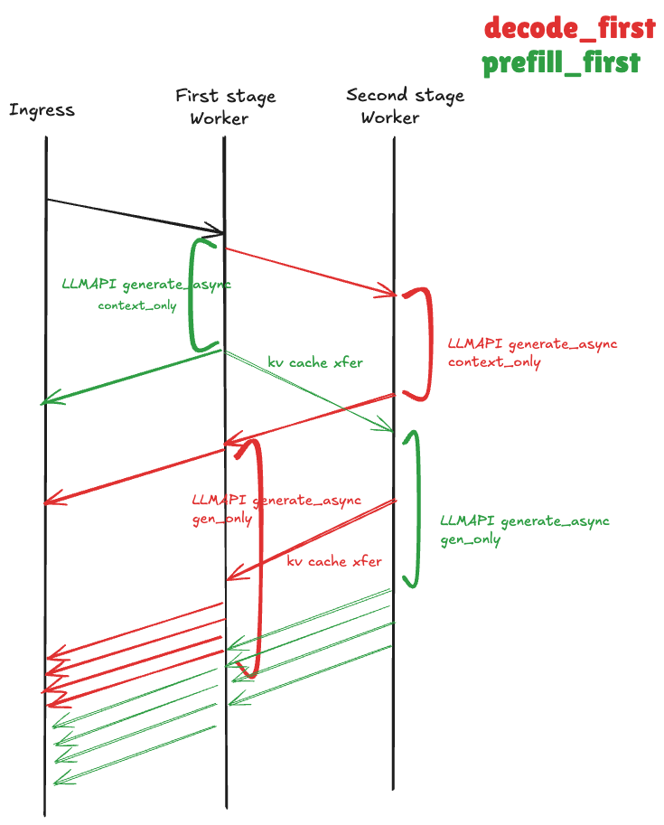

# Prefill->Decode Disaggregated Workflow for TensorRT-LLM 

**Status**: Draft

**Authors**: Tanmay Verma

**Category**: Architecture

**Replaces**: [Link of previous proposal if applicable] 

**Replaced By**: [Link of previous proposal if applicable] 

**Sponsor**: [Name of code owner or maintainer to shepard process]

**Required Reviewers**: [Names of technical leads that are required for acceptance]

**Review Date**: [Date for review]

**Pull Request**: [Link to Pull Request of the Proposal itself]

**Implementation PR / Tracking Issue**: [Link to Pull Request or Tracking Issue for Implementation]

# Summary

Currently, the disaggregated workflow examples require requests to first hit the decode worker and then the prefill worker. This DEP proposes an alternative approach that allows users to perform prefill operations on the first worker followed by decode operations on the second worker, providing more flexibility in workflow orchestration.

# Motivation

**\[Required\]**

Dynamo users have expressed strong interest in gaining control over request flow patterns. The current TensorRT-LLM disaggregated workflow routes requests first to a TensorRT-LLM worker, which then forwards them to a Prefill worker for remote prefill execution. This design constraint stems from the current limitation where only one worker per model can interact with the KV router(call `register_llm`), allowing KV routing to either Prefill workers or Decode workers depending on which receives the request first. In the existing implementation, users are restricted to KV routing on decode workers only. Providing flexibility to choose which worker type handles the initial request routing would address critical user requirements for workflow customization.

## Goals

**\[Optional \- if not applicable omit\]**

List out any additional goals in bullet points. Goals may be aspirational / difficult to measure but guide the proposal. 

### Short-Term Goal

* Goal Allow users to swap the order of prefill/decode workers in TensorRT-LLM disaggregated workflows in the short-term

* Goal Maintain feature parity between both orchestration methods (prefill-first and decode-first workflows)

### Long-Term Goal

* Propose a long-term goal of maintaining a unified disaggregated workflow. 

**\[Optional \- if not applicable omit\]**

List out any items which are out of scope / specifically not required in bullet points. Indicates the scope of the proposal and issue being resolved.

## Requirements

**\[Optional \- if not applicable omit\]**

List out any additional requirements in numbered subheadings.

**\<numbered subheadings\>**

### REQ \<1\> \<Option to control prefill-first or decode-first\>
User **MUST** be able to control whether the request flows from Prefill->Decode or Decode->Prefill.

### REQ \<2\> \<Both the workflows should be properly tested\>
We **SHOULD** properly test both the workflows.

# Proposal

**\[Required\]**

Current request disaggregated workflow looks like:

To unblock users in short-term, we are proposing an additional option (--disaggregation-strategy={prefill_first, decode_first}) to the worker script. The two workers are:
- First stage worker
- Second stage worker

Based on the cli option, the first stage worker can decide whether it wants to run prefill locally and then push the request to second stage for decode. Or forward the request to second stage for remote prefill and run decode locally. 

This should address the requirement in short-term.

## Long-Term

We strongly believe that it should not be the workers job to determine what and where to perform execution. The KV router should be smart enough to handle prefill and decode worker request routing.
The long-term proposal is a WIP. 

# Alternate Solutions

**\[Required, if not applicable write N/A\]**

List out solutions that were considered but ultimately rejected. Consider free form \- but a possible format shown below.

## Alt \<\#\> \<Title\>

**Pros:**

\<bulleted list or pros describing the positive aspects of this solution\>

**Cons:**

\<bulleted list or pros describing the negative aspects of this solution\>

**Reason Rejected:**

\<bulleted list or pros describing why this option was not used\>

**Notes:**

\<optional: additional comments about this solution\>

