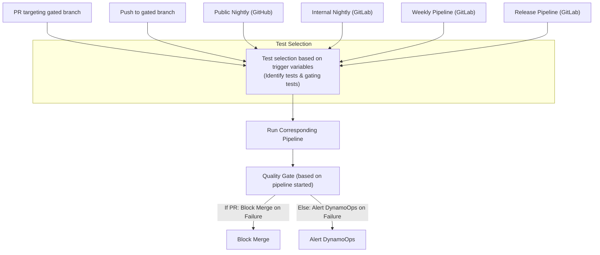

# Dynamo Testing Strategy

## Status
Draft

## Authors
Pavithra Vijayakrishnan

## Category
Test Design Proposal

## Required Reviewers
Meenakshi, Harrison, Neelay

---

## Summary
Dynamo is a distributed, high-throughput inference framework. This strategy defines a layered, automated, and scalable approach to testing, CI/CD, and observability, with the objective of achieving high reliability and rapid iteration.

---

## Goals

This document serves as the comprehensive guideline for testing and CI/CD in the Dynamo project. Its goals are to:

- **Establish a Comprehensive Testing Strategy:** Define a layered, automated, and scalable approach to testing, covering all aspects from linting and unit tests to integration, end-to-end (E2E), performance, stress, and security tests.
- **Map CI/CD Workflows to Test Execution:** Clearly outline the different CI/CD workflows and pipeline runs, specifying which tests are triggered in each pipeline (pre-commit, PR, nightly, release, etc.) and how dynamic test selection is achieved.
- **Define Testing Metrics and Adequacy:** Set clear metrics for test coverage, adequacy, and quality, including line, function, and path coverage, as well as criteria for gating and prime path testing.
- **Facilitate Debuggability and Reliability:** Recommend robust logging, monitoring, and alerting practices to improve test debuggability, enable rapid root cause analysis, and ensure that test failures are actionable and visible to the right owners.
- **Ensure Continuous Improvement:** Provide mechanisms for tracking test flakiness, coverage trends, and performance regressions, and establish clear ownership and escalation paths for test failures.

By achieving these goals, the Dynamo project aims to ensure high reliability, rapid iteration, and continuous improvement in both code quality and system robustness.

## Motivation
- Dynamo uses multiple layers of testing: linting, unit, integration, end-to-end (E2E), performance, benchmark, stress, and security tests.
- Each test type targets a specific aspect of system quality.
- Tests are integrated into CI/CD pipelines to ensure reliability, determinism, performance, visibility, debuggability, and security at every stage of development.


## Types of tests

### Linting & Static Analysis
- **Tools:** pre-commit, clippy, rustfmt, black, flake8, semgrep
- **Trigger:** Every commit/PR (gated by copyPR bot)

### Unit Tests
- **Coverage Target:** 85% (Rust), 80% (Python)
- **Location:** client/common/server/tests/unit/
- **Trigger:** Every PR, push to gated branch

### Integration Tests
- **Location:** tests/integration/
- **Trigger:** PRs, push to gated branch, nightly, weekly, Release
- **Focus:** Real service interaction, distributed scenarios

### End-to-End (E2E) Tests
- **Location:** tests/e2e/
- **Trigger:** PRs, push to gated branch, nightly, weekly, Release
- **Focus:** User workflows, CLI/API

### Performance/Benchmark Tests
- **Location:** benchmark/
- **Trigger:** Nightly, weekly, Release
- **Metrics:** Latency, throughput, resource usage

### Stress Tests
- **Location:** tests/stress/
- **Trigger:** weekly
- **Vision:** Early detection of rare, resource and distributed failures

### Security Tests
- **Location:** tests/security/
- **Trigger:** nightly, weekly, release

---

## Definitions

- **TDD (Test-Driven Development):** A software development process where tests are written before the code they validate. Developers write a failing test, implement the minimal code to pass the test, and then refactor as needed. This approach ensures code is thoroughly tested and requirements are well understood.
- **BDD (Behavior-Driven Development):** A development methodology that emphasizes designing or specifying the expected behavior of a system or component before implementation. Tests are derived from these designs or behavioral specifications to ensure correctness.
- **ATDD (Acceptance Test-Driven Development):** A collaborative approach where acceptance criteria are defined as tests before development begins. These tests represent the requirements from the user's perspective and serve as the basis for validating that the system meets business needs.
- **Gated Branch:** Any branch in the repository that is subject to branch protections and quality controls. This includes main, release, or any other protected branch, such as long-term support (LWS/PB) branches.
- **control flow graph:** CFG is a graphical representation of all possible execution paths of a program.
- **Critical Components of the Dynamo System:** Key subsystems or modules whose correct operation is essential for the overall reliability and functionality of Dynamo. Examples include the planner, router, kvbm, and others as identified in the project.
- **Prime Path (in Testing):** In the context of this strategy, the prime path is defined as the longest happy path through the system, ideally integrating the happy paths of all critical components (e.g., planner, router, kvbm, dynamo serve). This path represents the most comprehensive, non-redundant execution flow and is validated by E2E tests.


### Comparison of ATDD, TDD, and BDD

| Aspect        | ATDD (Acceptance Test-Driven Development) | TDD (Test-Driven Development) | BDD (Behavior-Driven Development) |
|--------------|------------------------------------------|-------------------------------|-----------------------------------|
| **Focus**     | User and business requirements           | Code functionality at a unit level | Feature behavior from a user's perspective |
| **Test Scope**| High-level acceptance tests (end-to-end or integration) | Low-level unit tests          | High-level behavioral scenarios   |
| **Stakeholders** | All stakeholders, including customers | Primarily developers          | Developers, testers, and business stakeholders |
| **Language**  | Plain, business-readable language        | Programming language-specific test code | Human-readable language (often Gherkin) |

## Vision

The Dynamo test strategy and CI/CD pipelines are guided by the following key criteria:
- **Fail Fast:** Early termination on critical failures, quick lint/syntax checks, and immediate feedback.
- Dynamic, code-aware test selection is implemented in CI. Dynamically choose the trigger varaibles.
- **Parallelization:** Matrix builds, parallel test execution, and concurrent pipeline stages.
- **Caching & Efficiency:** Build and test result caching, Docker layer caching, and resource-aware scheduling. Currenlty have sccache.
- **Flakiness Management:** Automatic retries, quarantine for unstable tests, and flakiness analytics.
- **Environment Isolation:** Clean, containerized builds and reproducible infrastructure.
- **Reporting:** Coverage trends, performance regression detection, and resource usage metrics. All test failures and regressions are actionable and monitored.
- Test ownership and escalation paths are documented.
- Long-standing (weekly scheduled) CI for stress tests is also treated as a first-class pipeline.

These criteria ensure robust, efficient, and scalable pipelines that support rapid development and high-quality releases.

## Metric

### Test metric discussed below

### Quality Gate on Pipeline

A quality gate on a pipeline is a set of conditions that must be met for the pipeline to be considered successful and for code to progress to the next stage ( merge, or release as RC).

**Example:**
- In a pull request pipeline, the quality gate may require that all unit, integration, and prime path E2E tests pass, and that code coverage remains above a defined threshold.
- In a release pipeline, the quality gate may additionally require that security and performance tests pass.

In general
  - No Critical failures
  - Coverage drop >2%: Block merge, alert
  - Performance regression >5%: Alert, block release


## Triggering Workflows and CI types

Dynamo employs two primary CI systems:
1. **Public-Facing CI**
2. **Internal CI**

### Workflows triggering CI

Some pipelines, such as the Pull Request (PR) Pipeline, run a targeted subset of builds and tests. The CI system determines if code changes are limited to a specific framework; if so, that framework is set as the changed framework. Otherwise, the pipeline defaults to a pre-defined framework. This is controlled by:

DYNAMO_TEST_FRAMEWORK = <changed framework> (if detected) or DYNAMO_DEFAULT_FRAMEWORK (fallback)

The following workflows trigger CI runs in the Dynamo project:

1. **Pull Request (PR) on GitHub (Targeting Gated Branches):**
   - Gated by copy-pr bot (for external contribution; manual intervention required)
   - Runs only relevant builds and tests for the changed framework, or defaults to the main framework if no specific change is detected.
   - Dynamically choose the trigger variables
   - Triggers the public-facing CI to run
   - Quality gate on pipeline, if failed blocks merge.

2. **Push to Gated Branches:**
   - Triggers the public-facing CI to run all builds and tests for a dynamically chosen framework
   - Builds for the relevant or default framework.
   - Runs all performance tests for the chosen/default framework.
   - Quality gate on pipeline; if the gate checks fail, alerts DynamoOps
   - Auto-revert commit (not recommended)

3. **Scheduled Runs for GitHub – Nightly:**
   - Triggers the public-facing CI
   - Builds and tests run for all platforms and infrastructure
   - Quality gate on pipeline; if the gate checks fail, alerts DynamoOps

4. **Scheduled Runs for GitLab – Nightly:**
   - Triggers the internal CI
   - From here, triggers the GitHub nightly CI or reuses the nightly CI results cached for GitHub
   - Only additional tests like security tests, OSRB automated tests, performance tests, benchmarking tests, or jobs running on new hardware are configured on the GitLab nightly CI
   - Quality gate on pipeline; if the gate checks fail, alerts DynamoOps

5. **Scheduled Runs for GitLab – Weekly:**
   - Triggers the internal CI to run the long-standing stress test for performance evaluation, fault tolerance, conformance testing, etc.
   - Quality gate on pipeline; if the gate checks fail, alerts DynamoOps
   **Long-Standing Test CI:** A weekly pipeline for multi-day stress/chaos on dedicated runners is beneficial. This enables detection of memory leaks, resource starvation, and rare bugs.

6. **Manually Triggered Runs for GitLab – Release:**
   - Triggers the internal CI to run the release pipeline (define a single variable RELEASE_CI = true, currently not the case)
   - Stricter quality gate on pipeline; if the gate checks fail, alerts DynamoOps

**Note:** Quality gates differ by event. For example, security tests are gating in release pipelines but not in nightly runs. Failures in non-gating tests still require follow-up.


#### CI/CD Event Flow Diagram



**Dynamic Test Selection:**  CI should adapt test selection based on code changes (and historical flakiness ?). vLLM is currently the default framework, but if persistent flakiness is detected, the default can switch to TensorRTLLM or another framework with lower build time.


### Mapping Tests to Pipelines

Each subsequent pipeline inherits the tests from the previous pipeline type, with additional tests layered on as needed:

- **Pre-commit:** Linting, static analysis
- **PR:** Lint, unit, integration, E2E (CPU, 1GPU), OSRB checks (if applicable), evaluate coverage
- **Push to Gated Branch:** Full integration and E2E tests, evaluate coverage
- **GitHub Nightly:** All tests, all hardware, performance smoke tests, coverage
- **GitLab Nightly:** All tests, all hardware, benchmarks, coverage trend, security, 
- **GitLab Weekly:** Nightly tests plus 24-72h stress/chaos, cross-component (using NIXL, aiperf, modelexpress), distributed scale, conformance testing.
- **GitLab Release:** All tests, all hardware, benchmarks, coverage trend, security

---


## Directory Structure

Previous directiry structure recommendation is not followed. Dynamo team to review and finalize the structure. 

TODO : Update with final decision. 

``` 
# Dynamo top-level folder
tests/
└── conftest.py

└── router/
    └── conftest.py
    └── test_runtime_initialization.py
    └── runtime_utils.py
    ...
└── planner/
    └── conftest.py
    └── test_llm_initialization.py
        ...
└── utils/
    └──  ...
    ...
```

``` 
# Dynamo top-level folder
tests/
└── conftest.py

└── runtime/
    └── conftest.py
    └── test_runtime_initialization.py
    └── runtime_utils.py
    ...
└── llm/
    └── conftest.py
    └── test_llm_initialization.py
        ...
    ...
```

```
tests/
├── unit/               # Unit tests for individual components
│   ├── conftest.py     # Unit test fixtures and configuration
│   └── unittest_utils.py
├── integration/        # Integration tests between components
│   ├── conftest.py     # Integration test fixtures and configuration
│   └── integtest_utils.py
├── e2e/                # End-to-end system tests
│   ├── conftest.py     # E2E test fixtures and configuration
│   └── e2etest_utils.py
├── conftest.py         # Shared fixtures and configuration
└── README.md        
```

---

## Trigger Variables

All CI variables must be defined in one place and have the same meaning across all CI systems.

- DYNAMO_TEST_GPU_COUNT
- DYNAMO_TEST_FRAMEWORK
- DYNAMO_TEST_MODE
- CI_FAIL_FAST
- CI_COVERAGE_THRESHOLD
- CI_SKIP_SLOW_TESTS
- DYNAMO_LOG_LEVEL
- DYNAMO_DEFAULT_FRAMEWORK
- .... (will continue to update this here or in the CI strategy document).

---

## Test Segmentation and Grouping

Dynamo's test suite is segmented by component, h/w requirements, and environment to enable targeted CI runs, clear ownership, and debugging. Pytest markers are used for Python, and module/feature-based grouping is used for Rust.

### Python (pytest) Markers

Markers are used to select, group, and report on tests in CI and local runs. Example markers:

- **Lifecycle:**
  - pre_commit, pre_merge, nightly, weekly, release
- **Hardware:**
  - gpu_0, gpu_1, gpu_2, gpu_4, gpu_8
  - h100, gb200, a100, l40
- **Test Type:**
  - unit, integration, e2e, stress, smoke, performance, scalability, distributed, flaky, slow, security, conformance
- **Component/Feature:**
  - kv_cache, kvbm, planner, router, api, config, logging, security, data_plane, control_plane
- **Framework/Backend:**
  - vllm, trtllm, sglang, custom_backend
- **Environment/Infra:**
  - k8s, slurm, docker, cloud

**pyproject.toml registration example:**
```
[pytest]
markers =
    pre_merge: marks tests to run before merging
    nightly: marks tests to run nightly
    weekly: marks tests to run weekly
    gpu_0: marks tests to run on CPU
    gpu_1: marks tests to run on GPU
    gpu_2: marks tests to run on 2GPUs
    gpu_4: marks tests to run on 4GPUs
    gpu_8: marks tests to run on 8GPUs
    e2e: marks tests as end-to-end tests
    integration: marks tests as integration tests
    unit: marks tests as unit tests
    stress: marks tests as stress tests
    vllm: marks tests as requiring vllm
    trtllm: marks tests as requiring trtllm
    sglang: marks tests as requiring sglang
    slow: marks tests as known to be slow
    h100: marks tests to run on H100
    kvbm: marks tests for KVBM
    kv_cache: marks tests for key-value cache
    planner: marks tests for planner 
    router: marks tests for router
    api: marks tests for API endpoints
    config: marks tests for configuration
    logging: marks tests for logging/metrics
    security: marks security/auth tests
    data_plane: marks data path tests
    control_plane: marks control/config path tests
    smoke: marks smoke tests
    regression: marks regression tests
    flaky: marks known-flaky tests
    performance: marks performance tests
    scalability: marks scalability tests
    distributed: marks distributed/multi-node tests
    k8s: marks Kubernetes tests
    slurm: marks Slurm tests
    docker: marks Dockerized tests
    cloud: marks cloud-only tests
    custom_backend: marks custom backend tests
```

**Usage Example:**
```python
@pytest.mark.integration
@pytest.mark.kvbm
@pytest.mark.gpu_2
def test_kv_cache_multi_gpu_behavior():
    ...
```

### Rust (cargo test) Segmentation

- By module/file: Place tests in `tests/kv_cache.rs`, `tests/planner.rs`, etc.
- By function name: Use descriptive names: `test_kv_cache_basic`, `test_router_sharding`
- By features: Use Cargo features to enable/disable test groups: `cargo test --features planner`
- By #[ignore]: Mark slow or special-case tests: `#[ignore]`
- By directory: Organize by component: `server/tests/integration/`, `common/tests/unit/`

**Example:**
```rust
#[cfg(test)]
mod kv_cache_tests {
    #[test]
    fn test_kv_cache_basic() { /* ... */ }
    #[test]
    #[ignore]
    fn test_kv_cache_long_running() { /* ... */ }
}
```

### CI and Ownership

- CI pipelines use marker expressions to select relevant tests for each stage (e.g., `pytest -m "integration and planner and gpu_2"`).
- Rust and Python tests are both first-class.
- Ownership and escalation for each test group/component are documented in the project.

### Component Ownership (PIC) 

| Component | Point of Contact (PIC) |
|-----------|-----------------------|
| vllm      |       Alec            |
| trtllm    |      Tanmay           |
| sglang    |      Ishan            |
| kvbm      |       Ryan Oslon      |
| planner   |       HongKuan        |
| router    |      (?)              |
| nixl      |       Adit            |

### CI Area Ownership

| CI Area      | Point of Contact (PIC) |
|--------------|-----------------------|
| Test Fail    |      Pavithra         |
| Infra Fail   |       Meenakshi       |
| Docker Build |      Tushar           |
| K8s          |        Dmitry         |
| Cloud        |       Anant           |
| Reporting    |     Pavithra          |
| Security/OSRB|      Dmitry           |

---


## Metric : Test Coverage and Adequacy

Test coverage is a primary metric for assessing the quality and completeness of the Dynamo test suite. The following concepts and criteria are used to define and measure coverage:

- **Test Case:** A set of input values, expected results, and any necessary pre/post conditions to evaluate a s/w unit.
- **Test Set:** A collection of related test cases.
- **Test Requirement:** A specific element or behavior of the software that a test case must satisfy or cover.
- **Coverage Criterion:** A rule or set of rules that impose test requirements on a test set.
- **Adequacy Criterion:** The set of test requirements that must be satisfied for a test suite to be considered adequate.

A test suite satisfies an adequacy criterion if:
- All tests succeed.
- Every test requirement in the criterion is satisfied by at least one test case in the suite. For us, this will be a coverage criterion and the threshold needs to be >80%.

### Coverage Metrics and Goals

Coverage is measured using multiple criteria, including:
- Line coverage
- Statement coverage
- Function/method coverage
- Condition/decision coverage
- Path coverage
- Loop coverage

The initial goal is to achieve at least 80% (will be reevaluated after a baseline run next week) code coverage on the main branch. This target will evolve as the project matures and as new components are added.

### Sources of Test Requirements
- **Functional (black box, specification-based):** Derived from software specifications
- **Fault-based:** Derived from hypothesized faults and common bug patterns

### Control Flow and Reachability
 Ensure the line coverage >80 % for pytest integration tests. Ensure syntactic and semantic reachability of the function in comopnents using the right test case and logic. 
- **Line Coverage:** Not solely based on lines, but on the control flow graph (CFG) of the code
- **Syntactic Reachability:** A node is syntactically reachable from another if a path exists in the CFG
- **Semantic Reachability:** A node is semantically reachable if a path can be executed on some input (undecidable in general)
- Standard graph algorithms compute syntactic reachability; semantic reachability is not always computable
Choosing the right tool is imortant - pytest-cov for pytests and rust uses a llvm source-code based coverage -> 


### Deterministic and Non-Deterministic Testing
- **Deterministic CFG:** All paths and outcomes are predictable and repeatable
- **Non-Deterministic CFG:** Some paths or outcomes may vary due to concurrency, randomness, or external state. Does Dynamo have non-determinism in any of the additional components ? Example based on the infarstructure and m/y availabilit do we get different outputs in plnner? Is thsi currently tested?
- Tests with non-deterministic output should be explicitly marked and handled differently in reporting and analysis
- Non-deterministic tests are essential for evaluating fault tolerance, robustness, and system behavior under uncertainty

### Fault Tolerance and Robustness
- Coverage criteria and adequacy should include tests for fault tolerance, such as simulating failures, network partitions, or resource exhaustion
- Marking and tracking non-deterministic and fault-injection tests supports continuous improvement in system resilience

Coverage metrics, adequacy criteria, and the handling of non-deterministic tests are reviewed regularly to ensure the test suite remains effective as Dynamo evolves. 

More informaton on fault tolerance and testing can be found in #TODO add link here. @Neelay Shah.

## Gating Checks and Prime Path Testing

Gating checks are essential jobs in the CI pipeline that must pass before code can progress to the next stage. These checks ensure that only builds and tests meeting minimum quality and stability standards are allowed to merge or release.

### Prime Path Definition and Role
- **Prime Path (Project Definition):** The prime path is defined here as the longest happy path through the system, ideally integrating the happy paths of all critical components (e.g., planner, router, kvbm, dynamo serve). This path represents the most comprehensive, non-redundant execution flow.
- **E2E as Prime Path:** In this strategy, E2E tests are designed to implement the prime path. These tests validate that the system's core workflows, spanning multiple components, work together as intended.
- **Gating Role:** Passing the prime path (E2E) tests is required for any code to merge or release. These tests are the main gating (functional sanity) tests in the pipeline.

### Gating Checks = Gating Build + Gating Tests + (more)
- **Gating Build:** All build jobs started in a given pipeline is a gating job. If the build fails, no further tests are executed.
- **Gating Tests / Sanity Tests:** The primary gating tests are the end-to-end (E2E) tests that exercise the prime path. These serve as sanity checks, ensuring that the most critical workflows function as expected. Define the gating tests for each type of the pipeline run.

### Types of CI Pipelines
- **[GITHUB] Pull Requests (PRs):**
  - The build job is a gating check for the default or changed framework.
  - Prime path E2E tests for the default or changed framework/component are exercised as the gating test set.
- **[GITHUB] Push to Protected Branches (main, release, LWs/PB branches):**
  - All framework builds on the default platform (e.g., x86) are gating jobs.
  - All prime path E2E tests for all frameworks on the default platform are included as gating tests.
- **[GITHUB] Nightly Pipelines:**
  - All framework builds on the default platform (e.g., x86) are gating jobs.
  - All prime path E2E tests for all frameworks on the default platform are included as gating tests.
  - Security checks are also required as gating jobs.
- **Release Pipelines:**
  - All gating checks from nightly (builds, prime path E2E tests, and security checks) are required.
  - Performance gating tests (benchmarking) are added as additional requirements for release.
  - Additional performance and security gating checks may be included as needed.

This approach ensures that only code passing the most critical, cross-component workflows is allowed to merge or release, improving overall system reliability and reducing the risk of regressions in production.


#### CI Test Trigger Matrix

| Trigger Variable                        | pre-merge | vllm_1-gpu | vllm_multi_gpu | trtllm_1-gpu | trtllm_multi_gpu | vllm_benchmark | trtllm_benchmark | jet | compoundai |
|-----------------------------------------|:---------:|:----------:|:--------------:|:------------:|:----------------:|:--------------:|:----------------:|:---:|:----------:|
| `RUN_PRE_MERGE_TESTS=true`              | Yes       | _          | -              | _            | -                | -              | -                | -   | -          |
| `RUN_VLLM=true`                         | Yes       | Yes        | -             | -            | -                | -              | -                | -   | -          |
| `RUN_END_TO_END_TESTS=true`             | -         | Yes        | Yes            | Yes          | Yes              | -              | -                | -   | -          |
| `RUN_TENSORRTLLM=true`                  | -         | -          | -              | Yes          | -               | -              | -                | -   | -          |
| `RUN_INTEGRATION_TESTS_ON_JET=true`     | -         | -          | -              | -            | -                | -              | -                | Yes | -          |
| `RUN_SDK_CI=true`                       | -         | -          | -              | -            | -                | -              | -                | -   | Yes        |
| `RUN_TRTLLM_BENCHMARKS_ON_JET=true`     | -         | -          | -              | -            | -                | -              | Yes              | - | -          |
| `RUN_VLLM_BENCHMARKS_ON_JET=true`       | -         | -          | -              | -            | -                | Yes            | -                | - | -          |
| `NIGHTLY_BUILD=true`                    | Yes       | Yes        | Yes            | Yes          | Yes              | Yes            | Yes              | Yes | Yes        |

- **Yes**: Test runs automatically with this trigger.
- **Manual**: Test can be triggered manually from the pipeline.
- **-**: Test is not run with this trigger.

---

## Additional Suggestions: Logging Improvements

Robust logging is essential for improving debuggability and reducing turnaround time for test failures and fixes. The following recommendations are proposed:

Pre-requisites: 
- Identify if the system has unique identifiers - Any flow ids or similar being currently logged? not observed in the pipeline runs 
- Generate a uuid for each critical flow in the component - @Pavithra
- Adopt a consistent logging structure, such as: 
`<component name> - <uuid> - <state of the system where the error occurred and any versions logging> <the error>`.
 This aids in quick identification and resolution of issues. Need to work with the Dynamo team to come to an agreement.
- Assign component-wise PICs to verify and confirm that logging is correct and complete for their respective areas.
- Logs can be used to detect which component failed and automatically create tickets for the PIC responsible for that component.
- Future goals imo such as developing dashboards that helps visualize from inference logs. Not critical as we can use aiperf at the time of benchamrking.

## Additional Suggestions: Monitoring & Alerting

- **Metrics:** All test jobs log duration, pass/fail, resource usage (Prometheus)
- **Dashboards:** Grafana for test health, coverage, flakiness, performance, container size, security/OSRB violations.
- **Alerts:**
  - Critical failures: Immediate Slack/email
  - Coverage drop >2%: Block merge, alert
  - Flaky test rate >5%: Alert, review
  - Performance regression >5%: Alert, block release

**Test Flakiness analytics:** Visualization of unstable areas is recommended to prioritize engineering effort.

**Open/Closed Metrics:** All test coverage data should be visible to the internal team only.

TODO: Define critical falures here. These failures can be the gating tests failing in gated branches. Refine the gating tests further here to include performance (?).

---


