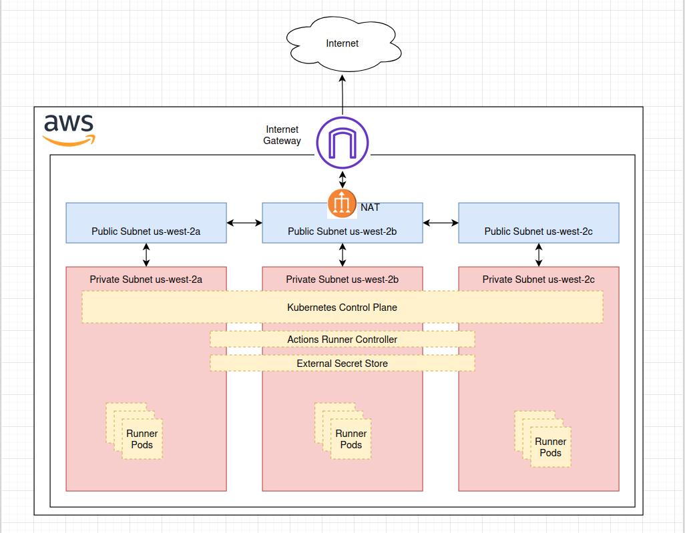

# Velonix - Dynamo's CI/CD solution for Github Actions

**Status**: Under Review

**Authors**: [@dillon-cullinan](https://github.com/dillon-cullinan)

**Category**: Architecture - CI/CD

**Sponsor**: TBD

**Required Reviewers**: [@saturley-hall](https://github.com/saturley-hall), [@dmitry-tokarev-nv](https://github.com/dmitry-tokarev-nv)

**Review Date**: TBD

**Pull Request**: [PR Link](https://github.com/ai-dynamo/enhancements/pull/36)

**Implementation PR / Tracking Issue**: [OPS-724](https://linear.app/nvidia/issue/OPS-724/setup-a-k8-cluster-for-github-gpu-runners)

# Summary

Velonix will be Dynamo's CI/CD solution for its open-source components, and public-facing workflows. It encapsulates all infrastructure related to hosting the Actions Runner Controller to provide a robust and secure CI/CD platform to the organization.

# Motivation

The Dynamo project is an open-source project, and as such is required to participate in NVIDIA's Github First initiative. Part of this initiative is to move our CI/CD to the public domain to encourage more external contributions from the community. This requirement poses several security and infrastructure challenges which this enhancement proposal will address. Additionally, this is an opportunity to improve our infrastructure response times, extensibility, maintainability.

## Goals

* Provide publicly observable CI/CD workflows

* Infrastructure should be secure and follow best practices

* Improve infrastructure response times

* Improve infrastructure maintainability

* Improve infrastructure extensibility

### Non Goals

* Major workflow restructuring

* Optimization of workflow steps

# Proposal

NOTE: The solution is meant to be location agnostic. Diagrams will may show a particular cloud provider, but the solution can be deployed anywhere, given the needed updates to IaC.

## Key Tools

### Terraform

Infrastructure as code solution. All infrastructure provisioning should be done via Terraform, and the projects involved should be easy to contribute to and customize.

### Kubernetes

Kubernetes is a container orchestration tool. It is the foundational technology the solution will build off of due to its capability to support robust and dynamic container solutions.

### Github Actions

Github Actions is a CI/CD platform that is native to Github. This choice is mainly due to familiarity and we are already using it. There are other solutions that exist that are viable, such as Buildkite. The platform choice itself is slightly out-of-scope.

### Actions Runner Controller

[Actions Runner Controller](https://github.com/actions/actions-runner-controller) (ARC) is a Kubernetes controller specifically for Github Actions. The controller allows us to use its custom resources for different variations of runners we want across the org. We can combine this controller with Terraform to provide multiple node groups and respective runners. This allows us to customize basically everything; instance type, instance AMI, runner docker image, resource utilization, etc.

Additionally, ARC provides a `HorizontalRunnerAutoscaler`, which is its way of auto-scaling the needed `Pods` for workflows. These autoscalers have a couple different metrics you can use for autoscaling, but for now we will use a very direct polling mechanism which will ensure that we have a number of pods equal to the number of `InProgress` or `Queued` workflows; meaning the number of pods is always 1:1 with the number of workflows, minimal queueing and on-demand provisioning.

### External Secrets Operator

[External Secrets Operator](https://external-secrets.io/latest/) is a Kubernetes controller for synchronizing secrets from a centralized secrets manager to your Kubernetes cluster. This is a key security tool, as it allows us to store secrets in a centralized location without revealing secrets in the Kubernetes manifests. The External Secrets Operator works with several providers; such as AWS Secrets Manager, OnePassword, Hashicorp Vault, and many others. Keeping our secrets in a centralized vault is an important step we should take as a team, and this tool will provide us the versatility of switching providers as our processes mature.

### EKS Pod Identities

[EKS Pod Identities](https://docs.aws.amazon.com/eks/latest/userguide/pod-identities.html) is another key resource for security. By utilizing Pod Identities, we can attach IAM policies to Kubernetes `ServiceAccounts`. This allows us to be very granular with our IAM permissions. For example, the only pod that needs access to AWS Secrets Manager is the `External Secrets Operator`, therefore we can attach the required IAM policy by adding the respective ServiceAccount to only its Pod.

## Diagrams

### Network

### Kubernetes

# Alternate Solutions

## Alt \<\#\> \<IPP Provided Solution\>

**Pros:**

* Uses NVIDIA hardware, cheaper
* Within NVIDIA network, follows security protocols
* Team does not need to maintain it ourselves

**Cons:**

* Less control over what we need

**Reason Rejected:**

Currently, IPP team is not capable of providing the needed capacity for the Dynamo team. In the future, this can change, and we should be open to moving to their solution. This proposals infrastructure is built in a way for an easy transition.
