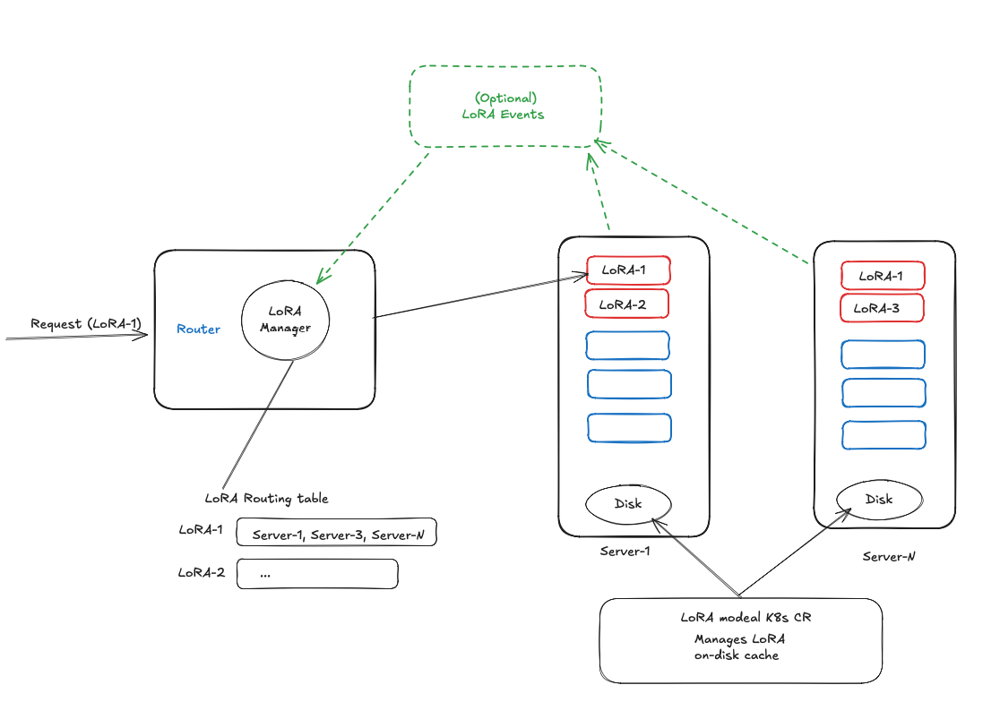

Lora Placement Proposal
# Optimal LoRA Placement & Routing

This proposal defines a churn-minimizing LoRA placement and routing system for a cluster of N inference servers, each with S LoRA slots and a load/unload API. The system routes requests per LoRA to a stable subset of servers using Rendezvous/HRW hashing for deterministic placement stability.


# Summary

# Goals
- Minimize adapter churn (load/unload operations) during steady state and demand drift.
- Provide stable placement under server add/remove (minimal remapping).
- Support fast mitigation of overload events with minimal movement.
- Enable gradual adaptation without requiring a priori per-server capacity models.
- Support routing to a subset of servers per LoRA with existing routing semantic (round-robin, kv, random etc.)


# Non Goals
Optimize for LoRA rank/size differences (explicitly out of scope for this iteration).
- Guarantee perfect fairness across servers under all possible demand patterns (best-effort within churn constraints).
# Requirements

### REQ 1: Placement Stability
The placement algorithm MUST be stable under server membership changes (add/remove), such that only LoRAs that mapped to affected servers are remapped, and remapping follows deterministic fallback ordering.

### REQ 2: Churn Minimization
The system MUST enforce churn bounds:
- A global (and optionally per-server) load/unload budget per time window.
- A lease/cooldown preventing newly loaded adapters from being unloaded immediately.

### REQ 3: Availability
Each LoRA MUST have at least one active replica available for routing except during explicit maintenance/outage scenarios. Eviction policies MUST NOT remove the last replica of a LoRA.


# Proposal

## Design Principles

### Lazy loading the LoRA adapter
- Load the LoRA adapter on the first request to the server.

## Router handles control plane for LoRA placement
- centralize the control plane for LoRA placement in router. 
- Router hosts controller logic to handle the placement of loras to servers.

### Stability via HRW hashing
- For each LoRA a, compute a deterministic ranking of servers by score(a, s) = H(a || s).
- Replica set = top-R_a servers in this ranking.
- Adding/removing servers changes placement only for LoRAs whose top rankings are affected.

### Churn-first control
- Prefer traffic steering and add-only replication.

### Lazy realization
- Separate desired placement (intent) from actual loaded set (location).
- Routing changes can precede actual loads; servers load on first miss.

### Architecture components

- Optimal Placement: a routing table mapping lora adapter → (servers, probability of routing)
- Real metrics: an adapter location table (cluster-wide index of where each adapter is present) 
- Placement Controller: a loop that re-estimates demand each timestep, recomputes placement, and updates routing


### Adapter Palcement algo

A placement algorithm that takes in the following inputs:
- backends: list of backend servers
- loras: list of loras
- current_placement: dictionary mapping adapter to server
- demand_estimate_per_lora: dictionary mapping adapter to demand estimate (normalized to 0-1)

And outputs a new placement dictionary mapping loras to servers.

```python
next_placement = placement_algorithm(backends, loras, current_placement, demand_estimate_per_lora)
```
- Use Active sequence tracking to estimate demand for each lora.
- Compute optimal placement using HRW Rendezvous hashing (generalized consistent hashing) with replica factors.
- Update the routing table based on the new placement.
- we can debounce or wait for k iterations to update the placement to avoid churn.



## Example 
4 LoRAs 

Servers: S1,S2,S3,S4, slots S=2, LoRAs {A,B,C,D} with heat {A>>B>>C>D}.

Replica factors for each LoRA: R_A=3, R_B=2, R_C=1, R_D=1

HRW server orderings for each LoRA:
A: [S2,S4,S1,S3] → target[A]={S2,S4,S1}
B: [S3,S2,S4,S1] → target[B]={S3,S2}
C: [S1,S4,S2,S3] → target[C]={S1}
D: [S4,S3,S1,S2] → target[D]={S4}

