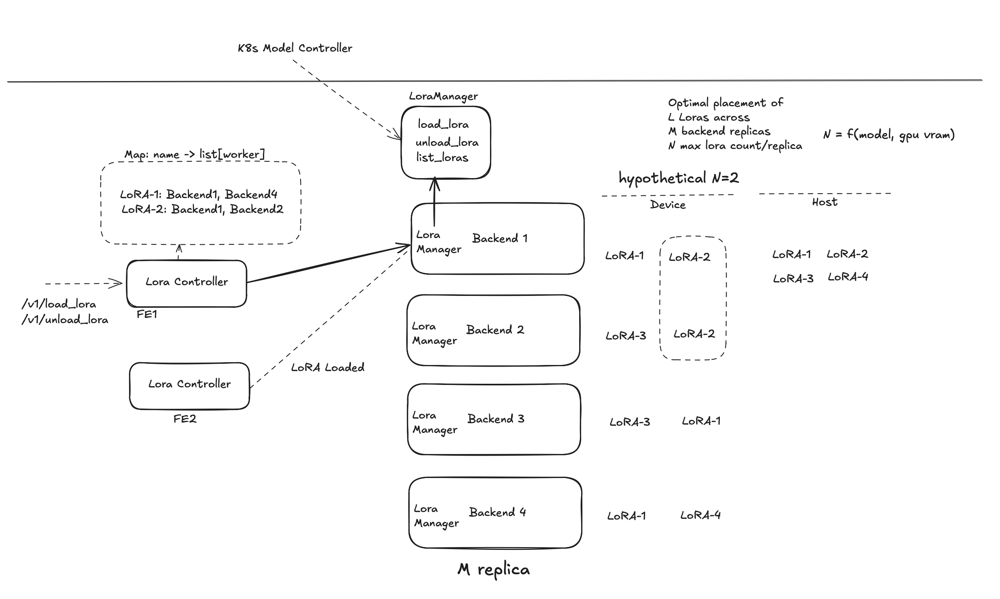

# LoRA Support for Dynamo

**Status**: Draft

**Authors**: Biswa Panda

**Category**: Architecture 

**Required Reviewers**: Neelay Shah, Julien, Tanmay Verma, Alec, Ryan McCormick, Ishaan

**Sponsor**: Anish, Harry


## Overview
This document outlines the support for Multi-LoRA model serving in Dynamo.
Single backend worker can serve multiple LoRA models. Each worker will have a LoRA manager to manage the lifecycle of the LoRA models locally.

In the frontend, LoRA models can leverage the same code paths used for base model routing and preprocessing, requiring minimal changes.

## Requirements
- support for multiple concurrent LoRA model serving and hot loading/unloading of LoRA models at runtime without restarting workers.
- need for load balancing sparse LoRA deployments across multiple backend workers
- LoRA scheduling: dynamic lora management across fleet (load, unload, list) when workers/LoRA models are added/removed

## Out of scope
- Framework support needed for LoRA on MoE models

## Design Principles

Sticky LoRA scheduling: (Similar to KV cache indexing)
- LoRAs should  be sticky to the same worker if possible. Avoid re-scheduling to different worker to avoid cache thrashing.
- LoRA replica scheduling will be dynamic (but avoid re-scheduling) based on load balancing policy.

Backend
- Eager scheduling: Backend workers expose endpoints for explicit LoRA management (load, unload, list)
- Backend workers must respond to LoRA inference requests
  - lazy load LoRA models to llm engine on first LoRA request if its not already loaded.
- LoRA models status will be available in backend's http service endpoint
- configurable cache eviction policy for LoRA models across layers
 
Frontend
- Fronted will discover backend worker's LoRA models status and populate internal map of Lora model name -> worker list
- KV Router will use same block hash computation logic as backend workers to route requests to the appropriate worker.

## Architecture
**LoRA Management Flow:**
```
Frontend (HTTP) → Backend Worker → LLM Engine

Operator → Backend Worker → LLM Engine
```



### LLM Backends

LLM Manager in backend frameworks will be responsible for:
- exposing endpoints for explicit LoRA management (load, unload, list)
- Loading LoRA models to llm engine
- Unloading LoRA models from llm engine
- Downloading LoRA models from upstream LoRA repository to local disk

### LoRA loading and cache management
- explicit: Backend workers expose internal system endpoints to manage LoRA models. The frontend controller discovers workers and distributes LoRA management requests to them.
- implicit: Backend workers will discover LoRA models from configurable (local disk or remote repository) location and load them to llm engine on first LoRA request.

Loading a LoRA means its moved into GPU memory and its available for inference. Maximum number of LoRAs loaded into GPU memory depends on model, GPU VRAM size and framework specific limits. 
Additional LoRas can reside CPU memory or disk cache, but only a limited number can be active in GPU memory at any time.

LRU cache at multiple levels (remote, host, device), and that loading and unloading LoRas between CPU and GPU memory incurs a time penalty. The LoRA controller aims to keep LoRas 'sticky' in memory to minimize frequent evictions and associated delays.

Frontend
- `load_lora` API will load the LoRA into system wide cache and make it available for inference.
- `unload_lora` API will evict the LoRA from system wide cache and reclaim resources for other LoRAs.


**Backend LoRA Management API:**
- Load a LoRA model to llm engine

```bash
POST /v1/load_lora
{
  "base_model": "Qwen/Qwen3-0.6B",                    # required: base model name
  "lora_model": "sql-adapter",                        # required: unique identifier for the LoRA adapter
  "lora_path": "my-org/sql-adapter@main",             # optional: HuggingFace repo@revision - default location is $DYN_LORA_PATH/lora/{lora-name}
#   "lora_path": "/path/to/lora",                     # optional: local path or HuggingFace repo
#   "pin_lora": true,                                 # optional: if this LoRA should be pinned to the device memory - sglang/vllm
#   "traffic_weight": 0.4,                            # optional: weight of the LoRA model in the traffic distribution
}

# Response
{
  "lora_model": "sql-adapter",
  "status": "success",
}
```

- Unload a LoRA model from device memory
```bash
POST /v1/unload_lora
{
  "lora_model": "sql-adapter"
}
```

 **Alternative API:**
  - POST `/v1/loras`: Load LoRA adapter in backend workers
  - DELETE `/v1/loras/<lora_name>`: remove LoRA adapter from backend workers
  - GET `/v1/loras`: get list of loaded LoRA adapters

We want to expose similar api from backend workers as well and dynamo rpc calls dont use http verbs like POST, DELETE, GET, etc.

### LoRA Controller

The LoRA controller in frontend is responsible for:

Phase 1: LoRA discovery data layer
- Finding all backend workers that support LoRA operations and getting their lora status
- Map of {Lora model name -> list of backend workers} for all loaded LoRA models in the frontend

Phase 2: LoRA management scheduling layer
- Distributing LoRA load/unload requests to all relevant workers based on LoRA model

The controller uses the distributed runtime to communicate with backend workers via internal dynamo endpoints.

## (Alternative 1) Frontend LoRA controller

Frotnend exposes HTTP endpoints for LoRA management

## (Alternative 2) K8s bsed LoRA controller

More details in DEP for Dynamo Model

```yaml
# Base model
apiVersion: nvidia.com/v1alpha1
kind: DynamoModel
metadata:
  name: llama-3-70b-instruct-v1
  namespace: dynamo-system
spec:
  modelName: meta-llama/Llama-3.3-70B-Instruct
  version: 8a4556b53a7d81d7e07db15eafb5af5dcd321b33 

---
# LoRA model CR
kind: DynamoModel
metadata:
  name: secAlign-70B-lora
spec:
  model_type: lora
  name: facebook/Meta-SecAlign-70B                   # served model name
  version: 7db15e                                    # huggingface-sha 
  base_model_ref: llama-3-70b-instruct-v1            # Base model described above
#   traffic_weight: 0.4

---
# Deployment CR
kind: DynamoGraphDeployment
metadata:
  name: vllm-disagg
  namespace: dynamo-system
spec:
  services:
    VllmPrefillWorker:
      modelRef:
        name: llama-3-70b-instruct-v1                # base model
```

### Directory Structure for LoRA models
```
<lora-root>/
├── <lora-model-1>/
│       └── <model-weights>
├── <lora-model-2>/
│       └── <model-weights>
```

### Downloading LoRA models to local disk
Support custom LoRA downloader plugin to download LoRA models to local disk (default is HuggingFaceDownloader).

```bash
DYN_LORA_PATH=<path/to/lora/cache>
DYN_LORA_HF_TOKEN=<huggingface/token>

# Optional: Users can bring their own Custom LoRA download logic
DYN_LORA_DOWNLOADER_PLUGIN=<my.custom.lora.downloader.CustomDownloader>,  # default is HuggingFaceDownloader

# user can bring their own custom LoRA downloader plugin as python module
python -m dynamo.vllm --lora-downloader-plugin=<my.custom.lora.downloader.CustomDownloader> ...
```

## LoRA Cache Management

Different cache levels for LoRA models:
### Device cache
LoRA models are loaded into GPU memory and ready for inference. This capacity is limited by GPU VRAM size and framework specific limits and of the order of 10/100s of LoRAs based on parameters like rank, adapter size, etc.

### Host cache
LoRA models are downloaded to host cache (default is local disk). This is slower than device cache but capacity is not limited by GPU VRAM size. Based on RAM size, the capacity can be of the order of 1000s of LoRAs (assuming 25Mb per LoRA) and load times will reduce to 1-2ms.

### Disk cache 
loading time ~ 100ms and can support millions of LoRAs based on disk size.


### Remote cache
This is the source of truth of LoRA models. It is used to download LoRA models from remote repositories like HuggingFace, etc.

## Life of a LoRA Request

**Using LoRA in requests:**
```bash
curl -X POST http://localhost:8000/v1/chat/completions \
  -H "Content-Type: application/json" \
  -d '{
    "model": "sql-adapter",
    "messages": [{"role": "user", "content": "write a sql query to find most active 5 users. activity table has 2 columns: user_id and time_spent"}]
  }'
```

### Inference Request Flow

1. **HTTP Ingress**: Client sends request with `model` field set to the LoRA adapter name (e.g., `"model": "sql-adapter"`)

2. **Model Discovery**: Frontend checks if the model name matches a loaded LoRA adapter by consulting the LoRA controller (which has a map of {Lora model name -> list of backend workers} for all loaded LoRA models)

3. **Frontend Processing**: Preprocessor converts the request to pre-processed format (tokenize, chat template, etc.) - same code path as base model

4. **Routing Decision**: 
   - There will be KV Router per base model. LoRA-aware block hashing (same as backend model block hashing) will be used in router to compute KV block hash and route requests to appropriate workers.

5. **Backend Processing**: Backend worker identifies LoRA by name and constructs framework-specific request and generates response.
   - vLLM: Creates `LoRARequest(lora_name, lora_int_id, lora_path)`
   - sglang: Similar LoRA request object [example](https://docs.sglang.ai/advanced_features/lora.html#dynamic-lora-loading)
   - TensorRT-LLM: Similar LoRA request object [example](https://nvidia.github.io/TensorRT-LLM/1.1.0rc5/torch/features/lora.html#multi-lora-support)

6. **Response**: Standard OpenAI-compatible response is streamed back to frontend

### LoRA Management Flow

1. **Load Request**: Client sends `POST /v1/load_lora` to frontend HTTP endpoint

2. **Worker Discovery**: Frontend uses service discovery to find all workers with the base model

3. **Distribution**: Frontend sends internal `load_lora` request to workers based on load balancing policy (phase-1 send to all workers)

4. **Worker Processing**: Each worker handler:
   - Downloads LoRA weights if needed (via HuggingFace or custom downloader)
   - Calls backend engine's internal API (e.g., `engine.add_lora()` for vLLM)
   - Returns success/failure status

5. **Aggregation**: Frontend/Operator collects responses from all workers and returns aggregate status

6. **LoRA models discovery**: Loaded LoRAs automatically appears in frontend's `/v1/models` endpoint

## KV routing with LoRA models

### KV Router per LoRA model
LoRA enabled Router (in Frontend) will discover all the LoRA models using service discovery mechanism.
Each active LoRA model will have dedicated KV router to handle the request for the LoRA model. It will function similar to existing KV router for base model.

Backend requests will generate KV event stream and Frontend router will consume them to build its Radix Tree.

### Single KV Router per base model
In this approach, we create a single KV Router per base model.
This approach will need to use lora identifier (lora name or id) to compute the KV block hashes for request consistently across Backend LLM workers and frontend router.

 Pros:
- No need to shard the KV Router by LoRA model

Cons:
- Complexity increases as we need to change the block hash computation logic to include the lora identifier
- Changes need to be made in KV routing path in both frontend and backend to support this.

# LoRA Load Balancing

As workers and LoRA models are added/removed we need to dynamically balance the LoRA models across the workers.

LoRA controller will be responsible for discovering all the LoRA models and workers and balancing the LoRA models.

considerations
- use sticky scheduling policy to balance the LoRA models across the workers.
- lazarus like load balancing to schedule LoRA models based on their traffic weights.

# LoRA Controller

## Frontend LoRA controller
Discussed above in the Architecture section.


#  Framework Support for multiple concurrent LoRA model serving

### vLLM LoRA Support

vLLM supports dynamically loading LoRA adapters at runtime using the [punica kernels](https://docs.vllm.ai/en/stable/features/lora.html#dynamically-serving-lora-adapters).

**Prerequisites:**
User needs to enable LoRA support when starting vLLM:
   ```bash
   python -m dynamo.vllm \
       --model <model-name> \
       --enable-lora \
       --max-lora-rank 32
   ```
This will automatically enable runtime LoRA updates env var `VLLM_ALLOW_RUNTIME_LORA_UPDATING` 

**Note:** vLLM must be built with punica kernels support for concurrent LoRA serving. The loaded LoRA name can be used directly as the model name in inference requests.

### sglang LoRA Support

sglang supports [dynamic LoRA loading](https://docs.sglang.ai/advanced_features/lora.html#Dynamic-LoRA-loading) similar to vLLM.

**Prerequisites:**
1. Enable LoRA support when starting sglang:
   ```bash
   python -m dynamo.sglang \
       --model <model-name> \
       --enable-lora \
       --max-loras-per-batch 8
   ```

**Implementation (Future):**
- Similar architecture as vLLM: worker handler with `load_lora()`, `unload_lora()`, and `list_loras()` methods
- Uses sglang's internal LoRA API for runtime adapter management
- Same frontend HTTP endpoints (`/load_lora`, `/unload_lora`)

### TensorRT-LLM LoRA Support

TensorRT-LLM has experimental LoRA support. Implementation details will be added in Phase 2.

**Prerequisites (Planned):**
1. Build TensorRT-LLM with LoRA support enabled
2. Configure LoRA settings during engine build time

**Implementation (Future):**
- Adapter similar worker handler interface as vLLM and sglang
- May require engine rebuild or pre-configured LoRA slots
- Same frontend HTTP endpoints for consistency


## Data structures for LoRA model management

Interfaces and dataclasses for LoRA model in Dynamo. Corresponding rust structs and traits will be available in `dynamo/lib/llm/src/lora.rs`.

Data structures for LoRA model management in Dynamo:

```python
from dataclasses import dataclass

# LoRA model dataclass in Dynamo
@dataclass
class LoraModel:
    name: str
    status: LoraStatus
    cache_location: CacheLocation
    local_path: str

class LoraStatus(intEnum):
    DOWNLOADED = 1
    LOADED = 2
    READY_FOR_USE = 3

class CacheLocation(Enum):
    DEVICE = "device"
    HOST = "host"
    DISK = "disk"
    REMOTE = "remote"

# LoRA Events
class LoraEventType(intEnum):
    DOWNLOADED_TO_DISK = 1
    DELETED_FROM_DISK = 2
    LOADED_TO_DEVICE = 3
    UNLOADED_FROM_DEVICE = 4

@dataclass
class LoraEvent:
    event_type: LoraEventType
    lora_model: LoraModel
    timestamp: datetime
    instance_id: str

# LoRA Manager - this will be responsible for managing lifecycle of the LoRA models in backend service
class LoraManager(abc.ABC):
    @abc.abstractmethod
    def lora_models(self) -> List[LoraModel]:
        pass

    @abc.abstractmethod
    def load_lora(self, name: str) -> LoraModel:
        pass

    @abc.abstractmethod
    def unload_lora(self, name: str) -> LoraModel:
        pass

# Concrete implementation of LoRA manager
class DynamoVllmLoraManager(LoraManager)
    pass

# Plugin interface for LoRA downloader in LLM backend
class LoraDownloaderBase(abc.ABC):
    @abc.abstractmethod
    def download_lora_to_disk(self, lora_name: str, base_model: str, lora_path: str = None) -> LoraModel:
        pass

# Dynamo's default concrete LoRA downloader implementation
# this will downlowd LoRA models from huggingface to local disk
class HuggingFaceDownloader(LoraDownloaderBase):
    ...

```

## Implementation Components
  - POST `/v1/loras`: Load LoRA adapter in backend workers
  - DELETE `/v1/loras/<lora_name>`: remove LoRA adapter from backend workers
  - GET `/v1/loras`: get list of loaded LoRA adapters

### Frontend
- **HTTP Endpoints** for LoRA management
  - (existing) GET `/v1/models`: Lists base models + loaded LoRA adapters in frontend
  
### Backend Workers
- **Endpoints**
- **Framework Specific LoRA Handler** (`components/src/dynamo/vllm/handlers.py`):
  - `load_lora()`: Downloads and loads LoRA to llm engine
  - `unload_lora()`: Unloads LoRA from llm engine
  - `list_loras()`: Returns list of loaded LoRAs
  - `generate()`: Modified to support LoRA requests

### LoRA Resolution
- **HuggingFace Resolver** (`components/src/dynamo/vllm/hf_lora_resolver.py`):
  - Maps LoRA name to HuggingFace repository
  - Handles local paths and remote repositories
  - Supports custom resolution logic

### Configuration
- **CLI Arguments**:
  - `--lora-downloader-plugin`: Custom downloader plugin class

Additional framework specific cli args and environment variables LoRA support:
For example, vLLM has the following configuration:
  - `--enable-lora`: Enable LoRA support
  - `--max-lora-rank`: Maximum LoRA rank (default: 64)
  - `--max-loras`: Maximum concurrent LoRAs (default: 4)


## Smart LoRA Serving

### Load Distribution Logic: 
LoRA controller distributes LoRas across available backend workers to minimize cache thrashing and maximize resource utilization, with the controller orchestrating which worker loads which LoRa.

### Traffic Weighting and Pinning: 
- Optionally user can assign traffic weights to LoRas (e.g., loading more replicas of high-traffic LoRas) and pinning specific LoRas to prevent eviction.

### Thundering Herd problem with new LoRA model requests:
State synchronization between multiple front ends is required to avoid thundering herd problem with new LoRA model requests. We can use event-based updates and service discovery to ensure consistent LoRA model states across FE instances.

### Scaling and Fault Tolerance:
LoRA controller will be responsible for fault tolerance for LoRA model serving.

As the system scales to more workers and LoRas, LoRA placement (LoRA replicas for fault tolerance) will become increasingly important.
We need a pluggable policy where use can configure how to place M LoRAs on N workers optimally.

## Phases

### Phase 1: Basic Support for LoRA models in Dynamo
**Status**: working POC for vLLM

**Components:**
- P0: vLLM backend: poc phase
- P1: sglang backend: not started
- P2: TensorRT-LLM backend
** Metrics:**
- expand current model specific metrics to include LoRA model metrics

### Phase 2: Smart LoRA Serving (Load balancing and fault tolerance for LoRA model serving)

**Goals:**
1. Load balancing and fault tolerance for LoRA model serving
2. sglang backend LoRA support (similar architecture as vLLM)
3. TensorRT-LLM backend LoRA support
4. KV routing optimization for LoRA requests
5. LoRA-aware autoscaling policies
6. Multi-tenant LoRA isolation and quotas

## References

### Implementation Guides
- **[vLLM LoRA Loading](components/backends/vllm/LORA_LOADING.md)**: Detailed vLLM-specific implementation
- **[Launch Script](components/backends/vllm/launch/agg_lora.sh)**: Example launch configuration with LoRA support

### Documentation
- [vLLM LoRA Documentation](https://docs.vllm.ai/en/stable/features/lora.html)
- [SGLang LoRA Documentation](https://docs.sglang.ai/advanced_features/lora.html)
- [TensorRT-LLM LoRA Documentation](https://nvidia.github.io/TensorRT-LLM/1.1.0rc5/features/lora.html)

### Questions 
- How much time it takes to load a LoRA model to llm engine?
- How many LoRA models can be loaded to llm engine simultaneously? This is limited by LoRA size, device memory and framework specific limits.