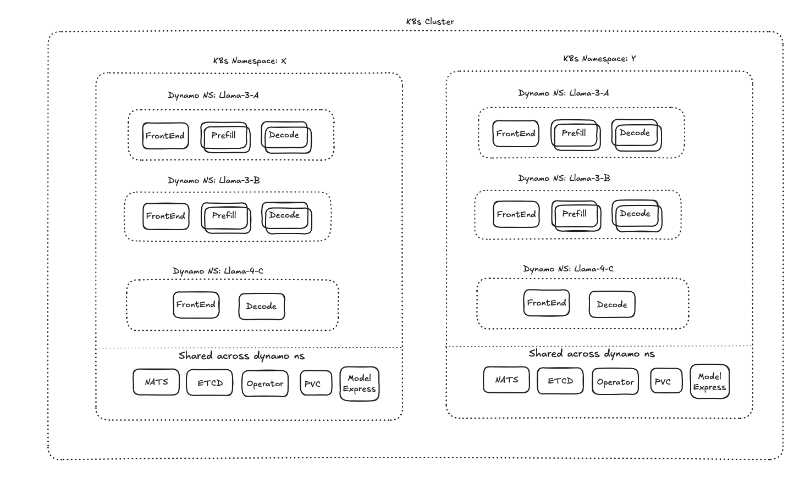
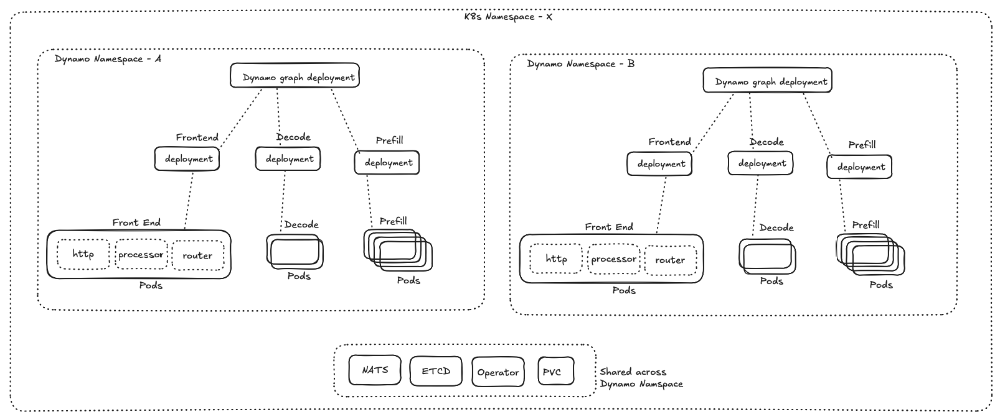
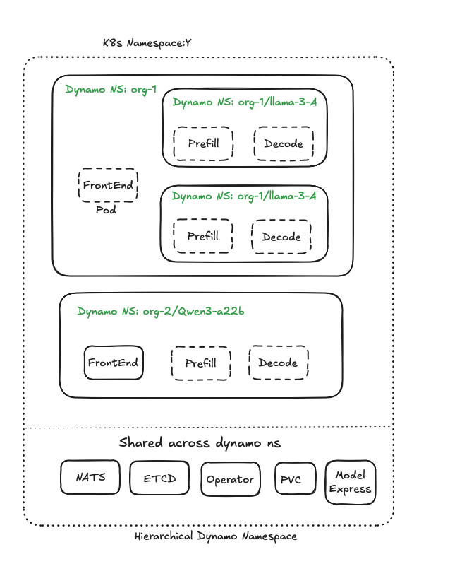

# Multi-tenancy support for DynamoGraphDeployment

## Problem
1. Currently we dont have strong isolation between dynamo graph deployments.
Users expect a Dynamo namespace scoped frontend to serve models from same dynamo namespace. 
For example,two distinct DynamoGraphDeployment frontend pods should not serve models from the different namespaces.

2. Dynamo namespace is logic grouping of components but its not fully enforced across the entire system.
a. k8s CR `dynamoNamespace` is not used to isolate the models.

## What is a Dynamo namespace? 

tldr; Dynamo namespace is name of a `dynamo graph deployment`. 

A Dynamo graph deployment is:
- `logical` group of workers (components) managed and working cohesively.
- `logical` partition/boundary of distributed runtime (control, data and event plane)

Dynamo namespace maps 1:1 with a k8s `DynamoGraphDeployment` CR.

## Use cases for Dynamo namespace
Dynamo namespace enables a hybrid sharing model where we share some resources (operator/etcd/nats deployments, resources, data in pvc) within a k8s namespace and not others (logical component deployments) across multiple dynamo namespaces.

It helps multi-tenenacy use cases where each model deployment is managed in respective isolated`dynamo namespace`.

Use cases:

1. Users dont want to create distinct k8s namespaces for each model deployment.
   a. when dynamic namespace creation and management is not supported/possible
   b. simple to use and manage. Differentiating roles:
       -  `Infra team`: deploys and manages etcd, nats, operator and resources.
       -  `GenAI Inference Team`: deploys and manages etcd, nats, operator and resources. 

2. A/B test models in same namespace with same/shared model weights in RWX PVC volume but different parameters/backends.

3. Deploy multiple models in same k8s namespace use Inference gateway (shared inference pool, endpoint picker) to serve multiple models. This allow configuring granular model routing, Flow control and scheduling policies.

K8s namespace is the strongest isolation boundary in k8s. But its shared nothing architecture and causes issues with
- sharing model weights
- sharing common platform (etcd/nats/operator)
- role based access control (rbac) of above resources vs components

## Requirements

1. Users **SHOULD** be able to create `multiple independent` `DynamoGraphDeployment` (serving same or different models) within single k8s namespace by specifying different `dynamoNamespace` in k8s CR.
For example, I can create two dynamo graph deployments in same k8s namespace with same models with different parameters/backends and benchmark results.

2. Single Dynamo cloud deployment (1 etcd+nats+operator) **SHOULD** be able to serve models from multiple dynamo namespaces.

3. User **SHOULD** be able to deploy 1 or more `DynamoGraphDeployment` in same k8s namespace using different dynamo namespaces.

## Design principles

- Dynamo namespace is `dynamo graph deployment name` which is a logical grouping of components working together.

- Reduce complexity and cognitive load. Reuse existing dynamo namespace as the isolation boundary.

- Minimize cross-contention in FE (http, router, processor) across different namespaces.

- Absolute share nothing architecture should use K8s namespace as the isolation boundary.


## Proposal

### Use K8s namespace as stronger isolation boundary:
Dynamo graph deployment in different k8s namespaces are fully isolated from each other.

They dont share any -
1. deployment (etcd, nats, operator, etc) 
2. resources (cpu, memory, etc)
3. data (PVC for models, etc)
4. components (http, router, processor or llm backends)

Use cases:
1. Users can create distinct k8s namespaces for each model deployment.

Pros:
- Strong isolation boundary.
- Already supported by k8s.

Cons:
- Need to create k8s namespaces dynamically for each model deployment.
- Tightly coupling operability of infra team with genai inference team.
- Need to manage more instances of etcd, nats, operator

### Dynamo namespace as secondary isolation boundary within a k8s namespace:
#### Isolation:
This approach is a hybrid sharing model.

Shared:
1. deployment (etcd, nats, operator, etc) and its resources (cpu, memory, etc)
2. data (PVC for models, etc)

Not shared:
1. components (http, router, processor or llm backends)

#### High level design:



1. `DYNAMO_NAMESPACE` environment variable is used by components to scope their functionality.

2. when `DYNAMO_NAMESPACE` is not specified, `default` is the default namespace.

3. Frontend components (http, router, processor) are scoped to the dynamo namespace.
Advantages:
- Provides sharding ability to scale Routers independently.
- Provides dynamo namespace scoped `sharding` ability to scale all-in-one frontend components independently.

4. Dynamo namespace itself is hierarchial allowing heierchial isolation of Frontend components.

### Implementation

#### Dynamo Operator changes:

Top level `dynamoNamespace` in DynamoGraphDeployment automatically sets `DYNAMO_NAMESPACE` environment variable in all components.

```yaml
apiVersion: dynamo.ai/v1alpha1
kind: DynamoGraphDeployment
metadata:
  name: dynamo-graph-deployment
spec:
  dynamoNamespace: default/model1
```

Similar changes are required in helm chart approach as well.



#### Dynamo Frontend components (http, router, processor):
They use `DYNAMO_NAMESPACE` environment variable to read from etcd and nats.
Phase 1:
- Ignore any etcd data/watch events for namespaces other than the specific namespace.
- Ignore any nats messages for namespaces other than the specific namespace.

Phase 2:
This phase will handle childrent namespaces as well.
same frontend can handle `llama/version-A` and `llama/version-B` namespaces.
- Subscribe to etcd data/watch events for specific namespace as prefix.
- Subscribe to nats messages for namespaces specified namespace as prefix.
- Ignore any event which doesn't match the prefix.

#### Dynamo Backend components (vllm,sglang, trtllm):
  - uses `DYNAMO_NAMESPACE` environment variable to scope their functionality.

Remove `--endpoint` argument in this format(`dyn://namespace.component.endpoint`) from all backend components.
1. namespace is read from `DYNAMO_NAMESPACE` environment variable. This makes it possible to use same backend components for multiple namespaces. it makes a python command line to be `relocatable` across dynamo namespaces by just changing the `DYNAMO_NAMESPACE` environment variable and not the command line arguments.

2. A component hosts multiple endpoints so `dyn://namespace.component.endpoint` is too specific. we dont use it in actual code.

3. components name is unique in a dynamo namespace. we can delegate this until actually we have a use case for multiple components with same name in a namespace.

Remove this argument from all backend components.
```python
  parser.add_argument(
        "--endpoint",
        type=str,
        default=DEFAULT_ENDPOINT,
        help=f"Dynamo endpoint string in 'dyn://namespace.component.endpoint' format. Default: {DEFAULT_ENDPOINT}",
    )
```


####  Heirarchial Dynamo namespace:

Dynamo namespace itself is hierarchial allowing heierchial isolaton and request routing.

A frontend launched with specific `DYNAMO_NAMESPACE` will be scoped to it's namespace and all children namespaces.



for example,
Frontend components in `org-1` dynamo namespace can be used to serve llama-8b model version-A or verion-B for all users.


#### Dynamo Planner:
TODO


#### Common components:
1. etcd
2. nats
3. operator
5. observability stack