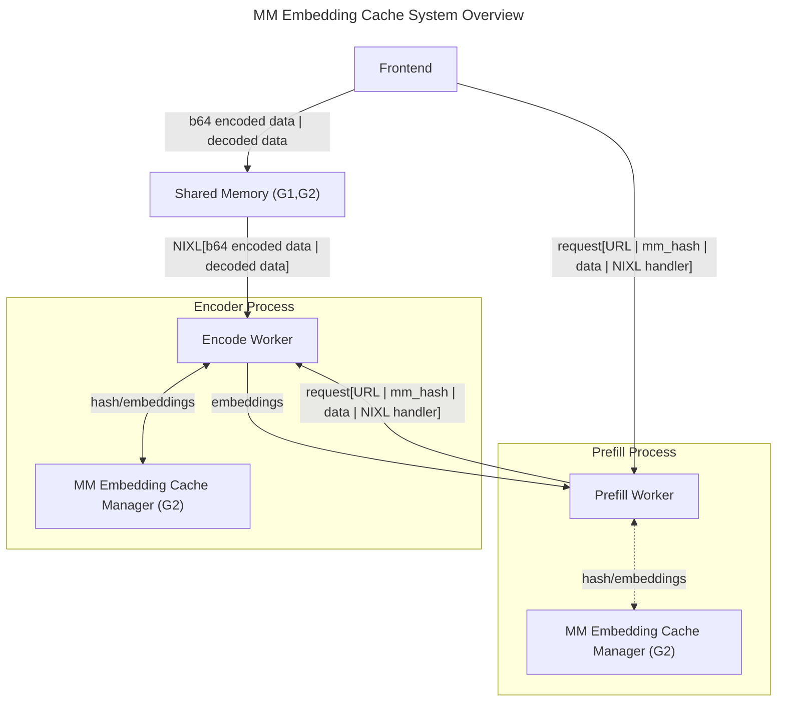
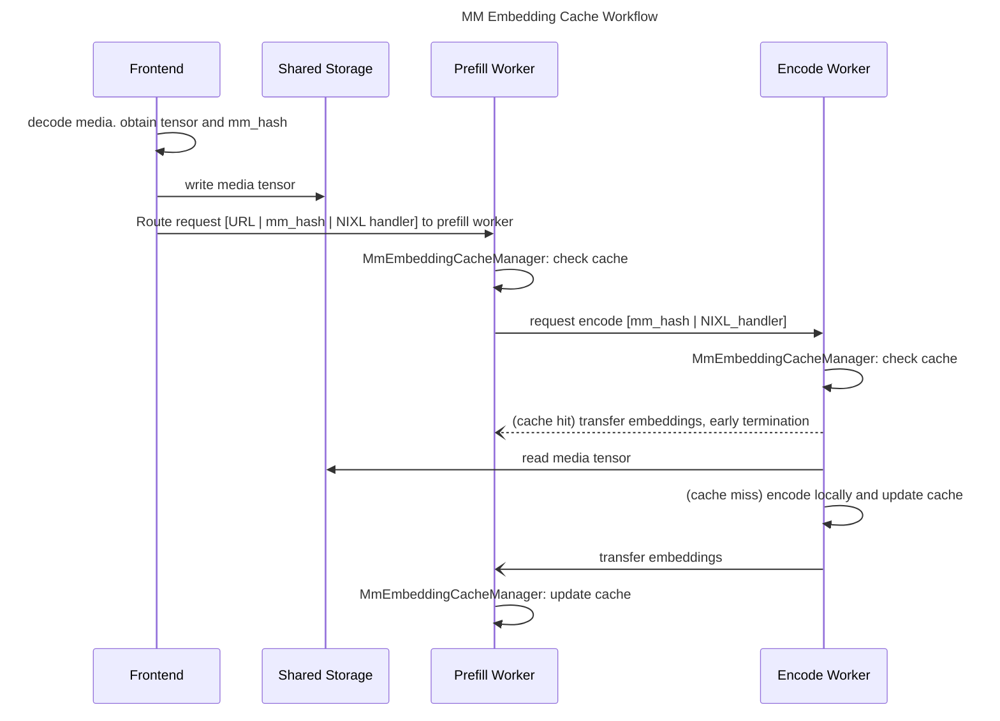
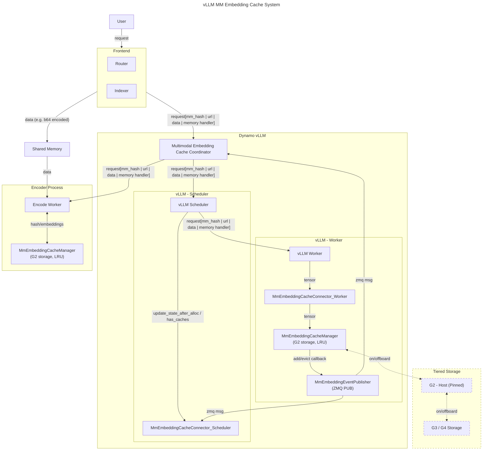

# Multimodal Embedding Cache

**Status**: Approved

**Authors**: [@furionw](https://github.com/furionw)

**Category**: Architecture

**Replaces**: N/A

**Replaced By**: N/A

**Sponsor**: [@guanluo](https://github.com/guanluo), [@ziqifan617](https://github.com/ziqifan617)

**Required Reviewers**: [@guanluo](https://github.com/guanluo), [@ziqifan617](https://github.com/ziqifan617), [@milesial](https://github.com/milesial), [@indrajit96](https://github.com/indrajit96), [@nv-kmcgill53](https://github.com/nv-kmcgill53)

**Review Date**: 2026-01-23

**Pull Request**: N/A

**Implementation PR / Tracking Issue**: N/A

## Summary

This proposal is to

- support multimodal embedding (MME) cache in Encode, Aggregated and Prefill worker in **increase throughput and TTFT** for multimodal workloads.
- streamline multimodal workflow across frameworks (vLLM, TRT-LLM and SGLang) so that Prefill worker becomes the entry point for frontend. This way, we can arrive at a **performant, well-tested yet easy-to-follow** workflow.

## Motivation

Research has evidenced that both MME cache (G1 and G2) and encoder disaggregation improve both throughput and time-to-first-token (TTFT):

- [Encoding cache initial benchmark](<!-- Add link -->)
- [vLLM EPD blog](<!-- Add link -->) and prior work

Despite these advancements, opportunities remain for further improvement, particularly in supporting encoder G2 cache and streamlining workflow to avoid re-computation.

## Non-goals

The future work is as follow

- **[Cross-Node Cache]**: Enable cache sharing across multiple nodes via event plane
- **[G1]**: LLM engine is at the best position to utilize GPU, but we can explore where it may make sense. e.g. G1 cache in Encode
- **[G3 / G4 Tiered Storage]**: Yet to verify. Required work: NIXL + framework interface change to support async. Risks: IO costs performance more than re-computation. We observed perf gain in KVBM when the transfer unit is larger (e.g. larger block size).

# Proposal

## Overview

The Multimodal Embedding Cache system introduces a tiered caching mechanism for multimodal embeddings, enabling efficient reuse of computed embeddings across requests. The design separates concerns between cache storage (MmEmbeddingCacheManager) and event publishing (MmEmbeddingEventPublisher) to maintain clean architecture.

## Architecture

Here we present a simplified system overview and its corresponding workflow. The idea is to
- add MME cache to workers to avoid computation
- build message systems so that router and prefill workers can route requests based on global awareness

One can find its concrete application in "vLLM Deep Dive" section.

### System Overview

### Workflow

## vLLM Deep Dive

### Cache Hit Flow

1. Frontend decodes media and computes `mm_hash`
2. Frontend writes decoded tensor to shared memory
3. Frontend routes request to Prefill worker with `mm_hash` and memory handler
4. Prefill worker checks `MmEmbeddingCacheManager` for cached embedding
5. **Cache hit**: Return cached embedding immediately
6. **Cache miss**: Forward request to Encode worker

### Cache Miss Flow

1. Encode worker receives request with `mm_hash` and memory handler
2. Encode worker checks its local `MmEmbeddingCacheManager`
3. **Cache hit**: Transfer embeddings to Prefill worker
4. **Cache miss**: Read tensor from shared memory, encode, cache result, transfer to Prefill worker
5. Prefill worker caches received embedding in its `MmEmbeddingCacheManager`
6. `MmEmbeddingEventPublisher` broadcasts cache update via ZMQ

## Architecture Components

### 1. MmEmbeddingCacheManager

Responsible for storing and retrieving multimodal embeddings in G2 (host pinned memory) with LRU eviction policy.

**Responsibilities:**
- Store embeddings by `mm_hash`
- Retrieve embeddings on cache hit
- Manage LRU eviction when capacity is reached
- Trigger callbacks on add/evict events

### 2. MmEmbeddingEventPublisher

Responsible for publishing cache state changes via ZMQ.

**Responsibilities:**
- Publish "add" events when embeddings are cached
- Publish "evict" events when embeddings are removed
- Send ZMQ messages to `mmCacheCoordinator` and `MmEmbeddingCacheConnector_Scheduler`

### 3. MmEmbeddingCacheConnector (Scheduler)

Integrates with vLLM scheduler to track cache state for scheduling decisions.

**Responsibilities:**
- Track which embeddings are cached via `has_caches`
- Update state after allocation via `update_state_after_alloc`
- Subscribe to ZMQ events from `MmEmbeddingEventPublisher`

### 4. MmEmbeddingCacheConnector (Worker)

Integrates with vLLM worker to handle embedding tensor flow.

**Responsibilities:**
- Receive tensors from vLLM worker
- Forward tensors to `MmEmbeddingCacheManager` for caching

### 5. Multimodal Embedding Cache Coordinator

Central coordinator for routing requests and managing cache state.

**Responsibilities:**
- Route requests to Encode worker and vLLM scheduler
- Receive cache state updates via ZMQ
- Coordinate cache lookups across workers

## Nomenclature

multimodal embedding cache
- "multimodal" signifies workload
- "embedding" differentiate itself from "decoded media cache" (e.g. mm_processor_cache in vLLM)
- we decided to not use "encoder cache" as a name because 1) MME self-explains what is cached and 2) "encode" is an overloaded term