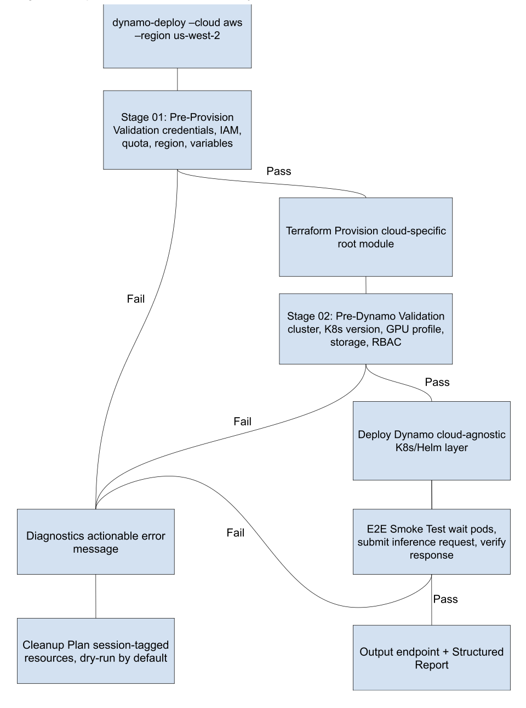
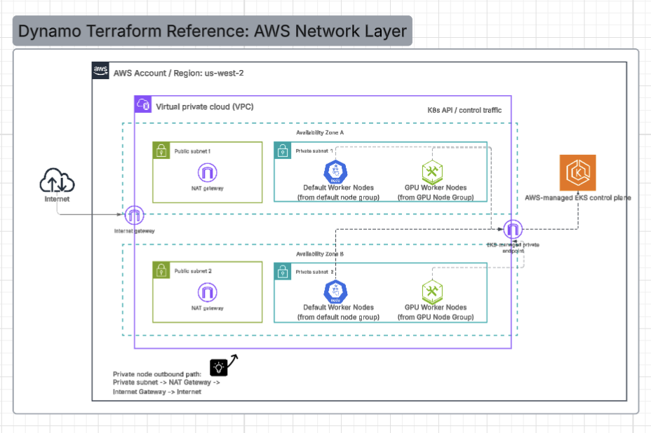
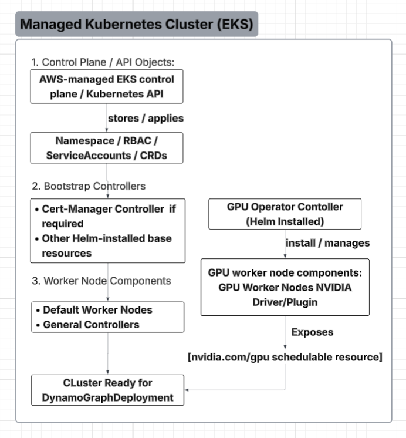

# 2026 Summer Intern Project: Dynamo Terraform Deployment Reference - Haydn Li

## 1. Overview

This document describes the design for a Terraform-native Dynamo deployment reference on managed Kubernetes.

V1 focuses on one cloud provider end to end. The goal is to make the path from a clean cloud account to a running Dynamo deployment easy to follow through repository structure, Terraform examples, Kubernetes deployment instructions, and README guidance.

The first implementation should focus on getting one deployment path working well. If time allows after that, the project can improve Terraform-native guidance, diagnostics, cleanup support, GPU-specific checks, or add another cloud provider example.

## 2. Problem Statement

There is not currently a Dynamo IaC example intended for a user to deploy end to end. Velonix can be used as a reference architecture for how internal infrastructure is structured, but it is CI/CD infrastructure and is not meant to be deployed directly by an external user.

The main gap is not only Terraform code. It is the end-to-end path around the code: repo layout, README guidance, required inputs, Terraform infrastructure steps, Kubernetes Bootstrap steps, Dynamo deployment steps, verification, and cleanup instructions.

Once the base deployment path works, follow-up work can make the experience easier to validate, debug, and clean up.

## 3. Goals and Scopes

### 3.1 P0: Core Deliverables

| Component | Description | Success Criteria |
|-----------|-------------|-----------------|
| Single-Cloud End-to-End Path | One required cloud path from clean account/config to running Dynamo deployment. | User can follow the README for the selected provider and reach a running Dynamo deployment |
| Terraform Root Module | Cloud-specific Terraform example for the selected provider. | User can run `terraform init`, `terraform plan`, and `terraform apply` from the documented example folder. |
| Managed K8s Infra | Provision the K8s infra needed by the selected Dynamo deployment path | Cluster is created and accessible with documented kubeconfig / access instructions |
| K8s Bootstrap Resources | Document the K8s resources required to prepare the cluster for Dynamo installation. | User can apply the required bootstrap resources, such as namespaces, RBAC, service accounts, CRDs, and Helm-installed resources, depending on the selected deployment path. |
| Dynamo Deployment Path | Users can follow Dynamo documentation to deploy a DGD for the selected workload. | User can follow Dynamo documentation to deploy a DGD for the selected workload. |
| Basic Verification and CleanUp | Provide simple verification and cleanup instructions | User can confirm the deployment is running and follow documented cleanup steps |

### 3.2 P1: Optional Improvements

P1 work comes after the base infrastructure and Dynamo deployment are working. These items can be selected based on time, cloud access, GPU availability, and what we learn from the first implementation.

| Component | Description |
|-----------|-------------|
| Terraform Workflow Consistency | Keep the same README and workflow pattern as the project grows beyond the first provider. |
| Terraform-Native Validation | Use Terraform variable validation, plan, preconditions, and outputs to guide users; add custom scripts only when Terraform cannot cover the check. |
| Smoke Test Automation | Automate the basic verification step after Dynamo is deployed. |
| Diagnostics Guidance | Classify common Terraform, Kubernetes, or Dynamo deployment failures into actionable messages. |
| Dry-Run Cleanup Planning | Help users identify resources from failed or partial deployments |
| GPU-Aware Checks | Add checks for the default GPU deployment path, including GPU node readiness, GPU resource availability, and Nvidia device plugin or operator setup |
| Second Cloud Example | Add another provider as a separate Terraform example after the first provider works |

### 3.3 Future Extension Plan

The internship should focus on getting from a clean account to a working Dynamo deployment. Work beyond the deployment reference, such as access control, quota management, or long-running service ownership, can be revisited later if there is a clear user need.

Future work may include stronger security checks, cost guidance, safer cleanup execution, autoscaling, longer-term monitoring, or deeper multi-cloud support.

Any destructive cleanup should require explicit opt-in and should only target resources confidently tied to the current deployment.

## 4. Architecture

### Figure 1: Terraform Infrastructure Layer

### Figure 2: K8s and Dynamo Deployment Layer

### 4.1 V1 Deployment Pipeline

The V1 pipeline is README-first and Terraform-native. Terraform remains the source of truth for cloud infrastructure; Terraform-native features should be used first for input validation, plan review, and user guidance. Helper scripts may be added later only where Terraform does not cover the workflow.

1. Choose the provider example.
2. Review prerequisites and configure the required Terraform inputs for the selected provider.
3. Run `terraform init`, `terraform plan`, and `terraform apply`.
4. Configure Kubernetes access to the provisioned cluster.
5. Apply the Kubernetes bootstrap resources required to prepare the cluster for Dynamo installation.
6. Follow the Dynamo documentation to deploy a DynamoGraphDeployment for the selected workload.
7. Verify that the deployment is running.
8. Follow documented cleanup steps when finished.

Later work may add Terraform-native guidance and lightweight K8s/Dynamo checks, but those checks should not block the V1 deployment path.

## 5. Project Roadmap (12 Weeks)

The following timeline outlines the development of the Dynamo Terraform Deployment Reference, prioritizing the AWS path before adding optional improvements.

| Week | Deliverable | Success Criteria | Priority |
|------|-------------|-----------------|----------|
| 1 | Scope and provider alignment | Mentor agrees on the first cloud provider, V1 scope, repo location, dynamo helm chart and deployment design, and Dynamo deployment path to target. | P0 |
| 2 | Repository and README skeleton | Provider example folder, README outline, required inputs, K8s bootstrap strategy, and cleanup section are drafted. | P0 |
| 3 | Terraform root module skeleton | Terraform structure for the selected provider is in place with variables, outputs, and documented prerequisites. | P0 |
| 4 | Managed Kubernetes provisioning | Terraform can plan/apply the core managed Kubernetes infrastructure for the selected provider, or blockers are documented. | P0 |
| 5 | Cluster access and deployment handoff | User can access the provisioned cluster and apply documented k8s bootstrap resources | P0 |
| 6 | Dynamo deployment path | Dynamo can be deployed onto the prepared cluster by following the documented Dynamo path. | P0 |
| 7 | Basic verification and cleanup docs | User can verify the deployment is running and follow documented cleanup steps. | P0 |
| 8 | First-user trial run | Another engineer or mentor follows the README; gaps are captured and folded back into the docs. | P0 |
| 9 | V1 hardening | Terraform inputs, docs, K8s bootstrap steps, and failure notes are cleaned up based on trial run feedback. | P0 |
| 10 | P1 extension selection | Select one optional improvement based on time and mentor feedback: Terraform native guidance, smoke test automation, diagnostics guidance, GPU checks, cleanup planning, or a second cloud example. | P1 |
| 11 | P1 implementation | Chosen P1 extension is implemented or prototyped without changing the Terraform-native V1 path. | P1 |
| 12 | Final demo and handoff | Demo the V1 deployment path and summarize known gaps, cleanup steps, and recommended next work. | P0/P1 |

## 6. Success Metrics

P0 succeeds if a user can follow the README for the selected provider and reach a running Dynamo deployment.

The repository should remain Terraform-native. Cloud-specific Terraform root modules should stay visible and reviewable, and any helper scripts should stay close to the documented workflow.

The documentation should be usable by someone other than the author. At least one engineer should be able to follow the README, reproduce the deployment path or dry-run flow, and feed any gaps back into the docs.

P1 success is measured by useful follow-up improvements after the base path works, such as Terraform-native validation, smoke test automation, diagnostics guidance, cleanup planning, GPU-aware checks, or a second cloud example.
