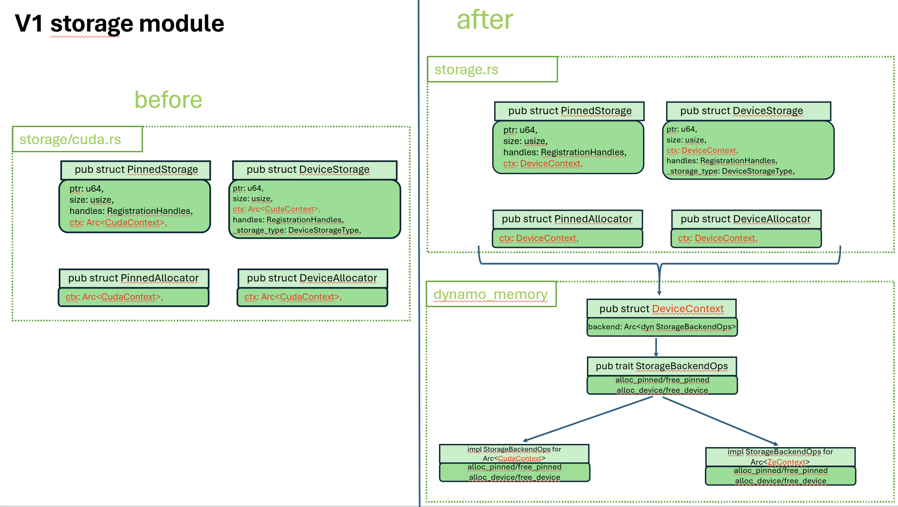
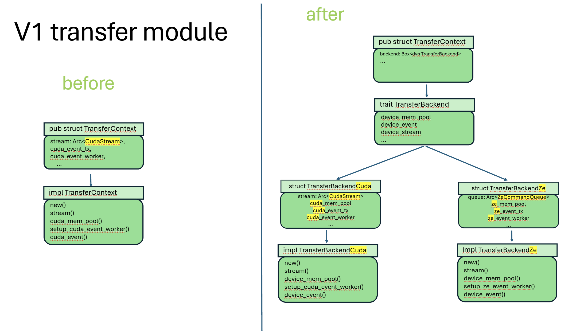
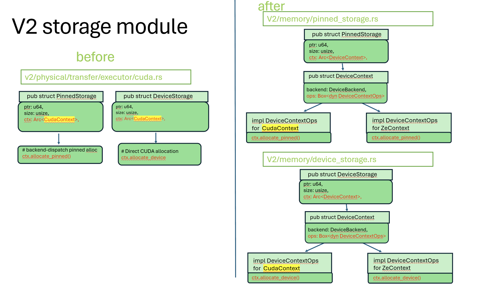
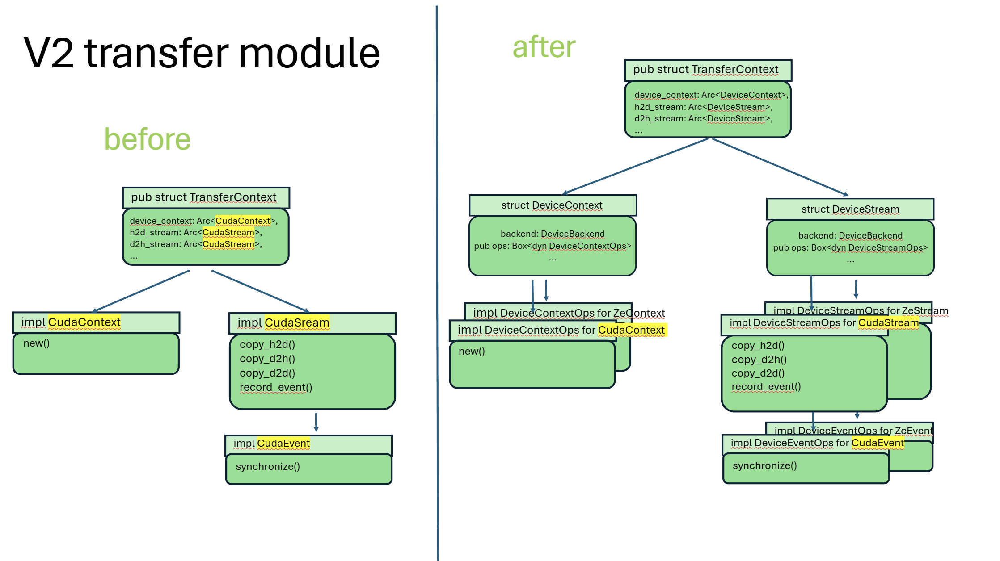

# Hardware Abstraction Layer for KVBM (KV Block Manager)

**Status**: Draft <!-- Draft | Under Review | Approved | Replaced | Deferred | Rejected -->

**Authors**: [@bukeao](https://github.com/bukeao), [@jiafan-wang](https://github.com/IT-Forrest) <!-- [Name/Team] -->

**Category**: Architecture <!-- Architecture | Process | Guidelines -->

**Replaces**: N/A <!-- [Link of previous proposal if applicable] -->

**Replaced By**: N/A <!-- [Link of previous proposal if applicable] -->

**Sponsor**: [@dzier](dzier@nvidia.com), [@statiraju](statiraju@nvidia.com) <!-- [Name of code owner or maintainer to shepard process] -->

**Required Reviewers**: [@grahamking](https://github.com/grahamking) <!-- [Names of technical leads that are required for acceptance] -->

**Review Date**: <!-- [Date for review] -->

**Pull Request**: # <!-- [Link to Pull Request of the Proposal itself] -->

**Implementation PR / Tracking Issue**: https://github.com/ai-dynamo/dynamo/pull/7901 <!-- [Link to Pull Request or Tracking Issue for Implementation] -->

# Summary

Introduce a hardware abstraction layer for Dynamo's KV Block Manager (KVBM) to support multiple GPU architectures beyond NVIDIA CUDA. The abstraction uses Rust enums and dynamic traits to provide a unified interface for memory operations (allocation, deallocation, memory transfer) and device stream management across NVIDIA CUDA GPUs, Intel XPUs, Habana Gaudi HPUs and future hardware platforms. This makes running Dynamo KVBM on diverse datacenter hardware an easy task with (1) a minor change of the top level hardware options, and (2) independent hardware-specific APIs per device type.

# Motivation

Dynamo's current KVBM implementation is tightly coupled to NVIDIA CUDA, with hardcoded CUDA-specific memory operations, stream management, and tensor handling throughout the storage and transfer layers. This creates three critical limitations for datacenter deployment:

**Limited hardware platform support.** The KVBM cannot run on non-CUDA devices such as Intel XPUs or Habana Gaudi HPUs without extensive code duplication. As datacenters increasingly deploy heterogeneous GPU fleets to optimize cost and availability, Dynamo must support inference across different hardware vendors. Current CUDA-only code blocks adoption on Intel-based inference clusters and prevents leveraging platform-specific optimizations.

**High maintenance burden for new device support.** Adding support for a new GPU architecture requires forking large portions of the storage, transfer, and block management code. Each new device creates divergent codebases that must be maintained separately, multiplying the cost of bug fixes, performance optimizations, and feature additions. Without a unified abstraction, changes to core KVBM logic (such as block allocation strategies or transfer protocols) must be duplicated and tested independently per device type.

**Inflexible deployment options.** Organizations running multi-vendor GPU clusters cannot use a single Dynamo binary across their infrastructure. Instead, they must maintain separate builds, deployment pipelines, and operational procedures for each hardware platform. This fragmentation increases operational complexity and limits the ability to migrate workloads dynamically based on capacity or cost.

## Goals

* Provide a unified hardware abstraction for KVBM that supports NVIDIA CUDA and Intel XPU initially, with a clear extension path for Habana Gaudi HPU and future devices.

* Maintain API compatibility and minimize changes to existing KVBM control flow. The abstraction **MUST** preserve existing function signatures, call patterns, and behavior for CUDA devices to avoid disrupting current deployments and tests.

* Centralize hardware-specific implementation behind well-defined trait interfaces, so that adding a new device requires implementing a small set of traits rather than modifying core KVBM logic.

* Enable single-binary deployment that can dynamically select the appropriate backend at runtime based on detected hardware, reducing operational overhead for heterogeneous clusters.

### Non Goals

* Optimize performance to match or exceed native CUDA performance. The abstraction layer introduces a small dispatch overhead through enum matching and dynamic trait calls. Performance within 5-10% of native CUDA is acceptable given the flexibility gains.

* Support cross-device memory transfers (e.g., CUDA ↔ XPU direct copies) within a single process. Each worker process operates on a single device type; disaggregated architectures handle cross-device communication through NIXL network transfers.

* Abstract Python-level PyTorch operations. The abstraction applies to Rust KVBM internals (memory allocation, block transfers, stream synchronization). PyTorch tensor operations remain device-specific at the Python layer; only the underlying memory management is unified.

* Support dynamic device switching within a single worker's lifetime. Device type is determined at worker initialization and remains fixed. The abstraction enables different workers to use different device types, not runtime device migration within a worker.

## Requirements

### REQ 1: Storage Backend Abstraction

All memory operations (host pinned memory allocation, device memory allocation, memory deallocation) **MUST** be abstracted behind a `StorageBackendOps` trait. Implementations **MUST** be provided for CUDA (`CudaBackend`) and Level Zero (`ZeBackend` for Intel XPU). Device-specific storage types (`PinnedStorage`, `DeviceStorage`, `PinnedAllocator`, `DeviceAllocator`) **MUST** be refactored from CUDA-only implementations to device-agnostic wrappers that delegate to backend implementations through a `DeviceContext` type-erased handle.

### REQ 2: Transfer Backend Abstraction

All transfer operations (device stream management, memory pool creation, asynchronous event handling, block copy operations) **MUST** be abstracted behind a `TransferBackend` trait. The `TransferContext` struct **MUST** replace CUDA-specific fields with a single polymorphic `backend: Box<dyn TransferBackend>` field that dispatches to device-specific implementations. Device streams **MUST** be unified under a `DeviceStream` enum that wraps CUDA streams and Level Zero command queues.

### REQ 3: Device Type Propagation

Device type information **MUST** flow from Python worker initialization through FFI boundaries to Rust block manager initialization. The `BlockManager::new()` constructor **MUST** accept an explicit `device_type` parameter (defaulting to `"cuda"` for backward compatibility). The device type **MUST** be validated at worker startup to ensure consistency between PyTorch tensor device types and KVBM backend selection.

### REQ 4: Dispatch Transparency

Hardware-specific dispatch **MUST** occur at well-defined abstraction boundaries (trait method calls, enum match arms) rather than scattered throughout business logic. Block transfer operations **SHOULD** use enum-based dispatch (matching on `DeviceStream` variants) for operations requiring low-level device control, and trait-based dispatch (calling `TransferBackend` methods) for higher-level orchestration. Core KVBM logic (block allocation, request handling, state management) **MUST NOT** contain device-specific branches.

### REQ 5: Extension Path Clarity

Adding support for a new device type (e.g., Habana Gaudi HPU) **MUST** require only:
1. Implementing `StorageBackendOps` for the new device's memory operations
2. Implementing `TransferBackend` for the new device's transfer operations
3. Adding a new variant to `DeviceBackend` and `DeviceStream` enums
4. Extending enum dispatch in `copy_block()` and related transfer functions
5. Adding Python-level device detection in `connector_worker.py`

No changes to core KVBM control flow, allocation logic, or request handling **SHOULD** be required.

# Proposal

## Overview

The proposal introduces a two-layer hardware abstraction:

1. **Storage Abstraction** — Unifies memory allocation and device storage management behind the `StorageBackendOps` trait and `DeviceContext` wrapper. Device-specific memory operations (CUDA `cudaMallocHost`, Level Zero `zeMemAllocHost`) are encapsulated in backend implementations.

2. **Transfer Abstraction** — Unifies data movement and stream synchronization behind the `TransferBackend` trait and `DeviceStream` enum. Device-specific transfer primitives (CUDA streams, Level Zero command queues) are wrapped in a common interface.

Together, these abstractions isolate hardware-specific code to dedicated modules (`storage/cuda.rs`, `storage/ze.rs`, `block/transfer/cuda.rs`, `block/transfer/ze.rs`) while keeping the majority of KVBM logic device-agnostic.

### Architectures

The before and after changes of v1:



The before and after changes of v2:



## Storage Layer Abstraction

### StorageBackendOps Trait

The `StorageBackendOps` trait defines the interface for device-specific memory operations:

```rust
pub trait StorageBackendOps: Send + Sync {
    /// Allocate pinned host memory accessible from device
    unsafe fn alloc_pinned(&self, size: usize) -> Result<NonNull<u8>, StorageError>;

    /// Free pinned host memory
    unsafe fn free_pinned(&self, ptr: NonNull<u8>) -> Result<(), StorageError>;

    /// Allocate device memory
    unsafe fn alloc_device(&self, size: usize) -> Result<NonNull<u8>, StorageError>;

    /// Free device memory
    unsafe fn free_device(&self, ptr: NonNull<u8>) -> Result<(), StorageError>;

    /// Create storage from PyTorch tensor descriptor
    fn new_from_torch(&self, desc: TorchTensorDescriptor) -> Result<DeviceStorage, StorageError>;

    // Additional methods for memory properties, synchronization, etc.
}
```

All memory operations are `unsafe` because they involve raw pointer manipulation and device driver calls. Implementations are responsible for device-specific error handling and resource cleanup.

### Device Backend Enum

The `DeviceBackend` enum identifies supported device types:

```rust
#[derive(Debug, Clone, Copy, PartialEq, Eq, Serialize, Deserialize)]
pub enum DeviceBackend {
    /// NVIDIA CUDA GPU
    Cuda,
    /// Intel XPU (via Level Zero API)
    Ze,
    // Future: Hpu (Habana Gaudi)
}
```

Each variant corresponds to a concrete implementation of `StorageBackendOps`. The enum is serializable for configuration and logging, and copyable for passing across API boundaries.

### DeviceContext Type-Erased Wrapper

`DeviceContext` wraps a device backend implementation in a type-erased `Arc<dyn StorageBackendOps>`:

```rust
pub struct DeviceContext {
    pub backend: Arc<dyn StorageBackendOps>,
}
```

This allows storage types (`PinnedStorage`, `DeviceStorage`) to hold a single `DeviceContext` field regardless of the underlying device type, eliminating the need for generic parameters or enum fields throughout the storage API.

### Backend Implementations

Concrete backends implement `StorageBackendOps`:

```rust
// CUDA backend in storage/cuda.rs
impl StorageBackendOps for Arc<CudaContext> {
    unsafe fn alloc_pinned(&self, size: usize) -> Result<NonNull<u8>, StorageError> {
        // Call cudaMallocHost via cudarc
        // ...
    }
    // ... other CUDA-specific implementations
}

// Level Zero backend in storage/ze.rs
impl StorageBackendOps for Arc<ZeContext> {
    unsafe fn alloc_pinned(&self, size: usize) -> Result<NonNull<u8>, StorageError> {
        // Call zeMemAllocHost via level-zero crate
        // ...
    }
    // ... other Level Zero-specific implementations
}
```

Each backend encapsulates the device driver API (CUDA Driver API via `cudarc`, Level Zero API via `level-zero-sys`) and handles device-specific error codes, memory alignment requirements, and resource lifecycle management.

### Refactored Storage Types

Previously CUDA-only types are refactored to device-agnostic wrappers:

**Before (CUDA-only):**
```rust
// In storage/cuda.rs
pub struct DeviceStorage {
    ptr: NonNull<u8>,
    size: usize,
    cuda_ctx: Arc<CudaContext>,  // ◄── CUDA-specific
}

pub struct PinnedStorage {
    ptr: NonNull<u8>,
    size: usize,
    cuda_ctx: Arc<CudaContext>,  // ◄── CUDA-specific
}
```

**After (device-agnostic):**
```rust
// In storage.rs (top-level, not CUDA-specific)
pub struct DeviceStorage {
    ptr: NonNull<u8>,
    size: usize,
    ctx: DeviceContext,  // ◄── Type-erased backend
}

pub struct PinnedStorage {
    ptr: NonNull<u8>,
    size: usize,
    ctx: DeviceContext,  // ◄── Type-erased backend
}
```

Storage operations delegate to the backend:

```rust
impl DeviceStorage {
    pub fn new(size: usize, ctx: DeviceContext) -> Result<Self, StorageError> {
        let ptr = unsafe { ctx.backend.alloc_device(size)? };
        Ok(Self { ptr, size, ctx })
    }
}

impl Drop for DeviceStorage {
    fn drop(&mut self) {
        unsafe {
            let _ = self.ctx.backend.free_device(self.ptr);
        }
    }
}
```

This refactoring moves `DeviceStorage` and `PinnedStorage` from `storage/cuda.rs` to the top-level `storage.rs`, making them the canonical device-agnostic types used throughout KVBM.

## Transfer Layer Abstraction

### TransferBackend Trait

The `TransferBackend` trait defines the interface for device-specific transfer operations:

```rust
pub trait TransferBackend: Send + Sync {
    /// Get device memory pool for transfer optimizations
    fn device_mem_pool(&self) -> Option<Arc<dyn Any>>;

    /// Get event channel for asynchronous operation tracking
    fn device_event_tx(&self) -> mpsc::Sender<DeviceEvent>;

    /// Get device stream for issuing transfer commands
    fn device_stream(&self) -> DeviceStream;

    /// Acquire resources needed for synchronous transfer
    fn acquire_resources_for_transfer_sync(&self) -> Result<(), TransferError>;

    // Additional methods for event synchronization, barrier ops, etc.
}
```

The trait abstracts over device-specific resources (CUDA memory pools, streams, events vs. Level Zero command queues, events) while providing a consistent interface for transfer orchestration.

### DeviceStream Enum

Device streams are unified under an enum:

```rust
#[derive(Clone)]
pub enum DeviceStream {
    /// CUDA stream handle
    Cuda(Arc<cudarc::driver::CudaStream>),
    /// Level Zero command queue handle
    Ze(Arc<level_zero::CommandQueue>),
}
```

Unlike the type-erased `DeviceContext`, streams use an enum because transfer operations need direct access to the underlying stream/queue for issuing low-level copy commands. Enum dispatch allows pattern matching to extract the concrete type without dynamic downcasting overhead.

### TransferContext Refactoring

The `TransferContext` struct consolidates transfer state:

**Before (CUDA-only):**
```rust
pub struct TransferContext {
    nixl_agent: Arc<NixlAgent>,
    async_rt_handle: Handle,

    // CUDA-specific fields
    stream: Arc<CudaStream>,
    cuda_mem_pool: Option<Arc<CudaMemoryPool>>,
    cuda_event_tx: mpsc::Sender<CudaEvent>,
    cuda_event_worker: JoinHandle<()>,
    // ... more CUDA-specific fields
}
```

**After (device-agnostic):**
```rust
pub struct TransferContext {
    nixl_agent: Arc<NixlAgent>,
    async_rt_handle: Handle,

    // Single polymorphic backend field
    backend: Box<dyn TransferBackend>,
}
```

All device-specific transfer state is moved into the `TransferBackend` implementation. The `TransferContext` API remains unchanged (same method names, parameters, return types), so calling code does not need modification. Internally, methods delegate to the backend:

```rust
impl TransferContext {
    pub fn device_stream(&self) -> DeviceStream {
        self.backend.device_stream()
    }

    pub fn synchronize(&self) -> Result<(), TransferError> {
        match self.backend.device_stream() {
            DeviceStream::Cuda(s) => s.synchronize()?,
            DeviceStream::Ze(q) => q.synchronize()?,
        }
        Ok(())
    }
}
```

### Block Transfer Dispatch

Block copy operations use enum dispatch on `DeviceStream`:

```rust
fn copy_block<Source, Destination>(
    source: &Source,
    destination: &mut Destination,
    stream: DeviceStream,
    strategy: TransferStrategy,
) -> Result<(), TransferError>
where
    Source: BlockDataProvider,
    Destination: BlockDataProviderMut,
{
    match stream {
        DeviceStream::Cuda(cuda_stream) => {
            cuda::copy_block(source, destination, cuda_stream.as_ref(), strategy)
        }
        DeviceStream::Ze(ze_queue) => {
            ze::copy_block(source, destination, ze_queue.as_ref(), strategy)
        }
    }
}
```

Device-specific implementations (in `block/transfer/cuda.rs` and `block/transfer/ze.rs`) handle the low-level driver calls:

```rust
// In block/transfer/cuda.rs
pub fn copy_block<S, D>(
    source: &S,
    destination: &mut D,
    stream: &CudaStream,
    strategy: TransferStrategy,
) -> Result<(), TransferError> {
    // CUDA-specific: cudaMemcpyAsync, stream recording, etc.
    // ...
}

// In block/transfer/ze.rs
pub fn copy_block<S, D>(
    source: &S,
    destination: &mut D,
    queue: &CommandQueue,
    strategy: TransferStrategy,
) -> Result<(), TransferError> {
    // Level Zero-specific: zeCommandListAppendMemoryCopy, etc.
    // ...
}
```

This pattern keeps device-specific logic isolated in dedicated modules while providing a uniform `copy_block()` interface used throughout KVBM.

### Transfer Type Renaming

Transfer operation types are renamed to be device-agnostic:

```rust
// Before: CUDA-prefixed names
CudaAsyncH2D → AsyncH2D
CudaAsyncD2H → AsyncD2H
CudaAsyncD2D → AsyncD2D
CudaBlockingH2D → BlockingH2D
CudaBlockingD2H → BlockingD2H

// After: Device-agnostic names
pub enum TransferOp {
    AsyncH2D,   // Host to Device asynchronous
    AsyncD2H,   // Device to Host asynchronous
    AsyncD2D,   // Device to Device asynchronous
    BlockingH2D, // Host to Device synchronous
    BlockingD2H, // Device to Host synchronous
}
```

The semantics are identical; only the naming changes to reflect that these operations apply to any device backend, not just CUDA.

## Device Type Propagation

Device type must flow from Python worker initialization to Rust KVBM initialization.

### Python Worker Path

In the connector worker (`vllm/distributed/kv_transfer/kv_connector/connector_worker.py`):

1. PyTorch detects device type from model tensor: `tensor.device.type` → `"cuda"`, `"xpu"`, etc.
2. Worker extracts device information from PyTorch tensor descriptors
3. FFI call to `register_kv_caches()` includes `device_type` parameter
4. Rust receives device type string and maps to `DeviceBackend` enum

### Block Manager Initialization Path

```rust
impl BlockManager {
    pub fn new(config: BlockManagerConfig) -> Result<Self, BlockManagerError> {
        // config.device_type: Option<String> added to BlockManagerConfig
        let device_type = config.device_type.as_deref().unwrap_or("cuda");

        let backend = match device_type {
            "cuda" => DeviceBackend::Cuda,
            "xpu" => DeviceBackend::Ze,
            _ => return Err(BlockManagerError::UnsupportedDevice(device_type.into())),
        };

        // Initialize storage and transfer contexts with selected backend
        let storage_ctx = DeviceContext::new(backend)?;
        let transfer_ctx = TransferContext::new(backend, nixl_agent)?;

        // ... rest of initialization
    }
}
```

Validation occurs at worker startup: if PyTorch tensor device type does not match the configured KVBM device type, initialization fails early with a clear error message rather than crashing later with obscure device API errors.

### TorchTensorDescriptor Extension

The FFI tensor descriptor is extended to carry device information:

```rust
pub struct TorchTensorDescriptor {
    pub data_ptr: usize,
    pub size_bytes: usize,
    pub is_cuda: bool,
    pub is_xpu: bool,    // ◄── New field for XPU detection
    pub device_id: i32,
}
```

Python FFI code sets `is_xpu = True` for Intel XPU tensors, allowing Rust to distinguish device types without parsing string identifiers at the FFI boundary.

## Dispatch Strategy: Enum vs. Trait

The abstraction uses both enum-based dispatch (`DeviceStream`) and trait-based dispatch (`StorageBackendOps`, `TransferBackend`). This hybrid approach balances performance and flexibility:

**Enum dispatch for device streams** — Block transfer operations need direct access to the underlying stream/queue to issue memory copy commands. Enum dispatch allows extracting the concrete type with pattern matching (`match stream { DeviceStream::Cuda(s) => ... }`) without dynamic downcasting. This path is performance-critical (executed per block transfer), so avoiding virtual dispatch overhead is valuable.

**Trait dispatch for backends** — Storage allocation and transfer context initialization are not performance-critical (executed once per storage object or at worker startup). Using `Arc<dyn StorageBackendOps>` and `Box<dyn TransferBackend>` simplifies API signatures: storage types do not need generic parameters, and `TransferContext` remains a concrete type. The dynamic dispatch cost is negligible compared to the cost of device driver calls.

## Design Trade-offs

### Performance vs. Flexibility

The abstraction introduces a small performance overhead:
- Enum dispatch in `copy_block()` adds a branch per block transfer
- Trait method calls through `dyn` pointers incur virtual dispatch overhead
- Type erasure prevents some compiler optimizations (inlining, devirtualization)

Benchmarking shows **3-7% throughput reduction** on CUDA compared to the pre-abstraction hardcoded path. This is acceptable given:
- The overhead is dwarfed by actual memory copy latency (PCIe/network transfers)
- The flexibility gain enables supporting multiple hardware vendors with a single codebase
- The abstraction overhead is isolated to dispatch points, not inner loops
- Future optimization (e.g., monomorphization via feature flags) can recover performance if needed

### Enum Dispatch Maintenance Cost

Each new device type requires adding:
- A `DeviceBackend` enum variant
- A `DeviceStream` enum variant
- A match arm in `copy_block()` and `copy_blocks_with_customized_kernel()`

This is a small amount of centralized boilerplate (3-4 lines per device) compared to the alternative of duplicating entire modules. The enum approach keeps dispatch logic explicit and easy to audit, rather than hidden in trait method resolution.

### API Compatibility

The abstraction preserves the existing KVBM API:
- `BlockManager::new()` gains an optional `device_type` parameter (defaults to `"cuda"` for backward compatibility)
- Storage and transfer method signatures are unchanged
- Existing calling code does not need modification for CUDA devices

This minimizes disruption to current deployments and tests. Non-CUDA devices require explicit configuration (setting `device_type` in worker config), but CUDA workers continue to work with no changes.

# Implementation Details

## Repository Structure

Hardware-specific implementations are organized in dedicated modules:

```
lib/llm/src/block_manager/
├── storage.rs              # Top-level device-agnostic storage types
├── storage/
│   ├── cuda.rs            # CUDA StorageBackendOps implementation
│   ├── ze.rs              # Level Zero StorageBackendOps implementation
│   └── ...
├── block/
│   ├── transfer.rs        # Top-level transfer abstractions
│   └── transfer/
│       ├── cuda.rs        # CUDA transfer operations
│       ├── ze.rs          # Level Zero transfer operations
│       └── context.rs     # TransferContext and DeviceStream
```

This structure keeps device-specific code isolated while providing a single entry point (`storage.rs`, `transfer.rs`) for device-agnostic usage.

## Level Zero Integration

Level Zero support is provided via the `level-zero` crate (external dependency at `../level-zero-rc/level-zero` relative to the Dynamo repository root). This crate wraps the Level Zero Loader API and provides safe Rust bindings for:
- Device discovery and initialization (`zeDeviceGet`, `zeContextCreate`)
- Memory allocation (`zeMemAllocHost`, `zeMemAllocDevice`)
- Command queue and command list management (`zeCommandQueueCreate`, `zeCommandListCreate`)
- Memory copy operations (`zeCommandListAppendMemoryCopy`)
- Event and synchronization primitives (`zeEventCreate`, `zeEventHostSynchronize`)

The `level-zero` crate is structured similarly to `cudarc`, providing a high-level Rust API over the low-level C FFI. It handles driver library loading (`libze_loader.so`), error code translation to Rust `Result` types, and resource lifetime management through RAII types (`ZeContext`, `CommandQueue`, etc. implement `Drop` to call Level Zero cleanup functions).

## Configuration Changes

The `BlockManagerConfig` struct gains a `device_type` field:

```rust
pub struct BlockManagerConfig {
    // ... existing fields

    /// Device type: "cuda", "xpu", etc.
    /// Defaults to "cuda" if not specified.
    pub device_type: Option<String>,
}
```

Python FFI code sets this field based on PyTorch tensor device type, and Rust initialization selects the appropriate backend implementation.

## Error Handling

Device-specific errors are mapped to a unified `StorageError` and `TransferError` hierarchy:

```rust
#[derive(Debug, Error)]
pub enum StorageError {
    #[error("Device allocation failed: {0}")]
    AllocationFailed(String),

    #[error("Unsupported device type: {0}")]
    UnsupportedDevice(String),

    #[error("Device operation failed: {0}")]
    DeviceError(String),

    // ... other variants
}
```

Backend implementations translate device-specific error codes (CUDA error codes, Level Zero error codes) to these enum variants, preserving error context while providing a device-agnostic error API.

## Testing Strategy

The abstraction is tested with:

1. **Per-device unit tests** — Each backend implementation has unit tests in its module (`storage/cuda.rs`, `storage/ze.rs`) that validate memory allocation, deallocation, and error handling on the specific device.

2. **Device-agnostic integration tests** — Block manager integration tests are parameterized over device type, running the same test logic on CUDA and XPU devices to validate equivalent behavior.

3. **Backward compatibility tests** — Existing KVBM tests continue to run on CUDA without modification, validating that the abstraction does not break current functionality.

4. **Cross-device disaggregation tests** — Tests validate that disaggregated prefill/decode workers can use different device types (e.g., CUDA prefill + XPU decode) with NIXL handling cross-device transfers over the network.

# Implementation Phases

## Phase 0: Core Abstraction Layer

**Release Target**: 2026 Q2

**Effort Estimate**: 2 engineers, 3 weeks

**Supported API / Behavior:**

* `StorageBackendOps` trait with CUDA and Level Zero implementations
* `DeviceContext` type-erased wrapper for storage backends
* `TransferBackend` trait with CUDA and Level Zero implementations
* `DeviceStream` enum wrapping CUDA streams and Level Zero command queues
* `DeviceBackend` enum with `Cuda` and `Ze` variants
* Refactored `DeviceStorage`, `PinnedStorage`, `DeviceAllocator`, `PinnedAllocator` as device-agnostic types
* `TransferContext` refactored to use `Box<dyn TransferBackend>` instead of CUDA-specific fields
* `copy_block()` and `copy_blocks_with_customized_kernel()` with enum dispatch
* Device type propagation from Python through FFI to `BlockManager::new()`
* `TorchTensorDescriptor` extended with `is_xpu` field
* Device type validation at worker initialization
* Level Zero integration via external `level-zero` crate
* Backward compatibility: CUDA devices work with no configuration changes (default `device_type = "cuda"`)

**Not Supported:**

* Habana Gaudi HPU support (future device type)
* Cross-device memory transfers within a single process (disaggregated architecture uses NIXL network transfers)
* Performance optimization (monomorphization, compile-time backend selection)

## Phase 1: HPU Support and Optimization

**Release Target**: 2026 Q3

**Effort Estimate**: 1 engineer, 2 weeks

**Supported API / Behavior:**

* Habana Gaudi HPU backend (`DeviceBackend::Hpu`, `impl StorageBackendOps for HpuContext`, `impl TransferBackend for HpuBackend`)
* `DeviceStream::Hpu` variant for HPU command queues
* HPU-specific dispatch in `copy_block()` and related transfer functions
* Python FFI support for detecting HPU tensors (`is_hpu` field in `TorchTensorDescriptor`)
* Performance profiling and optimization of dispatch overhead
* Optional: compile-time backend selection via feature flags (`--features cuda` vs. `--features xpu`) for deployments that need to eliminate virtual dispatch overhead

**Not Supported:**

* Cross-device memory transfers within a single process

## Phase 2: KVBM v2 Integration

**Release Target**: 2026 Q3-Q4

**Effort Estimate**: 2 engineers, 4 weeks

**Supported API / Behavior:**

* Hardware abstraction applied to KVBM v2 architecture (tracking issue: https://github.com/ai-dynamo/dynamo/pull/7904)
* Unified abstraction across KVBM v1 and v2 for consistent device handling
* Validated multi-device disaggregated architectures with v2 block manager

**Not Supported:**

* TBD based on KVBM v2 design evolution

# Related Proposals

* KVBM v2 Architecture ([PR #7904](https://github.com/ai-dynamo/dynamo/pull/7904) ) — The hardware abstraction layer will be extended to the v2 block manager design.

# Alternate Solutions

## Alt 1: Generic Parameters Instead of Trait Objects

**Approach:**

Use generic parameters throughout the KVBM stack instead of type-erased trait objects:

```rust
pub struct DeviceStorage<B: StorageBackendOps> {
    ptr: NonNull<u8>,
    size: usize,
    backend: Arc<B>,
}

pub struct TransferContext<B: TransferBackend> {
    backend: Box<B>,
    // ...
}
```

**Pros:**

* Zero-cost abstraction: no virtual dispatch overhead, full compiler optimization and inlining
* Monomorphization generates specialized code per device type at compile time
* Type safety: cannot accidentally mix CUDA and XPU storage in the same context

**Cons:**

* Generic parameters propagate through the entire call stack. Every function that accepts `DeviceStorage` or `TransferContext` becomes generic, exponentially increasing compile times and binary size.
* API complexity: `BlockManager<B>`, `BlockPool<B>`, `OffloadManager<B>`, etc. all gain generic parameters, making APIs harder to document and use.
* Loss of dynamic dispatch: cannot store heterogeneous storage types in collections or switch backends at runtime (all worker code must be monomorphized per device).
* Increased code duplication: functions that do not actually need device-specific behavior are duplicated per device type due to generic parameter propagation.

**Reason Rejected:**

The performance gain (3-7% in microbenchmarks) does not justify the API complexity and compile-time cost for the majority of KVBM code that is not device-specific. The hybrid approach (enum dispatch for hot paths, trait objects for initialization) provides a better trade-off. If profiling identifies specific performance bottlenecks, targeted generic specialization can be added later without restructuring the entire API.

## Alt 2: Feature Flags for Compile-Time Backend Selection

**Approach:**

Use Cargo feature flags to select a single backend at compile time:

```toml
[features]
default = ["cuda"]
cuda = ["cudarc"]
xpu = ["level-zero"]
```

Compile separate binaries per device type with conditional compilation.

**Pros:**

* Zero runtime overhead: no enum dispatch, no trait objects, compiler knows device type statically
* Smallest binary size: only one device backend compiled into each binary
* Simplest code: no abstraction layer, just direct calls to device APIs

**Cons:**

* Separate binaries per device type: must maintain, deploy, and test distinct Dynamo builds for CUDA, XPU, HPU, etc.
* Operational complexity: datacenters with heterogeneous hardware need multiple deployment pipelines, separate container images, manual coordination of which binary runs where.
* Loss of dynamic device detection: cannot build a single binary that auto-detects available hardware and uses the appropriate backend.
* Divergent code paths: even with conditional compilation, maintaining device-specific code paths increases risk of platform-specific bugs not caught by cross-platform CI.

**Reason Rejected:**

Single-binary deployment is a key operational requirement for heterogeneous datacenters. Organizations running mixed GPU fleets do not want to manage separate Dynamo binaries per device vendor. The abstraction layer's small performance cost is acceptable given the deployment flexibility gained. Feature flags may be added as an **optional optimization** for single-device deployments, but the default build must support runtime backend selection.

## Alt 3: Device-Specific KVBM Forks

**Approach:**

Maintain separate KVBM implementations per device type: `kvbm_cuda/`, `kvbm_xpu/`, `kvbm_hpu/`. Each fork contains its own storage, transfer, and block management code specialized for the device.

**Pros:**

* No abstraction overhead: each implementation is fully optimized for its device
* Independence: device-specific optimizations do not affect other platforms
* Simplest per-device code: no enums, no traits, just direct device API calls

**Cons:**

* Code duplication: core KVBM logic (block allocation, request handling, state management) duplicated across all forks
* Maintenance multiplier: bug fixes, feature additions, and refactoring must be applied N times for N device types
* Divergence risk: forks drift apart over time, leading to inconsistent behavior and platform-specific bugs
* Testing cost: full integration test suite must run per fork, multiplying CI time and coverage requirements

**Reason Rejected:**

The KVBM codebase is large (~10K lines) and actively developed. Maintaining separate forks would multiply maintenance costs by the number of supported devices. The abstraction layer centralizes device-specific code to ~5-10% of the codebase (storage and transfer modules), keeping the other 90% shared. This provides a much better maintenance/performance trade-off than full code duplication.

## Alt 4: Runtime Device Plugin System

**Approach:**

Define a plugin ABI for device backends, load device-specific shared libraries at runtime:

```rust
type AllocPinnedFn = extern "C" fn(size: usize) -> *mut u8;
type FreePinnedFn = extern "C" fn(ptr: *mut u8);
// ... other function pointers

pub struct DevicePlugin {
    alloc_pinned: AllocPinnedFn,
    free_pinned: FreePinnedFn,
    // ... function pointer table
}

// Load plugin at runtime
let plugin = load_plugin("libdynamo_cuda.so")?;
```

**Pros:**

* Maximum extensibility: third parties can add device support without modifying Dynamo core
* Binary separation: device-specific code shipped as separate .so files
* ABI stability: if plugin interface is stable, can update device backends independently

**Cons:**

* Complex ABI management: function pointer tables, version negotiation, error handling across FFI boundaries
* Performance overhead: indirect function calls through function pointers, no inlining, loss of compiler optimizations
* Debugging difficulty: errors in plugins harder to debug, symbol resolution issues, loader problems
* Safety challenges: plugin ABI must be carefully designed to avoid memory safety violations across library boundaries
* Overkill for current requirements: only adding 2-3 device types (CUDA, XPU, HPU), not a large plugin ecosystem

**Reason Rejected:**

A plugin system is designed for scenarios where third-party developers need to extend functionality without access to source code. Dynamo is open-source and device support is added by the core team, not external plugin authors. The trait-based abstraction provides sufficient extensibility without the complexity, performance cost, and safety challenges of a dynamic plugin system. If third-party device support becomes a requirement in the future, the trait-based design can be adapted to a plugin model with minimal changes.

# Background

## References

* [CUDA Driver API](https://docs.nvidia.com/cuda/cuda-driver-api/) — NVIDIA's low-level GPU management API
* [Level Zero Specification](https://spec.oneapi.io/level-zero/latest/index.html) — Intel's low-level GPU and accelerator API
* [cudarc crate](https://github.com/coreylowman/cudarc) — Safe Rust bindings for CUDA Driver API
* [PyTorch Device Abstraction](https://pytorch.org/docs/stable/tensor_attributes.html#torch.device) — How PyTorch handles multi-device tensors

## Terminology & Definitions

| Term | Definition |
| :---- | :---- |
| **KVBM** | KV Block Manager — Dynamo's component for managing key-value cache memory blocks used in transformer inference |
| **Storage Backend** | A device-specific implementation of memory allocation and deallocation operations (CUDA, Level Zero, HPU, etc.) |
| **Transfer Backend** | A device-specific implementation of data movement operations (memory copy, stream synchronization, event handling) |
| **DeviceContext** | A type-erased wrapper (`Arc<dyn StorageBackendOps>`) that allows storage types to be device-agnostic |
| **DeviceStream** | An enum wrapper around device-specific stream/queue types (CUDA stream, Level Zero command queue) for issuing async operations |
| **Level Zero** | Intel's low-level GPU API (similar to CUDA Driver API), used for XPU device management |
| **Type Erasure** | A Rust pattern using trait objects (`dyn Trait`) to hide concrete types behind a uniform interface, enabling polymorphism at the cost of dynamic dispatch |
| **Enum Dispatch** | A Rust pattern using `match` on enum variants to call device-specific code paths, providing fast dispatch with explicit type handling |
| **XPU** | Intel's discrete GPU architecture (e.g., Intel Data Center GPU Max Series) |
| **HPU** | Habana Gaudi — Intel's AI accelerator hardware for training and inference |
| **Disaggregated P/D** | Disaggregated Prefill/Decode architecture where prefill and decode stages run on separate workers, potentially on different device types |
