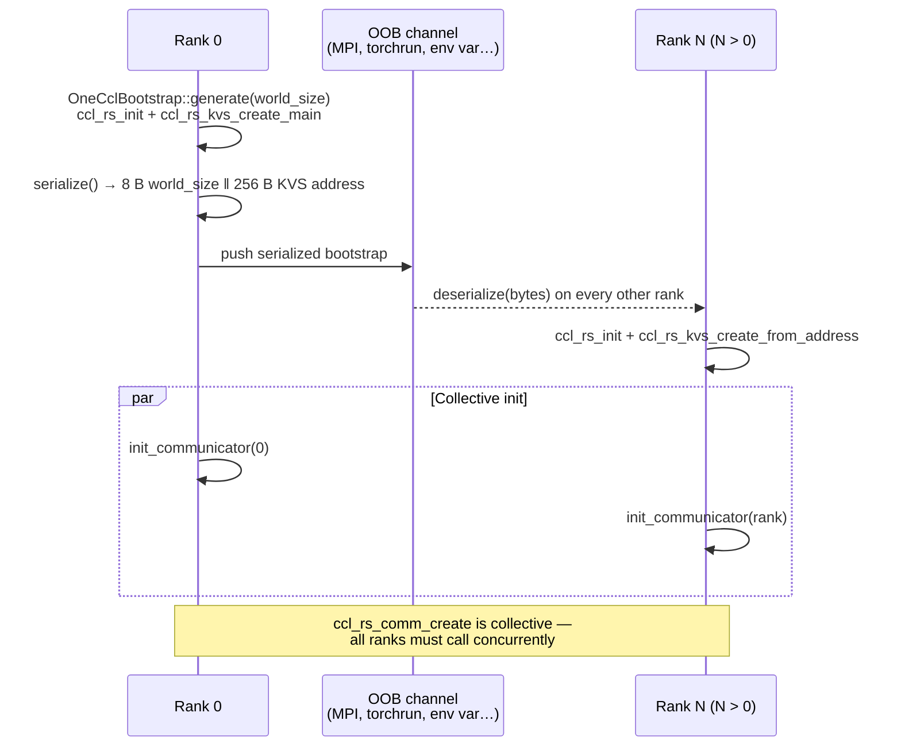
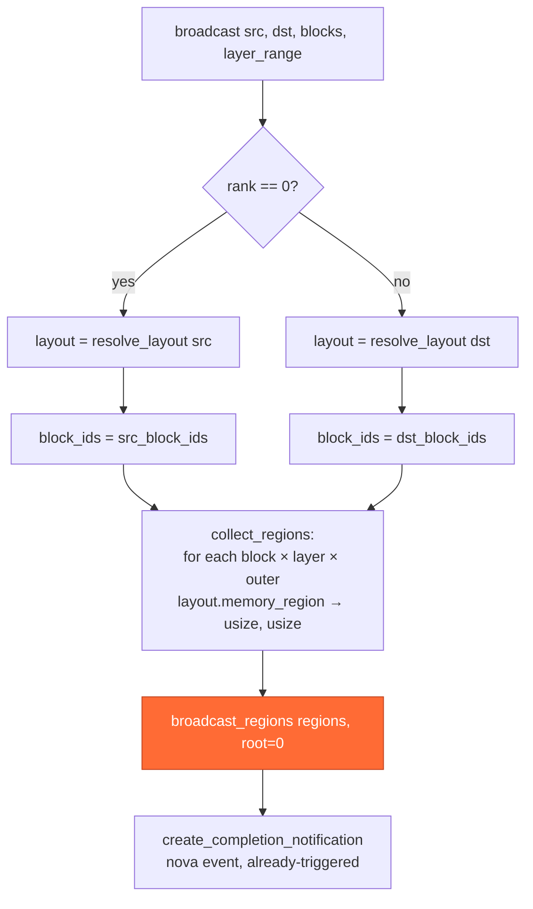

# Collectives — NCCL and oneCCL

Runtime behavior of the two `CollectiveOps` implementations in
`kvbm-engine`. This document focuses on *how broadcasts execute*: the
bootstrap protocol, the event model, and the differences between the two
backends at the call level.

For the broader architecture — which crates own which traits, how the
device backend is selected, what `kvbm-v2` as a whole looks like — see
[`kvbm_v2_xpu_sycl_enablement.md`](../../kvbm-physical/docs/kvbm_v2_xpu_sycl_enablement.md).

## The trait

```rust
pub trait CollectiveOps: Send + Sync {
    fn broadcast(
        &self,
        src: LogicalLayoutHandle,   // e.g. G1 on rank 0
        dst: LogicalLayoutHandle,   // e.g. G1 on all ranks
        src_block_ids: &[BlockId],
        dst_block_ids: &[BlockId],
        layer_range: Option<Range<usize>>,
    ) -> Result<TransferCompleteNotification>;

    fn rank(&self) -> usize;
    fn world_size(&self) -> usize;
}
```

Three concrete implementations ship in the crate:

| Impl | Module | Feature | Backend |
|---|---|---|---|
| `StubCollectiveOps` | `collectives::stub` | always available | no-op; tests and single-worker paths |
| `NcclCollectives` | `collectives::nccl` | `nccl` | CUDA via `cudarc::nccl` |
| `OneCclCollectives` | `collectives::oneccl` | `oneccl` | SYCL/XPU via `oneapi-rs::ccl` |

Both real backends take a `LayoutResolver` (for mapping logical G1/G2/G3
handles to physical layouts) and an `EventManager` from the runtime.

## Construction paths

Each real backend exposes the same two construction shapes:

| Path | NCCL | oneCCL | Used by |
|---|---|---|---|
| From-scratch bootstrap | `NcclCollectives::from_bootstrap` | `OneCclCollectives::from_bootstrap` | tests, standalone Rust apps |
| Borrowed communicator | `NcclCollectives::from_borrowed` | `OneCclCollectives::from_borrowed` | production via PyTorch / vLLM / torchrun |

The "borrowed" paths exist because inference runtimes already own a
communicator — `torch.distributed` creates one for `nccl` and for
`ccl`. KVBM borrows it rather than creating a second one.

## oneCCL bootstrap — step by step



Key invariants:

- `SERIALIZED_SIZE = 8 + CCL_RS_KVS_ADDRESS_SIZE` (264 bytes). Transport
  is opaque — KVBM does not prescribe OOB (env var, TCP, filesystem
  token, whatever the launcher offers).
- `ccl_rs_init` is idempotent but must be called before
  `ccl_rs_kvs_create_*`. Both `generate` and `deserialize` call it.
- `init_communicator` is **collective**: all ranks must call it
  concurrently or `ccl_rs_comm_create` hangs.

NCCL follows the same shape with `ncclUniqueId` in place of the KVS
address.

## Broadcast flow



### `broadcast_regions` — the two backends differ here

**NCCL** calls one `ncclBroadcast` per region and relies on the NCCL
group API to coalesce them, then records a single CUDA event via the
registered `CudaEventRegistrar` so the returned
`TransferCompleteNotification` can be awaited asynchronously.

**oneCCL**:

```rust
ccl_rs_group_start();                           // begin batch
for (ptr, size) in regions {
    ccl_rs_broadcast(ptr, size, UINT8, root, comm, stream, &mut event);
    // keep only the last event for destruction
}
ccl_rs_group_end();                             // submit batch
ccl_rs_event_destroy(last_event);               // per-op events in a group
                                                // are not valid sync points
ccl_rs_stream_wait(stream);                     // host wait —
                                                // delegates to sycl::queue::wait()
```

All broadcasts submit as a single group, and the host blocks on the
underlying SYCL queue after `group_end`. Per-op events returned by
in-group collectives are not valid synchronization points (oneCCL
logs a warning if you wait on them); the primitive for a
group is a queue-level wait, exposed via `ccl_rs_stream_wait` from the
`oneapi-rs` bindings.

The returned `TransferCompleteNotification` is constructed with
`event_system.new_event() → trigger() → awaiter`, i.e.
already-triggered, so callers see immediate completion. This is
semantically equivalent to the NCCL path *for correctness*: by the
time `broadcast()` returns, the GPU is done.

## TODO: async completion

The current implementation host-blocks inside `broadcast_regions` (via
`ccl_rs_stream_wait` for oneCCL); after that, `create_completion_notification`
constructs an already-triggered `nova_event` so the returned
`TransferCompleteNotification` resolves immediately
([`oneccl.rs:345`](../src/collectives/oneccl.rs)). That's correct and
warning-free, but stalls the calling thread for the broadcast duration
— acceptable for the stream-ordered consumption pattern KVBM uses
today, a problem if a future consumer wants host work to overlap with
the broadcast.

`NcclCollectives` has had a `CudaEventRegistrar` trait declared but
no implementation. Two paths are viable.

**Path A — reuse `TransferContext::register_device_event`**
(async primitive that kvbm-physical already drives for
local device transfers):

1. `ccl_rs_stream_get_native_queue(stream, &mut raw_queue)` — reach
   the `sycl::queue` behind the CCL stream.
2. `oneapi_rs::ccl::sys::sycl_rs_submit_barrier(raw_queue, &mut ev)` —
   record a SYCL barrier event at the tail of the group.
3. Wrap the raw `sycl_rs_event_t` as `SyclEvent`, then as a
   backend-agnostic `DeviceEvent { backend: Sycl, ops: ... }`.
4. Hand the `DeviceEvent` to
   `kvbm_physical::transfer::TransferContext::register_device_event`,
   which enqueues it onto the existing shared polling task and
   returns a real deferred `TransferCompleteNotification`.

This requires injecting `Arc<TransferContext>` into `OneCclCollectives`
but doesn't add a new trait.

**Path B — `OneCclEventRegistrar` trait** (mirrors the
declared-but-unimplemented `CudaEventRegistrar` in `nccl.rs`):

Define `trait OneCclEventRegistrar { fn register_sycl_event(&self, …)
-> TransferCompleteNotification; }` and have `OneCclCollectives` take
`Arc<dyn OneCclEventRegistrar>`. The concrete implementation still
forwards to `register_device_event` underneath.

Both approaches use the same underlying primitives
(`submit_barrier` + `register_device_event` polling task) — they
differ only in whether `OneCclCollectives` takes a concrete
`TransferContext` or an abstract trait object.

## MLA pattern — where this gets used

In Multi-head Latent Attention replicas, only rank 0 loads G2/G3:

```
Rank 0:   G3 disk ←→ G2 host ←→ G1 GPU ─── broadcast ───→ Other ranks G1
Rank 1-N:                       G1 GPU ←──────────────────────────┘
```

`ReplicatedDataWorker` in `kvbm-engine` owns a `CollectiveOps` trait
object. The execution structure is wired up in
[`worker/physical/replicated.rs`](../src/worker/physical/replicated.rs):
when rank 0 finishes a G2/G3 → G1 onboard, `execute_local_transfer`
routes to `self.broadcast(...)` for the cross-rank dispatch, and
non-rank-0 workers expect to receive the data on their own G1.

The bridge into `CollectiveOps::broadcast` itself is
**`unimplemented!()`** today — the structure is in place but the actual
broadcast call has not yet been wired through. When implemented, each
rank will synchronize on the returned `TransferCompleteNotification`
before using the blocks.

## Error and cleanup semantics

| Event | NCCL | oneCCL |
|---|---|---|
| Per-rank init failure before broadcast | `ncclResult_t` returned from `ncclCommInitRank` | `ccl_rs_result_t` returned from `ccl_rs_comm_create` |
| Mid-broadcast failure | first failing `ncclBcast` early-returns from the loop via `?`, so `ncclGroupEnd` is **not** called — the group is left dangling. (Asymmetric with oneCCL; tightening NCCL's path to "always close the group" would mirror the cleaner oneCCL behavior.) | `ccl_rs_broadcast` error breaks the loop; `ccl_rs_group_end` is **always** called (even on error) so the oneCCL runtime is left in a clean state. The broadcast error is propagated after cleanup. |
| Communicator destruction (owned) | `ncclCommDestroy` on `Drop` | `ccl_rs_comm_destroy` on `Drop` |
| Communicator destruction (borrowed) | host runtime (PyTorch) owns it | host runtime owns it |
| Stream destruction (owned) | `cudarc::CudaStream` RAII frees the stream on `Drop`; KVBM doesn't drive `cuStreamDestroy` directly | `ccl_rs_stream_destroy` on `Drop` only for `CclStream::Owned` |

The `CommOwnership` enum in `oneccl.rs` distinguishes `Owned` vs.
`Borrowed` so `Drop` does not call destroy on a handle the runtime
still owns.

## Feature flags

```toml
# lib/kvbm-engine/Cargo.toml
nccl       = ["dep:cudarc"]
oneccl     = ["dep:oneapi-rs"]
collectives = ["nccl"]          # backward-compat alias for nccl
```

`worker/physical::replicated` (and the re-exported
`ReplicatedDataWorker`) are gated on `any(feature = "nccl", feature =
"oneccl")`, so either collective backend pulls the module in. The
`collectives` alias is kept so existing CUDA callers that pass
`--features collectives` keep working unchanged.

## Test layout

| Test | Scope | Gated on |
|---|---|---|
| `collectives::stub::tests` | sanity on the no-op impl | always |
| `collectives::nccl::tests` | NCCL path, 2-GPU broadcast roundtrip | `feature = "testing-nccl"` |
| `collectives::oneccl::tests::oneccl_worker` | child-process dispatcher — runs only when `ONECCL_TEST_RANK` is set in the env, otherwise returns silently. Reads `ONECCL_TEST_CASE` and dispatches to one of `worker_broadcast_1mb` / `worker_multi_region` / `worker_large_transfer`. | `feature = "oneccl"` (the parent module gate) |
| `collectives::oneccl::tests::test_oneccl_broadcast_multi_xpu_raw` / `test_oneccl_multi_region_broadcast` / `test_oneccl_broadcast_large_transfer` | driver tests — each spawns one process per rank via `std::process::Command` re-entering the test binary with `ONECCL_TEST_RANK` set, distributes the bootstrap, and verifies 1 MB / multi-region / 64 MB broadcasts. | `feature = "testing-oneccl"` |

The oneCCL tests use multi-process rendezvous because `ccl_rs_comm_create`
requires distinct OS processes to exercise realistic behavior; in-process
"ranks" share a single oneCCL runtime and would not catch KVS-address
mismatch bugs. The dispatcher is gated only on `oneccl` so a child
process spawned by the driver tests can find its handler at runtime
without needing `testing-oneccl` re-enabled in the child build.
