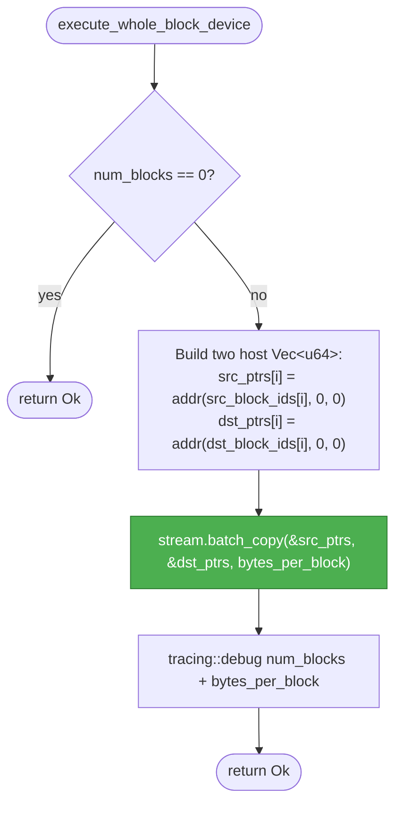
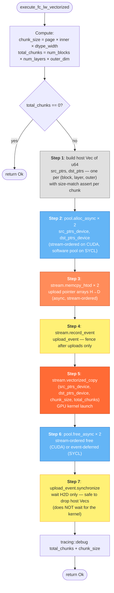
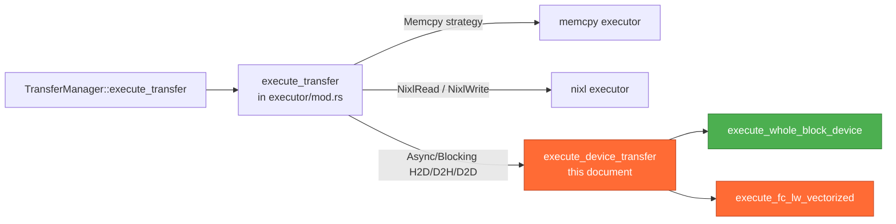

# Device Executor Flow — `transfer/executor/device.rs`

Step-by-step flow for the transfer executor that dispatches through the
`DeviceContextOps` / `DeviceStreamOps` / `DeviceMemPoolOps` trait surface
(defined in [`lib/device/src/traits.rs`](../../device/src/traits.rs)).

This document focuses on **what `device.rs` does at runtime**. For the
architecture behind the traits and how XPU/SYCL fits in alongside CUDA,
see [`kvbm_v2_xpu_sycl_enablement.md`](./kvbm_v2_xpu_sycl_enablement.md).

The executor has three functions:

| Function | Purpose |
|---|---|
| `execute_device_transfer` | Top-level dispatch: strategy + stream-pool selection + sync semantics |
| `execute_whole_block_device` | FC→FC path: one `batch_copy` of `bytes_per_block` per block |
| `execute_fc_lw_vectorized` | FC↔LW path: pool-backed pointer upload + `vectorized_copy` kernel launch |

---

## 1. `execute_device_transfer` — top-level dispatch

Entered from `transfer::executor::execute_direct_transfer` for any
`TransferStrategy` that is not `Memcpy` or NIXL.

```mermaid
flowchart TD
    START([execute_device_transfer]) --> V1[Validate layer count<br/>+ outer dim match]
    V1 --> V2[validate_layout_compatibility]
    V2 --> LR[Resolve layer_range<br/>default = 0..num_layers]
    LR --> SET[Compute flags:<br/>caller_manages_sync = device_stream.is_some&#40;&#41;<br/>whole_block = can_use_whole_block_transfer&#40;&#41;<br/>is_d2h = AsyncD2H or BlockingD2H]

    SET --> CMS0{caller-provided<br/>device_stream?}
    CMS0 -- yes --> USE_CALLER[Use caller stream]
    CMS0 -- no + is_d2h --> POOL_D2H[ctx.next_d2h_stream]
    CMS0 -- no + !is_d2h --> POOL_H2D[ctx.next_h2d_stream]

    USE_CALLER --> DISPATCH
    POOL_D2H --> DISPATCH
    POOL_H2D --> DISPATCH

    DISPATCH{whole_block?}
    DISPATCH -- yes --> FN_WB[execute_whole_block_device]
    DISPATCH -- no --> FN_VEC[execute_fc_lw_vectorized]

    FN_WB --> BLK{Blocking strategy?<br/>BlockingH2D or BlockingD2H}
    FN_VEC --> BLK

    %% Phase 1: blocking sync runs unconditionally (independent of caller_managed)
    BLK -- yes --> SYNC[device_stream.synchronize]
    BLK -- no --> CMS1
    SYNC --> CMS1

    %% Phase 2: caller_managed early-return runs after the optional sync,
    %% so a "Blocking + caller-provided stream" path also exits here.
    CMS1{caller_manages_sync?}
    CMS1 -- yes --> DONE_CMS([TransferCompleteNotification::completed])
    CMS1 -- no --> ASY{Async* strategy?}

    %% Phase 3: only the Async* branch records an event + registers.
    %% Blocking* with no caller stream falls through to completed&#40;&#41;.
    ASY -- yes --> EVT[device_stream.record_event]
    EVT --> REG([ctx.register_device_event<br/>→ TransferCompleteNotification])
    ASY -- no --> DONE_BLK([TransferCompleteNotification::completed])

    style FN_WB fill:#4caf50,stroke:#2e7d32,color:#fff
    style FN_VEC fill:#ff6b35,stroke:#c44520,color:#fff
    style POOL_H2D fill:#90caf9,stroke:#1565c0
    style POOL_D2H fill:#90caf9,stroke:#1565c0
    style SYNC fill:#fff176,stroke:#f9a825
```

### Stream pool selection

`TransferContext` maintains **two** stream pools per device, each
`num_streams` wide, with round-robin acquisition:

| Pool | Acquired via | Used for |
|---|---|---|
| H2D | `ctx.next_h2d_stream()` | Host→device (whole-block batch DMA *and* FC↔LW kernel launches) |
| D2H | `ctx.next_d2h_stream()` | Device→host (whole-block *and* kernel) |

This matches the upstream CUDA design. Both CUDA and SYCL queues are
engine-class agnostic, so whole-block `batch_copy` and kernel
`vectorized_copy` share the direction pool without losing concurrency.
D2D maps to the H2D pool (`is_d2h = false`); the actual copy direction
is determined by pointer addresses, not the pool label.

On SYCL the pool is backed by round-robin `sycl::queue` slots. Every
queue is built on the shared multi-device `SyclContext`
(see `shared_sycl_context` in `lib/device/src/sycl/mod.rs`). Pool width is
`TransferContext::num_streams` (default 4).

### Sync semantics

The executor runs three sequential phases after the copy is enqueued.
Each phase is independent — the next phase always sees the side effects
of the previous one.

1. **Optional inline sync.** If the strategy is `BlockingH2D` /
   `BlockingD2H`, call `device_stream.synchronize()`. This runs
   regardless of whether the caller provided their own stream — a
   `Blocking*` strategy always synchronizes inline before returning.
2. **Caller-managed early exit.** If the caller provided their own
   `device_stream`, return `TransferCompleteNotification::completed()`.
   The caller owns synchronization for any further work; the executor
   does not record an event on a caller-owned stream.
3. **Async event registration.** Otherwise, if the strategy is
   `AsyncH2D` / `AsyncD2H` / `AsyncD2D`, record a `DeviceEvent` on the
   stream and hand it to `ctx.register_device_event`, which returns a
   `TransferCompleteNotification` that completes when the event fires.
   For `Blocking*` strategies that reach this phase (no caller stream,
   already synchronized in phase 1), return `completed()` directly.

---

## 2. `execute_whole_block_device` — FC→FC path

One pointer pair per block, one DMA per pair, direction auto-detected by
the runtime from the pointer addresses.

`bytes_per_block` comes from `src.layout().config().bytes_per_block()`.
The source and destination layouts are both fully contiguous here, so
one pointer per block is sufficient.

`stream.batch_copy` is the `DeviceStreamOps::batch_copy` method: on CUDA
it calls `kvbm_kernels::memcpy_batch` (using
`cudaMemcpyBatchAsync` when available, falling back to a per-pair
`cudaMemcpyAsync` loop); on SYCL it submits `num_pairs`
`queue.memcpy_raw_async` calls, which the SYCL runtime auto-detects as
H2D / D2H / D2D from the pointer addresses.

---

## 3. `execute_fc_lw_vectorized` — FC↔LW kernel path

One pointer pair per (block, layer, outer) chunk. Pointer arrays are
uploaded to device memory from a `DeviceMemPool`, then a GPU kernel
reads them and performs `total_chunks` parallel copies of `chunk_size`
bytes each.

### Why record an event before the kernel

Step 4 captures a fence immediately after the two `memcpy_htod` uploads.
Step 7 waits on that event, which blocks only until the H2D copies are
done — *not* until the kernel finishes. This lets the host drop the
source `Vec<u64>` arrays as soon as the uploads complete, while the
kernel keeps running asynchronously. The in-order stream (CUDA) or
in-order `sycl::queue` (SYCL) guarantees the kernel still observes the
uploads.

### Backend specifics

| Step | CUDA | SYCL |
|---|---|---|
| 2. `pool.alloc_async` | `CudaMemPool::alloc_async_raw` using `cuMemAllocFromPoolAsync` on the raw `CUstream` | `SyclMemPoolWrapper::alloc_async` draws from a software free-list over `sycl::malloc_device`; tracks ptr→size in `active_allocs` |
| 3. `stream.memcpy_htod` | `cudarc::driver::result::memcpy_htod_async` | `queue.memcpy_raw_async` |
| 4. `stream.record_event` | `stream.record_event(None)` | `queue.submit_barrier()` wrapped in `SyclEventWrapper` |
| 5. `stream.vectorized_copy` | `kvbm_kernels::vectorized_copy` (`.cu` compiled by nvcc) | `kvbm_kernels::sycl_vectorized_copy` (`.cpp` compiled by `icpx -fsycl`) with the `sycl::queue*` handle. With the `xpu-sycl` feature **disabled**, the SYCL impl reads the device pointer arrays back to host and falls back to a `batch_copy` loop — slower, but lets the executor compile cleanly without `kvbm-kernels`'s SYCL launchers. |
| 6. `pool.free_async` | `cuMemFreeAsync` stream-ordered | `SyclMemPoolWrapper` records the event and defers the return-to-pool until the event signals (`PendingFree` queue) |
| 7. `event.synchronize` | `cuEventSynchronize` | `sycl::event::wait` |

---

## Relationship to the rest of the executor

- `memcpy` handles host↔host `Memcpy` (no device involved).
- `nixl` handles any strategy whose name starts with `Nixl*` (RDMA / GDS).
- `device.rs` handles everything device-local:
  `AsyncH2D`, `AsyncD2H`, `AsyncD2D`, `BlockingH2D`, `BlockingD2H`.

Two-hop transfers (e.g. Device → Pinned → Remote) land back in
`execute_direct_transfer` once per hop, so each hop still flows through
this executor independently.

---

## `TransferStrategy` vs. upstream — rename and additions

The `TransferStrategy` enum consumed by this executor differs from
upstream [`ai-dynamo/dynamo`](https://github.com/ai-dynamo/dynamo) `main`
in two distinct ways:

| Change | Upstream main | Branch | Rationale |
|---|---|---|---|
| **Rename** (no behavior change) | `CudaAsyncH2D`, `CudaAsyncD2H`, `CudaAsyncD2D` | `AsyncH2D`, `AsyncD2H`, `AsyncD2D` | These variants are dispatched by the backend-agnostic `device.rs`, which routes them to `CudaStreamWrapper` or `SyclStreamWrapper` through `DeviceStreamOps`. A `Cuda` prefix is misleading on the SYCL path, so the prefix is dropped. Behavior is identical — the rename is a pure find-and-replace. |
| **New variants** | — (panics on `System ↔ Device`) | `BlockingH2D`, `BlockingD2H` | Upstream `strategy.rs` returns `panic!("System to Device transfers are not supported")` for `System ↔ Device(_)`. The branch replaces that panic with the new `Blocking*` strategies, which run an async copy on the stream and then call `device_stream.synchronize()` before returning. Applies on **both** backends — the motivating case (unpinned `System` memory degrading async copies to staged blocking behavior) affects CUDA and SYCL identically, so hiding the variants behind `#[cfg]` would leave the upstream panic in place for CUDA consumers with no benefit. |

Semantics summary:

- `Async*` — enqueues on a stream, records a `DeviceEvent`, returns a
  notification. Caller awaits the notification. Applies to pinned host
  memory or device memory.
- `Blocking*` — enqueues on a stream, calls `device_stream.synchronize()`
  inline, returns `TransferCompleteNotification::completed()`. Applies
  to unpinned (`System`) host memory where the async copy would stage
  internally and gain nothing from the notification path.
- Neither form is backend-specific; both CUDA and SYCL stream wrappers
  implement the same `DeviceStreamOps` contract.

Nothing was removed from the upstream enum. The only removed *behavior*
is the `panic!` on `System ↔ Device`, which is now a supported transfer.
