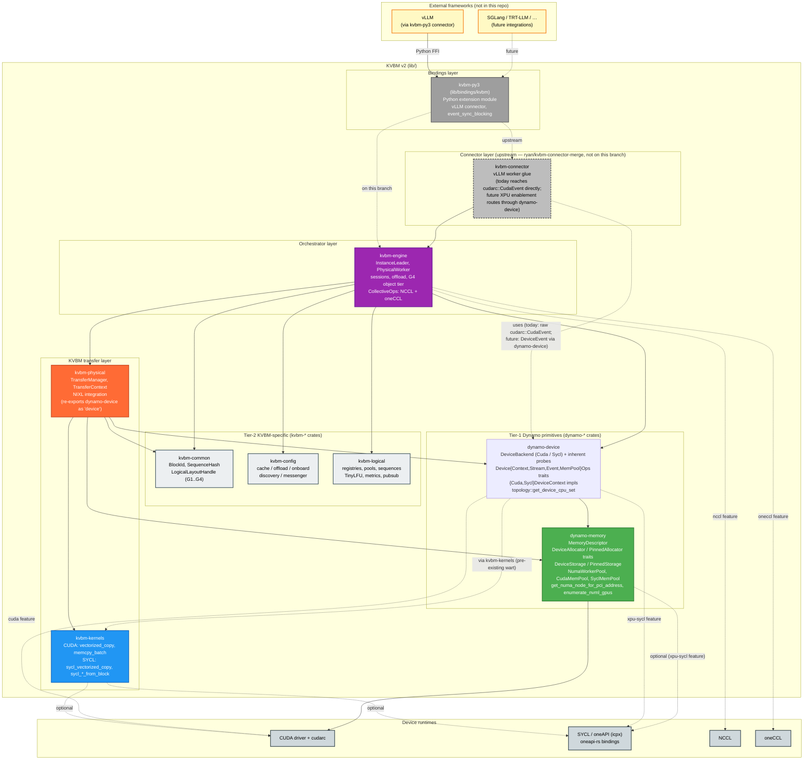

# KVBM v2 — XPU/SYCL enablement

How Intel XPU (SYCL/oneAPI) was integrated into KVBM v2 alongside the
existing NVIDIA CUDA backend: the trait surfaces that were extracted, the
SYCL implementations that were added, and the crate-level wiring that keeps
KVBM v2 engine-agnostic and framework-agnostic.

This document covers the state of the branch, the evolution from the
CUDA-only baseline, and the relationships between the crates under
`lib/` that make up KVBM v2.

## Related docs

This doc is the overview. Per-crate details live alongside the code:

- [`device_executor_flow.md`](./device_executor_flow.md) — device executor dispatch, `TransferStrategy` mapping, stream-pool walkthrough.
- [`sycl_pool_and_numa.md`](../../memory/docs/sycl_pool_and_numa.md) — `SyclMemPool` free-list allocator and NUMA-aware pinned host pages.
- [`sycl_kernels.md`](../../kvbm-kernels/docs/sycl_kernels.md) — SYCL kernel build pipeline, launcher ABI, `vectorized_copy` / permute kernel dispatch.
- [`collectives.md`](../../kvbm-engine/docs/collectives.md) — NCCL / oneCCL multi-device sync, feature gating, test layout.
- [`event_sync.md`](../../bindings/kvbm/docs/event_sync.md) — Python binding event-sync for layer-wise onboarding.

## KVBM v2 modules and scope

KVBM v2 is a set of Rust crates under `lib/` that together form an
**engine-agnostic, framework-agnostic KV-cache block manager**. The goal is
for any inference framework (vLLM, SGLang, TensorRT-LLM, …) to plug KVBM v2
in under its own runtime, with no dependency flowing from KVBM into a
specific framework.

**Ownership per crate:**

| Crate | Responsibility | XPU/SYCL in scope? |
|---|---|---|
| `kvbm-common` | Shared logical-tier vocabulary: `BlockId`, `SequenceHash`, `LogicalLayoutHandle` (G1/G2/G3/G4 tier enum). Pure data types, no device deps. | No — fully device-neutral. The `DeviceBackend` enum lives in `dynamo-device`, not here. |
| `kvbm-config` | Static configuration for caches, discovery, NIXL, object storage, offload, onboard policies, tokio/rayon runtimes, messengers. Pure config structs. | No. |
| `kvbm-logical` | Logical block lifecycle: registries, pools, sequence tracking, metrics, TinyLFU cache, pub/sub adapters, framework integrations. Works on logical handles; never touches devices directly. | No. |
| `kvbm-consolidator` | Out-of-process aggregation/consolidation service. Reads event streams from KVBM workers via ZeroMQ (`tmq`), tracks events and hashes, emits to consumers. Operates on logical types (`BlockId`, `SequenceHash`) and serialized wire formats — never touches GPU memory. Deps: `kvbm-logical`, `dynamo-tokens`, `dynamo-kv-hashing`, `dynamo-kv-router`. | No. |
| `dynamo-memory` (`lib/memory`) | Backend-agnostic storage primitives: `MemoryDescriptor`, `DeviceAllocator` / `PinnedAllocator` traits, `DeviceStorage` / `PinnedStorage`, `NumaWorkerPool`, `CudaMemPool`, `SyclMemPool`, plus NUMA helpers (`get_numa_node_for_pci_address`, `subdivide_cpu_set_for_device`, `enumerate_nvml_gpus`). Tier-1 Dynamo crate: **does not depend on any `kvbm-*` crate**. Backend-aware NUMA/CPU-set dispatch lives in `dynamo-device`, not here. | **Yes** — houses `SyclMemPool`, SYCL-aware sysfs primitives, and the allocator traits that downstream device wrappers implement. |
| `dynamo-device` (`lib/device`) | Backend-agnostic device-handle abstraction: `DeviceBackend` tag enum (with inherent `is_available`/`detect_backend`/`list_available` probes), the `DeviceContextOps` / `DeviceStreamOps` / `DeviceEventOps` / `DeviceMemPoolOps` trait surface, the `DeviceContext` / `DeviceStream` / `DeviceEvent` / `DeviceMemPool` trait-object wrappers, the `CudaDeviceContext` / `SyclDeviceContext` impls, and `topology::get_device_cpu_set(backend, pci_address)` for backend-aware CPU-set dispatch. Tier-1 Dynamo crate: **does not depend on any `kvbm-*` crate** (one pre-existing exception: `kvbm-kernels` for kernel launchers — the kernels crate is misnamed and would be `dynamo-kernels` under the strict naming convention). | **Yes** — the canonical home for the multi-backend abstraction. CUDA and SYCL both implement the trait surface here. Adding ROCm or other backends is a single-crate change. |
| `kvbm-kernels` | CUDA and SYCL kernel launchers: `vectorized_copy`, `memcpy_batch`, `sycl_vectorized_copy`, `sycl_*_from_block`. Built from `.cu` via nvcc and `.cpp` via `icpx -fsycl`. | **Yes** — SYCL kernel sources and FFI wrappers live here. |
| `kvbm-physical` | KVBM-specific transfer subsystem: `TransferManager`, `TransferContext`, NIXL integration, layout/manager modules. Re-exports `dynamo_device as device` for backward compatibility, so `kvbm_physical::device::DeviceContext` continues to resolve. | **Yes** — the KVBM-side consumer of the multi-backend layer; transfer and NIXL routing are CUDA/SYCL-aware. |
| `kvbm-engine` | Orchestrator: `InstanceLeader`, `PhysicalWorker`, `ReplicatedDataWorker`, sessions, offload pipeline, object tier (G4), `CollectiveOps` with NCCL and **oneCCL** implementations, `OneCclBootstrap`. | **Yes** — adds the `oneccl` feature and the XPU-aware layer-wise onboard path. |
| `kvbm-py3` (`lib/bindings/kvbm`) | Python/FFI bindings consumed by external frameworks. Owns the vLLM connector and its backend-specific `event_sync_blocking` (CUDA / SYCL / fallback). | **Yes** — SYCL variant added alongside CUDA, mutually exclusive by feature. |

**Shared logical-tier deps (referenced by KVBM but not part of it):**

| Crate | Consumed by | Purpose | XPU/SYCL relevance |
|---|---|---|---|
| `dynamo-tokens` (`lib/tokens`) | `kvbm-common` (re-exported as `SequenceHash = dynamo_tokens::PositionalLineageHash`), `kvbm-logical`, `kvbm-consolidator` | Token block sequencing and `PositionalLineageHash` computation. No device deps. | No. |
| `dynamo-kv-hashing` (`lib/kv-hashing`) | `kvbm-consolidator` | Prefix-aware KV hashing utilities. No device deps. | No. |
| `dynamo-kv-router` (`lib/kv-router`) | `kvbm-consolidator` | Logical request routing across replicas. No device deps. | No. |
| `dynamo-llm` (`lib/llm`) | `kvbm-py3` (`bindings/kvbm`) imports `block_manager::*` types: `BlockDataExt`, `Controller`, `DistributedLeaderWorkerResources`, `connector::protocol::RequestType`, `metrics_kvbm::KvbmMetrics`, `recorder::Recorder`. | No device deps. The `lib/llm/src/block_manager/v2/` subtree is not on the XPU/SYCL enablement path and should not receive new XPU work. | No. |
| `dynamo-mocker` (`lib/mocker`) | None of the kvbm-* crates depend on it. Conversely, mocker's `kvbm-offload` feature (off by default) pulls in `kvbm-engine`, `kvbm-physical`, `kvbm-common`, `velo` for G1↔G2 offload simulation in test scenarios. | No device-specific code in the source; pure logical/test harness. | No. |

The small crates (`kvbm-common`, `kvbm-config`, `kvbm-logical`,
`kvbm-consolidator`) are listed for completeness but contain no
device-specific code and are not touched by XPU/SYCL enablement. The
diagrams in this document draw them as inert upper layers so the
reader can see where KVBM v2 sits as a whole.

## KVBM v2 crate stack

This diagram shows the full KVBM v2 module stack under `lib/`, the
dependency direction between crates, and the boundaries that external
frameworks (vLLM, SGLang, …) integrate across. The device-specific
implementations (CUDA / SYCL) sit at the bottom; logical/config/common
crates at the top are framework-agnostic and have no device deps.



**Key takeaways for framework integration:**

- **No upward dep from KVBM into a framework.** `kvbm-common`, `kvbm-config`,
  and `kvbm-logical` have no knowledge of vLLM, PyTorch, or any inference
  runtime. That's what makes v2 reusable across frameworks.
- **One integration point: `kvbm-py3`.** External frameworks import the
  Python extension module built from `lib/bindings/kvbm`, which internally
  talks to `kvbm-engine`. Adding SGLang or TensorRT-LLM would mean a new
  connector in the bindings crate (or a sibling Python binding) without
  changes to the lower layers.
- **Device/runtime is a compile-time feature, not a crate.** CUDA vs. XPU is
  chosen via Cargo features (`cuda` / `xpu-sycl` on `kvbm-physical` and
  `dynamo-memory`; `nccl` / `oneccl` on `kvbm-engine`). `kvbm-py3` enforces
  that `cuda` and `xpu-sycl` are mutually exclusive.
- **Kernels are optional and FFI-gated.** `kvbm-kernels` produces
  `libkvbm_kernels.so` (nvcc) and `libkvbm_kernels_sycl.so` (icpx); both are
  loaded only when the corresponding backend feature is enabled. SYCL
  kernels are built automatically when the `xpu-sycl` Cargo feature is
  enabled (icpx must be on PATH or `ONEAPI_ROOT` set).

The remaining diagrams and tables zoom in on the **device abstraction** and
**memory layer** inside this stack — the two layers that XPU/SYCL enablement
actually touches.

## Evolution: from CUDA-only to CUDA + XPU/SYCL

Before this work, KVBM v2 assumed CUDA everywhere: device types, allocation,
pools, collectives, pinned memory, and even test helpers called CUDA APIs
directly. Enabling Intel XPU required extracting a small backend-agnostic
trait surface at each boundary, then adding SYCL/oneAPI implementations
behind it. The table below summarizes the shape of each boundary before and
after XPU/SYCL enablement.

| Area | Before (CUDA-only) | After (CUDA + XPU/SYCL) |
|---|---|---|
| **Backend selector** | Implicit — everything was CUDA. | `DeviceBackend::{Cuda, Sycl}` tag enum in `dynamo-device`. Runtime probes (`is_available` / `detect_backend` / `list_available`) are inherent methods on the enum, guarded by `catch_unwind` so a missing `libcuda.so` / `libsycl.so` doesn't abort the process. `DeviceContext::new(backend, id)` dispatches to `CudaDeviceContext` or `SyclDeviceContext` behind `#[cfg(feature = "cuda")]` / `#[cfg(feature = "xpu-sycl")]`. `dynamo-device` is a tier-1 Dynamo primitive: no `kvbm-*` deps, so non-KVBM consumers can use it directly. |
| **Device context / stream / event** | Direct use of `cudarc::driver::{CudaContext, CudaStream, CudaEvent}`. | New traits `DeviceContextOps`, `DeviceStreamOps`, `DeviceEventOps`, `DeviceMemPoolOps` in `lib/device/src/traits.rs` (`dynamo-device`). `CudaDeviceContext` and `SyclDeviceContext` both implement them (named to avoid shadowing `cudarc::driver::CudaContext` and `oneapi_rs::safe::SyclContext`); the transfer executor, notification loop, and pool wrappers talk to trait objects only. `kvbm-physical` re-exports the crate as `kvbm_physical::device` for backward compatibility. |
| **Copy API on streams** | Direction-named CUDA calls (`cudaMemcpyAsync` with explicit H2D/D2H kinds). | Pattern-based primitives on `DeviceStreamOps`: `batch_copy` (N DMAs, direction auto-detected), `memcpy_htod` / `memcpy_dtoh` (scalar uploads/downloads), `vectorized_copy` (kernel over pointer arrays). The executor picks between them based on op type, not direction. |
| **`TransferStrategy` enum** | `CudaAsyncH2D`, `CudaAsyncD2H`, `CudaAsyncD2D`; `panic!` on `System ↔ Device`. | Two changes — (1) **rename** `CudaAsync*` → `Async*` since the backend-agnostic executor dispatches to either `CudaStreamWrapper` or `SyclStreamWrapper`; (2) **add** `BlockingH2D`, `BlockingD2H` that replace the upstream panic with an async copy + inline `device_stream.synchronize()`. Blocking variants apply on **both** backends because the motivating case (unpinned `System` memory degrading async copies to staged blocking behavior) affects CUDA and SYCL identically. See [`device_executor_flow.md`](./device_executor_flow.md#transferstrategy-vs-upstream--rename-and-additions) for the full before/after mapping. |
| **Memory pool** | Native CUDA pool (`cuMemPoolCreate` / `cuMemAllocFromPoolAsync`). | Two pool implementations behind `DeviceMemPoolOps`: `CudaMemPool` (native API, stream-ordered) and `SyclMemPool` (software free-list over `sycl::malloc_device`, SYCL has no native pool API). `SyclMemPool`'s `PoolInner.active_allocs: HashMap<ptr, real_size>` keeps `cached_bytes` and `release_threshold` accurate when a best-fit returns a block larger than requested. |
| **Device storage** | `DeviceStorage::new(size, device_id)` hard-coded to `cudarc::driver::result::malloc_sync`. | `DeviceStorage::new(size, Arc<dyn DeviceAllocator>)`. The new `DeviceAllocator` trait lives in `dynamo-memory` with *no* CUDA types; `DeviceContext` in `dynamo-device` implements it. The same pattern rewired `PinnedStorage`. |
| **Pinned host allocation** | `PinnedStorage` called `cuMemHostAlloc` inline. | A `PinnedAllocator` trait in `dynamo-memory` is the per-backend FFI shim that `NumaWorkerPool` invokes from a NUMA-pinned worker thread (one thread per NUMA node, global singleton). `CudaPinnedAllocator` / `SyclPinnedAllocator` in `dynamo-device` provide the backend implementations; the worker first-touches pages after allocation so Linux binds them to the correct node. The NUMA-vs-fallback routing decision happens *upstream* of the trait, in `CudaDeviceContext::allocate_pinned` / `SyclDeviceContext::allocate_pinned`. End-to-end validation via `move_pages(2)` is available for either backend through the `validate_numa_placement` binary — see [`sycl_pool_and_numa.md`](../../memory/docs/sycl_pool_and_numa.md#validating-first-touch-on-real-hardware) for the correct invocation on CUDA vs. XPU hosts (XPU requires the `xpu-sycl` feature at build time). |
| **NUMA topology / PCI discovery** | CUDA-specific: PCI BDF pulled from `cuDeviceGet*` attributes. | Backend-agnostic. `DeviceContextOps::pci_bdf_address()` returns `"DDDD:BB:DD.F"` — CUDA queries `CU_DEVICE_ATTRIBUTE_PCI_*`; SYCL reads `SyclDevice::info()?.pci_address`. NUMA-node lookup is split: `dynamo_memory::numa::get_numa_node_for_pci_address` resolves NUMA via sysfs with `nvidia-smi` / `xpu-smi` fallbacks (backend-agnostic; takes a PCI BDF string), while backend-aware CPU-set subdivision lives in `dynamo_device::topology::get_device_cpu_set(backend, pci)` — the latter dispatches per-backend GPU enumeration (NVML for CUDA, sysfs PCI scan for Intel `0x8086` class `0x03xxxx`) and calls back into `dynamo-memory`'s `subdivide_cpu_set_for_device` primitive for the actual splitting. |
| **Event reuse** | Single-shot events — `CudaEvent::record(&stream)`. | New `DeviceEventOps::record_on_stream(stream_handle)` lets the same `DeviceEvent` be re-recorded on a later op. Required by `PhysicalWorker::execute_local_layerwise_onboard` in `kvbm-engine`, which records one event per layer on a shared H2D stream. |
| **Kernels** | CUDA `.cu` sources compiled by nvcc in `kvbm-kernels`: `vectorized_copy`, `memcpy_batch`, optional permute kernels. | Same CUDA kernels, *plus* SYCL `.cpp` sources (`sycl/vectorized_copy_kernel.cpp`, `sycl/tensor_permute_kernel.cpp`) compiled by `icpx -fsycl` into `libkvbm_kernels_sycl.so` when `xpu-sycl` is enabled. FFI wrappers in `src/tensor_kernels_sycl.rs` expose them as `sycl_vectorized_copy`, `sycl_universal_from_block`, `sycl_block_from_universal`. SYCL kernels pass a `sycl::queue*` instead of a `cudaStream_t` and use byte-size element dispatch rather than dtype templates. |
| **Collectives (`kvbm-engine`)** | NCCL only (`feature = "nccl"`, `cudarc::nccl`). | `CollectiveOps` trait is now implemented by `NcclCollectives` **and** `OneCclCollectives` (`feature = "oneccl"`, `oneapi-rs::ccl`). oneCCL supports both a from-scratch bootstrap (`OneCclBootstrap` — 8 B world_size + 256 B KVS address rendezvous) and borrowed handles from PyTorch / vLLM. Broadcasts use `ccl_rs_group_start/end` with a single `event_wait` on the last submitted op. |
| **vLLM connector event sync (`kvbm-py3`)** | `event_sync_blocking(u64)` called `cuEventSynchronize` and asserted on failure. | Three cfg-gated implementations of the same `pub fn event_sync_blocking(u64) -> anyhow::Result<()>`: CUDA (`cuEventSynchronize`), SYCL (`oneapi_rs::sys::sycl_rs_event_wait`), and a "no backend" stub that `bail!`s. The call site now `?`-propagates the error instead of swallowing it. |
| **Test helpers (`kvbm-physical`)** | Direct `cudaMemcpy` with explicit D2H/H2D kinds in `fill.rs` / `checksum.rs`. | Backend-agnostic `sync_memcpy_dtoh` / `sync_memcpy_htod` helpers on `DeviceContext` that construct a throwaway stream and synchronize. Tests pick a backend via `test_device_backend()` which prefers SYCL when compiled in and available, falling back to CUDA. |
| **Benchmark tooling** | `bench_engine` and `bench_transfer` hard-coded `cuda_device_id`; `kvbench` was CUDA-only (no kernel-layer XPU baseline); no multi-rank collective bench. | Four tools, one per layer of the stack — kernel (`kvbench` / `kvbench_xpu_sycl`), TransferManager (`bench_transfer`), Leader/Worker (`bench_engine`), and a parallel cross-rank track for collective broadcast (`bench_collectives`, NCCL / oneCCL). See [Benchmarks](#benchmarks) below for the comparison. |

The rest of the document shows the resulting trait surface, the full
cross-crate graph, and the memory layer in detail.

## Benchmarks

KVBM v2 ships four benchmarks, each targeting a different layer of the
stack. Running the progression bottom-up (kernel → transfer-manager →
leader/worker, with collectives as a parallel cross-rank track) is the
intended way to localize a performance regression: if the lower layer
is clean but the higher layer regresses, the overhead lives in the
layer between them.

| Tool | Path | Layer | What it measures |
|---|---|---|---|
| `kvbench` / `kvbench_xpu_sycl` | [`lib/kvbm-kernels/examples/kvbench.rs`](../../kvbm-kernels/examples/kvbench.rs), [`lib/kvbm-kernels/examples/kvbench_xpu_sycl.rs`](../../kvbm-kernels/examples/kvbench_xpu_sycl.rs) | **Kernel layer** | Raw kernel vs. bare `memcpy` baseline. No `TransferManager`, no NIXL, no leader/worker. Compares `sycl_vectorized_copy` (FFI) against `sycl::queue::memcpy` (or `kvbm_kernels_launch_vectorized_copy` against `cudaMemcpyAsync` on CUDA) across `fc_to_fc` / `lw_to_fc` / `fc_to_lw` patterns and `d2d` / `h2d` / `d2h` directions. Llama 3.1 70B KV-cache dimensions, CSV output. |
| `bench_transfer` | [`lib/kvbm-physical/examples/bench_transfer.rs`](../examples/bench_transfer.rs) | **TransferManager layer** | Same transfer matrix, but routed through `kvbm-physical::TransferManager` — the API the real offload path uses. Adds: stream-pool scheduling, executor dispatch (whole-block batch copy vs. FC↔LW vectorized kernel), NIXL registration. Backend selected via `--backend {auto,cuda,sycl}`. Still single-process. The delta vs. `kvbench` is the `TransferManager` overhead. |
| `bench_engine` | [`lib/kvbm-engine/bin/bench_engine.rs`](../../kvbm-engine/bin/bench_engine.rs) | **Leader/Worker layer** | Production-fidelity end-to-end: `InstanceLeader` + `VeloWorkerService`/`Client` + `SpmdParallelWorkers`, NUMA-pinned worker threads (each with its own tokio runtime and `NixlAgent`), multi-GPU, optional full offload pipeline. `--backend {auto,cuda,sycl}`. NUMA affinity resolved via PCI BDF for both backends through the shared `get_device_cpu_set(backend_kind, bdf)` API. The delta vs. `bench_transfer` is leader/worker / offload-pipeline overhead. |
| `bench_collectives` | [`lib/kvbm-engine/bin/bench_collectives.rs`](../../kvbm-engine/bin/bench_collectives.rs) | **Collectives layer** | Multi-process broadcast bandwidth for the cross-rank replication path. Rank 0 spawns one child per rank, distributes the bootstrap token, and collects JSONL. Reports decimal `alg_bw_gbps` / `bus_bw_gbps`. `--backend {nccl, oneccl}` selects NCCL (CUDA, raw `ncclBcast` on a `CudaStream`) or oneCCL (XPU, raw `ccl_rs_broadcast` on a `sycl::queue` via `OneCclBootstrap`). Sweeps `--sizes`, `--num-regions` (mirrors the production `broadcast_regions` group_start/group_end batch — `N = num_blocks × num_layers × outer_dim`), and `--no-wait-for-completion` to isolate stream-wait / `event::wait()` overhead. Complements `bench_engine` with replication-path numbers that the engine bench doesn't isolate. |

All four produce CSV / JSONL output, so you can join runs and compare
layers directly. See each tool's module-level docs for the exact flag
matrix.

## System overview — all crates and their abstractions

The first diagram is the 10 000-foot view: which crate owns which abstraction
and how components connect end-to-end. Each color is a single *layer of
ownership*:

- 🟩 **Green** — `dynamo-memory`: storage + allocator traits, NUMA worker pool, SYCL pool implementation.
- 🟧 **Orange** — `dynamo-device`: device abstraction traits + CUDA / SYCL wrappers, backend tag enum, topology dispatch.
- 🟥 **Red-orange** — `kvbm-physical`: KVBM transfer manager / context / executor (consumer of `dynamo-device`).
- 🟦 **Blue** — `kvbm-kernels`: GPU kernel launchers (CUDA + SYCL).
- 🟪 **Purple** — `kvbm-engine`: collective ops (NCCL + oneCCL) and workers that drive transfers.
- Grey — `kvbm-py3` / vLLM binding layer.

```mermaid
graph TB
    subgraph bindings["kvbm-py3 (bindings)"]
        PyConnector["PyKvConnectorWorker"]
        EvSync["event_sync_blocking(u64)<br/>cfg: cuda / xpu-sycl"]
        PyConnector --> EvSync
    end

    subgraph engine["kvbm-engine"]
        PW["PhysicalWorker<br/>execute_local_layerwise_onboard"]
        CollTrait["trait CollectiveOps<br/>broadcast(layout, blocks, layers)"]
        NcclImpl["NcclCollectives<br/>(feature = nccl)"]
        OneCclImpl["OneCclCollectives<br/>(feature = oneccl)"]
        OneCclBS["OneCclBootstrap<br/>KVS rendezvous"]
        CollTrait -.-> NcclImpl
        CollTrait -.-> OneCclImpl
        OneCclImpl --> OneCclBS
    end

    subgraph device["dynamo-device (lib/device)"]
        %% Trait + handle + Cuda/Sycl impls grouped per Ops surface
        CtxOps["trait DeviceContextOps"]
        DC["DeviceContext"]
        CudaCtx["CudaDeviceContext / Wrappers<br/>device/cuda/mod.rs"]
        SyclCtx["SyclDeviceContext / Wrappers<br/>device/sycl/mod.rs"]

        StrOps["trait DeviceStreamOps"]
        DS["DeviceStream"]

        EvOps["trait DeviceEventOps"]
        DE["DeviceEvent"]

        PoolOps["trait DeviceMemPoolOps"]
        DP["DeviceMemPool"]

        DC -.-> CtxOps
        DS -.-> StrOps
        DE -.-> EvOps
        DP -.-> PoolOps
        CudaCtx -.implements.-> CtxOps
        CudaCtx -.implements.-> StrOps
        CudaCtx -.implements.-> EvOps
        CudaCtx -.implements.-> PoolOps
        SyclCtx -.implements.-> CtxOps
        SyclCtx -.implements.-> StrOps
        SyclCtx -.implements.-> EvOps
        SyclCtx -.implements.-> PoolOps
    end

    subgraph physical["kvbm-physical"]
        TM["TransferManager<br/>TransferContext<br/>stream pools × 2"]
        Exec["execute_device_transfer<br/>whole-block vs FC↔LW"]

        TM --> DC
        TM --> Exec
        Exec --> DS
        Exec --> DP
    end

    subgraph kernels["kvbm-kernels"]
        CudaKern["vectorized_copy<br/>memcpy_batch<br/>CUDA (.cu)"]
        SyclKern["sycl_vectorized_copy<br/>sycl_*_from_block<br/>SYCL (.cpp via icpx)"]
    end

    subgraph memory["dynamo-memory"]
        MD["trait MemoryDescriptor"]
        DevS["DeviceStorage"]
        PinS["PinnedStorage"]
        DAlloc["trait DeviceAllocator"]
        PAlloc["trait PinnedAllocator"]
        NumaWP["NumaWorkerPool<br/>one thread per NUMA node"]
        SMPool["SyclMemPool<br/>software free-list<br/>active_allocs: ptr→size"]
        CMPool["CudaMemPool<br/>native pool API"]

        DevS -.implements.-> MD
        PinS -.implements.-> MD
        DevS --> DAlloc
        PinS --> DAlloc
        NumaWP --> PAlloc
    end

    %% Cross-crate edges
    PyConnector -. via DLPack .-> TM
    PW --> TM
    PW -. uses .-> CollTrait

    NcclImpl -. raw CudaStream .-> CudaCtx
    OneCclImpl -. raw sycl::queue .-> SyclCtx

    CudaCtx -.implements.-> DAlloc
    SyclCtx -.implements.-> DAlloc

    CudaCtx -. owns inner .-> CudaPinAlloc["CudaPinnedAllocator<br/>cuMemHostAlloc"]
    SyclCtx -. owns inner .-> SyclPinAlloc["SyclPinnedAllocator<br/>sycl::malloc_host"]
    CudaPinAlloc -.implements.-> PAlloc
    SyclPinAlloc -.implements.-> PAlloc
    CudaCtx --> NumaWP
    SyclCtx --> NumaWP

    CudaCtx --> CMPool
    SyclCtx --> SMPool
    DP --> CMPool
    DP --> SMPool

    CudaCtx -. FFI .-> CudaKern
    SyclCtx -. FFI .-> SyclKern

    classDef mem fill:#4caf50,stroke:#2e7d32,color:#fff,stroke-width:2px
    classDef dev fill:#ff9800,stroke:#e65100,color:#fff,stroke-width:2px
    classDef phys fill:#ff6b35,stroke:#c44520,color:#fff,stroke-width:2px
    classDef kern fill:#2196f3,stroke:#1565c0,color:#fff,stroke-width:2px
    classDef eng fill:#9c27b0,stroke:#6a1b9a,color:#fff,stroke-width:2px
    classDef bind fill:#9e9e9e,stroke:#616161,color:#fff,stroke-width:2px

    class MD,DevS,PinS,DAlloc,PAlloc,NumaWP,SMPool,CMPool,CudaPinAlloc,SyclPinAlloc mem
    class DC,DS,DE,DP,CudaCtx,SyclCtx,CtxOps,StrOps,EvOps,PoolOps dev
    class TM,Exec phys
    class CudaKern,SyclKern kern
    class PW,CollTrait,NcclImpl,OneCclImpl,OneCclBS eng
    class PyConnector,EvSync bind
```



### How a transfer flows through the stack

1. A caller in `kvbm-engine` (e.g. `PhysicalWorker::execute_local_layerwise_onboard`)
   asks `TransferManager::execute_transfer` for an onboard.
2. `TransferContext` round-robins a `DeviceStream` out of the H2D or D2H
   pool (`next_h2d_stream` / `next_d2h_stream`) and the executor
   (`transfer::executor::device`) picks `batch_copy` (FC→FC) or
   `vectorized_copy` (FC↔LW). Both whole-block DMAs and kernel launches
   share the same direction pool; see `device_executor_flow.md` for the
   rationale.
3. `batch_copy` / `vectorized_copy` go through `DeviceStreamOps`, which
   dispatches to either `CudaStreamWrapper` or `SyclStreamWrapper`.
4. `vectorized_copy` implementations call into `kvbm-kernels`
   (`kvbm_kernels::vectorized_copy` for CUDA, `kvbm_kernels::sycl_vectorized_copy`
   for SYCL — the latter links against `libkvbm_kernels_sycl.so` built by
   `icpx -fsycl`).
5. Allocation flows the other way: `PhysicalLayout::builder().allocate_device(ctx)`
   in `kvbm-physical` hands `DeviceStorage::new` an `Arc<dyn DeviceAllocator>`;
   `DeviceStorage` lives in `dynamo-memory` and calls the trait.
6. Pinned host allocation passes through `NumaWorkerPool` in `dynamo-memory`,
   which runs a backend-specific `PinnedAllocator` on a NUMA-pinned worker
   thread and first-touches pages before handing the pointer back.

## Trait surface (drill-down)

```mermaid
classDiagram
    direction TB

    class DeviceBackend {
        <<enum, in dynamo-device>>
        Cuda
        Sycl
        +name() &'static str
        +is_available() bool
        +detect_backend() Result~Self~
        +list_available() Vec~Self~
    }

    class DeviceContext {
        -backend: DeviceBackend
        -device_id: u32
        -ops: Box~dyn DeviceContextOps~
        +new(backend, device_id) Result~Self~
        +pci_bdf_address() Option~String~
        +create_stream() Result~DeviceStream~
        +allocate_device(size) Result~u64~
        +free_device(ptr) Result
        +allocate_pinned(size) Result~u64~
        +free_pinned(ptr) Result
        +create_memory_pool(reserve, threshold) Result~DeviceMemPool~
    }

    class DeviceStream {
        -backend: DeviceBackend
        +ops: Box~dyn DeviceStreamOps~
        +batch_copy(src, dst, size) Result
        +memcpy_htod(dst_device, src_host) Result
        +memcpy_dtoh(src_device, dst_host) Result
        +vectorized_copy(src_dev, dst_dev, chunk, count) Result
        +record_event() Result~DeviceEvent~
        +synchronize() Result
    }

    class DeviceEvent {
        -backend: DeviceBackend
        +ops: Box~dyn DeviceEventOps~
        +is_complete() Result~bool~
        +synchronize() Result
        +record_on(stream: DeviceStream) Result
    }

    class DeviceMemPool {
        -backend: DeviceBackend
        -ops: Box~dyn DeviceMemPoolOps~
        +alloc_async(size, stream) Result~u64~
        +free_async(ptr, stream) Result
    }

    %% --- Context group: trait + handle + Cuda/Sycl impls -----------------
    class DeviceContextOps {
        <<trait>>
        +device_id() u32
        +create_stream() Result~Box dyn DeviceStreamOps~
        +allocate_device(size) Result~u64~
        +free_device(ptr) Result
        +allocate_pinned(size) Result~u64~
        +free_pinned(ptr) Result
        +bind_to_thread() Result*
        +disable_event_tracking() Result*
        +create_memory_pool(reserve, threshold) Result~Box dyn DeviceMemPoolOps~
        +raw_handle() Option~u64~*
        +pci_bdf_address() Option~String~*
    }

    class CudaDeviceContext {
        <<cuda backend>>
        +create_stream() CudaStreamWrapper
        +allocate_device()
        +allocate_pinned() NUMA-aware
        +create_memory_pool() CudaMemPoolWrapper
        +pci_bdf_address()
    }

    class SyclDeviceContext {
        <<xpu backend>>
        -device: Arc<SyclDevice>
        -shared_context: Arc<SyclContext>
        +create_stream() fresh SyclQueue each call
        +allocate_device() tracked
        +allocate_pinned() NUMA-aware
        +create_memory_pool() SyclMemPoolWrapper
        +pci_bdf_address()
    }

    %% --- Stream group ----------------------------------------------------
    class DeviceStreamOps {
        <<trait>>
        +batch_copy(src, dst, size) Result
        +memcpy_htod(dst_device, src_host) Result
        +memcpy_dtoh(src_device, dst_host) Result
        +vectorized_copy(src_dev, dst_dev, chunk, count) Result
        +record_event() Result~Box dyn DeviceEventOps~
        +synchronize() Result
        +raw_handle() Option~u64~*
    }

    class CudaStreamWrapper {
        <<cuda backend>>
        +batch_copy()
        +memcpy_htod()
        +memcpy_dtoh()
        +vectorized_copy() kernel via kvbm-kernels
        +record_event() CudaEventWrapper
    }

    class SyclStreamWrapper {
        <<xpu backend>>
        +batch_copy()
        +memcpy_htod()
        +memcpy_dtoh()
        +vectorized_copy() SYCL kernel via kvbm-kernels
        +record_event() SyclEventWrapper barrier
    }

    %% --- Event group -----------------------------------------------------
    class DeviceEventOps {
        <<trait>>
        +is_complete() Result~bool~
        +synchronize() Result
        +record_on_stream(stream_handle: u64) Result
        +raw_handle() Option~u64~*
    }

    class CudaEventWrapper {
        <<cuda backend>>
        +is_complete()
        +synchronize()
        +record_on_stream()
    }

    class SyclEventWrapper {
        <<xpu backend>>
        +is_complete()
        +synchronize()
        +record_on_stream()
    }

    %% --- MemPool group ---------------------------------------------------
    class DeviceMemPoolOps {
        <<trait>>
        +alloc_async(size, stream) Result~u64~
        +free_async(ptr, stream) Result
    }

    class CudaMemPoolWrapper {
        <<cuda backend>>
        -pool: CudaMemPool
        +alloc_async() stream-ordered
        +free_async()
    }

    class SyclMemPoolWrapper {
        <<xpu backend>>
        -pool: SyclMemPool
        -buffers: Mutex~HashMap~u64, usize~~
        -pending_frees: Mutex~Vec~PendingFree~~
        +alloc_async()
        +free_async() event-deferred
    }

    %% --- Allocator (dynamo-memory consumer-tier trait) -------------------
    class DeviceAllocator {
        <<trait in dynamo-memory>>
        +allocate_device(size) Result~u64~
        +free_device(ptr) Result
        +allocate_pinned(size) Result~u64~
        +free_pinned(ptr) Result
        +device_id() u32
    }

    %% Public-handle composition (handle owns Box<dyn Ops>)
    DeviceContext --> DeviceBackend : has
    DeviceContext *-- DeviceContextOps : ops
    DeviceContext ..> DeviceStream : creates
    DeviceContext ..> DeviceMemPool : creates
    DeviceContext ..|> DeviceAllocator : implements

    DeviceStream --> DeviceBackend : has
    DeviceStream *-- DeviceStreamOps : ops
    DeviceStream ..> DeviceEvent : creates

    DeviceEvent --> DeviceBackend : has
    DeviceEvent *-- DeviceEventOps : ops

    DeviceMemPool --> DeviceBackend : has
    DeviceMemPool *-- DeviceMemPoolOps : ops

    %% Trait factory relations (Ops creates Ops)
    DeviceContextOps ..> DeviceStreamOps : creates
    DeviceContextOps ..> DeviceMemPoolOps : creates
    DeviceStreamOps ..> DeviceEventOps : creates

    %% Backend impls — grouped with their Ops trait above
    CudaDeviceContext ..|> DeviceContextOps : implements
    SyclDeviceContext ..|> DeviceContextOps : implements

    CudaStreamWrapper ..|> DeviceStreamOps : implements
    SyclStreamWrapper ..|> DeviceStreamOps : implements

    CudaEventWrapper ..|> DeviceEventOps : implements
    SyclEventWrapper ..|> DeviceEventOps : implements

    CudaMemPoolWrapper ..|> DeviceMemPoolOps : implements
    SyclMemPoolWrapper ..|> DeviceMemPoolOps : implements

    style DeviceAllocator fill:#4caf50,stroke:#2e7d32,color:#fff,stroke-width:3px
    style DeviceContext fill:#fff3e0,stroke:#ef6c00,stroke-width:3px

    style DeviceStreamOps fill:#ff6b35,stroke:#c44520,color:#fff,stroke-width:3px
    style DeviceStream fill:#ff8c5a,stroke:#c44520,color:#fff,stroke-width:2px
    style CudaStreamWrapper fill:#ffb088,stroke:#c44520,stroke-width:2px
    style SyclStreamWrapper fill:#ffb088,stroke:#c44520,stroke-width:2px

    style DeviceEventOps fill:#9c27b0,stroke:#6a1b9a,color:#fff,stroke-width:2px

    style DeviceMemPoolOps fill:#2196f3,stroke:#1565c0,color:#fff,stroke-width:3px
    style DeviceMemPool fill:#64b5f6,stroke:#1565c0,color:#fff,stroke-width:2px
    style CudaMemPoolWrapper fill:#90caf9,stroke:#1565c0,stroke-width:2px
    style SyclMemPoolWrapper fill:#90caf9,stroke:#1565c0,stroke-width:2px
```



## Memory layer (`dynamo-memory`)

The storage side is deliberately separated from the device abstraction so
`dynamo-memory` stays free of device-SDK deps. Storage types expose themselves
as `MemoryDescriptor` (size, address, storage kind, optional NIXL descriptor)
and delegate allocation to a backend-agnostic `DeviceAllocator`. Pinned host
memory additionally goes through a NUMA worker pool that owns a
`PinnedAllocator` per backend.

```mermaid
classDiagram
    direction TB

    %% --- Storage descriptor group (dynamo-memory) ----------------------
    class MemoryDescriptor {
        <<trait>>
        +addr() usize
        +size() usize
        +storage_kind() StorageKind
        +as_any() Any
        +nixl_descriptor() Option~NixlDescriptor~
    }

    class StorageKind {
        <<enum>>
        System
        Pinned
        Device(u32)
        Disk(u64)
    }

    class DeviceStorage {
        -ctx: Arc~dyn DeviceAllocator~
        -ptr: u64
        -device_id: u32
        -len: usize
        +new(len, ctx) Result~Self~
    }

    class PinnedStorage {
        -ctx: Arc~dyn DeviceAllocator~
        -ptr: usize
        -len: usize
        +new(len, ctx) Result~Self~
    }

    class SystemStorage {
        +new(len) Result~Self~
    }

    class DiskStorage {
        +new(len) Result~Self~
    }

    %% --- Allocator traits (dynamo-memory) + impls (dynamo-device) ------
    class DeviceAllocator {
        <<trait, dynamo-memory>>
        +allocate_device(size) Result~u64~
        +free_device(ptr) Result
        +allocate_pinned(size) Result~u64~
        +free_pinned(ptr) Result
        +device_id() u32
    }

    class DeviceContext {
        <<dynamo-device>>
        implements DeviceAllocator
    }

    class PinnedAllocator {
        <<trait, dynamo-memory>>
        +alloc_pinned(size) Result~*mut u8~
        +free_pinned(ptr) Result
    }

    class CudaPinnedAllocator {
        <<dynamo-device>>
        -context: Arc~cudarc::CudaContext~
        +alloc_pinned() cuMemHostAlloc
    }

    class SyclPinnedAllocator {
        <<dynamo-device>>
        -context: Arc<SyclContext>
        +alloc_pinned() sycl::malloc_host
    }

    %% --- NUMA worker pool group (dynamo-memory) ------------------------
    class NumaWorkerPool {
        <<singleton, dynamo-memory>>
        +global() &static Self
        +allocate_pinned_for_gpu(size, pci_bdf, allocator) Result~Option~*mut u8~~
        +allocate_pinned_on_node(size, node, allocator) Result
    }

    class NumaWorker {
        -node: NumaNode
        -thread: pinned via sched_setaffinity
        +allocate(size, allocator) Result
    }

    %% --- Device-side memory pools (dynamo-memory) ----------------------
    class CudaMemPool {
        -inner: Mutex~CUmemoryPool~
        +alloc_async_raw(size, stream) Result
        +free_async_raw(ptr, stream) Result
    }

    class SyclMemPool {
        -context: Arc~SyclContext~
        -device: Arc~SyclDevice~
        -inner: Mutex~PoolInner~
        -release_threshold: u64
        +alloc(size) Result~u64~
        +free(ptr, size) Result
    }

    class PoolInner {
        -free_list: BTreeMap~size, Vec~FreeBlock~~
        -active_allocs: HashMap~ptr, real_size~
        -cached_bytes: usize
    }

    %% --- Storage → MemoryDescriptor implements -------------------------
    SystemStorage ..|> MemoryDescriptor
    DiskStorage ..|> MemoryDescriptor
    DeviceStorage ..|> MemoryDescriptor
    PinnedStorage ..|> MemoryDescriptor
    MemoryDescriptor ..> StorageKind : returns

    %% --- Storage → DeviceAllocator (Arc dyn) ---------------------------
    DeviceStorage --> DeviceAllocator : Arc dyn
    PinnedStorage --> DeviceAllocator : Arc dyn

    %% --- Allocator impls (kept adjacent to their trait) ----------------
    DeviceContext ..|> DeviceAllocator : implements
    CudaPinnedAllocator ..|> PinnedAllocator : implements
    SyclPinnedAllocator ..|> PinnedAllocator : implements

    %% --- NUMA worker pool wiring ---------------------------------------
    NumaWorkerPool *-- NumaWorker : per-node
    NumaWorker --> PinnedAllocator : calls dyn

    DeviceContext ..> NumaWorkerPool : allocate_pinned
    DeviceContext ..> CudaPinnedAllocator : wraps
    DeviceContext ..> SyclPinnedAllocator : wraps

    %% --- Memory pools ---------------------------------------------------
    SyclMemPool *-- PoolInner
    DeviceContext ..> CudaMemPool : create_memory_pool
    DeviceContext ..> SyclMemPool : create_memory_pool

    %% --- Styling --------------------------------------------------------
    style MemoryDescriptor fill:#66bb6a,stroke:#2e7d32,color:#fff,stroke-width:2px
    style DeviceAllocator fill:#4caf50,stroke:#2e7d32,color:#fff,stroke-width:3px
    style PinnedAllocator fill:#4caf50,stroke:#2e7d32,color:#fff,stroke-width:3px
    style NumaWorkerPool fill:#81c784,stroke:#2e7d32,color:#fff,stroke-width:2px
    style CudaMemPool fill:#81c784,stroke:#2e7d32,color:#fff,stroke-width:2px
    style SyclMemPool fill:#81c784,stroke:#2e7d32,color:#fff,stroke-width:2px
    style DeviceContext fill:#ffb088,stroke:#c44520,stroke-width:3px,color:#000
    style CudaPinnedAllocator fill:#ffccbc,stroke:#c44520
    style SyclPinnedAllocator fill:#ffccbc,stroke:#c44520
```



Key points:

- **`MemoryDescriptor`** is the only type-erasable trait — everything downstream
  (layouts, NIXL registration) handles `Arc<dyn MemoryDescriptor>`.
- **`DeviceAllocator`** and **`PinnedAllocator`** are both backend-agnostic
  traits owned by `dynamo-memory`. The `DeviceContext` in `dynamo-device`
  implements `DeviceAllocator` directly; small `CudaPinnedAllocator` /
  `SyclPinnedAllocator` shim structs in `dynamo-device` implement
  `PinnedAllocator` so the NUMA worker pool can dispatch backend-specific
  FFI from a node-pinned thread.
- **`NumaWorkerPool`** is a process-global singleton. It never does backend
  calls itself — it just hands a `PinnedAllocator` to a NUMA-pinned worker
  thread, which does the allocation and first-touches each page.
- **`SyclMemPool`** is the only software memory pool in the tree. `PoolInner`
  keeps `active_allocs: HashMap<ptr, real_size>` so that a best-fit reuse that
  returns a larger block doesn't corrupt `cached_bytes` or the
  `release_threshold` budget when the caller later frees with a smaller size
  hint. The CUDA pool uses the native CUDA pool APIs and needs none of this.

## Key design decisions

### Backend selection

`DeviceBackend` lives in `dynamo-device` — a tier-1 Dynamo primitive
crate that does not depend on any `kvbm-*` crate. Runtime availability
probes are inherent methods on the enum (no extension trait), guarded
by `catch_unwind` so a missing `libcuda.so` or `libsycl.so` does not
abort the process.

```rust
// dynamo-device
pub enum DeviceBackend { Cuda, Sycl }
impl DeviceBackend {
    pub fn name(&self) -> &'static str;       // "CUDA" / "SYCL (XPU)"
    pub fn is_available(&self) -> bool;       // catch_unwind FFI probe
    pub fn detect_backend() -> Result<Self>;  // Cuda-first, then Sycl
    pub fn list_available() -> Vec<Self>;
}
```

`DeviceContext::new(backend, device_id)` dispatches to
`CudaDeviceContext::new` or `SyclDeviceContext::new` behind
`#[cfg(feature = "cuda")]` / `#[cfg(feature = "xpu-sycl")]`.

**Crate-tier rule.** `dynamo-*` crates are subsystem-agnostic
primitives; `kvbm-*` crates depend on them, never the reverse. Adding
ROCm or another backend is a single-crate change inside `dynamo-device`
(append a `Rocm` variant, add a `rocm` Cargo feature, gate a `rocm`
submodule with the FFI impl). KVBM downstreams (`kvbm-physical`,
`kvbm-engine`, bindings) automatically gain the new backend through
the existing trait surface.

### Copy API — pattern-based, not direction-based

Three primitives on `DeviceStreamOps`:

- **`batch_copy(src_ptrs, dst_ptrs, size)`** — N independent DMA copies of the
  same size. Direction (H2D, D2H, D2D) is auto-detected from pointer addresses
  by the runtime (`cudaMemcpyDefault` / SYCL `queue.memcpy()`). Used for
  whole-block FC→FC transfers.
- **`memcpy_htod(dst_device, src_host)`** / **`memcpy_dtoh(src_device, dst_host)`** —
  stream-ordered scalar copies used to upload/download pointer arrays for
  `vectorized_copy` and by the backend-agnostic `sync_memcpy_*` test helpers.
- **`vectorized_copy(src_ptrs_device, dst_ptrs_device, chunk_size, count)`** —
  N independent copies executed in parallel by a GPU kernel. Both pointer
  arrays live in device memory (previously uploaded via `memcpy_htod`).
  Implemented by `kvbm-kernels` for CUDA (`kvbm_kernels_launch_vectorized_copy`)
  and SYCL (`kvbm_kernels_sycl_launch_vectorized_copy` in
  `sycl/vectorized_copy_kernel.cpp`). Used for FC↔LW per-chunk transfers.

The executor picks `batch_copy` or `vectorized_copy` based purely on
layout shape (whole-block vs. FC↔LW); callers don't choose.

### Stream pools

`TransferContext` creates **two** stream pools per device — one for H2D and
one for D2H — each `num_streams` wide (default 4) with round-robin
acquisition. Whole-block DMAs and kernel launches share the same direction
pool; neither CUDA nor SYCL binds queues to distinct engine classes today,
so splitting copy vs. compute into separate pools gave no concurrency
benefit. The two-pool layout matches upstream `ai-dynamo/dynamo` CUDA.

On SYCL, `SyclDeviceContext::create_stream()` returns a fresh in-order
`sycl::queue` on each call — the stream pool lives entirely in
`TransferContext` (matching the CUDA shape). Every queue kvbm-physical
hands out is bound to the shared multi-device `SyclContext`. Pool width is
`TransferContext::num_streams` (default 4).

### Events

`DeviceEventOps` now includes `record_on_stream(stream_handle)` so a single
event can be re-recorded across successive ops — used by
`PhysicalWorker::execute_local_layerwise_onboard` in `kvbm-engine`, which
records one event per layer on a shared H2D stream so the caller can
stream-wait per-layer.

### Memory pool

`DeviceMemPoolOps::{alloc_async, free_async}` take a `&dyn DeviceStreamOps`
for stream ordering.

- **CUDA**: `CudaMemPoolWrapper` uses `cuMemAllocFromPoolAsync` /
  `cuMemFreeAsync` with the raw `CUstream` handle — GPU-side ordering is
  implicit.
- **SYCL**: SYCL has no native pool API. `SyclMemPoolWrapper` wraps
  `dynamo_memory::SyclMemPool` (a software free-list over
  `sycl::malloc_device`). `free_async` defers the return-to-pool behind a
  recorded `DeviceEvent` via `pending_frees`; the deferred frees are drained
  on the next `alloc_async`. The inner `SyclMemPool` tracks every outstanding
  ptr → real allocated size in `active_allocs`, so reusing a larger block for
  a smaller request does not corrupt `cached_bytes` / `release_threshold`.

### PCI BDF for NUMA discovery

`DeviceContextOps::pci_bdf_address()` returns the device's PCI BDF as a
`"DDDD:BB:DD.F"` string — CUDA queries `CU_DEVICE_ATTRIBUTE_PCI_*`; SYCL
reads `SyclDevice::info()?.pci_address`. `dynamo_memory::numa` consumes this
to pick a NUMA node via sysfs (`/sys/bus/pci/devices/<bdf>/numa_node`), with
`nvidia-smi` / `xpu-smi` fallbacks.

### Allocation bridging

The `dynamo-memory` crate no longer depends on any device SDK for the
storage abstraction. Instead it defines:

```rust
pub trait DeviceAllocator: Send + Sync + Debug {
    fn allocate_device(&self, size: usize) -> Result<u64>;
    fn free_device(&self, ptr: u64) -> Result<()>;
    fn allocate_pinned(&self, size: usize) -> Result<u64>;
    fn free_pinned(&self, ptr: u64) -> Result<()>;
    fn device_id(&self) -> u32;
}
```

`DeviceContext` in `dynamo-device` implements this trait, and both
`DeviceStorage::new(size, Arc<dyn DeviceAllocator>)` and
`PinnedStorage::new(size, Arc<dyn DeviceAllocator>)` accept it. This keeps
backend-specific FFI out of `dynamo-memory`'s public API surface while letting the
physical-layout builder allocate through whichever backend was selected at
`TransferManager` construction time.

### NUMA-aware pinned allocation

`dynamo_memory::numa::worker_pool::NumaWorkerPool` is a global lazy pool
of threads, one per NUMA node, each pinned with `sched_setaffinity`. Host
memory is allocated via a backend-specific `PinnedAllocator`:

```rust
pub trait PinnedAllocator: Send + Sync + 'static {
    fn alloc_pinned(&self, size: usize) -> Result<*mut u8, String>;
    fn free_pinned(&self, ptr: *mut u8) -> Result<(), String>;
}
```

`CudaPinnedAllocator` (in `lib/device/src/cuda/mod.rs`, the `dynamo-device`
crate) binds the CUDA context to the pinned worker thread before calling
`cuMemHostAlloc`. `SyclPinnedAllocator` (in `lib/device/src/sycl/mod.rs`)
calls `context.malloc_host(size)` — allocation is context-scoped, so no
queue or thread binding is needed. After the backend allocation returns,
the worker writes one byte per page to force first-touch on the correct
node.

### Collectives

A parallel trait `CollectiveOps` lives in `kvbm-engine`:

- **`NcclCollectives`** — CUDA via `cudarc::nccl`.
- **`OneCclCollectives`** — SYCL via `oneapi-rs::ccl`. Broadcasts use
  `ccl_rs_group_start/end` with a single `event_wait` on the last submitted
  op; construction supports both a from-scratch bootstrap
  (`OneCclBootstrap` — KVS address serialized to 8B world_size + 256B KVS
  address) and borrowed handles from PyTorch / vLLM.

### Feature graph

| Crate | Feature | Effect |
|---|---|---|
| `dynamo-memory` | `xpu-sycl` | Enables `SyclMemPool`, SYCL NUMA enumerators. Requires `oneapi-rs`. |
| `kvbm-kernels` | `xpu-sycl` | Compiles SYCL `.cpp` sources via icpx and links `libkvbm_kernels_sycl.so`. |
| `kvbm-kernels` | `xpu-sycl-permute` | Enables SYCL permute kernel re-exports (implies `xpu-sycl`). |
| `kvbm-physical` | `cuda` (default) | Forwards to `dynamo-device/cuda`. Pulls in `kvbm-kernels`. |
| `kvbm-physical` | `xpu-sycl` | Forwards to `dynamo-device/xpu-sycl`. Pulls in `kvbm-kernels/xpu-sycl`, `oneapi-rs`, and `dynamo-memory/xpu-sycl`. |
| `kvbm-engine` | `nccl` | Compiles `collectives::nccl`. |
| `kvbm-engine` | `oneccl` | Compiles `collectives::oneccl` + `oneccl_bootstrap`. |
| `kvbm-py3` (bindings) | `cuda` / `xpu-sycl` | Selects which `event_sync_blocking` is emitted. Mutually exclusive. |
| `kvbm-py3` | `nccl` / `oneccl` | Imply the corresponding device feature. |

CUDA and SYCL backends can coexist in a single `kvbm-physical` build (both
features enabled), but the bindings crate assumes exactly one of
`cuda` / `xpu-sycl`.
