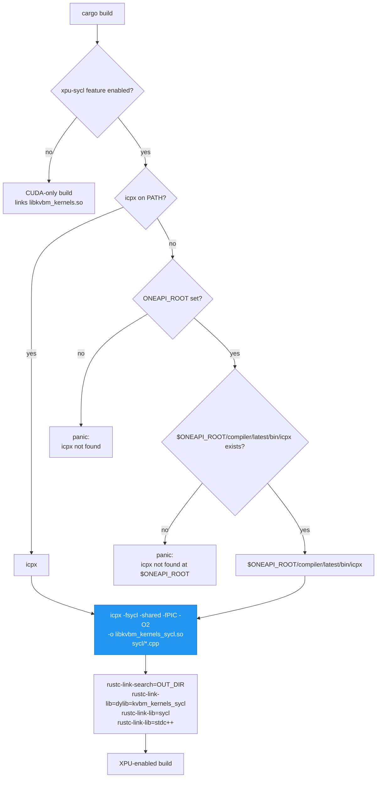
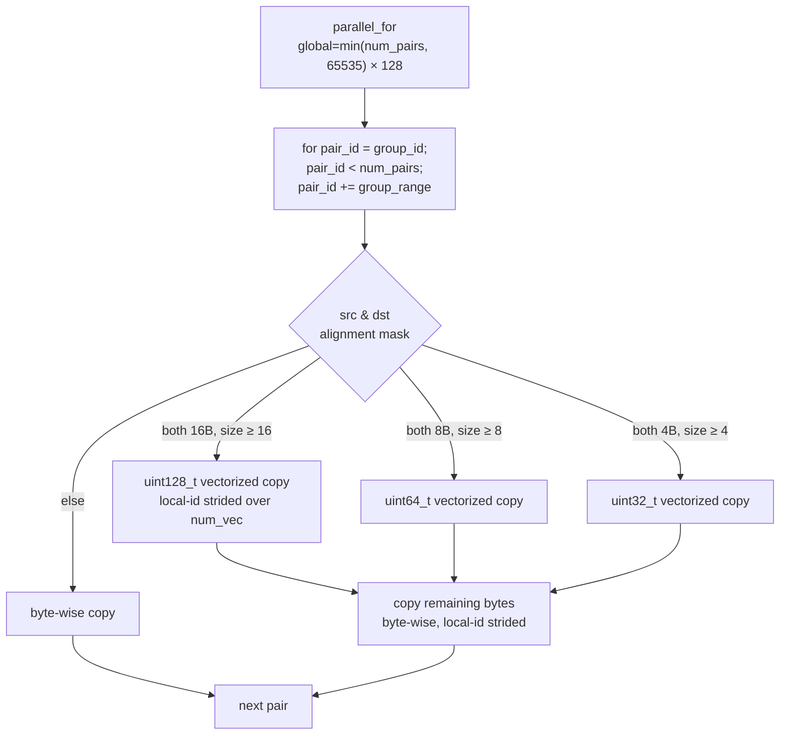

# SYCL Kernels

How the SYCL/XPU path of `kvbm-kernels` is organized: the `.cpp` sources,
how they are compiled into `libkvbm_kernels_sycl.so` by `icpx -fsycl`, the
`extern "C"` launcher ABI, and how the kernels dispatch work-groups.

For the broader architecture and how these kernels plug into the device
abstraction in `kvbm-physical`, see
[`kvbm_v2_xpu_sycl_enablement.md`](../../kvbm-physical/docs/kvbm_v2_xpu_sycl_enablement.md).

## File layout

```
lib/kvbm-kernels/
├── sycl/
│   ├── vectorized_copy_kernel.cpp   # sycl_vectorized_copy launcher
│   └── tensor_permute_kernel.cpp    # permute launchers
│                                    # (sycl_universal_from_block + sycl_block_from_universal)
├── cuda/
│   ├── tensor_kernels.cu            # CUDA kernels (unchanged)
│   └── stubs.c                      # abort-on-call stubs when nvcc is absent
├── src/
│   ├── tensor_kernels.rs            # CUDA FFI (always built)
│   ├── tensor_kernels_sycl.rs       # SYCL FFI (feature xpu-sycl)
│   └── lib.rs
└── build.rs                         # two-tier build (CUDA + SYCL)
```

## Build pipeline

The SYCL branch in `build.rs` is driven by the `xpu-sycl` Cargo
feature. When enabled, it compiles every
`.cpp` under `sycl/` into a single shared library.



Notes:

- The CUDA branch runs regardless of `xpu-sycl` — a pure
  XPU build still needs `cc` (or the stubs) for `libkvbm_kernels.so`.
  This is a known rough edge; see the enablement doc for follow-up
  items.
- The SYCL library is a single `.so` — `icpx` takes every `.cpp` in
  `sycl/` as one call. Adding a new kernel means adding a new `.cpp`
  alongside the existing two; `build.rs` discovers it automatically.
- `build.rs` emits one `cargo:rerun-if-changed=<path>` per discovered
  `.cpp` file (Cargo doesn't expand globs in `rerun-if-changed`), so
  `cargo build` incrementally rebuilds when any SYCL source changes.

## `extern "C"` launcher ABI

All three launchers use the same shape: opaque device pointer arrays,
explicit dimension arguments, a `void*` that Rust supplies as a
`sycl::queue*`, and an `int` return code.

Naming is aligned end-to-end: the `.so` is `libkvbm_kernels_sycl.so`,
the C++ symbols are `kvbm_kernels_sycl_launch_*`, the Rust `extern "C"`
declarations match, and the Rust public wrappers are `sycl_*`. The
`xpu-sycl` Cargo feature is spelled the same across `kvbm-kernels`,
`dynamo-memory`, `dynamo-device`, `kvbm-physical`, and `kvbm-py3`, so
every KVBM crate activates this code path with one consistent flag.

```cpp
extern "C" {

int kvbm_kernels_sycl_launch_vectorized_copy(
    void** src_ptrs, void** dst_ptrs,
    size_t copy_size_bytes,
    int    num_pairs,
    void*  queue_ptr);    // sycl::queue* opaque

int kvbm_kernels_sycl_launch_universal_from_block(
    void* const*       universal_ptrs,
    const void* const* block_ptrs,
    size_t num_blocks, size_t nh, size_t nl, size_t no,
    size_t nt, size_t hd, size_t elem_size,
    int    layout_value,  // 0 = NHD, 1 = HND
    void*  queue_ptr);

int kvbm_kernels_sycl_launch_block_from_universal(
    const void* const* universal_ptrs,
    void* const*       block_ptrs,
    size_t num_blocks, size_t nh, size_t nl, size_t no,
    size_t nt, size_t hd, size_t elem_size,
    int    layout_value,
    void*  queue_ptr);

}
```

Return values: `0` on success, `-1` on a `sycl::exception` caught
inside the launcher. Callers in Rust wrap this with a descriptive
`anyhow::anyhow!("... failed (rc={ret})")`.

### The Rust side

`src/tensor_kernels_sycl.rs` exposes one safe-ish `unsafe fn` per
launcher; the shared `BlockLayout` enum (`NHD = 0`, `HND = 1`) is passed
in place of the raw `int`. Tests and `kvbm-physical` call
these functions with the queue pointer obtained via
`oneapi_rs::safe::SyclQueue::raw_queue_ptr()`.

## Kernel dispatch — `sycl_vectorized_copy`

This is the hot path for FC↔LW transfers in KVBM v2. Each work-group
handles one or more `(src, dst)` pointer pairs using a group-strided
outer loop; inside, work-items cooperate on a single pair using
alignment-dependent vector widths.



Constants and grid shape:

- `kBlockDim = 128` — work-group size; chosen to match the CUDA
  `blockDim.x` used by the equivalent `.cu` kernel.
- Grid is clamped to `65535` work-groups (mirrors the CUDA grid-dim
  cap). With `num_pairs > 65535` each group sweeps multiple pairs via
  the strided outer loop.
- The `uint128_t` type is declared `alignas(16)` so the compiler emits
  a single 128-bit load/store when the pointers allow.

### Why per-pair alignment probing?

`batch_copy` must accept pointers that are only naturally aligned to
the data type (2 B for fp16, 4 B for fp32, …). Hard-coding 16-byte
vector loads would over-read past the last element. The runtime probe
picks the widest *safe* width per pair, so wide-aligned pairs get
full-rate SIMD and narrow-aligned pairs still correct with no
performance cliff on short copies.

## Kernel dispatch — permute kernels

`universal_from_block` and `block_from_universal` are fused
permute-and-copy kernels used by the FC↔LW path when the source and
destination layouts disagree (NHD vs HND vs universal). The Rust side
only calls them when the layout metadata requests permutation;
same-layout transfers reuse `sycl_vectorized_copy`.

Both kernels:

- Use `kBlockDim = 256` (more in-flight work-items per group because
  each item copies only one element).
- Flatten the output to a 1-D index `thread_id ∈ [0, nh·nl·no·nt·hd)`
  and decompose it back to `(block, nh, nl, no, nt, hd)` indices.
- Compute the within-chunk byte offset via `block_inner_offset(layout,
  …)` — a single branch on NHD vs HND.
- Move `elem_size` bytes per work-item via `copy_element`, which
  specializes to `uint64_t` / `uint32_t` / `uint16_t` stores for
  `elem_size ∈ {8, 4, 2}` and falls back to a byte loop otherwise.
- Share the same 65535-group cap as `vectorized_copy` via
  `compute_grid_size`. With `total = num_blocks × nh × nl × no × nt × hd`
  routinely above 65535 × 256 ≈ 16.7 M elements at production scale, the
  inner `for (; thread_id < total; thread_id += stride)` loop strides
  each work-item across multiple output elements. The cap is the same
  upper bound mirrored from the CUDA kernel.

Element-type dispatch is done by **byte size, not C++ templates**,
because permute is pure data movement — no arithmetic on element
values. This keeps the kernel a single specialization per `elem_size`
branch rather than one per dtype.

## Error surface

Inside every launcher:

```cpp
try {
    q.parallel_for( ... );
} catch (const sycl::exception& e) {
    fprintf(stderr, "kvbm_kernels_sycl: <launcher> failed: %s\n", e.what());
    return -1;
}
```

Each launcher prints the exception message (`e.what()`, which typically
contains the underlying Level-Zero error string) to stderr before
returning `-1`. The Rust-side FFI wrapper then converts the non-zero
return code into a descriptive `anyhow::anyhow!("... failed (rc={ret})")`
that propagates up through the executor.

## Feature graph

| Feature | Effect |
|---|---|
| `xpu-sycl` | Builds `src/tensor_kernels_sycl.rs` and compiles SYCL kernels via icpx. Requires DPC++ compiler. |
| `xpu-sycl-permute` | Enables SYCL permute kernel re-exports (implies `xpu-sycl`). |
| `testing-xpu-sycl` | Enables `tests/sycl_kernel_roundtrip.rs` integration tests; requires a real XPU device |
| `kvbench-xpu-sycl` | Enables the `kvbench_xpu_sycl.rs` example (pulls in `clap`, `oneapi-rs`, and `xpu-sycl-permute`) |

Kernel dispatch from the `dynamo-device` SYCL backend (consumed by
`kvbm-physical`) crosses this FFI boundary through the
`kvbm_kernels::sycl_vectorized_copy` call site in
`lib/device/src/sycl/mod.rs`. The SYCL permute wrappers
(`sycl_universal_from_block` / `sycl_block_from_universal`) are exported
and covered by `tests/sycl_kernel_roundtrip.rs`, but are not currently on
the production device-executor path. See the device executor flow doc for
the call sequence that wraps the vectorized-copy launch.
