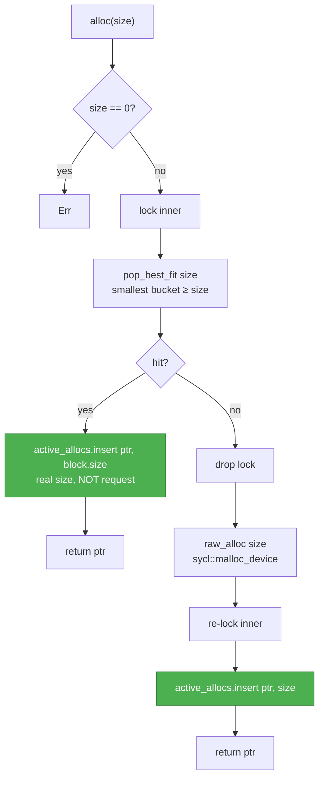
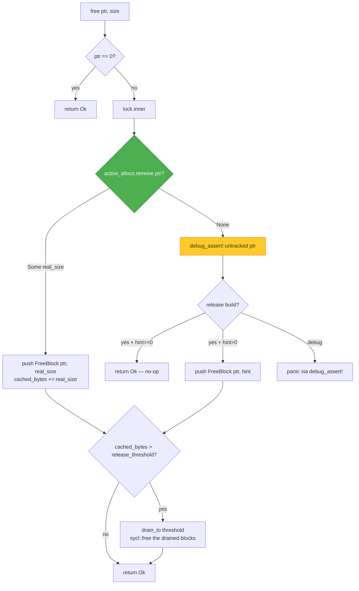

# SyclMemPool and NUMA-aware pinned allocation

Implementation contracts for the two pieces of `dynamo-memory` that
matter most for the XPU/SYCL path:

1. **`SyclMemPool`** — a software free-list that stands in for the
   native pool API CUDA provides and SYCL does not.
2. **`NumaWorkerPool`** + `PinnedAllocator` — the shared machinery that
   routes pinned host allocation through NUMA-pinned worker threads,
   used by both CUDA and SYCL backends.

For architecture and feature-graph context see
[`kvbm_v2_xpu_sycl_enablement.md`](../../kvbm-physical/docs/kvbm_v2_xpu_sycl_enablement.md).

## `SyclMemPool` — software free-list

CUDA exposes a native stream-ordered pool (`cuMemAllocFromPoolAsync` /
`cuMemFreeAsync`). SYCL does not. `SyclMemPool` implements the same
`alloc` / `free` semantics in software over `sycl::malloc_device` and
`sycl::free`.

### Data structure

```
PoolInner {
    free_list:     BTreeMap<usize, Vec<FreeBlock>>,   // size → stack
    active_allocs: HashMap<u64, usize>,               // ptr  → real_size
    cached_bytes:  usize,                             // total cached bytes
}
```

Every block in the pool has **one** size that is authoritative — the
size at which `sycl::malloc_device` created it. `active_allocs` keeps
the ptr-to-real-size mapping outside the free list so that a reused
block does not lose its provenance.

### `alloc(size)` path



Two things to note:

- On a cache hit `active_allocs` stores `block.size`, **not** the
  caller's `size`. Best-fit can hand back a larger block; accounting
  must follow the real block.
- `raw_alloc` runs **outside** the mutex so concurrent misses don't
  serialize on the SYCL driver. The second lock acquisition to record
  the new ptr is short and race-free because nobody else can see the
  ptr yet.

### `free(ptr, size)` path

The `size` parameter (here used as a hint — see note below) names the
caller's best guess at the original allocation size.



The `size` argument (signature: `free(ptr: u64, size: usize)`) is
preserved for API compatibility but acts as a hint — it is **not**
used on the happy path. It takes effect only as a fallback when the
caller passes a ptr the pool never issued, which in debug builds is a
`debug_assert!` failure. The unit test
[`test_pool_free_ignores_size_hint`](../src/pool/sycl.rs) pins this
behavior.

### Why real-size tracking matters

Without it, this degradation path cripples the pool:

1. Warm pool with `reserve_size = 64 MiB`. Free list: `{64 MiB → [X]}`.
2. `alloc(1 MiB)` returns `X` (best fit). *Without tracking*, pool
   forgets the block was 64 MiB.
3. `free(X, 1 MiB)` pushes `{X, 1 MiB}` into the free list.
4. Next `alloc(4 MiB)` misses the cache — there is no ≥ 4 MiB block
   anymore — and goes to `sycl::malloc_device` for a fresh 4 MiB
   allocation.

After the first mismatched round-trip the pool stops amortizing, and
`release_threshold` stops reflecting actual USM footprint. The
`active_allocs` map closes that gap.

### Drop semantics

`Drop` uses `Mutex::get_mut()` (no lock needed because `&mut self`
already proves exclusive access). `drain_to(0)` empties the free list
and each block is returned via `sycl::free`. Blocks still in
`active_allocs` are *not* freed — they are caller-owned pointers, and
freeing them here would race a concurrent consumer.

## NUMA-aware pinned allocation

Both CUDA and SYCL route pinned host allocation through a single global
`NumaWorkerPool`. A backend-specific `PinnedAllocator` runs on a
NUMA-pinned worker thread that also performs first-touch.

### The trait

```rust
pub trait PinnedAllocator: Send + Sync + 'static {
    fn alloc_pinned(&self, size: usize) -> Result<*mut u8, String>;
    fn free_pinned(&self, ptr: *mut u8) -> Result<(), String>;
}
```

Two implementations live in `dynamo-device`:

- `CudaPinnedAllocator` — binds the CUDA context to the pinned worker
  thread, then calls `cuMemHostAlloc(DEVICEMAP)`.
- `SyclPinnedAllocator` — holds an `Arc<SyclContext>` and calls
  `context.malloc_host(size)`. SYCL USM host allocation is context-scoped,
  so the allocator doesn't need a queue at all.

### `NumaWorkerPool` topology

```mermaid
flowchart LR
    CTX[DeviceContext.allocate_pinned size] --> PCI["pci_bdf_address()"]
    PCI --> NODE["get_numa_node_for_pci_address<br/>(sysfs → nvidia-smi/xpu-smi fallback)"]
    NODE --> POOL[NumaWorkerPool::global]
    POOL --> SPAWN{worker for node exists?}
    SPAWN -- no --> NEW[spawn thread:<br/>sched_setaffinity to node's CPUs]
    SPAWN -- yes --> REUSE[reuse worker]
    NEW --> SEND
    REUSE --> SEND
    SEND["send AllocRequest(size, node, Arc dyn PinnedAllocator)"]
    SEND --> W1

    subgraph worker[NUMA-pinned worker thread]
        W1[verify current NUMA node]
        W2[allocator.alloc_pinned size]
        W3[first-touch each page<br/>write_volatile 0 to one byte per system page]
        W4[return pointer]
        W1 --> W2 --> W3 --> W4
    end

    W4 --> CALLER[caller receives pinned ptr]

    style NEW fill:#4caf50,stroke:#2e7d32,color:#fff
    style W3 fill:#ff9800,stroke:#ef6c00,color:#fff
```



Key invariants:

- One worker per NUMA node, spawned lazily and kept alive for the
  process lifetime.
- The worker pins itself **before** servicing any request, then yields
  briefly so the kernel scheduler can actually migrate the thread to
  the target node (pinning is synchronous but migration is cooperative).
- `do_pinned_allocation` checks `get_current_cpu_numa_node()` before
  the allocation and again before first-touch; mismatches log a
  `tracing::error!` so badly-placed pages are observable in production.
- First-touch touches one byte per system page (`sysconf(_SC_PAGESIZE)`,
  fallback 4 KiB) plus the final byte when the allocation is not
  page-aligned. Touching forces Linux to bind the page to the
  worker's current NUMA node under the default *first-touch* policy.

### Timeout and cleanup

Per-request timeout is `max(10, 10 + size_gib)` seconds clamped to 300 s.
If the caller drops the response channel before the worker sends (e.g.,
the caller errored out), the worker detects the drop and calls
`allocator.free_pinned(ptr)` rather than leaking the allocation.

The worker thread exits when its request channel is dropped — normally
at process shutdown, since the pool is a `OnceLock` global.

## Cross-backend consistency

| Aspect | CUDA path | SYCL path |
|---|---|---|
| Allocator trait | `CudaPinnedAllocator: PinnedAllocator` | `SyclPinnedAllocator: PinnedAllocator` |
| Backend-specific thread binding before alloc | yes — `ctx.bind_to_thread()` so the cudarc context follows the worker thread | no — SYCL USM host allocation is context-scoped |
| First-touch done in worker? | yes (shared logic in `NumaWorkerPool`) | yes (same code) |
| PCI BDF source | `CU_DEVICE_ATTRIBUTE_PCI_{DOMAIN,BUS,DEVICE}_ID` | `SyclDevice::info().pci_address` |
| NUMA node lookup | `/sys/bus/pci/devices/<bdf>/numa_node`, fallback `nvidia-smi topo` | same sysfs lookup, fallback `xpu-smi discovery` parsing |

The "backend-specific thread binding" row is **not** about NUMA pinning
— the NUMA worker thread itself is always pinned via
`sched_setaffinity` regardless of backend. The row only refers to
backend-runtime context binding (CUDA's per-thread current-context
state); SYCL has no equivalent because allocations go through
`SyclContext` directly.

First-touch semantics are identical because the first-touch walk runs
in `NumaWorkerPool` regardless of backend. The only backend-specific
logic is *how* the underlying allocation is made.

## Validating first-touch on real hardware

`lib/kvbm-physical/bin/validate_numa_placement.rs` is a diagnostic
binary that exercises the full NUMA allocation path on either backend
and verifies with `move_pages(2)` that every page landed on the
expected NUMA node. It's the authoritative answer to "does first-touch
actually work on my system?".

The backend is resolved in two steps: **compile time** (which Cargo
features were enabled) and **runtime** (what `--backend` picks). Only
a backend that was compiled in can be selected at runtime — otherwise
the binary prints an actionable rebuild hint and exits.

```bash
# CUDA host (default features include `cuda`) — auto-detect picks CUDA:
cargo run -p kvbm-physical --bin validate_numa_placement

# CUDA host, larger allocation, subset of devices:
cargo run -p kvbm-physical --bin validate_numa_placement -- \
    --size 64 --gpus 0,2

# Intel XPU host — requires the `xpu-sycl` feature (which enables
# `xpu-sycl` in `kvbm-kernels`, triggering `icpx -fsycl`):
    cargo run -p kvbm-physical \
        --no-default-features --features xpu-sycl \
        --bin validate_numa_placement -- \
        --backend sycl --size 64 --gpus 0,2

# Mixed host with both backends compiled in:
    cargo run -p kvbm-physical --features cuda,xpu-sycl \
        --bin validate_numa_placement -- --backend sycl
```

The binary builds under either `cuda` or `xpu-sycl` (or both
simultaneously); at runtime it reports which backends were compiled in
and refuses to use any that weren't. For each device it:

1. Resolves the PCI BDF through `DeviceContext::pci_bdf_address()`
   (same path `allocate_pinned` uses internally).
2. Looks up the expected NUMA node via
   `dynamo_memory::numa::get_numa_node_for_pci_address`.
3. Allocates pinned memory via `PinnedStorage::new(size, ctx)` — this
   drives `NumaWorkerPool` → `PinnedAllocator` → first-touch exactly
   as production code does.
4. Calls `move_pages(2)` with `nodes = NULL` to read back each page's
   real NUMA node.
5. Reports per-device pass/fail and exits non-zero if any device is
   misplaced.

Run this on a multi-NUMA Intel host before trusting SYCL pinned
allocation — it's the only end-to-end proof that SYCL
`sycl::malloc_host` defers page population long enough for the
worker's first-touch walk to bind pages correctly.

## Gotcha: `SyclMemPool.free(ptr, 0)`

The previous implementation returned `Ok(())` early on `size == 0`.
After the real-size fix, `free(0, _)` is the only short-circuit —
`free(nonzero_ptr, 0)` now looks up the real size from `active_allocs`
and frees correctly. Callers that used to pass `size = 0` as a
"no-op" trigger will now perform the real free. This is intentional:
the `size` argument was never meant to control whether the free
happens.

Tests in `pool/sycl.rs::tests` pin both behaviors:

- `test_pool_free_null_ptr_noop` — `free(0, _)` is a no-op.
- `test_pool_free_ignores_size_hint` — `free(tracked_ptr, 0)` still
  recycles the tracked ptr at its real size, and a subsequent alloc
  hits the cache.

## Related reading

- Device-side usage of the pool: [`device_executor_flow.md`](../../kvbm-physical/docs/device_executor_flow.md), step 2 and step 6 of `execute_fc_lw_vectorized`.
- How the SYCL backend wires these pieces into `DeviceContextOps`: [`kvbm_v2_xpu_sycl_enablement.md`](../../kvbm-physical/docs/kvbm_v2_xpu_sycl_enablement.md).
