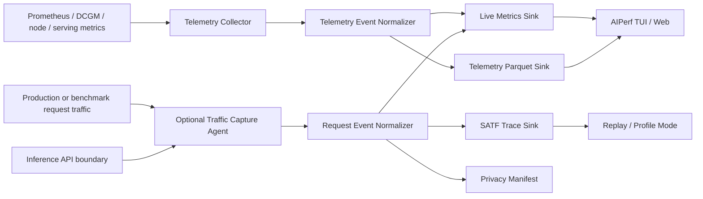

# Live AIPerf

**Status**: Draft

**Target repo**: `ai-dynamo/aiperf`

**Authors**: Ben Hamm

**Category**: Architecture

**Replaces**: N/A

**Replaced By**: N/A

**Sponsor**: TBD

**Required Reviewers**: AIPerf maintainers; Tachometer and SATF stakeholders

**Review Date**: TBD

**Pull Request**: https://github.com/ai-dynamo/enhancements/pull/88

**Implementation PR / Tracking Issue**: TBD

# Summary

This DEP proposes **Live AIPerf**: a production-aware extension to AIPerf that can observe live inference traffic and emit two related outputs:

1. **Live Metrics**: AIPerf-conventioned metrics computed from production or benchmark traffic in real time, including TTFT, ITL, request latency, output token throughput, and speculative decoding/MTP acceptance rate when available.
2. **Live Trace Capture and Anonymization**: privacy-safe trace artifacts that preserve replay-relevant workload structure, preferably in Standard Agentic Trace Format (SATF), with default support for content-free traces that retain keyed block fingerprints for shared-prefix/KV-cache replay fidelity.

These should be built as two independently deployable live-data paths under one Live AIPerf umbrella:

- a low-touch telemetry path for exported system, hardware, and serving metrics
- a separately gated traffic-capture path for anonymized replay traces

The two paths share AIPerf metric definitions, time correlation, artifact conventions, and user workflows, but they do not share the same trust boundary. Live metrics must be useful without request/response capture, and trace capture must remain optional and privacy-reviewed.

# Motivation

AIPerf today is primarily a synthetic-load benchmarking tool. That remains important, but customers increasingly need production-grounded performance answers:

- "What is my deployment doing right now, using the same metric definitions AIPerf uses in benchmark mode?"
- "Can I turn production traffic into a replayable benchmark workload without leaking prompt content, tool results, or proprietary workflow structure?"

Current request-level benchmark tooling can mis-characterize long-context, multi-turn, tool-using, bursty agentic workloads when it flattens them into independent requests. At the same time, production observability stacks often compute related metrics differently from AIPerf, making "live TTFT" and "AIPerf TTFT" hard to compare.

Live AIPerf closes that gap through two complementary mechanisms. First, it can scrape exported telemetry to measure systems under live load without changing the traffic path. Second, it can optionally capture request/response structure near the inference API boundary to produce privacy-safe replay traces. These mechanisms should be correlated through AIPerf artifacts and definitions, but reviewed and deployed according to their different risk profiles.

## Goals

- Observe production inference traffic without taking deployments offline.
- Compute live metrics using the same conventions as AIPerf profile-mode runs.
- Capture privacy-safe traces that can be replayed as realistic benchmark inputs, including shared-prefix/KV-cache behavior by default through keyed block fingerprints.
- Preserve agentic workload structure: sessions, turns, tool calls, tool returns, delays, dependencies, and prefix relationships.
- Capture speculative decoding/MTP acceptance-rate signals from real production use cases when the serving stack exposes them.
- Correlate user-visible request metrics with "under the hood" telemetry from disaggregated serving workers, including prefill and decode workers.
- Support K8s, Slurm, and SRT Slurm deployment paths.
- Reuse proven telemetry capture primitives where they fit while making AIPerf the user-facing product surface.

### Non Goals

- Replace full observability stacks such as Prometheus or Grafana for all cluster monitoring.
- Store raw production prompt/completion content by default.
- Guarantee semantic anonymization of arbitrary content in the hot path.
- Make rewritten content statistically identical to original content.
- Build a general-purpose data-loss-prevention product.
- Require AIPerf to be the load generator in order to observe traffic.

## Requirements

### REQ 1: Separate Trust Boundaries

Live AIPerf **MUST** treat telemetry scraping and traffic capture as separate trust boundaries.

Live metrics **MUST NOT** require request/response capture. A deployment that only exposes Prometheus-compatible system, hardware, or serving metrics **MUST** still be able to use the live telemetry path.

Traffic capture **MUST** be optional, separately configured, and subject to the privacy controls described in this DEP.

The two paths **SHOULD** use shared AIPerf metric definitions, timestamps, artifact layout, and correlation identifiers where available, but they **SHOULD NOT** require the same collector or deployment mechanism.

### REQ 2: AIPerf-Conventioned Live Metrics

Live metrics **MUST** use the same definitions as AIPerf profile-mode metrics wherever the same signal is available.

At minimum, Live AIPerf **SHOULD** support:

- time to first token
- inter-token or inter-chunk latency
- request latency
- request throughput
- output token throughput
- input/output token length distributions
- error/cancel/timeout rate

When observable, Live AIPerf **SHOULD** support:

- speculative decoding/MTP acceptance rate
- tool-call round-trip time
- multi-turn TTFT
- end-to-end task/session latency
- prefix-cache hit rate observed at the harness or API boundary

### REQ 3: Privacy-Safe Trace Capture

The default trace capture mode **MUST** be content-free and replay-faithful. It **MUST** preserve block-level equality structure through keyed block fingerprints or equivalent prefix identity metadata so AIPerf can replay shared-prefix and KV-cache behavior without persisting raw content.

The default trace capture mode **MUST NOT** persist:

- prompt text
- completion text
- tool arguments
- tool return content
- raw API request/response envelopes
- customer headers
- unredacted session or user identifiers

The default trace capture mode **SHOULD** preserve:

- token counts
- keyed token/block fingerprints or equivalent prefix identity metadata
- timing
- status/stop/error codes
- dependency relationships
- tool-call shape, optionally with anonymized tool classes
- tokenizer/chat-template identifiers
- sampling and generation parameters when safe
- cache/prefix metadata when observable
- speculative decoding acceptance rate

Shape-only traces that omit block identity **MAY** be supported behind an explicit flag, but they **MUST** be documented as lower-fidelity traces that cannot faithfully replay shared-prefix or KV-cache hit-rate behavior.

### REQ 4: Agentic Trace Export

Live AIPerf **SHOULD** export captured traffic in SATF or another agreed standard AIPerf trace format that can represent multi-turn, tool-using, dependency-preserving workloads.

Every exported trace **SHOULD** be validated before it is marked usable for replay.

### REQ 5: Explicit Privacy Manifest

Every captured artifact **MUST** include a machine-readable privacy manifest that describes:

- capture mode
- content policy
- hashing algorithm and key id, not the key itself
- tokenizer and chat template identifiers
- fields dropped
- structural anonymization settings
- timestamp bucketing or jitter policy
- trace validation status
- warnings about possible leakage

### REQ 6: Deployment Compatibility

Live AIPerf **SHOULD** support:

- K8s sidecar, daemon, or proxy deployments
- Slurm-based benchmark environments
- SRT Slurm environments
- local/debug capture against a single OpenAI-compatible endpoint

### REQ 7: Worker-Level Telemetry for Disaggregated Serving

Live AIPerf **SHOULD** preserve enough metadata to compare telemetry across serving roles and worker processes in disaggregated deployments.

At minimum, telemetry records **SHOULD** support grouping by:

- worker role, such as prefill or decode
- worker index
- worker process or rank
- hostname or node
- GPU index when applicable

This enables AIPerf users to correlate request-level symptoms, such as high TTFT or low output throughput, with internal serving behavior such as prefill/decode imbalance, GPU utilization, memory pressure, queueing, KV-cache allocation waits, or backend-specific histogram metrics.

# Proposal

Live AIPerf should expose three closely related workflows:

1. watch live metrics
2. capture anonymized traces
3. replay captured workloads

## Workflow 1: Watch Live Metrics

User intent: "Show me what my deployment is doing now, using AIPerf definitions."

Illustrative command:

```bash
aiperf watch --url https://deployment.example.com \
  --endpoint-type chat \
  --prometheus http://worker-0:9400/metrics \
  --ui tui
```

This should work whether or not AIPerf is generating the load. When AIPerf is the load generator, the same machinery should attach automatically and annotate the benchmark artifact.

This workflow should not require request/response capture. It should be able to operate from exported system, hardware, frontend, and backend metrics alone.

## Workflow 2: Capture Anonymized Traces

User intent: "Turn production traffic into a safe benchmark artifact."

Illustrative command:

```bash
aiperf capture --url https://deployment.example.com \
  --format satf \
  --privacy replay-hash \
  --output ./captures/prod-agentic.satf.json
```

Initial privacy modes:

- `replay-hash`: default content-free mode. Stores timing, token counts, dependencies, tool structure, and keyed token/block fingerprints so AIPerf can preserve shared-prefix/KV-cache behavior during replay.
- `shape-only`: no text, no token ids, and no block identity. Supports workload-shape replay only and cannot faithfully reproduce KV-cache hit rate.
- `redacted-content`: sanitized content-bearing SATF using NeMo Anonymizer or another configured content anonymization stage.

## Workflow 3: Replay Captured Workloads

User intent: "Benchmark candidate deployment behavior using production-shaped traffic."

Illustrative command:

```bash
aiperf profile my-model \
  --url http://candidate-deployment:8000 \
  --trace ./captures/prod-agentic.satf.json \
  --replay-mode agentic
```

This connects Live AIPerf to agentic benchmarking: live capture produces the workload artifact, and agentic replay consumes it.

## Architecture

Live AIPerf should be organized around two live-data paths that meet at AIPerf correlation, artifacts, and metric definitions.



### Telemetry Collector

The Telemetry Collector captures hardware, node, backend, and frontend telemetry from Prometheus-compatible endpoints. This is the low-touch path: it should not require request/response capture and should not require changing the live traffic path.

The collector should preserve worker-level metadata so users can inspect disaggregated serving systems under the hood. For example, a Dynamo deployment may have distinct prefill and decode workers. Live AIPerf should allow users to compare metrics by role, worker index, process or rank, hostname, and GPU so they can identify whether a live performance issue is caused by the frontend, prefill workers, decode workers, hardware utilization, KV-cache behavior, or cross-role imbalance.

### Optional Traffic Capture Agent

The Optional Traffic Capture Agent observes request/response traffic at or near the inference API boundary. This path is higher trust than telemetry scraping and must be separately configured, privacy-reviewed, and optional.

It emits structured events rather than final artifacts directly:

- request start
- first token
- token/chunk emission
- request end
- tool call emitted
- tool result observed
- session/turn boundary
- speculative decoding acceptance-rate observation
- error/cancel/timeout

### Event Normalizers

Telemetry and traffic capture can have different collectors and event schemas, but they should normalize into AIPerf-compatible events and artifacts. This is where profile-mode and live-mode definitions must converge.

### Live Metrics Sink

The Live Metrics Sink aggregates normalized telemetry events and, when enabled, request events into AIPerf metrics for the TUI, optional web views, and persistent artifacts. Metrics that require request lifecycle events should be clearly marked unavailable when only telemetry scraping is enabled.

### SATF Trace Sink

The SATF Trace Sink writes anonymized trace artifacts. By default, this sink should not receive raw content. It should receive enough metadata to preserve session shape, dependencies, timings, token counts, keyed block identity, input reuse, tool-call structure, and replay parameters.

### Privacy Manifest

The Privacy Manifest travels with each artifact and describes exactly what was captured, dropped, hashed, bucketed, or transformed.

# Implementation Details

## Normalized Request Event

The exact schema should be finalized during implementation, but the optional traffic-capture path should support normalized request records similar to:

```json
{
  "event_type": "llm_request_completed",
  "capture_id": "capture_2026_05_14_001",
  "session_id_hash": "session_...",
  "turn_seq": 3,
  "model": "model-name-or-alias",
  "endpoint_type": "chat",
  "request_start_us": 1778780000000000,
  "first_token_us": 1778780000123000,
  "request_end_us": 1778780002456000,
  "input_tokens_total": 4096,
  "output_tokens": 512,
  "stop_reason": "stop",
  "streaming": true,
  "spec_decode_acceptance_rate": 0.72
}
```

This is illustrative, not a final schema. The important point is that request-derived live metrics and trace export consume the same normalized request events. Telemetry-only deployments should use their own normalized telemetry events and should not require this request event shape.

## SATF Output

The default SATF output should be content-free and replay-faithful:

- session and turn ids are pseudonymized.
- content store is omitted.
- context and output text references are omitted.
- token counts and timing are preserved.
- keyed block fingerprints, prefix group ids, or equivalent block identity metadata are preserved.
- tool-call structure is preserved, but tool names and argument/result content are redacted or bucketed unless explicitly allowed.
- prefix/cache observations are represented using SATF-supported fields or agreed extensions.

This default intentionally leaks equality structure: reviewers and downstream tools can see that two requests share a token block or prefix group. That leakage is necessary for faithful shared-prefix and KV-cache replay, but it should be protected with customer-controlled keyed hashing rather than raw content or unsalted hashes.

## Artifact Layout

Proposed artifact layout:

```text
live-aiperf/
  YYYY-MM-DD/
    capture-name/
      manifest.json
      privacy_report.json
      metrics/
        live_metrics.parquet
      telemetry/
        final.parquet
      traces/
        workload.satf.json
      logs/
        capture_agent.log
```

This intentionally resembles existing nested run layouts while adding first-class AIPerf and trace artifacts.

## Privacy Design

The default promise should be:

> Live AIPerf can replay production-shaped traffic, including shared-prefix/KV-cache behavior, without storing production content.

Raw SHA-256 of token blocks is not enough for customer-safe anonymization. Low-entropy prompts, common tool strings, or known templates can be dictionary-attacked.

Recommended hashing policy:

- Use HMAC-SHA256 or equivalent keyed hashing for block fingerprints.
- Customer controls the secret.
- Store only a key id or policy id in the artifact.
- In the default `replay-hash` mode, fingerprints are stable within one capture artifact so replay can preserve shared-prefix/KV-cache behavior.
- Cross-capture stable fingerprints are opt-in and require an explicit customer-controlled key policy.
- Fingerprints that are not linkable even within one capture are incompatible with replay-faithful `replay-hash` mode and belong to the lower-fidelity `shape-only` mode.
- Include tokenizer name/version, chat template identifier, block size, and normalization policy.
- Make cross-tenant stable hashes impossible by default.
- Be explicit that keyed block fingerprints preserve equality structure by design.

Content is not the only leakage path. Session shape can reveal proprietary workflows.

Structural anonymization controls should include:

- timestamp bucketing
- optional timestamp jitter
- session id pseudonymization
- rare tool-name suppression
- tool-name class mapping
- conversation-length bucketing
- request length bucketing
- removal of low-frequency workflow signatures

## Speculative Decoding / MTP

Live AIPerf should capture acceptance-rate observations when the serving stack exposes them. These values should parameterize synthetic benchmark runs and SpecDec/MTP guidance.

Serving engines may expose acceptance rate at different layers and granularities. The design should support per-request, per-window, and per-model observations rather than assuming a single universal field.

## Deployment

### K8s

Primary customer production path:

- sidecar or daemon deployment
- passive observer mode where possible
- optional proxy mode when API-boundary events are required
- Prometheus service discovery for telemetry endpoints
- persistent object-store export
- integration with AIPerf K8s operator over time

### Slurm / SRT Slurm

Live AIPerf should support Slurm-based benchmark labs and internal performance work, including environments managed by [SRT Slurm](https://github.com/NVIDIA/srt-slurm).

### Local / Debug

Local capture should support:

- one OpenAI-compatible endpoint
- optional Prometheus endpoint
- local filesystem output
- no content persistence by default
- validation of generated traces

## Deferred to Implementation

- Final command naming: `aiperf watch`, `aiperf monitor`, `aiperf capture`, or a grouped `aiperf live` namespace.
- Final normalized event schema.
- Exact SATF fields/extensions required for prefix/cache and acceptance-rate capture.
- Final semantics for `replay-hash` and `shape-only` privacy modes.
- Whether telemetry prototype code is vendored, merged, pluginized, or wrapped.
- Whether web views are absorbed into AIPerf, kept internal, or exposed as reusable components.
- Whether traffic capture and trace anonymization should remain in this DEP or be split into a dedicated follow-on DEP after the live telemetry path lands.

# Implementation Phases

## Phase 0: Decisions and Interfaces

**Release Target**: TBD

**Effort Estimate**: TBD

**Work Item(s):** TBD

**Supported API / Behavior:**

- Define the normalized live event schema.
- Define artifact layout and privacy manifest.
- Decide command naming.
- Confirm SATF fields/extensions needed for prefix/cache and acceptance-rate capture.
- Decide telemetry code reuse strategy.
- Define the review and gating criteria for enabling optional traffic capture.

**Not Supported:**

- Production trace capture.
- Trace replay from live captures.

## Phase 1: Live Telemetry

**Release Target**: TBD

**Effort Estimate**: TBD

**Work Item(s):** TBD

**Supported API / Behavior:**

- AIPerf command can start or attach to Prometheus telemetry scraping.
- Outputs telemetry Parquet under an AIPerf artifact directory.
- Supports local/S3 storage.
- Supports DCGM and node-exporter at minimum.
- Preserves worker-role metadata for disaggregated serving systems, including prefill/decode comparisons when exposed by the serving stack.
- Works in Slurm, SRT Slurm, and local debug flows.

**Not Supported:**

- Full request lifecycle capture for traffic AIPerf did not generate.
- SATF trace export.

## Phase 2: AIPerf Live Request Metrics

**Release Target**: TBD

**Effort Estimate**: TBD

**Work Item(s):** TBD

**Supported API / Behavior:**

- Optionally capture request lifecycle events at the API boundary.
- Compute live TTFT, ITL, throughput, latency, error rate, and token distributions.
- Render live metrics using AIPerf conventions.
- Persist captured metrics as artifacts.
- Capture acceptance-rate signals where the serving stack exposes them.

**Not Supported:**

- Content-bearing anonymized trace export.
- Advanced structural anonymization.

## Phase 3: Performance-Only SATF Capture

**Release Target**: TBD

**Effort Estimate**: TBD

**Work Item(s):** TBD

**Supported API / Behavior:**

- Emit content-free SATF traces from live traffic when optional traffic capture is enabled.
- Preserve sessions, turns, dependencies, tool-call structure, timings, token counts, and inter-turn delays.
- Preserve keyed block fingerprints or equivalent prefix identity metadata for shared-prefix/KV-cache replay.
- Validate output with SATF validation tooling.
- Replay captured traces through AIPerf agentic load generation.

**Not Supported:**

- Content-bearing trace export by default.
- NeMo Anonymizer integration.

## Phase 4: Advanced Anonymization and Adapters

**Release Target**: TBD

**Effort Estimate**: TBD

**Work Item(s):** TBD

**Supported API / Behavior:**

- Block-hashed trace mode with HMAC policy.
- Shape-only trace mode for deployments that explicitly choose lower-fidelity replay without block identity.
- Mooncake import/export adapter.
- Optional NeMo Anonymizer integration for content-bearing SATF traces.
- Structural anonymization controls and privacy report.

**Not Supported:**

- Raw production content capture as a default mode.

# Related Proposals

- [Observability - Metrics](0004-observability-metrics.md)
- [RFC: Live Telemetry + MLflow Experiment Tracking for AIPerf](https://github.com/ai-dynamo/enhancements/pull/57)

# Alternate Solutions

## Alt 1: Keep Live Metrics and Trace Anonymization as Separate Projects

**Pros:**

- Smaller implementation surfaces.
- Different teams can move independently.
- Easier to ship a minimal live metrics feature quickly.

**Cons:**

- Duplicates deployment and capture infrastructure.
- Risks metric-definition drift between live metrics and replay traces.
- Creates a confusing customer story.

**Reason Rejected:**

Live metrics and anonymized trace capture do not share the same trust boundary, and this DEP should not imply that metrics require traffic capture. However, they do share enough product surface, artifact identity, metric definitions, timing/correlation needs, and replay workflow to remain under the Live AIPerf umbrella. The accepted design is one product area with independently deployable telemetry and traffic-capture paths.

## Alt 2: Use Existing Observability Tools Only

**Pros:**

- Customers may already run Prometheus, Grafana, OpenTelemetry, or vendor observability platforms.
- Avoids AIPerf owning monitoring infrastructure.

**Cons:**

- These tools do not necessarily compute AIPerf metric definitions.
- They do not produce replayable AIPerf trace artifacts.
- They generally do not preserve agentic workload structure for benchmarking.

**Reason Rejected:**

Live AIPerf should integrate with existing observability tools where useful, but AIPerf still needs to own metric definitions and replayable workload artifacts.

## Alt 3: Store Raw Production Traces and Anonymize Offline

**Pros:**

- Simpler capture implementation.
- Richest possible offline transformation options.

**Cons:**

- Unacceptable default privacy posture for many customers.
- Increases risk of sensitive prompt, completion, tool argument, or tool result retention.
- Makes trace sharing harder.

**Reason Rejected:**

The default product promise must be content-free replay-faithful capture. Optional content-bearing export can be added later, and lower-fidelity shape-only export can be available behind an explicit flag, but raw production content capture should not be the default architecture.

# Background

## Prior Art and References

### Tachometer

[Tachometer](https://github.com/NVIDIA-dev/warnold-tachometer) is the strongest prior art for the live metrics side. Tachometer is currently an NVIDIA-internal prototype, accessible to NVIDIA employees only, and is not yet a public project.

At a high level, Tachometer is a Prometheus-to-Parquet capture and visualization stack:

- Rust scraper for Prometheus endpoints.
- DCGM, node-exporter, backend, and frontend filters.
- Metadata tagging that supports comparing disaggregated serving roles such as prefill and decode workers.
- Arrow/Parquet writer and compaction flow.
- S3/local run browser and web UI.
- Existing awareness of AIPerf artifacts for Pareto views.

This DEP proposes using Tachometer as an implementation seed and component substrate, not as a separate long-term AIPerf-adjacent customer product.

### Standard Agentic Trace Format

[Standard Agentic Trace Format](https://gitlab-master.nvidia.com/compute/agentic-trace-spec) is the likely canonical target for agentic trace capture. The specification is currently accessible to NVIDIA employees only and is not yet a public project.

At a high level, SATF represents sessions as DAGs of LLM inference events, tool calls, tool results, delays, barriers, compaction events, and bootstrap events. It separates:

- a performance layer for token counts, timings, dependency relationships, input reuse, and optional KV/block information
- a reproduction layer for optional content store, context references, and output references

That split allows Live AIPerf to emit useful replay traces without persisting prompt text, completion text, tool arguments, or tool results.

### Offline Mooncake Anonymization Prototype

[AIPerf PR 822](https://github.com/ai-dynamo/aiperf/pull/822) is useful as narrow prior art. It converts raw OpenAI-style JSONL into a Mooncake-like block-hashed output. Useful pieces include tokenizer/chat-template handling, block hashing mechanics, and CLI/tutorial scaffolding.

The scope is narrower than Live AIPerf:

- offline and raw-content-first
- flat request stream, not agentic DAG
- requires prompt/completion text as input
- limited privacy controls around deterministic hashes, session ids, timestamps, and structural leakage
- no live metrics or sidecar deployment story

This work can seed adapters and implementation details, but should not define the product architecture.

### NeMo Anonymizer

[NeMo Anonymizer](https://github.com/NVIDIA-NeMo/Anonymizer) is complementary. It is a public content anonymization and rewriting system for datasets, using detection, replacement, and rewrite workflows. It can help when customers intentionally want to preserve sanitized content in a trace.

Recommended role:

- Default Live AIPerf emits content-free SATF replay traces with keyed block fingerprints or equivalent prefix identity metadata.
- Optional content-bearing trace export can pass SATF content payloads through NeMo Anonymizer.
- AIPerf owns the trace structure, timing, token counts, hashing policy, replay fit, and privacy manifest.

## Terminology & Definitions

| Term | Definition |
| :---- | :---- |
| **Agentic workload** | A workload involving multi-turn, tool-using, dependency-preserving interactions rather than independent flat requests. |
| **Content-free trace** | A trace that preserves performance metadata and workload structure without storing prompt, completion, tool argument, or tool result content. |
| **Live AIPerf** | The proposed AIPerf capability for observing live traffic and emitting live metrics, privacy-safe traces, or both. |
| **SATF** | Standard Agentic Trace Format, an NVIDIA-internal trace format specification at the time of this DEP. |
| **Tachometer** | An NVIDIA-internal telemetry prototype for scraping Prometheus-compatible metrics and writing them to Parquet for visualization. |

## Acronyms & Abbreviations

**DEP:** Dynamo Enhancement Proposal

**HMAC:** Hash-based Message Authentication Code

**ITL:** Inter-token latency

**MTP:** Multi-token prediction

**SATF:** Standard Agentic Trace Format

**TTFT:** Time to first token
