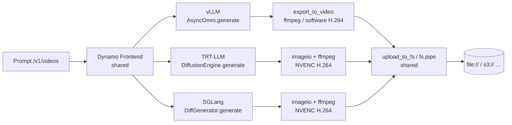
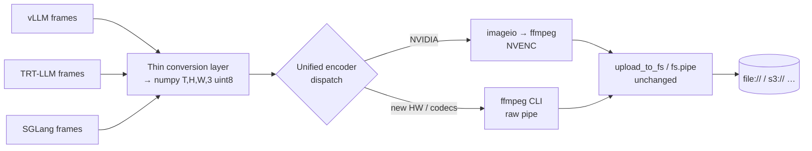

# Unified Video Encoder for Dynamo Diffusion Backends

**Status**: Draft

**Authors**: Sergey Plotnikov

**Category**: Architecture

**Replaces**: N/A

**Replaced By**: N/A

**Sponsor**: [Name of code owner or maintainer to shepard process]

**Required Reviewers**: [Names of technical leads that are required for acceptance]

**Review Date**: [Date for review]

**Implementation PR / Tracking Issue**: https://github.com/ai-dynamo/dynamo/pull/11121

# Summary

Dynamo currently serves video generation through three independent backends —
**vLLM** (via vLLM-Omni), **TensorRT-LLM**, and **SGLang**. Each backend
re-implements the final "raw frames → encoded video" step in its own way, with
its own codec, hardware assumptions, and code path. This document proposes a
single, shared video-encoding layer in `dynamo.common` that all three backends
call. The goal is to **unify encoding** so that codec, container, and hardware
support are implemented once, are consistent across backends, and are trivial to
extend (new codecs, new accelerators) without touching backend-specific code.

# Motivation

The three video backends share the same frontend, request schema, and storage
layer, but each ships its own frames→bytes encoder with divergent codecs,
hardware assumptions, and duplicated logic. This makes adding a codec, container,
or hardware accelerator (e.g. Intel XPU / VA-API) an N-times change and produces
inconsistent output across backends. Consolidating the single divergent step
into one shared encoder removes the duplication and makes hardware/codec support
a one-place change.

## Goals

* Unify the frames→bytes encode step for all three backends behind one shared
  entry point in `dynamo.common`.
* Preserve existing NVIDIA (NVENC) behavior unchanged.
* Make new hardware (XPU) and new codecs (notably HEVC) a single-place addition.
* Expose encoding controls (codec / container / HW accel / device) via
  environment variables.

### Non Goals

* Changing the frontend, request schema, or the storage/persistence layer.
* Per-backend CLI flags (may be layered on later).
* Removing the legacy helper functions in this change.

# Proposal

## Current Architecture

The video request travels through five stages. Stages 1 and 5 are **already
shared** by all three backends; stages 2–4 are where they diverge.

### Table 1 — Request handling (frontend → backend handler)

| Stage | vLLM | TensorRT-LLM | SGLang |
|---|---|---|---|
| HTTP / prompt processing | Dynamo Frontend (`dynamo.frontend`, OpenAI-compatible) | *same* | *same* |
| Shared request protocol | `NvCreateVideoRequest` / `VideoNvExt` (`dynamo.common.protocols`) | *same* | *same* |
| Backend entry point | `OmniHandler.generate()` | `VideoGenerationHandler.generate()` | `VideoGenerationWorkerHandler.generate()` |

> All three share the **same frontend and request schema**. The frontend routes
> `/v1/videos` to the appropriate worker endpoint; only the handler class differs.

### Table 2 — Generation (who produces the frames)

| | vLLM | TensorRT-LLM | SGLang |
|---|---|---|---|
| Generation call | `AsyncOmni.generate()` | `DiffusionEngine.generate()` | `DiffGenerator.generate()` |
| Owning package | `vllm_omni` | `dynamo.trtllm` (wraps `tensorrt_llm._torch.visual_gen`) | `sglang.multimodal_gen` |

> The call site for all three is **inside Dynamo handler code** — raw pixels are
> returned across the package boundary into Dynamo, which is what makes a shared
> Dynamo-side encoder possible without any upward dependency.

### Table 3 — Raw pixel output format

| | vLLM | TensorRT-LLM | SGLang |
|---|---|---|---|
| Type | `stage_output.images` — `list` (may hold one 5-D array) | `torch.Tensor` `(1, T, H, W, C)` `uint8` | `list[PIL.Image \| np.ndarray]` |
| Normalization helper | `normalize_video_frames()` | `video[0].cpu().numpy()` | per-frame `np.array(...)` |

> Three different in-memory shapes/types arrive at the encoder — this is exactly
> what the future "thin conversion layer" will absorb.

### Table 4 — Encoding (frames → bytes)

| | vLLM | TensorRT-LLM | SGLang |
|---|---|---|---|
| Encode function | `DiffusionFormatter._encode_video()` | `encode_to_video_bytes()` (`dynamo.common.utils.video_utils`) | `_frames_to_video()` (inline) |
| Encoder library | diffusers `export_to_video` → **ffmpeg** | `imageio.v3.imwrite(buffer, frames, extension=".mp4", codec="h264_nvenc")` → **ffmpeg** | `imageio.get_writer(buffer, format="mp4", codec="h264_nvenc")` → **ffmpeg** |
| Codec / HW | H.264 (libx264, **software**) | H.264 (**NVENC**), VP9 (`libvpx-vp9`) for webm | H.264 (**NVENC**) |
| Container(s) | mp4 | mp4 (webm code-capable) | mp4 |

> All three ultimately call **ffmpeg** (through imageio or diffusers). Only
> TensorRT-LLM uses the shared helper; SGLang duplicates equivalent logic inline,
> and vLLM has its own path. Containers other than mp4 are rejected by the
> handlers today even where the encoder could produce them.

### Table 5 — Persisting the encoded bitstream

| | vLLM | TensorRT-LLM | SGLang |
|---|---|---|---|
| Disk / object write | `upload_to_fs()` → `fs.pipe()` (`dynamo.common.storage`) | *same* | *same* |
| Backend (fsspec) | `DirFileSystem`; `file://` → local disk, `s3://`/`gs://` → object store | *same* | *same* |
| Response wrapping | `VideoData(url=… \| b64_json=…)` | *same* | *same* |

> Persistence is **already unified**. The encoders only produce bytes; the
> storage layer decides where the bytes land. (The unused `encode_to_mp4()`
> file-path variant bypasses this and is dead code.)

### Current flow chart

The fork in the middle (three encoders) is the only real divergence — and the
target of this work.

## Proposed Architecture

Insert a single shared encoder between the backends and the existing file
writer. Each backend feeds its raw pixels through a **thin conversion layer**
(normalize to a canonical `np.ndarray (T, H, W, 3) uint8`), then calls the
**unified encoder**, which dispatches to the right backend implementation.

### Two encode paths

| Path | When | Why this mechanism |
|---|---|---|
| **imageio → ffmpeg (NVENC)** | NVIDIA platforms (current behavior) | Keeps the proven, working path; minimal risk; no behavior change for existing users. |
| **ffmpeg CLI (raw pipe)** | New hardware / codecs | imageio's ffmpeg plugin does **not** expose the options needed for hardware acceleration on non-NVIDIA encoders (device selection, `hwupload`, hardware filter chains). Driving `ffmpeg` directly via the command line (piping raw frames to stdin) is the only way to reach those encoders and to add codecs imageio doesn't surface. |

The key principles: **(a)** the existing NVENC path is preserved unchanged;
**(b)** the file-writing stage (`upload_to_fs`) is untouched; **(c)** all
divergence collapses into one dispatch point.

## Codecs and Hardware Support

### Table 3a — Current hardware support

| Backend | CPU/software | NVIDIA (NVENC) |
|---|---|---|
| vLLM | ✅ (libx264) | — |
| TensorRT-LLM | (fallback) | ✅ |
| SGLang | (fallback) | ✅ |

### Table 3b — Current codecs / containers

| Codec | Container | Available in |
|---|---|---|
| H.264 / AVC | mp4 | all three |
| VP9 | webm | TRT-LLM (encoder-capable; handler-gated) |

### Table 3c — Unified encoder support (target)

| Capability | Current | Unified target |
|---|---|---|
| Software (CPU) | ✅ | ✅ |
| NVIDIA NVENC | ✅ | ✅ |
| **New accelerator (XPU)** | — | ✅ (new ffmpeg-CLI path) |
| H.264 / AVC | ✅ | ✅ |
| VP9 | partial | ✅ |
| **HEVC / H.265** | — | ✅ |
| mp4 container | ✅ | ✅ |
| webm container | partial | ✅ |

> Net effect: the unified encoder supports **everything supported today, plus**
> a new hardware accelerator and additional codecs (notably HEVC), without
> changing any backend's generation code.

## Encoding Controls

### Table 4a — Controls available today

| Control | Mechanism | Notes |
|---|---|---|
| Response format (`url` / `b64_json`) | request field `response_format` | per-request |
| Container (`output_format`) | request field | effectively mp4-only (handlers reject others) |
| FPS | request field `fps` / `nvext.fps` | per-request |
| Codec | — | hardcoded (`h264_nvenc` / libx264) |
| Hardware accelerator | — | hardcoded per backend |
| Hardware device | — | not selectable (except `DYNAMO_VAAPI_DEVICE`, local POC) |

### Table 4b — Controls to add

| Control | Values | Default behavior | Override |
|---|---|---|---|
| Codec selection | H.264 / HEVC / VP9 | container-appropriate default | explicit |
| Container | mp4 / webm | mp4 | explicit |
| HW acceleration | NVENC / XPU / CPU | **auto-detect** from platform | force a specific encoder (incl. CPU) |
| HW device selection | NVIDIA device index; XPU DRM render node | first available | explicit per accelerator |

### Configuration mechanism

The codebase already uses a **`flag_name` + `env_var`** pattern (e.g.
`--http-host` / `DYN_HTTP_HOST`), and a device-selection env var precedent
already exists (`DYNAMO_VAAPI_DEVICE`). Both CLI flags and env vars are
therefore feasible.

**Recommendation:** because the encoder lives in shared infra
(`dynamo.common`) and must serve three separate backend arg parsers, use
**environment variables as the universal baseline** (one set of `DYN_VIDEO_*`
knobs read by the shared encoder), with **optional per-backend CLI flags**
layered on top later following the existing `flag_name`/`env_var` convention.
This keeps the shared layer self-contained while still allowing CLI overrides
where a backend wants them.

| Proposed knob | Example env var | Example CLI (optional) |
|---|---|---|
| Codec | `DYN_VIDEO_CODEC` | `--video-codec` |
| Container | `DYN_VIDEO_CONTAINER` | `--video-container` |
| HW accelerator | `DYN_VIDEO_HW_ACCEL` (`auto`/`nvenc`/`xpu`/`cpu`) | `--video-hw-accel` |
| HW device | `DYN_VIDEO_DEVICE` (index or render node) | `--video-device` |

## Testing Impact

Routing all three backends through the shared `encode_video()` changes which
symbol each handler calls, so the existing tests that mock the old per-backend
encode functions no longer line up. No test code has been changed yet; this
section records what needs fixing when we return to it.

### Table 5a — Affected tests

| Test file | What it does today | Effect of the change | Fix |
|---|---|---|---|
| `components/src/dynamo/trtllm/tests/test_trtllm_video_diffusion.py` | Patches `…video_handler.encode_to_video_bytes` (≈9 sites) and asserts it is called with `fps=…, output_format="mp4"` | The handler now imports `encode_video`; patching the old name raises `AttributeError`, and the asserted kwargs no longer match | Repatch to `…video_handler.encode_video`; update assertions to the new signature (positional `fps`, `container="mp4"`) |
| `components/src/dynamo/common/tests/test_video_utils.py` | Imports and exercises `encode_to_video_bytes` directly | Still passes — `encode_to_video_bytes` is retained — but gives **no coverage** of the new `encode_video` / `to_canonical_frames` path | Add cases for `encode_video` and the thin conversion layer (see 5b) |
| SGLang / vLLM-Omni video output | No unit tests mock the old inline encoders (`_frames_to_video`, `export_to_video`) | No test breakage | None required |

### Table 5b — New coverage to add (later)

| Area | Why |
|---|---|
| `to_canonical_frames()` with each backend shape (`torch (1,T,H,W,C)`, list-with-5-D array, `list[PIL \| np]`) | Core of the unification; the one piece all three backends now depend on |
| `encode_video()` dispatch (env-var resolution + `auto` → `nvenc`/`xpu`) | Verifies controls and platform auto-detection select the right path |
| ffmpeg-CLI path (XPU) | Currently untested; mock `shutil.which` / `subprocess.run` and assert the VA-API command line |

# Alternate Solutions

N/A — the only considered alternative was leaving each backend's encoder in
place (status quo), which keeps the N-times duplication and was rejected for the
reasons given in Motivation.
