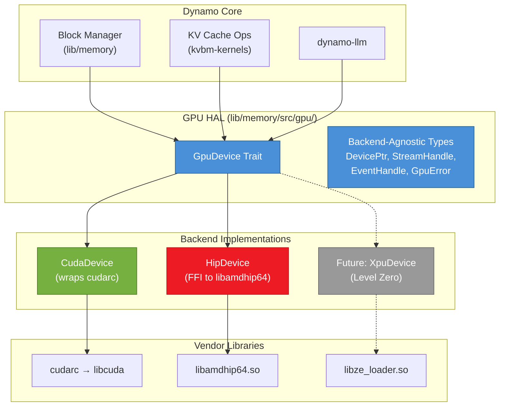
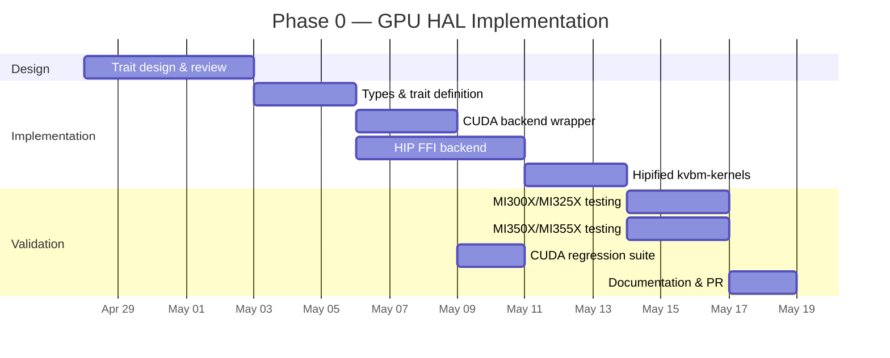
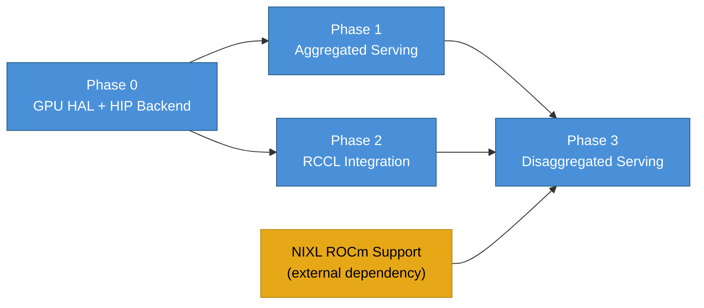

# DEP: GPU Hardware Abstraction Layer for Multi-Vendor Support

| Field       | Value                                                        |
|-------------|--------------------------------------------------------------|
| **Title**   | GPU Hardware Abstraction Layer for Multi-Vendor Support       |
| **Status**  | Draft                                                        |
| **Authors** | Andy Luo ([@andyluo7](https://github.com/andyluo7))         |
| **Category**| Architecture                                                 |
| **Sponsor** | TBD — seeking a maintainer sponsor from the Dynamo core team |
| **Created** | 2026-04-21                                                   |

---

## Summary

This proposal introduces a GPU Hardware Abstraction Layer (HAL) in `lib/memory` that decouples Dynamo's core infrastructure from CUDA-specific APIs. The HAL defines a `GpuDevice` trait providing a vendor-neutral interface for device management, memory allocation, stream and event operations, and asynchronous data transfers. Backend selection occurs at compile time via Cargo feature flags (`cuda`, `rocm`), ensuring zero runtime overhead on the existing CUDA path.

The initial implementation delivers a HIP/ROCm backend targeting AMD Instinct MI300X/MI325X (gfx942, CDNA3) and MI350X/MI355X (gfx950, CDNA4) GPUs, along with hipified compute kernels for the `kvbm-kernels` crate. This work is purely additive — no existing APIs, behaviors, or test suites are modified.

---

## Motivation

Dynamo's own documentation states its multi-vendor intent explicitly:

> *"Support for non-NVIDIA hardware is also available: Dynamo is working with HW vendors such as Intel and AMD to extend hardware support."*
> — [Dynamo Documentation](https://docs.dynamo.nvidia.com/)

Several artifacts in the codebase already anticipate AMD hardware:

- **Issue [#6242](https://github.com/ai-dynamo/dynamo/issues/6242)** ("feat: extend GPU model to system identifier mapping") defines a `GPUSKUType` enum that includes `mi200` and `mi300` variants alongside NVIDIA SKUs.
- **Issue [#3604](https://github.com/ai-dynamo/dynamo/issues/3604)** ("[FEATURE]: Does dynamo support AMD GPUs?") demonstrates direct community demand for AMD GPU support.
- The Kubernetes operator's GPU model registry already provisions for AMD Instinct identifiers.

However, the current implementation has no abstraction between Dynamo's core logic and CUDA-specific APIs. An analysis of the Rust source tree reveals **203 files with direct `cudarc` dependencies**, with GPU operations — device initialization, memory allocation, stream synchronization, and kernel dispatch — invoked inline throughout the codebase rather than through a common interface.

This tight coupling means that adding support for any non-CUDA platform requires either:

1. Forking and modifying every call site (fragile, unmaintainable), or
2. Introducing a clean abstraction layer first (this proposal).

Option 2 is the principled approach. A well-designed HAL benefits the entire project — it enforces separation of concerns, simplifies testing, and establishes the foundation for Intel XPU and future accelerator support without repeated refactoring.

---

## Goals

1. **Enable AMD Instinct GPU support.** Dynamo MUST be buildable and runnable on AMD Instinct MI300X/MI325X and MI350X/MI355X GPUs using vLLM-ROCm and SGLang-ROCm inference backends.

2. **Zero performance impact on CUDA.** The existing CUDA code path MUST NOT incur any additional overhead — no vtable dispatch, no runtime branching, no additional allocations.

3. **Clean separation of concerns.** All GPU operations MUST be accessed through a single trait interface (`GpuDevice`). Direct `cudarc` calls in new code SHOULD go through the HAL.

4. **Compile-time backend selection.** Exactly one GPU backend MUST be active per build, selected via Cargo feature flags. This matches Dynamo's existing pattern of compile-time configuration.

5. **Foundation for future vendors.** The trait design MUST be general enough to accommodate Intel XPU (Level Zero) and other accelerator platforms without breaking changes.

---

## Non-Goals

The following items are explicitly out of scope for this proposal:

- **Full disaggregated serving on ROCm.** Disaggregated KV cache transfer depends on NIXL ROCm support, which is a separate effort tracked independently.
- **TensorRT-LLM backend on ROCm.** TensorRT-LLM is NVIDIA-proprietary and will remain CUDA-only.
- **GPU Memory Service VMM APIs.** The `hipMem` equivalents of CUDA's virtual memory management APIs require separate investigation and are not needed for the initial HAL.
- **Performance optimization and tuning.** Kernel-level optimization for AMD architectures (warp scheduling, LDS utilization, wavefront occupancy) is future work beyond the scope of the HAL itself.

---

## Requirements

| ID    | Requirement | Priority |
|-------|-------------|----------|
| REQ-1 | The HAL MUST provide a `GpuDevice` trait covering device management, memory allocation, stream/event operations, and asynchronous memory transfers. | MUST |
| REQ-2 | The CUDA backend MUST wrap existing `cudarc` APIs with zero functional change. All current behavior MUST be preserved identically. | MUST |
| REQ-3 | The ROCm backend MUST use direct FFI bindings to `libamdhip64.so`. It MUST NOT introduce additional crate dependencies beyond `libc`. | MUST |
| REQ-4 | Only one GPU backend MUST be active per build. Enabling both `cuda` and `rocm` features simultaneously MUST produce a compile-time error. | MUST |
| REQ-5 | The HAL MUST NOT change any existing public API surface. All changes MUST be purely additive. | MUST |
| REQ-6 | HIP kernels in `kvbm-kernels` MUST compile and produce correct results on both gfx942 (MI300X/MI325X) and gfx950 (MI350X/MI355X) targets. | MUST |
| REQ-7 | All existing CUDA unit tests and integration tests MUST continue to pass without modification. | MUST |
| REQ-8 | The HAL SHOULD include comprehensive documentation and usage examples. | SHOULD |
| REQ-9 | The HAL MAY provide optional runtime device enumeration for diagnostic purposes. | MAY |

---

## Proposal

### Architecture Overview

The HAL introduces a trait-based abstraction between Dynamo's core logic and vendor-specific GPU APIs. The architecture follows a layered design:



### The `GpuDevice` Trait

The trait defines 20 associated functions organized into five functional groups:

```rust
/// Hardware-agnostic GPU device interface.
///
/// Implementations provide vendor-specific GPU operations behind a common API.
/// Exactly one implementation is active per build, selected via Cargo feature flags.
pub trait GpuDevice: Send + Sync + 'static {
    // ── Device Management (4 functions) ─────────────────────────────
    
    /// Initialize the GPU context for the specified device ordinal.
    fn init(ordinal: usize) -> Result<ContextHandle, GpuError>;
    
    /// Return the number of available GPU devices.
    fn device_count() -> Result<usize, GpuError>;
    
    /// Query device properties (name, compute capability, memory size).
    fn get_properties(ordinal: usize) -> Result<DeviceProperties, GpuError>;
    
    /// Synchronize the entire device, blocking until all work completes.
    fn device_synchronize() -> Result<(), GpuError>;

    // ── Memory Management (6 functions) ──────────────────────────────
    
    /// Allocate `size` bytes of device memory.
    fn malloc(size: usize) -> Result<DevicePtr, GpuError>;
    
    /// Free a previously allocated device pointer.
    fn free(ptr: DevicePtr) -> Result<(), GpuError>;
    
    /// Copy `size` bytes from host to device.
    fn memcpy_h2d(dst: DevicePtr, src: *const u8, size: usize) -> Result<(), GpuError>;
    
    /// Copy `size` bytes from device to host.
    fn memcpy_d2h(dst: *mut u8, src: DevicePtr, size: usize) -> Result<(), GpuError>;
    
    /// Copy `size` bytes between device pointers.
    fn memcpy_d2d(dst: DevicePtr, src: DevicePtr, size: usize) -> Result<(), GpuError>;
    
    /// Set `size` bytes of device memory to `value`.
    fn memset(ptr: DevicePtr, value: u8, size: usize) -> Result<(), GpuError>;

    // ── Async Memory Operations (3 functions) ────────────────────────
    
    /// Asynchronously copy `size` bytes from host to device on `stream`.
    fn memcpy_h2d_async(
        dst: DevicePtr, src: *const u8, size: usize, stream: StreamHandle,
    ) -> Result<(), GpuError>;
    
    /// Asynchronously copy `size` bytes from device to host on `stream`.
    fn memcpy_d2h_async(
        dst: *mut u8, src: DevicePtr, size: usize, stream: StreamHandle,
    ) -> Result<(), GpuError>;
    
    /// Asynchronously copy `size` bytes between device pointers on `stream`.
    fn memcpy_d2d_async(
        dst: DevicePtr, src: DevicePtr, size: usize, stream: StreamHandle,
    ) -> Result<(), GpuError>;

    // ── Stream Management (3 functions) ──────────────────────────────
    
    /// Create a new execution stream.
    fn stream_create() -> Result<StreamHandle, GpuError>;
    
    /// Destroy an execution stream.
    fn stream_destroy(stream: StreamHandle) -> Result<(), GpuError>;
    
    /// Block the host until all operations on `stream` complete.
    fn stream_synchronize(stream: StreamHandle) -> Result<(), GpuError>;

    // ── Event Management (4 functions) ───────────────────────────────
    
    /// Create a new event.
    fn event_create() -> Result<EventHandle, GpuError>;
    
    /// Destroy an event.
    fn event_destroy(event: EventHandle) -> Result<(), GpuError>;
    
    /// Record an event on the specified stream.
    fn event_record(event: EventHandle, stream: StreamHandle) -> Result<(), GpuError>;
    
    /// Block until the event has been recorded (completed).
    fn event_synchronize(event: EventHandle) -> Result<(), GpuError>;
}
```

### Backend-Agnostic Types

All types used in the trait interface are vendor-neutral wrappers:

```rust
// lib/memory/src/gpu/types.rs

/// Opaque device memory pointer.
#[derive(Debug, Clone, Copy, PartialEq, Eq, Hash)]
#[repr(transparent)]
pub struct DevicePtr(pub *mut std::ffi::c_void);

// SAFETY: DevicePtr wraps a GPU device pointer, which is a numeric address
// valid across threads. The GPU driver handles synchronization.
unsafe impl Send for DevicePtr {}
unsafe impl Sync for DevicePtr {}

/// Opaque stream handle.
#[derive(Debug, Clone, Copy, PartialEq, Eq, Hash)]
#[repr(transparent)]
pub struct StreamHandle(pub *mut std::ffi::c_void);

unsafe impl Send for StreamHandle {}
unsafe impl Sync for StreamHandle {}

/// Opaque event handle.
#[derive(Debug, Clone, Copy, PartialEq, Eq, Hash)]
#[repr(transparent)]
pub struct EventHandle(pub *mut std::ffi::c_void);

unsafe impl Send for EventHandle {}
unsafe impl Sync for EventHandle {}

/// Opaque device context handle.
#[derive(Debug, Clone, Copy, PartialEq, Eq, Hash)]
#[repr(transparent)]
pub struct ContextHandle(pub *mut std::ffi::c_void);

unsafe impl Send for ContextHandle {}
unsafe impl Sync for ContextHandle {}

/// Unified error type for GPU operations.
#[derive(Debug, thiserror::Error)]
pub enum GpuError {
    #[error("GPU operation failed: {operation} (vendor error code: {code})")]
    OperationFailed { operation: &'static str, code: i32 },

    #[error("Invalid device ordinal: {ordinal} (available: {available})")]
    InvalidDevice { ordinal: usize, available: usize },

    #[error("Out of device memory: requested {requested} bytes")]
    OutOfMemory { requested: usize },

    #[error("Driver not initialized or not found")]
    DriverNotFound,

    #[error("Invalid argument: {detail}")]
    InvalidArgument { detail: String },
}

/// Device properties queryable through the HAL.
#[derive(Debug, Clone)]
pub struct DeviceProperties {
    pub name: String,
    pub total_memory: usize,
    pub compute_capability_major: u32,
    pub compute_capability_minor: u32,
    pub multi_processor_count: u32,
    pub max_threads_per_block: u32,
    pub warp_size: u32,
    pub max_shared_memory_per_block: usize,
}
```

### Feature Flag Design

Backend selection uses Cargo feature flags with compile-time mutual exclusion:

```toml
# lib/memory/Cargo.toml (additions)

[features]
default = ["cuda"]
cuda = ["dep:cudarc"]
rocm = []

# Existing cudarc dependency becomes optional
[dependencies]
cudarc = { version = "0.12", optional = true }
libc = "0.2"
thiserror = "1"
```

The module root enforces mutual exclusion:

```rust
// lib/memory/src/gpu/mod.rs

#[cfg(all(feature = "cuda", feature = "rocm"))]
compile_error!(
    "Features `cuda` and `rocm` are mutually exclusive. \
     Enable exactly one GPU backend."
);

#[cfg(not(any(feature = "cuda", feature = "rocm")))]
compile_error!(
    "No GPU backend selected. Enable either the `cuda` or `rocm` feature."
);

pub mod types;

#[cfg(feature = "cuda")]
mod cuda;
#[cfg(feature = "cuda")]
pub use cuda::CudaDevice as GpuBackend;

#[cfg(feature = "rocm")]
mod hip;
#[cfg(feature = "rocm")]
pub use hip::HipDevice as GpuBackend;
```

This design provides a single concrete type `GpuBackend` at any compilation, enabling full monomorphization with zero dynamic dispatch.

### Directory Structure

All new files are additive. No existing files are moved or renamed.

```
lib/memory/
├── src/
│   └── gpu/                    # NEW — GPU HAL module
│       ├── mod.rs              # Trait definition, feature-flag routing
│       ├── types.rs            # Backend-agnostic types
│       ├── cuda.rs             # CUDA backend (wraps cudarc)
│       └── hip.rs              # HIP/ROCm backend (FFI to libamdhip64)
│
lib/kvbm-kernels/
├── hip/                        # NEW — HIP kernel sources
│   └── tensor_kernels.hip      # Hipified permute/transpose kernels
├── build.rs                    # MODIFIED — add ROCm compilation path
└── src/
    └── lib.rs                  # MODIFIED — conditional kernel loading
```

### Integration with Existing Code

The HAL does NOT require rewriting existing `cudarc` call sites immediately. Instead, it provides a migration path:

1. **Phase 0 (this DEP):** The HAL module exists alongside existing code. New code SHOULD use the HAL. Existing code continues to use `cudarc` directly.

2. **Phase 1 (future):** Critical paths (block manager, KV cache operations) are migrated to use `GpuBackend` instead of direct `cudarc` calls. This migration is incremental — each call site can be converted independently.

3. **Long-term:** All GPU operations go through the HAL. Direct `cudarc` usage is limited to the CUDA backend implementation itself.

This incremental approach avoids a disruptive "big bang" refactor while establishing the architectural direction.

---

## Implementation Details

### HIP FFI Bindings

The ROCm backend uses raw FFI to `libamdhip64.so`, avoiding external binding crates:

```rust
// lib/memory/src/gpu/hip.rs (excerpt)

#[link(name = "amdhip64")]
extern "C" {
    fn hipInit(flags: u32) -> i32;
    fn hipGetDeviceCount(count: *mut i32) -> i32;
    fn hipSetDevice(device_id: i32) -> i32;
    fn hipDeviceSynchronize() -> i32;
    fn hipGetDeviceProperties(prop: *mut HipDeviceProperties, device_id: i32) -> i32;

    fn hipMalloc(ptr: *mut *mut std::ffi::c_void, size: usize) -> i32;
    fn hipFree(ptr: *mut std::ffi::c_void) -> i32;
    fn hipMemcpy(
        dst: *mut std::ffi::c_void,
        src: *const std::ffi::c_void,
        size: usize,
        kind: i32,
    ) -> i32;
    fn hipMemcpyAsync(
        dst: *mut std::ffi::c_void,
        src: *const std::ffi::c_void,
        size: usize,
        kind: i32,
        stream: *mut std::ffi::c_void,
    ) -> i32;
    fn hipMemset(ptr: *mut std::ffi::c_void, value: i32, size: usize) -> i32;

    fn hipStreamCreate(stream: *mut *mut std::ffi::c_void) -> i32;
    fn hipStreamDestroy(stream: *mut std::ffi::c_void) -> i32;
    fn hipStreamSynchronize(stream: *mut std::ffi::c_void) -> i32;

    fn hipEventCreate(event: *mut *mut std::ffi::c_void) -> i32;
    fn hipEventDestroy(event: *mut std::ffi::c_void) -> i32;
    fn hipEventRecord(event: *mut std::ffi::c_void, stream: *mut std::ffi::c_void) -> i32;
    fn hipEventSynchronize(event: *mut std::ffi::c_void) -> i32;
}

/// HIP memory copy direction constants.
const HIP_MEMCPY_HOST_TO_DEVICE: i32 = 1;
const HIP_MEMCPY_DEVICE_TO_HOST: i32 = 2;
const HIP_MEMCPY_DEVICE_TO_DEVICE: i32 = 3;
```

### HipDeviceProperties Structure

The `hipDeviceProperties_t` struct requires careful layout matching. ROCm 7.x has expanded this structure; we use a 2048-byte padded representation for forward compatibility:

```rust
/// HIP device properties with forward-compatible padding.
///
/// The upstream `hipDeviceProperties_t` struct has grown across ROCm releases
/// (5.x: ~790 bytes, 6.x: ~900 bytes, 7.x: ~1100 bytes). We allocate 2048
/// bytes to accommodate future fields without breaking ABI compatibility.
/// Only fields at stable offsets (verified against ROCm 6.0–7.1) are read.
#[repr(C)]
struct HipDeviceProperties {
    name: [u8; 256],           // offset 0x000
    total_global_mem: usize,   // offset 0x100
    _pad1: [u8; 40],
    max_threads_per_block: i32,// offset 0x130
    _pad2: [u8; 28],
    warp_size: i32,            // offset 0x150
    _pad3: [u8; 60],
    multi_processor_count: i32,// offset 0x190
    major: i32,                // offset 0x194
    minor: i32,                // offset 0x198
    _pad4: [u8; 52],
    max_shared_memory_per_block: usize, // offset 0x1D0
    _tail: [u8; 1576],        // pad to 2048 bytes total
}

impl Default for HipDeviceProperties {
    fn default() -> Self {
        // SAFETY: All-zeros is a valid representation for this POD struct.
        unsafe { std::mem::zeroed() }
    }
}
```

> **Note:** Field offsets are validated against the ROCm 6.0, 6.2, 7.0, and 7.1 headers. The padding strategy ensures that `hipGetDeviceProperties` can write its full struct without overflowing our buffer, even if future ROCm versions add fields.

### Error Code Mapping

HIP error codes are mapped to the unified `GpuError` type:

```rust
/// Convert a HIP error code to a GpuError.
///
/// Error codes follow the hipError_t enum defined in hip_runtime_api.h.
fn check_hip(code: i32, operation: &'static str) -> Result<(), GpuError> {
    match code {
        0 => Ok(()),  // hipSuccess
        2 => Err(GpuError::OutOfMemory { requested: 0 }),  // hipErrorOutOfMemory
        101 => Err(GpuError::InvalidDevice { ordinal: 0, available: 0 }),
        700 | 719 => Err(GpuError::OperationFailed { operation, code }),
        _ => Err(GpuError::OperationFailed { operation, code }),
    }
}
```

### Thread Safety Model

GPU operations have specific threading constraints that the HAL documents and enforces:

- **Device pointers** (`DevicePtr`) are numeric addresses valid across threads. The GPU driver serializes access through streams.
- **Streams** (`StreamHandle`) provide ordering guarantees. Operations on the same stream execute in order; operations on different streams may execute concurrently.
- **Events** (`EventHandle`) synchronize across streams and between host and device.
- The `GpuDevice` trait requires `Send + Sync`, meaning implementations MUST be safe to use from multiple threads. Both CUDA and HIP drivers are thread-safe at the API level.
- **Context binding:** HIP follows CUDA's context model — each thread maintains a current device context. The HAL's `init` function binds the context for the calling thread.

### Hipified Kernels

The `kvbm-kernels` crate contains CUDA kernels for tensor permutation operations used in KV cache block management. These are translated to HIP:

```cpp
// lib/kvbm-kernels/hip/tensor_kernels.hip

#include <hip/hip_runtime.h>

/// Permute tensor data for KV cache block layout.
///
/// Transforms [num_blocks, block_size, num_heads, head_dim] to
/// [num_blocks, num_heads, block_size, head_dim] for cache-friendly access.
template <typename T>
__global__ void permute_blocks_kernel(
    const T* __restrict__ input,
    T* __restrict__ output,
    int num_blocks,
    int block_size,
    int num_heads,
    int head_dim)
{
    const int tid = blockIdx.x * blockDim.x + threadIdx.x;
    const int total = num_blocks * block_size * num_heads * head_dim;
    if (tid >= total) return;

    const int d = tid % head_dim;
    const int h = (tid / head_dim) % num_heads;
    const int s = (tid / (head_dim * num_heads)) % block_size;
    const int b = tid / (head_dim * num_heads * block_size);

    const int out_idx = b * (num_heads * block_size * head_dim)
                      + h * (block_size * head_dim)
                      + s * head_dim
                      + d;

    output[out_idx] = input[tid];
}

// Explicit instantiations for supported types.
template __global__ void permute_blocks_kernel<__half>(
    const __half*, __half*, int, int, int, int);
template __global__ void permute_blocks_kernel<__hip_bfloat16>(
    const __hip_bfloat16*, __hip_bfloat16*, int, int, int, int);
template __global__ void permute_blocks_kernel<float>(
    const float*, float*, int, int, int, int);
```

### Dual-Backend Build Support

The `kvbm-kernels` build script is extended to compile HIP kernels when the `rocm` feature is active:

```rust
// lib/kvbm-kernels/build.rs (ROCm additions)

#[cfg(feature = "rocm")]
fn build_hip_kernels() {
    let rocm_path = std::env::var("ROCM_PATH")
        .unwrap_or_else(|_| "/opt/rocm".to_string());

    let hipcc = format!("{}/bin/hipcc", rocm_path);

    // Detect target GPU architecture
    let gpu_targets = std::env::var("GPU_TARGETS")
        .unwrap_or_else(|_| "gfx942;gfx950".to_string());

    let offload_args: Vec<String> = gpu_targets
        .split(';')
        .map(|arch| format!("--offload-arch={}", arch))
        .collect();

    let status = std::process::Command::new(&hipcc)
        .args(&offload_args)
        .args(&["-c", "-fPIC", "-O3"])
        .arg("-o").arg("hip_tensor_kernels.o")
        .arg("hip/tensor_kernels.hip")
        .status()
        .expect("Failed to invoke hipcc. Is ROCm installed?");

    assert!(status.success(), "hipcc compilation failed");

    // Link the compiled object
    println!("cargo:rustc-link-search=native={}", std::env::var("OUT_DIR").unwrap());
    println!("cargo:rustc-link-lib=static=hip_tensor_kernels");

    // Link HIP runtime
    println!("cargo:rustc-link-search=native={}/lib", rocm_path);
    println!("cargo:rustc-link-lib=dylib=amdhip64");
}
```

---

## Implementation Phases

### Phase 0: GPU HAL + HIP Backend + Hipified Kernels *(This DEP)*

| Attribute   | Detail |
|-------------|--------|
| **Scope**   | `GpuDevice` trait, `CudaDevice` wrapper, `HipDevice` FFI backend, hipified `kvbm-kernels` |
| **Size**    | ~2,000 lines of Rust and HIP, purely additive |
| **Effort**  | 2–3 weeks, 1 engineer |
| **Deliverables** | `lib/memory/src/gpu/` module, `lib/kvbm-kernels/hip/` directory |
| **Testing** | Unit tests for both backends; validated on MI300X/MI325X (gfx942) and MI350X/MI355X (gfx950) |
| **Risk**    | Low — no existing code is modified; new module can be developed and tested independently |



### Phase 1: Aggregated Serving with vLLM-ROCm

- Migrate `dynamo-llm` block manager from direct `cudarc` calls to the `GpuBackend` trait.
- Adapt `dynamo.vllm` Python backend to detect and configure for ROCm.
- Replace NVML device enumeration with ROCm SMI (`librocm_smi64.so`) for GPU discovery and health monitoring.
- **Effort:** 4–6 weeks, 1–2 engineers.

### Phase 2: NCCL → RCCL for Distributed Operations

- Develop Rust FFI bindings for RCCL ([`ROCm/rccl`](https://github.com/ROCm/rccl)), AMD's API-compatible replacement for NCCL.
- Extend the HAL with a `CollectiveOps` trait for allreduce, allgather, and broadcast primitives.
- Port the distributed block manager to use the `CollectiveOps` abstraction.
- **Effort:** 3–4 weeks, 1 engineer.

### Phase 3: Disaggregated Serving *(Dependent on NIXL ROCm Support)*

- Collaborate with the NIXL team to enable ROCm transport support. UCX, which NIXL uses for data transfer, already supports ROCm memory registration.
- Enable multi-node KV cache transfers across ROCm devices.
- Validate disaggregated prefill/decode workflows on multi-node MI300X/MI325X clusters.
- **Effort:** 8–12 weeks, 2 engineers.

### Phase Dependency Graph



---

## Alternate Solutions Considered

### Alternative 1: Fork `cudarc` and Add HIP Backend

**Approach:** Fork the [`cudarc`](https://github.com/coreylowman/cudarc) crate and extend it with HIP support, providing a single unified crate for both CUDA and ROCm.

| Pros | Cons |
|------|------|
| Single crate for all backends | `cudarc` is actively developed; fork divergence is inevitable |
| Familiar API for existing contributors | Upstream is unlikely to accept HIP — the crate's stated scope is CUDA |
| No new trait required | `cudarc`'s API surface is large; wrapping all of it for HIP is disproportionate effort |

**Decision:** Rejected. Maintaining a fork of an actively-changing third-party crate creates long-term maintenance burden. An abstraction above `cudarc` is more sustainable — it isolates Dynamo from upstream API changes while keeping the CUDA backend as a thin wrapper.

### Alternative 2: Use the `hip-sys` Crate

**Approach:** Use the [`hip-sys`](https://crates.io/crates/hip-sys) crate for pre-built Rust bindings to the HIP API.

| Pros | Cons |
|------|------|
| Pre-generated bindings | Crate is immature; last published version may lag ROCm releases |
| Less boilerplate | Missing coverage for several HIP APIs needed by Dynamo |
| Community-maintained | Adds an external dependency for a critical path |

**Decision:** Rejected. Direct FFI declarations for the ~20 HIP functions needed are straightforward, have zero external dependencies, and can be precisely matched to the ROCm version deployed in production. This eliminates supply-chain risk and version-skew issues.

### Alternative 3: Runtime GPU Detection (No Compile-Time Flags)

**Approach:** Build a single binary that detects the available GPU platform at runtime and dispatches through a vtable.

| Pros | Cons |
|------|------|
| Single binary for all platforms | Runtime overhead from dynamic dispatch on every GPU call |
| Simpler CI — one build artifact | Complex error handling for missing drivers |
| | Larger binary size (links both CUDA and HIP libraries) |
| | Inconsistent with Dynamo's existing compile-time configuration patterns |

**Decision:** Rejected. Dynamo already uses compile-time feature flags extensively (e.g., for NCCL, TensorRT-LLM integration). A runtime dispatch model would be architecturally inconsistent and would introduce measurable overhead in performance-critical memory transfer paths.

---

## Background and References

### Project References

| Source | Description |
|--------|-------------|
| [Dynamo Documentation](https://docs.dynamo.nvidia.com/) | Official docs stating multi-vendor hardware support intent |
| [Issue #3604](https://github.com/ai-dynamo/dynamo/issues/3604) | Community feature request: "Does dynamo support AMD GPUs?" |
| [Issue #6242](https://github.com/ai-dynamo/dynamo/issues/6242) | GPU model-to-identifier mapping extension including MI200 and MI300 |

### Technical References

| Source | Description |
|--------|-------------|
| [HIP Programming Guide](https://rocm.docs.amd.com/projects/HIP/en/latest/) | AMD's HIP API reference and porting guide |
| [ROCm Documentation](https://rocm.docs.amd.com/) | AMD ROCm platform documentation |
| [RCCL](https://github.com/ROCm/rccl) | ROCm Communication Collectives Library (NCCL equivalent) |
| [NIXL](https://github.com/ai-dynamo/nixl) | NVIDIA Inference Xfer Library for disaggregated GPU data transfers |
| [`cudarc`](https://github.com/coreylowman/cudarc) | Third-party Rust crate providing safe CUDA bindings |

### AMD GPU Platforms

| GPU | ISA | Architecture | VRAM | Target Workload |
|-----|-----|-------------|------|-----------------|
| Instinct MI300X/MI325X | gfx942 | CDNA3 | 192–256 GB HBM3/HBM3e | Large-scale LLM inference |
| Instinct MI350X/MI355X | gfx950 | CDNA4 | 256–288 GB HBM3e | Next-gen LLM inference |

---

## Terminology

| Term | Definition |
|------|-----------|
| **HAL** | Hardware Abstraction Layer — a trait-based interface that decouples GPU operations from specific vendor APIs, enabling compile-time backend selection. |
| **HIP** | Heterogeneous-Compute Interface for Portability — AMD's GPU programming API, designed to be source-compatible with CUDA for simplified porting. |
| **ROCm** | Radeon Open Compute platform — AMD's open-source GPU computing software stack, including compilers, runtimes, libraries, and tools. |
| **cudarc** | A third-party Rust crate providing safe, idiomatic bindings to CUDA Driver and Runtime APIs, used extensively throughout Dynamo's Rust codebase. |
| **gfx942** | The GPU ISA target for AMD Instinct MI300X/MI325X, based on the CDNA3 microarchitecture. |
| **gfx950** | The GPU ISA target for AMD Instinct MI350X/MI355X, based on the CDNA4 microarchitecture. |
| **RCCL** | ROCm Communication Collectives Library — AMD's equivalent of NVIDIA's NCCL, providing optimized collective operations (allreduce, allgather, broadcast) for multi-GPU communication. |
| **NIXL** | NVIDIA Inference Xfer Library — a library for efficient GPU-to-GPU data transfers in disaggregated serving architectures, currently CUDA-only. |
| **CDNA** | Compute DNA — AMD's GPU architecture family designed for data center compute workloads (distinct from RDNA for graphics). |
| **FFI** | Foreign Function Interface — the mechanism by which Rust code calls functions in C/C++ shared libraries (e.g., `libamdhip64.so`). |

---

## Appendix A: Existing cudarc Usage Analysis

To quantify the scope of CUDA coupling in the Dynamo codebase, we surveyed all Rust source files for `cudarc` imports:

| Component | Files with `cudarc` | Primary Usage |
|-----------|---------------------|---------------|
| `lib/memory` | 12 | Device memory allocation, async transfers, stream management |
| `lib/kvbm-kernels` | 4 | Kernel loading and dispatch |
| `components/dynamo-llm` | 8 | Block manager, KV cache operations |
| `lib/bindings` | 6 | Python-Rust bridge for GPU tensors |
| Other | ~173 | Transitive imports, utilities, tests |
| **Total** | **~203** | |

The HAL's Phase 0 scope targets `lib/memory` and `lib/kvbm-kernels` — the lowest-level GPU abstraction points. Higher-level components will migrate in subsequent phases.

---

## Appendix B: Build and Test Instructions

### Building with CUDA Backend (Default)

```bash
cargo build                          # Uses default "cuda" feature
cargo build --features cuda          # Explicit
cargo test --features cuda           # Run all tests
```

### Building with ROCm Backend

```bash
# Requires ROCm 6.0+ installed at /opt/rocm (or set ROCM_PATH)
cargo build --no-default-features --features rocm
cargo test --no-default-features --features rocm

# Target specific GPU architectures
GPU_TARGETS="gfx942" cargo build --no-default-features --features rocm   # MI300X/MI325X only
GPU_TARGETS="gfx942;gfx950" cargo build --no-default-features --features rocm  # Both
```

### Verifying Mutual Exclusion

```bash
# This MUST fail at compile time
cargo build --features cuda,rocm
# Expected: error[E0080]: "Features `cuda` and `rocm` are mutually exclusive."
```
