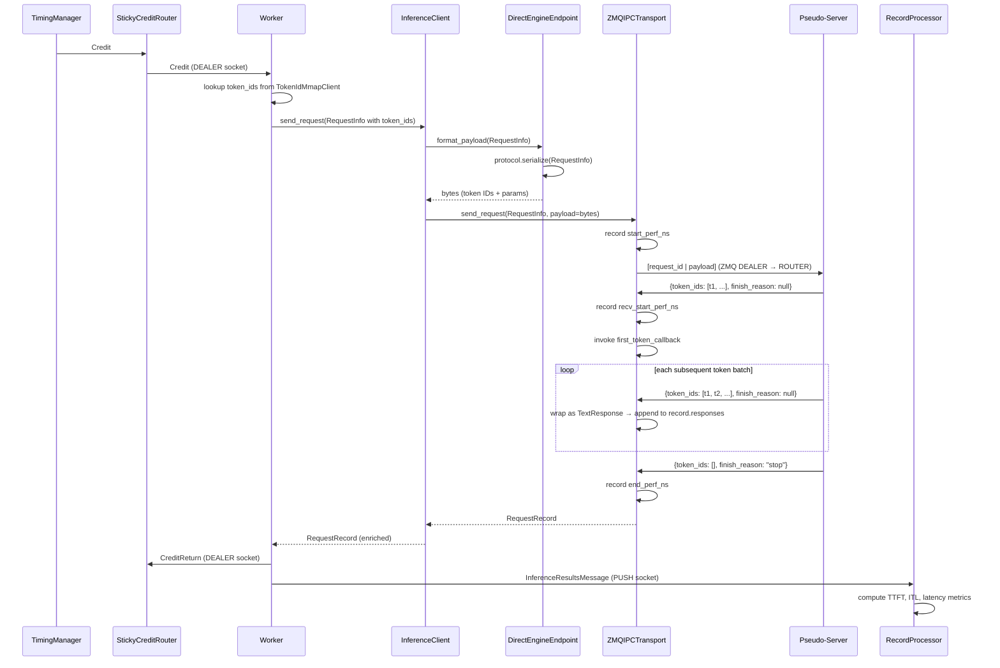
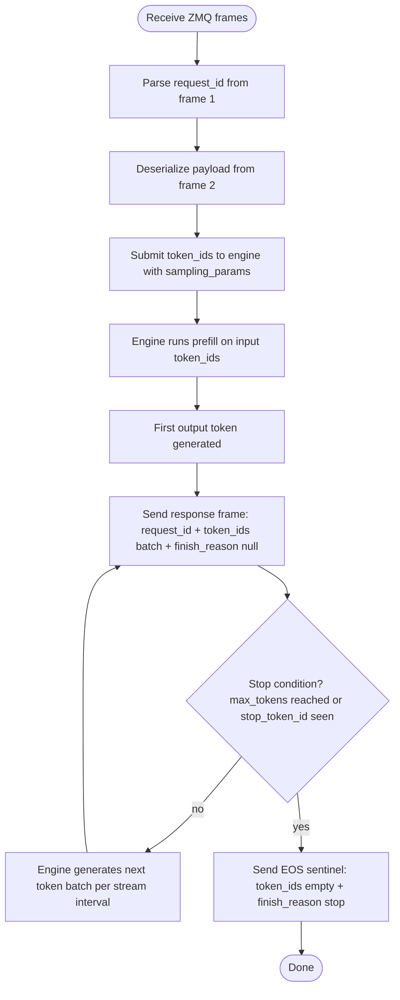

**Status**: Draft

**Authors**: [@FrankD412](https://github.com/FrankD412)

**Category**: Benchmarking

**Replaces**: N/A

**Replaced By**: N/A

**Sponsor**: [@ganeshku1](https://github.com/ganeshku1)

**Required Reviewers**: [@debermudez](https://github.com/debermudez), [@ajcasagrande](https://github.com/ajcasagrande)

**Review Date**: TBD

**Pull Request**: N/A

**Implementation PR / Tracking Issue**: N/A

# Summary

Add support for benchmarking inference engines directly via IPC, bypassing HTTP. AIPerf connects to a framework-managed pseudo-server over ZMQ and sends pre-tokenized requests using a versioned, aiperf-native wire protocol. The control plane, credit loop, record processing, and analytic plane are untouched. Pre-tokenization runs in the `DatasetManager` during the configure phase and is stored as two parallel mmap files alongside `dataset.dat`; workers look up token IDs at request time with no hot-path tokenization overhead.

# Value Proposition

Direct engine benchmarking addresses limitations inherent to HTTP-based benchmarking:

**Measurement accuracy** — HTTP adds variable latency at every measurement point: TCP framing, aiohttp processing, SSE parsing, and chunked transfer encoding. For TTFT, the HTTP stack is part of what gets measured even with keep-alive. For ITL, each token chunk passes through the server's ASGI layer before hitting the wire, adding noise that varies under load. ZMQ IPC overhead is ~5µs per frame vs. potentially milliseconds of HTTP stack variance — a meaningful difference when characterizing sub-10ms TTFT or measuring scheduler jitter.

**Engine isolation** — HTTP inference servers sit on top of considerable middleware: connection pooling, request routing, OpenAI schema validation, and async queuing. Benchmarking through HTTP measures the full stack, not the engine. Direct benchmarking removes the server layer, giving a clean read on inference kernel throughput, scheduling efficiency, and KV cache behavior.

**Input reproducibility** — Going through HTTP means the server re-tokenizes the prompt. Even with the same tokenizer version, edge cases around special tokens, chat templates, and whitespace handling can cause input length to differ from what was intended. Sending token IDs directly guarantees exact input length reproducibility across runs and across frameworks, which is essential for controlled head-to-head engine comparisons.

**Access to unexposed engine features** — Some engine capabilities are not surfaced through the HTTP API: experimental schedulers, custom attention backends, draft model configurations in speculative decoding, and per-request KV cache controls. Direct access allows benchmarking these without waiting for HTTP API support.

**Reduced resource contention** — The HTTP server process competes with the engine for CPU, memory bandwidth, and NUMA-local memory. Eliminating the server process reduces noise in GPU utilization and throughput telemetry.

# Goals

1. No direct coupling between aiperf and any engine framework — no optional imports, no shared dependencies, no integration test burden.
2. Pseudo-servers are user-managed processes; aiperf connects to them like it connects to a running vLLM server.
3. Pre-tokenization happens in aiperf using existing `TokenizerConfig` infrastructure; pseudo-servers stay lightweight.
4. The wire protocol is versioned and defined in a standalone module within aiperf; pseudo-server authors implement only the published spec.
5. The endpoint is protocol-agnostic and configurable; swapping protocols requires only a metadata change.

# Non-Goals

- AIPerf will not launch, manage, or monitor pseudo-server processes.
- AIPerf will not ship pseudo-server implementations for any specific engine (possibly provide a reference implementation).
- No integration tests against real engines in the aiperf test suite.
- Multi-turn conversation support is out of scope; only single-turn datasets are supported in this iteration. `DatasetManager` validates this constraint at configure time and raises an error if multi-turn conversations are present when `endpoint == direct_engine`.
- Token decoding (token IDs → natural language text) for response inspection is out of scope. `parse_response` populates `ParsedResponse` with output token count only; text reconstruction is deferred to a future iteration.

# Architecture

Direct engine benchmarking slots into the data plane only. The control plane (`TimingManager`, `StickyCreditRouter`, `WorkerManager`) and analytic plane (`RecordProcessor`, `RecordsManager`, `GPUTelemetryManager`) are unchanged. `InferenceClient` is unchanged. `DatasetManager` gains a conditional tokenization pass. `Worker` gains a token ID mmap lookup. The transport and endpoint plugins are new.

## End-to-End Communication Path



## Pseudo-Server Internal Data Path

This shows how a typical pseudo-server implementation might handle a request. Pseudo-server authors are free to implement this however they choose as long as they conform to the wire protocol.



## New Module Structure

```
src/aiperf/direct_engine/
    protocols/
        base.py          # BaseEngineProtocol ABC + module-level registry
        token_ids_v1.py  # first concrete protocol implementation
    endpoint.py          # DirectEngineEndpoint plugin
    transport.py         # ZMQIPCTransport plugin
    token_id_mmap.py     # TokenIdMmapWriter + TokenIdMmapClient
```

# Pre-Tokenization Pipeline

Pre-tokenization runs once during the configure phase in `DatasetManager`, before profiling begins. Workers perform a zero-overhead mmap lookup per request — no tokenization in the hot path.

## New CLI Flag

`--tokenizer-apply-chat-template` (bool, default `False`) added to `TokenizerConfig`. When `True`, tokenization calls `tokenizer.apply_chat_template([{"role": "user", "content": prompt}], tokenize=True)` instead of `tokenizer.encode(prompt)`. This ensures the token IDs match what the engine would receive after chat template application, which is required for correct input length reproducibility on instruction-tuned models.

For turns with multiple `Text` media items, text content is concatenated in order before tokenization.

## DatasetManager Tokenization Pass

When the configured endpoint type is `direct_engine`, `DatasetManager._configure_dataset()` performs two additional steps after writing `dataset.dat`:

1. **Tokenizer initialization** — `DatasetManager` calls `_configure_tokenizer()` unconditionally when `endpoint == direct_engine`, regardless of the `tokenizes_input` endpoint metadata flag (which is `false` for `direct_engine` since tokenization happens in the dataset pipeline, not the endpoint). This ensures `self.tokenizer` is available for the tokenization pass.

2. **Single-turn validation** — `DatasetManager` validates that every conversation in the loaded dataset has exactly one turn. If any conversation has more than one turn, it raises a `ValueError` with a message indicating that `direct_engine` requires a single-turn dataset. This prevents silent correctness failures where later turns would receive incorrect token IDs.

3. **Tokenization and write** — For each conversation, DatasetManager assembles the first turn's text content, tokenizes it using the configured tokenizer, and writes the resulting `list[int]` to `token_ids.dat` via `TokenIdMmapWriter`.

## Parallel Mmap Files

`token_ids.dat` and `token_ids_index.dat` follow the same mmap pattern as `dataset.dat` / `index.dat`. `TokenIdMmapWriter` and `TokenIdMmapClient` live in `src/aiperf/direct_engine/token_id_mmap.py`.

- Each entry in `token_ids.dat` is an `orjson`-serialized `list[int]`.
- `token_ids_index.dat` stores a JSON index of `{conversation_id: {offset, size}}` for zero-copy lookup.
- Both files are written to the same mmap directory as `dataset.dat`.

Token ID mmap paths are communicated to workers via `MemoryMapClientMetadata`, not as a top-level field on `DatasetConfiguredNotification`. `MemoryMapClientMetadata` gains two new optional fields:

```python
token_ids_data_file_path: Path | None = None
token_ids_index_file_path: Path | None = None
```

Both fields are `None` for all non-`direct_engine` runs. Workers that receive non-null paths open a `TokenIdMmapClient`; workers on HTTP runs skip this entirely with no behavioral change.

## Worker Token ID Lookup

When `MemoryMapClientMetadata.token_ids_data_file_path` is set, the Worker opens a `TokenIdMmapClient` at configure time. For each credit, the Worker looks up token IDs by `conversation_id` before building `RequestInfo`. The result is stored in `RequestInfo.token_ids: list[int] | None`. If the lookup fails (missing entry), the Worker sets `record.error` and returns the credit — same error path as a failed HTTP request.

## Scope Constraint

Pre-tokenization is scoped to single-turn datasets. The token IDs for a conversation represent the full input for its one and only turn. Multi-turn support, which would require chat-template assembly across all prior turns before tokenization, is deferred. The DatasetManager enforces this at configure time rather than silently producing incorrect results.

# Components

## Protocol Module (`direct_engine/protocols/`)

`BaseEngineProtocol` is an abstract class with two methods:

```python
class BaseEngineProtocol(ABC):
    @abstractmethod
    def serialize(self, request_info: RequestInfo) -> bytes: ...

    @abstractmethod
    def deserialize(self, data: dict, cumulative_tokens: int = 0) -> ParsedResponse | None: ...
```

`serialize` produces the raw bytes payload. `deserialize` receives an already-parsed JSON dict and the running cumulative output token count accumulated by the transport so far (including the current frame). It returns a `ParsedResponse` or `None`.

For `token_ids_v1`:
- If `finish_reason` is non-null and `token_ids` is empty, the frame is the EOS sentinel — return `None`.
- If `token_ids` is empty and `finish_reason` is `null` (malformed frame), return `None`.
- Otherwise, return `ParsedResponse(text="", usage=Usage({"completion_tokens": cumulative_tokens}))`. Setting `usage.completion_tokens` to the cumulative count on every frame (not the per-frame count) ensures that `_extract_server_output_token_count`, which takes the last non-`None` value from all responses, correctly reports the total output token count. Token decoding (`text=""`) is out of scope; see Non-Goals.

The transport tracks `accumulated_tokens: int = 0` across the receive loop, incrementing by `len(data.get("token_ids", []))` before calling `deserialize`, so the cumulative count passed to each call includes the current frame's tokens.

A module-level dict registry maps protocol name strings to classes. `token_ids_v1` is the initial concrete implementation. The registry is not a plugin category — it is a simple internal lookup. It can be elevated to a full plugin category if third-party protocol support becomes necessary.

The transport receive loop drives `deserialize` calls directly; it does not pass through `parse_response`. `parse_response` is called by `InferenceClient` after `send_request` returns to extract the final `ParsedResponse` from the accumulated `record.responses`. This two-phase design is consistent with the HTTP transport.

## `DirectEngineEndpoint` (`endpoint.py`)

A `BaseEndpoint` subclass registered as endpoint plugin `direct_engine`. Its metadata carries a `protocol` field (string, default `token_ids_v1`). On construction it resolves the protocol class from the registry and instantiates it. It has no format knowledge of its own.

- `format_payload(request_info)` — raises `ValueError` with a descriptive message if `request_info.token_ids is None` (indicates misconfiguration: tokenizer not configured or wrong endpoint used with ZMQ transport); delegates to `protocol.serialize(request_info)` → returns `bytes`
- `parse_response(response: InferenceServerResponse)` — conforms to `EndpointProtocol` signature. Calls `response.get_json()` to extract the parsed dict from the `TextResponse`, then delegates to `protocol.deserialize(data)` → returns `ParsedResponse | None`
- `get_endpoint_headers` and `get_endpoint_params` return empty dicts

Endpoint metadata in `plugins.yaml`:

```yaml
endpoint:
  direct_engine:
    class: aiperf.direct_engine.endpoint:DirectEngineEndpoint
    description: Direct engine endpoint using aiperf-native IPC protocol.
    metadata:
      protocol: token_ids_v1
      endpoint_path: ""
      supports_streaming: true
      produces_tokens: true
      tokenizes_input: false
      metrics_title: Direct Engine Metrics
      service_kind: direct_engine
```

## `ZMQIPCTransport` (`transport.py`)

A `BaseTransport` subclass registered as transport plugin `zmq_ipc`. Registered URL schemes: `zmq+ipc`, `zmq+tcp`. Transport metadata in `plugins.yaml`:

```yaml
transport:
  zmq_ipc:
    class: aiperf.direct_engine.transport:ZMQIPCTransport
    description: ZMQ IPC/TCP transport for direct engine benchmarking.
    metadata:
      transport_type: zmq_ipc
      url_schemes: [zmq+ipc, zmq+tcp]
```

On `send_request`:
1. Records `start_perf_ns`
2. Sends two ZMQ frames: `[request_id_bytes | payload_bytes]`
3. Loops receiving frames; sets `recv_start_perf_ns` on first frame
4. For each received frame: decodes bytes to UTF-8 str, calls `orjson.loads` to extract the dict, calls `protocol.deserialize(data)`. If `deserialize` returns `None` (EOS sentinel or malformed frame), the frame is discarded — `recv_start_perf_ns` is not set and `first_token_callback` is not invoked if this is the first frame received. If `deserialize` returns a non-`None` `ParsedResponse`, the transport wraps the frame as `TextResponse(perf_ns=time.perf_counter_ns(), text=decoded_str)` and appends it to `record.responses`. `TextResponse.perf_ns` must be set at the moment the frame is received, not after deserialization.
5. `first_token_callback(ttft_ns, first_text_response)` is invoked on the first frame for which `deserialize` returns a non-`None` result. This supports prefill concurrency slot release, consistent with the HTTP transport. `FirstTokenCallback` in `base_transports.py` is currently typed as `Callable[[int, SSEMessage], Awaitable[bool]]`; this type alias must be broadened to `Callable[[int, InferenceServerResponse], Awaitable[bool]]` to accommodate `TextResponse` here. `recv_start_perf_ns` is also set on this first valid frame.
6. Stops on end-of-stream sentinel or error frame; sets `end_perf_ns`
7. Returns populated `RequestRecord`

ZMQ DEALER socket is created at lifecycle start (`@on_start`) and closed at lifecycle stop (`@on_stop`), connection-pooled per worker. Workers connect to the pseudo-server address derived from the `--url` flag. `get_url` returns `model_endpoint.endpoint.base_url` unchanged — the ZMQ address is consumed once at socket connect time in `@on_start`, not per request.

## User Configuration

```bash
aiperf profile \
  --url zmq+ipc:///tmp/my_engine.sock \
  --endpoint direct_engine \
  --tokenizer meta-llama/Llama-3.1-8B \
  --extra-inputs temperature:0.0 max_tokens:512
```

Or over TCP with chat template:

```bash
aiperf profile \
  --url zmq+tcp://localhost:5555 \
  --endpoint direct_engine \
  --tokenizer meta-llama/Llama-3.1-8B \
  --tokenizer-apply-chat-template \
  --extra-inputs temperature:0.0 max_tokens:512
```

`detect_transport_from_url` in `InferenceClient` dispatches to `zmq_ipc` transport based on the URL scheme. The existing guard `if parsed.scheme and not parsed.netloc` re-parses bare hostnames (e.g., `localhost:8765`) by prepending `http://`. This guard must be scoped to HTTP-family schemes only — specifically, the re-parse must be skipped when `parsed.scheme` is not in `{"http", "https"}`. This preserves the existing bare-hostname behavior for HTTP URLs while correctly handling `zmq+ipc:///tmp/my_engine.sock`, which has a scheme but no netloc by design.

# Data Flow

1. During configure phase, `DatasetManager` detects `endpoint == direct_engine`, calls `_configure_tokenizer()` to initialize `self.tokenizer`, validates all conversations are single-turn, runs a tokenization pass, and writes `token_ids.dat` + `token_ids_index.dat` alongside `dataset.dat`. Token ID mmap paths are written into `MemoryMapClientMetadata.token_ids_data_file_path` and `token_ids_index_file_path`.
2. `DatasetConfiguredNotification` carries the updated `MemoryMapClientMetadata`. Workers open a `TokenIdMmapClient` when `token_ids_data_file_path` is non-null.
3. `TimingManager` issues a credit → `StickyCreditRouter` → `Worker`.
4. Worker retrieves the dataset entry from the mmap dataset client, looks up token IDs from `TokenIdMmapClient` by `conversation_id`, and populates `RequestInfo.token_ids`.
5. Worker calls `InferenceClient.send_request(request_info)`.
6. `InferenceClient` calls `endpoint.format_payload(request_info)` → `protocol.serialize` → `bytes`.
7. `InferenceClient` calls `transport.send_request(request_info, payload=bytes)`.
8. Transport records `start_perf_ns`, sends `[request_id | payload]` over ZMQ DEALER.
9. Pseudo-server receives, runs inference, streams response frames back.
10. Transport receives frames: decodes bytes to UTF-8 str, calls `protocol.deserialize`. Discards frames where `deserialize` returns `None`. On the first valid frame, constructs `TextResponse(perf_ns=time.perf_counter_ns(), text=decoded_str)`, sets `recv_start_perf_ns`, invokes `first_token_callback`.
11. End-of-stream sentinel triggers `end_perf_ns`; transport returns `RequestRecord`.
12. `InferenceClient` enriches record; Worker pushes `InferenceResultsMessage` to `RecordProcessor`.
13. `RecordProcessor` computes TTFT, ITL, request latency, throughput — identical to HTTP path.

# Wire Protocol — `token_ids_v1`

All frames are `orjson`-serialized JSON. The protocol is identified by the string `token_ids_v1`; future versions are separate named protocols and can coexist.

## Request (aiperf → pseudo-server)

Two ZMQ frames:

- **Frame 1:** `request_id` as UTF-8 bytes
- **Frame 2:** JSON payload:

```json
{
    "request_id": "550e8400-e29b-41d4-a716-446655440000",
    "token_ids": [1234, 5678, 9012],
    "max_tokens": 512,
    "stop_token_ids": [2],
    "sampling_params": {
        "temperature": 0.0,
        "top_p": 1.0,
        "top_k": 50,
        "seed": 42,
        "repetition_penalty": 1.0
    }
}
```

- `max_tokens` and `stop_token_ids` are optional; sourced from user config or dataset entry.
- `sampling_params` is optional and opaque to aiperf. Populated from `model_endpoint.endpoint.extra` (`--extra-inputs`). Pseudo-server authors handle whatever their engine supports.

## Response frames (pseudo-server → aiperf)

One ZMQ frame per streaming iteration. Each frame may carry one or more token IDs depending on the framework's streaming interval (e.g., TRT-LLM's `streaming_token_budget`):

```json
{
    "request_id": "550e8400-e29b-41d4-a716-446655440000",
    "token_ids": [9012, 314, 7],
    "finish_reason": null
}
```

- `token_ids` is a non-empty list on mid-stream frames. Single-token-per-frame frameworks send a one-element list.
- `finish_reason` is `null` for mid-stream frames.
- A frame with `token_ids: []` and `finish_reason: null` is malformed; `deserialize` returns `None` and the transport discards it. `recv_start_perf_ns` is not set and `first_token_callback` is not invoked if this was the first frame received. The next valid (non-`None`) frame is treated as the first token for timing purposes.

## End-of-stream sentinel

```json
{
    "request_id": "550e8400-e29b-41d4-a716-446655440000",
    "token_ids": [],
    "finish_reason": "stop"
}
```

`finish_reason` non-null signals end of stream. The transport stops the receive loop and sets `end_perf_ns`.

## Error frame

```json
{
    "request_id": "550e8400-e29b-41d4-a716-446655440000",
    "error": "out of memory"
}
```

Presence of `"error"` key on any frame terminates the stream immediately. The transport sets `record.error` and returns.

# Required Changes to Existing Code

These are changes to existing files required before the new components can be implemented:

| File | Change |
|---|---|
| `src/aiperf/common/config/tokenizer_config.py` | Add `apply_chat_template: bool = False` field with `--tokenizer-apply-chat-template` CLI flag |
| `src/aiperf/common/models/dataset_models.py` | Add `token_ids_data_file_path: Path \| None = None` and `token_ids_index_file_path: Path \| None = None` to `MemoryMapClientMetadata` |
| `src/aiperf/transports/base_transports.py` | Broaden `FirstTokenCallback` type alias from `Callable[[int, SSEMessage], Awaitable[bool]]` to `Callable[[int, InferenceServerResponse], Awaitable[bool]]`; update `BaseTransport.send_request` abstract method signature accordingly |
| `src/aiperf/transports/aiohttp_transport.py` | Update `first_token_callback` parameter annotation in `send_request` to match broadened alias |
| `src/aiperf/workers/worker.py` | Update `first_token_callback` closure parameter annotation to match broadened alias; add `TokenIdMmapClient` instantiation when `token_ids_data_file_path` is set; populate `RequestInfo.token_ids` from lookup |
| `src/aiperf/workers/inference_client.py` | Scope the bare-hostname re-parse guard in `detect_transport_from_url` to `scheme in {"http", "https"}` only, so `zmq+ipc` (no netloc by design) is not re-parsed as an HTTP URL |
| `src/aiperf/common/models/record_models.py` | Add `token_ids: list[int] \| None = None` to `RequestInfo` |

# Error Handling

| Condition | Handling |
|---|---|
| ZMQ connection failure / timeout | Transport catches exception, sets `record.error = ErrorDetails.from_exception(e)`, returns record |
| Malformed frame / failed `orjson.loads` | Same as connection failure |
| Pseudo-server error frame | Transport detects `"error"` key, sets `record.error`, stops receiving; partial timing preserved |
| `request_info.token_ids` is `None` at format time | `DirectEngineEndpoint.format_payload` raises `ValueError`; indicates misconfiguration |
| Token ID mmap lookup fails (missing conversation) | Worker sets `record.error`, returns credit — identical to HTTP request failure path |
| Multi-turn conversation with `direct_engine` endpoint | `DatasetManager` raises `ValueError` at configure time before profiling begins |
| Malformed frame: `token_ids: []` with `finish_reason: null` | `deserialize` returns `None`; transport discards frame; `recv_start_perf_ns` and `first_token_callback` deferred to next valid frame |

In all cases the credit is returned and the error record flows to `RecordProcessor` — identical to the HTTP error path. The `request_id` frame prefix prevents cross-contamination between concurrent in-flight requests on the same DEALER socket.

# Testing

## Unit tests (`tests/unit/`)

- `token_ids_v1` serialization/deserialization round-trips
- `token_ids_v1` `deserialize` returns `None` for EOS sentinel (`token_ids: []`, `finish_reason: "stop"`)
- `token_ids_v1` `deserialize` returns `None` for malformed frame (`token_ids: []`, `finish_reason: null`)
- `DirectEngineEndpoint.format_payload` raises `ValueError` when `request_info.token_ids` is `None`
- `DirectEngineEndpoint.format_payload` and `parse_response` with a mock protocol
- `ZMQIPCTransport` timing logic (`start_perf_ns`, `recv_start_perf_ns`, `end_perf_ns`) with a mock ZMQ socket
- `ZMQIPCTransport` decodes frame bytes to UTF-8 str before constructing `TextResponse`
- Error frame detection and `record.error` population
- DatasetManager tokenization pass: correct token IDs written to `token_ids.dat`, with and without `--tokenizer-apply-chat-template`
- DatasetManager tokenization pass: multi-content turn (multiple `Text` items) concatenates text in order before tokenizing
- DatasetManager raises `ValueError` when a multi-turn conversation is present with `endpoint == direct_engine`
- Worker `TokenIdMmapClient` lookup populates `RequestInfo.token_ids` correctly; missing entry produces `record.error`
- `TokenIdMmapClient` is not opened when `token_ids_data_file_path` is `None` (HTTP runs)

## Component integration tests (`@pytest.mark.component_integration`)

A lightweight in-process pseudo-server stub (ZMQ ROUTER, background task) that streams canned token sequences in response to any request. Validates:

- Full `Worker → InferenceClient → transport → stub → RecordProcessor` path
- TTFT, ITL, and end-to-end latency are computed correctly
- Error records are produced correctly on error frames and connection failures
- Pre-tokenized dataset entry flows end-to-end: `token_ids.dat` → Worker → `RequestInfo.token_ids` → endpoint payload → ZMQ wire

## Scope boundary

No integration tests against real engine frameworks. Testing against a real pseudo-server is the pseudo-server author's responsibility. This is consistent with goal 1 — aiperf takes no engine dependency, even in tests.

# Outstanding Questions/Thoughts

1. Does pre-tokenized input break `aiperf`'s existing dataflow sufficiently that with might need to enable a different sub-command to enable this? Right now the proposal proposes adding a new mapping file (which for large datasets could be large) and requires a tokenizer to be called on every input (though I think that is already happening today).

2. How much overhead would the psuedo-server add? Some prototyping is required to test and get some numbers and test if the harness adds non-trivial amounts of delay. We need a few things on this front:

- What is a good baseline of delay we're willing to tolerate since introducing more into the chain does guarantee there will be some delay. I think that ~1-2% is reasonable, but if we start getting much higher than that we're probably outside of noise.
- We can own the reference copy, but the way that I envision this going is that each framework will have its own psuedo-server implementation. We can assist with maintenance, but this would require buy-in.
- A reference implementation is currently a work in progress.

3. How would we handle multi-turn in this scenario? We're pre-tokenizing prompts and if we go with multi-turn, then we would need to decode, add a chat template, encode again. This cost would scale with the length/number of turns.

4. Right now the specifications above are immature, mostly just trying to get the flow down. In theory, in responses we could add a timing log that would quantify the lifecycle of the request. This would allow us to know what parts of the psuedo-server are adding latency.
