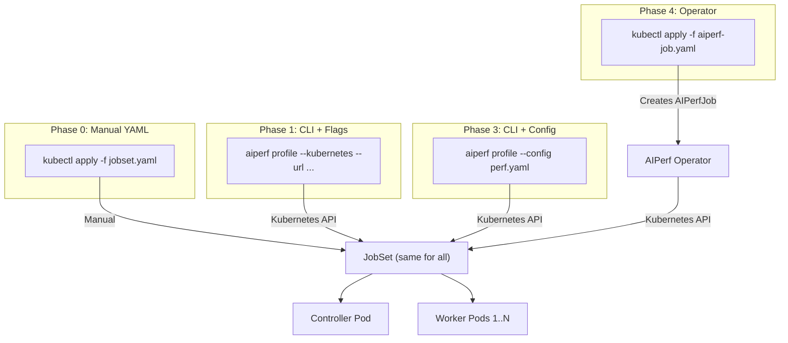

<!--
# SPDX-FileCopyrightText: Copyright (c) 2025-2026 NVIDIA CORPORATION & AFFILIATES. All rights reserved.
# SPDX-License-Identifier: Apache-2.0
-->
# AIPerf Kubernetes Deployment Enhancement

**Status**: Draft

**Authors**: Anthony Casagrande

**Category**: Architecture

**Replaces**: None

**Replaced By**: None

**Sponsor**: Ganesh Kudleppanavar

**Required Reviewers**: Ganesh Kudleppanavar, Nicolas Noble, Biswa Ranjan Panda, Neelay Shah, Hannah Zhang, Itay Neeman, Maksim Khadkevich

**Review Date**: 2026-01-26

**Pull Request**: TBD

**Implementation PR / Tracking Issue**: TBD

> [!NOTE]
> This document is a work in progress. Content may be removed, added, or modified before finalization.

# Summary

This proposal defines a **CLI-driven** approach to deploy AIPerf across multiple Kubernetes pods, enabling benchmarks that scale beyond single-node limits to 1M+ concurrent connections. The design combines **JobSet** with AIPerf's existing ZMQ communication to achieve massive scale with minimal code changes.

**Core Design:**
- **CLI-driven**: `aiperf profile --kubernetes` creates resources, streams progress, and retrieves results
- **JobSet**: Industry-standard multi-component workload management, used by Google on 130K-node clusters<sup>[[6]](#ref-6)</sup>
- **Sidecar pattern**: RecordProcessor co-located with Worker for data locality
- **Memory-mapped datasets**: HTTP download at startup, then mmap for fast local reads

**Prerequisites:**
- Kubernetes 1.33+ (JobSet supports the three most recent K8s minor versions)
- JobSet CRD installed (v1alpha2 API, production-ready per Google/Kubeflow adoption, GA expected 2026)<sup>[[4]](#ref-4)</sup>

# Motivation

Single-node AIPerf is limited to ~28K-60K concurrent connections per source IP due to ephemeral port exhaustion. Production AI inference services require validation at 100K-1M+ concurrency levels, exceeding single-node OS and hardware limits. Kubernetes-based Dynamo inference services need distributed load generation for realistic performance validation.

## Goals

- Scale load generation to 1M+ connections across multiple pods (see [Appendix I](#i-scaling-guidelines))
- Provide simple deployment via `--kubernetes` flag while preserving existing CLI compatibility
- Reuse existing ZMQ TCP transport to minimize code changes
- Automatically calculate worker count from target concurrency at deployment time

### Non-Goals (MVP)

- Automatic pod failure recovery beyond Kubernetes/JobSet built-in mechanisms
- Non-Kubernetes container orchestration platforms
- Web-based UI for job management and visualization
- Cross-cluster or multi-cloud distributed deployments
- Replacing the existing single-node deployment mode (both modes coexist)
- Advanced security features (mTLS, network policies, secret management)

## Requirements

### REQ 1 Distributed Architecture

AIPerf **MUST** support deployment across multiple Kubernetes pods using JobSet, with controller and workers as separate replicatedJobs. Workers **MUST** be deployable as scalable replicas, each paired with a co-located RecordProcessor sidecar (1:1 ratio).

### REQ 2 Kubernetes API Integration

The implementation **MUST** use the Kubernetes API directly. All components **MUST** be managed via JobSet for unified lifecycle management, stable identity, and automatic restart.

### REQ 3 Concurrency Scaling

The distributed deployment **MUST** sustain at least 1M concurrent connections given sufficient pod replicas. Validation criteria are defined per Phase; see [Appendix I](#i-scaling-guidelines) for pod count calculations.

### REQ 4 Communication Protocol

The implementation **MUST** preserve compatibility with existing ZMQ-based communication, using TCP for inter-pod and IPC for intra-pod communication.

### REQ 5 Lifecycle Management

The system **MUST** support complete lifecycle management: deployment, execution, and cleanup. The system **SHOULD** support re-attaching to running benchmarks via `aiperf attach` and **SHOULD** automatically clean up failed deployments to prevent resource leaks.

### REQ 6 Developer Experience

The implementation **MUST** provide a simple deployment experience that enables 1M+ concurrent connections with minimal configuration. The system **SHOULD** follow basic Kubernetes security practices while prioritizing ease of use and performance over enterprise complexity.

# Proposal

## Architecture Overview

> [!NOTE]
> The two-pod architecture (controller + workers) is decided. The exact container breakdown within the controller pod may change during implementation.

The architecture uses **JobSet** to manage all components as a unified workload:

1. **Controller ReplicatedJob**: All singleton services in one pod with **4 containers**, communicating via IPC over a shared volume
2. **Workers ReplicatedJob**: Scalable worker pods with RecordProcessor sidecars, using TCP to controller and IPC to sidecar

```
┌─────────────────────────────────────────────────────────────────────────┐
│ Kubernetes Cluster                                                      │
│                                                                         │
│  ┌───────────────────────────────────────────────────────────────────┐  │
│  │ JobSet: aiperf-benchmark-{job_id}                                 │  │
│  │   failurePolicy: maxRestarts=0 (fail fast)                        │  │
│  │   startupPolicy: InOrder (controller → workers)                   │  │
│  │                                                                   │  │
│  │  ┌─────────────────────────────────┐  ┌─────────────────────────┐ │  │
│  │  │ ReplicatedJob: controller       │  │ ReplicatedJob: workers  │ │  │
│  │  │ replicas: 1                     │  │ replicas: N             │ │  │
│  │  │                                 │  │                         │ │  │
│  │  │ ┌─────────────────────────┐     │  │ Pod 0..N-1              │ │  │
│  │  │ │    control-plane        │     │  │ ┌────────┬─────────┐    │ │  │
│  │  │ │ (SysCtrl + WorkerMgr)   │     │◄─┤ │Worker  │Processor│    │ │  │
│  │  │ ├────────────┬────────────┤     │  │ │        │(sidecar)│    │ │  │
│  │  │ │TimingMgr   │DatasetMgr  │     │  │ └────────┴─────────┘    │ │  │
│  │  │ ├────────────┴────────────┤     │  │                         │ │  │
│  │  │ │    RecordsManager       │     │  │                         │ │  │
│  │  │ └─────────────────────────┘     │  │                         │ │  │
│  │  │  (4 containers + IPC vol)       │  │   (2 containers)        │ │  │
│  │  └─────────────────────────────────┘  └─────────────────────────┘ │  │
│  └───────────────────────────────────────────────────────────────────┘  │
└─────────────────────────────────────────────────────────────────────────┘
```

### Why JobSet

| Aspect | Raw Pod + Indexed Job | JobSet |
|--------|----------------------|--------|
| Industry adoption | Native K8s API | Google (130K-node clusters), Kubeflow Trainer V2 |
| Multi-component coordination | Manual | Built-in replicatedJobs |
| Failure policies | Per-resource | Unified across all components |
| DNS management | Manual Service | Automatic headless service |
| Startup sequencing | Manual wait | Built-in startupPolicy |
| Cleanup | Delete Pod + Job separately | Delete JobSet (cascades) |

> "Replacing repetitive infrastructure layers with JobSet would help to avoid redundancy and reduce developer toil." - Kubeflow Trainer V2 Proposal<sup>[[1]](#ref-1)</sup>

### Service Distribution

**Controller ReplicatedJob** (replicas: 1, 4 containers)

| Container | Service(s) | Communication |
|-----------|------------|---------------|
| `control-plane` | SystemController, WorkerManager, GPUTelemetryManager*, ServerMetricsManager* | IPC + Event Bus |
| `timing-manager` | TimingManager | IPC + Credit Router (TCP) |
| `dataset-manager` | DatasetManager | IPC + Event Bus, HTTP API (dataset) |
| `records-manager` | RecordsManager | IPC + Pull (TCP), HTTP API (progress, artifacts) |

*Optional services enabled via `--gpu-telemetry` and `--server-metrics` flags.

**Workers ReplicatedJob** (replicas: N, 2 containers)

| Container | Service | Communication |
|-----------|---------|---------------|
| `worker` | Worker | TCP to Controller, IPC to sidecar |
| `record-processor` | RecordProcessor | IPC from Worker, TCP to RecordsManager |

### Why This Structure

**Hybrid container strategy (4 containers):**
- **Isolated**: `timing-manager`, `dataset-manager`, `records-manager` run in separate containers due to CPU spikes or timing sensitivity
- **Combined**: `control-plane` (SystemController + WorkerManager) groups lightweight coordination services together
- Provides resource isolation where needed: TimingManager requires clean timing; RecordsManager experiences CPU spikes during aggregation
- Containers communicate via IPC over a shared emptyDir volume

**All singletons in one pod:**
- Treats the controller as an atomic unit; any failure terminates the benchmark (fail-fast design)
- Achieves IPC latency (~μs) instead of TCP (~ms)
- Shares IPC sockets via a mounted volume

**RecordProcessor as sidecar:**
- Keeps data local: KB-MB responses stay within the pod via IPC
- Reduces network bandwidth ~50x (only ~100B metrics cross the network)
- Scales naturally: adding workers automatically adds processors
- Isolates CPU spikes in tokenization from timing-sensitive workers

## Communication Architecture

The existing ZMQ-based communication patterns are preserved with adaptations for distributed deployment:

### ZMQ Communication Flow

| Channel | Pattern | Transport | Purpose |
|---------|---------|-----------|---------|
| CREDIT_ROUTER | ROUTER/DEALER | IPC + TCP | TimingManager ↔ Workers (credit distribution/return) |
| RAW_INFERENCE | PUSH/PULL | IPC only | Worker → RecordProcessor (raw responses, direct sidecar) |
| RECORDS | PUSH/PULL | IPC + TCP | RecordProcessors → RecordsManager (processed metrics) |
| EVENT_BUS_PROXY | XPUB/XSUB | IPC + TCP | Coordination messages |

### Network Configuration

| Scope | Protocol | Latency |
|-------|----------|---------|
| Within pods | IPC | ~μs |
| Between pods | TCP | ~100μs-1ms (acceptable for 100ms+ requests) |

**JobSet DNS format:** Hostname is `{jobset-name}-{replicatedJob-name}-{job-index}-{pod-index}`. Full FQDN is `{hostname}.{subdomain}.{namespace}.svc.cluster.local`, where subdomain defaults to the JobSet name.

### Dual-Bind Strategy

ZMQ proxies on the controller pod bind to **both** IPC and TCP simultaneously. This allows local services (within the controller pod) to use low-latency IPC while remote services (worker pods) connect via TCP, all through the same proxy.

```python
# Example: Event bus proxy dual-bind
frontend = ctx.socket(zmq.XSUB)
frontend.bind("ipc:///aiperf/event_bus_proxy_frontend.ipc")  # local singletons
frontend.bind("tcp://0.0.0.0:5663")                           # remote workers
```

**Transport selection logic:** Services select transport based on locality:
- **Controller pod services** (SystemController, TimingManager, etc.): Connect via IPC
- **Worker pod services** (Worker, RecordProcessor): Connect via TCP to controller, IPC to sidecar

This approach delivers IPC latency benefits for co-located services without additional bridging components.

See [Appendix A](#a-zmq-address-tables) for address tables, [Appendix F](#f-yaml-definitions) for Service definition.

## Deployment Modes

### Single-Node vs Kubernetes

| Aspect | Single-Node | Kubernetes |
|--------|-------------|------------|
| Worker Identity | UUID | `JOB_COMPLETION_INDEX` (0, 1, 2, ...) |
| Worker → RecordProcessor | Via RAW_INFERENCE_PROXY (IPC) | Direct IPC to sidecar |
| Dataset Access | Local filesystem | HTTP download to local emptyDir, then mmap |
| Service Discovery | Local addresses | JobSet DNS |
| Progress Streaming | APIService (optional) | APIService via port-forward/LB |
| Cleanup | Process termination | JobSet deletion (cascades) |

### CLI Usage

```bash
# Run benchmark
aiperf profile --kubernetes \
  --url http://my-llm-service:8080 \
  --concurrency 100000 \
  --workers-max 200

# Attach to running benchmark
aiperf attach <job-id> --namespace benchmarks

# Cleanup
aiperf cleanup --job-id <job-id>
```

## Resource Management

### Pod Resource Allocation

**Controller pod containers:**

| Container | CPU Request | CPU Limit | Memory Request | Memory Limit |
|-----------|-------------|-----------|----------------|--------------|
| `control-plane` | 200m | 1000m | 256Mi | 512Mi |
| `timing-manager` | 100m | 500m | 128Mi | 256Mi |
| `dataset-manager` | 100m | 500m | 256Mi | 512Mi |
| `records-manager` | 200m | 1000m | 256Mi | 1Gi |
| **Controller total** | **600m** | **3000m** | **896Mi** | **2.25Gi** |

**Worker pod containers:**

| Container | CPU Request | CPU Limit | Memory Request | Memory Limit |
|-----------|-------------|-----------|----------------|--------------|
| `worker` | 250m | 250m | 256Mi | 512Mi |
| `record-processor` | 100m | 250m | 256Mi | 512Mi |
| **Worker total** | **350m** | **500m** | **512Mi** | **1Gi** |

**Rationale:** Workers are I/O-bound (waiting on the asyncio event loop), while CPU-bound tokenization runs in separate processors to avoid timing jitter. Per-container limits enable fine-grained resource control. Worker CPU limit equals request to ensure predictable timing measurements without CPU throttling variance; exact values are TBD based on production profiling.

### Scaling Guidelines

**Worker count formula:** `workers = ceil(target_concurrency / connections_per_worker)`

The default is 500 connections per worker (configurable via `AIPERF_HTTP_CONNECTION_LIMIT`). This conservative starting point may be adjusted based on production benchmarking; higher values reduce pod count but increase per-worker event loop load. See [Appendix I](#i-scaling-guidelines) for resource estimates at various scales.

### Failure Handling

**Fail-fast approach:** Partial restarts skew measurements, so clear failures are better than questionable results.

| Component | backoffLimit | Behavior |
|-----------|--------------|----------|
| Controller | 0 | Fail immediately (cannot recover state) |
| Workers | 2 | Retry transient failures, then fail benchmark |
| JobSet | maxRestarts=0 | No full restart (would corrupt measurements) |

### Error Reporting

When a benchmark fails, the CLI automatically collects diagnostic information:

| Source | Content | Access |
|--------|---------|--------|
| Pod logs | stdout/stderr from all containers, including stack traces | `kubectl logs` or automatic retrieval |
| Pod events | Kubernetes events (OOM kills, image pull failures, scheduling issues) | `kubectl describe pod` |
| ConfigMap | Last known progress state before failure | Automatic retrieval |
| Exit codes | Container exit codes indicating failure type | JobSet status |

The `aiperf attach` command (Phase 2) streams logs in real-time and automatically retrieves failure diagnostics when the benchmark terminates unexpectedly. For manual debugging, pod logs remain accessible via `kubectl logs <pod-name> -c <container-name>` until the JobSet is deleted.

# Implementation Phases

## Phase Overview

| Phase | Goal | Key Deliverable |
|-------|------|-----------------|
| **0: POC** | Validate architecture | Manual JobSet, split IPC + TCP works across pods |
| **1: MVP** | Break 65K barrier | `--kubernetes` flag, 100K+ connections, automated |
| **2: Reliability** | Production-grade | `attach`, progress streaming, pre-flight checks |
| **3: Production** | Enterprise patterns | Config file, parameter sweeps, S3 upload |
| **4: Future** | GitOps/declarative | Operator, CRD, status reporting |

## Phase 0: POC

**Goal:** Validate split IPC + TCP architecture across pod boundaries.

**Deliverables:** Manual JobSet YAML deployment

**Success criteria:** IPC works within pods, TCP works across pods, complete 1K request benchmark

## Phase 1: MVP

**Goal:** Break the 65K connection barrier with CLI automation.

**Deliverables:** `--kubernetes` flag, ConfigMap-based config, JobSet creation, health probes, results retrieval, automatic cleanup

**Success criteria:** 100K+ connections, end-to-end automation, ±5% variance versus single-node

## Phase 2: Reliability

**Deliverables:** `aiperf attach` for reconnecting, WebSocket progress streaming, graceful shutdown, pre-flight checks

## Phase 3: Production

**Deliverables:** Config file support (`--config perf.yaml`), parameter sweeps, S3/GCS upload

## Phase 4: Future

**Deliverables:** AIPerf Operator (thin JobSet wrapper), `AIPerfJob` CRD, status reporting

## Interface Evolution

| Phase | Command | Best For |
|-------|---------|----------|
| **0** | `kubectl apply -f jobset.yaml` | POC |
| **1** | `aiperf profile --kubernetes ...` | Dev |
| **3** | `aiperf profile --config perf.yaml` | CI/CD |
| **4** | `kubectl apply -f aiperf-job.yaml` | GitOps |

See [Appendix D](#d-interface-evolution-details) for examples. The operator follows Kubeflow Trainer V2<sup>[[1]](#ref-1)</sup>, a thin JobSet wrapper.

# Implementation Details

> [!IMPORTANT]
> This section contains detailed implementation guidance and is **not required reading for design review**. It bridges the gap between architectural decisions and implementation.

## Configuration Strategy

| Type | Delivery | Contents |
|------|----------|----------|
| **ConfigMap** | Static, loaded at pod startup | endpoint, tokenizer, output, telemetry, zmq addresses |
| **ProfileConfigureCommand** | Dynamic, per sweep point | concurrency, request_rate, num_requests, sequence lengths |

This hybrid approach enables parameter sweeps without pod restarts.

### ConfigMap Creation and Loading

Configuration is mounted as JSON files at `/etc/aiperf/`. The CLI serializes Pydantic models to JSON, creates a ConfigMap via Kubernetes API, and pods mount it as files. Services load config using `AIPERF_CONFIG_*` environment variables. See [Appendix B](#b-configmap-code-examples) for code examples.

| Variable | Default | Description |
|----------|---------|-------------|
| `AIPERF_CONFIG_BASE_PATH` | `/etc/aiperf` | Directory containing config files |
| `AIPERF_CONFIG_SERVICE_FILE` | `service_config.json` | Service config filename |
| `AIPERF_CONFIG_USER_FILE` | `user_config.json` | User config filename |

> **Future:** The `ServiceConfig` + `UserConfig` approach is the MVP solution. It will eventually be replaced by a unified `AIPerfJobSpec` YAML config that the CLI parses to generate both JobSet and ConfigMap. This spec will later become the CRD schema.

## Dataset Distribution

> [!NOTE]
> The dataset distribution approach described here is preliminary. The final implementation may differ based on performance testing and operational requirements.

### Dataset Upload to Cluster

The CLI transfers dataset files to the cluster using one of these approaches:

| Dataset Type | Source Method | CLI Usage |
|--------------|---------------|-----------|
| **Local file** | HTTP API upload | `--input-file /local/prompts.jsonl` |
| **PVC-resident** | Mount existing PVC | `--input-file pvc://{pvcname}/path/to/prompts.jsonl` |
| **Remote URL** | DatasetManager downloads | `--input-file https://example.com/prompts.jsonl` |
| **Public dataset** | DatasetManager downloads | `--public-dataset sharegpt` |
| **Synthetic** | Generated in-cluster | `--isl 550`, `--isl-stddev 10`, `--num-dataset-entries 1000`, etc. |

> The `pvc://` URI scheme follows the KServe storage URI convention.<sup>[[2]](#ref-2)</sup>

The HTTP API upload supports chunked transfer and compression (LZ4/ZSTD) for efficient transfer of large dataset files.

### Distribution to Workers

```
Controller Pod                         Worker Pod
┌─────────────────────┐               ┌──────────────────────────────────────┐
│ DatasetManager      │               │ Worker                               │
│   generates dataset │  Event Bus    │   1. Wait for                        │
│   [emptyDir]        │──(broadcast)─►│      DATASET_CONFIGURED_NOTIFICATION │
│                     │               │   2. Download via                    │
│ APIService          │    HTTP       │      `GET /api/dataset`              │
│   GET /api/dataset  │◄──────────────│   3. Save to local emptyDir          │
│                     │               │   4. Open as mmap                    │
│                     │               │   5. Fast local reads (~μs)          │
└─────────────────────┘               └──────────────────────────────────────┘
```

**Why this approach:** Works on any cluster without requiring RWX PVC support. The network cost is paid once at startup, avoiding per-request bottlenecks. Memory-mapped access provides ~100x faster reads than network access.

**Optional:** Use `--dataset-pvc NAME` to mount a pre-existing dataset PVC.

## Time Synchronization

**Credit-based offset measurement:** TimingManager stamps each credit with `issued_at_ns = T1`. When the worker receives it at `T2`, the offset is calculated as `T2 - T1`. Every credit provides a fresh measurement, and workers perform a quick round-trip calibration on first connection to account for network latency.

**Why credit-based sync:** NTP is often unavailable in containers. Since credits already flow from controller to worker, this approach requires no extra messages and adapts to clock drift over time.

## Progress Streaming and HTTP API

The controller pod exposes HTTP APIs via RecordsManager and DatasetManager for CLI communication, providing dedicated endpoints rather than overloading the Kubernetes API for data transfer.

### HTTP API Endpoints (ports 9090, 9091)

The HTTP API is hosted by two services: **RecordsManager** (progress, metrics, artifacts) on port 9091 and **DatasetManager** (dataset download) on port 9090. Artifact downloads support LZ4/ZSTD compression. See [Appendix G](#g-http-api-endpoints) for the full endpoint reference.

### Architecture

```
CLI (outside cluster)                    Controller Pod (inside cluster)
┌─────────────────────┐                  ┌─────────────────────────────────┐
│ ProgressClient      │◄─── WebSocket ───│ RecordsManager (port 9091)      │
│   └─► Terminal UI   │     /ws          │   /api/progress, /ws            │
│                     │                  │   /api/artifacts, /api/metrics  │
│ ArtifactClient      │◄─── HTTP GET ────│                                 │
│   └─► ./artifacts/  │     /api/...     ├─────────────────────────────────┤
│                     │                  │ DatasetManager (port 9090)      │
│ DatasetUpload       │──── HTTP POST ───│   /api/dataset                  │
│   └─► prompts.jsonl │     /api/dataset │                                 │
└─────────────────────┘                  └─────────────────────────────────┘
         │
         │ port-forward / LB / NodePort
         └───────────────────────────────────────────────────────────────────
```

### External Access Methods

| Method | Use Case | Reliability | Setup |
|--------|----------|-------------|-------|
| **port-forward** (default) | Dev, short benchmarks | Low (drops on idle) | None |
| **LoadBalancer** | Cloud, long benchmarks | High | Auto (cloud only) |
| **NodePort** | On-prem, bare metal | Medium | Know node IP |
| **Ingress** | Enterprise | High | DNS + TLS config |

> **Recommendation:** For benchmarks longer than a few minutes, use `--api-access loadbalancer` (cloud) or `--api-access nodeport` (on-prem) to avoid port-forward connection drops.

> **Why not use JobSet DNS?** The CLI runs outside the cluster. Cluster-internal DNS is not resolvable externally. The `--api-access` option selects the appropriate access method.

## Results Persistence

| Storage | Content | Persistence | Use Case |
|---------|---------|-------------|----------|
| **emptyDir** (default) | All artifacts | Ephemeral (lost on pod termination) | Dev, short benchmarks, CI/CD |
| **PVC** (optional) | All artifacts | Persistent (survives pod restart) | Long benchmarks, production |
| **ConfigMap** | `summary.json` only | Persistent | Quick summary access |

> **ConfigMap size limit:** Kubernetes ConfigMaps have a 1MB limit. The summary.json and progress data are designed to stay well under this threshold (typically <10KB); full artifacts are stored in emptyDir/PVC.

**Incremental progress persistence:** RecordsManager periodically updates the ConfigMap with current progress (completed requests, error counts, partial latency statistics). If a benchmark fails mid-run, the CLI retrieves the last known state from the ConfigMap, ensuring partial results are preserved even without a PVC.

> Use `--results-pvc` to enable persistent storage. Without it, artifacts must be retrieved via HTTP API before pod terminates.

### Artifact Retrieval Flow

1. CLI retrieves `summary.json` from ConfigMap (fast, <1 KB)
2. CLI downloads artifacts via HTTP API (`GET /api/artifacts/archive` with ZSTD compression, 3-5x smaller)
3. Results written to `./artifacts/{job_id}/`
4. Cleanup: JobSet deleted (cascades to all pods)

## CLI Options

| Option | Type | Default | Description |
|--------|------|---------|-------------|
| `--kubernetes` | flag | false | Enable Kubernetes mode |
| `--namespace` | str | auto | Kubernetes namespace |
| `--image` | str | auto | AIPerf container image (auto = current CLI version tag) |
| `--workers-max` | int | auto | Number of worker pods |
| `--kubeconfig` | path | ~/.kube/config | Kubeconfig file |
| `--kubecontext` | str | current-context | Kubernetes context to use |
| `--dataset-pvc` | str | None | Mount pre-existing dataset PVC (skips HTTP download) |
| `--results-pvc` | str | None | PVC name for persistent results (default: emptyDir) |
| `--api-access` | enum | "port-forward" | External API access method |

### Namespace Behavior

| Scenario | Namespace | Cleanup |
|----------|-----------|---------|
| `--namespace` not specified | Auto-generated: `aiperf-{job_id}` | Auto-deleted after benchmark |
| `--namespace benchmarks` specified | Uses existing namespace | Resources deleted, namespace preserved |

Auto-generated namespaces provide isolation between concurrent benchmarks and guarantee cleanup. User-specified namespaces allow reuse of existing RBAC, PVCs, and network policies.

### Pre-flight Checks

Pre-flight checks run automatically with `aiperf profile --kubernetes` and are also available standalone via `aiperf preflight` for debugging cluster setup.

| Check | Failure Action |
|-------|----------------|
| cluster-connectivity | Error with connection details |
| rbac-permissions | Error with missing permissions |
| namespace-availability | Error with namespace status |
| resource-quota | Warning with required resources |
| endpoint-reachability | Error with network troubleshooting hints |
| image-pull | Error with registry/auth hints |
| time-synchronization | Warning if clock skew >10ms |

Pre-flight checks fail fast with actionable error messages, preventing partial deployments. See [Appendix E](#e-pre-flight-check-example) for example output.

## RBAC Requirements

AIPerf requires a Role with permissions for: ConfigMaps, Services (CRUD), Pods/logs (read), Jobs (read), and JobSets (CRUD). See [Appendix F](#f-yaml-definitions) for the full Role definition.

## Container Images

A single container image supports all AIPerf service modes. Each container runs one or more services via `aiperf service`:

```bash
# Controller pod containers (4 containers)
aiperf service --type system-controller,worker-manager --health-port 8080  # control-plane
# With optional telemetry:
# aiperf service --type system-controller,worker-manager,gpu-telemetry-manager,server-metrics-manager --health-port 8080
aiperf service --type timing-manager --health-port 8081
aiperf service --type dataset-manager --health-port 8082 --api-port 9090
aiperf service --type records-manager --health-port 8083 --api-port 9091

# Worker pod containers
aiperf service --type worker --health-port 8080
aiperf service --type record-processor --health-port 8081
```

### Service Command Options

The `aiperf service` command accepts `--type` (required), `--api-port`, `--health-port`, and `--id` options. See [Appendix J](#j-service-command-reference) for the full option and service type reference.

## Health Probes

Each container exposes `/healthz` (liveness) and `/readyz` (readiness) endpoints via a minimal HTTP server on the async event loop.

**Controller pod containers:**

| Container | Port | Health Checks |
|-----------|------|---------------|
| `control-plane` | 8080 | Event loop responsive, ZMQ sockets bound, worker registry initialized |
| `timing-manager` | 8081 | Event loop responsive, credit router connected |
| `dataset-manager` | 8082 | Event loop responsive, dataset loaded |
| `records-manager` | 8083 | Event loop responsive, pull socket bound |

**Worker pod containers:**

| Container | Port | Health Checks |
|-----------|------|---------------|
| `worker` | 8080 | Event loop responsive, ZMQ connected, dataset mmap loaded |
| `record-processor` | 8081 | Event loop responsive, IPC socket connected |

All containers use startup probes to allow time for initialization (up to 60s for dataset loading). See [Appendix H](#h-health-probe-configuration) for full YAML configuration.

## Deferred to Implementation

The following details are deferred to the implementation phase: exact ZMQ port assignments, StorageClass recommendations per cloud provider, container image registry location, Prometheus metrics endpoint, and log format schema for Loki/EFK.

See [Appendix F](#f-yaml-definitions) for RBAC Role and Controller Service YAML definitions.

# Related Proposals

- [research/10-indexed-jobs-vs-jobset-comparison.md](./research/10-indexed-jobs-vs-jobset-comparison.md)
- [config-schema-alignment.md](./config-schema-alignment.md)

# Alternate Solutions

## Custom Kubernetes Operator (k6-Operator Pattern)

Build a dedicated AIPerf Kubernetes operator with a custom CRD (`AIPerfJob`), similar to k6-operator<sup>[[9]](#ref-9)</sup>, Locust operator, or other load testing operators.

**Pros:**
- GitOps-native declarative API (`kubectl apply -f benchmark.yaml`)
- Custom status reporting on CRD (`kubectl get aiperfJob` shows progress, metrics)
- Self-healing via reconcile loops
- Multi-tenancy with admission webhooks for resource quotas
- Kubernetes-native user experience

**Cons:**
- Significant development effort for production-quality operator<sup>[[10]](#ref-10)</sup>
- CRD schema versioning complexity (backward compatibility, conversion webhooks, storage version migration)
- Ongoing maintenance burden (must track client-go, controller-runtime, K8s API changes every 4 months)
- Idempotency challenges: "Kubernetes operators are expected to be idempotent, but the k6 API is not"<sup>[[11]](#ref-11)</sup>
- Self-healing can corrupt benchmark results (partial restarts skew timing measurements)
- Technical silos: "Custom operators create technical silos with limited reuse; teams cannot easily compose automation logic from multiple Operators"<sup>[[12]](#ref-12)</sup>

**Rejected:** Kubeflow Trainer V2 explicitly moved away from custom operators toward JobSet, noting that custom operators "introduce redundancy and increase maintenance costs."<sup>[[1]](#ref-1)</sup> For batch workloads like benchmarking, operators add complexity without proportional benefit: the "self-healing" that justifies operators for stateful databases is counterproductive for benchmarks where partial restarts invalidate measurements. JobSet provides the necessary coordination primitives (startup ordering, failure policies, DNS) without custom controller code. Phase 4 reserves an operator option for GitOps use cases, but as a thin JobSet wrapper following the Kubeflow Trainer V2 pattern. See [research/12-leveraging-jobset-vs-custom-operator.md](./research/12-leveraging-jobset-vs-custom-operator.md) and [research/architecture-decision-analysis-jobset-vs-operator.md](./research/architecture-decision-analysis-jobset-vs-operator.md) for detailed analysis.

## Per-Service Pod Architecture (Original Proposal)

Separate pods for each service (5 singleton pods + worker Deployment + processor Deployment). See [AIP-0002-kubernetes-deployment.md](./AIP-0002-kubernetes-deployment.md).

| Aspect | Original | Final |
|--------|----------|-------|
| Singleton pods | 5 separate (7 CPU, 8Gi) | 1 co-located (0.6-3 CPU, 0.9-2.25Gi) |
| Pod count (100K) | 255 | 201 |
| Worker↔Processor | TCP (~ms) | IPC (~μs) |
| Dataset access | ZMQ request/reply (~ms) | Local mmap (~μs) |
| Cleanup | Delete 7+ resources | Delete 1 JobSet |

**Pros:**
- Familiar Deployment/ReplicaSet patterns
- Theoretical flexibility for independent service updates

**Cons:**
- High resource overhead (7 CPU, 8Gi for singletons alone)
- TCP latency on timing-critical credit distribution path
- False sense of resilience (any singleton failure still fails the benchmark)
- Dataset bottleneck with ZMQ request/reply at scale
- Complex orchestration (5+ Deployments)
- No startup ordering without manual readiness waits

**Rejected:** The microservices pattern does not fit AIPerf's tightly-coupled benchmark semantics, where all components must succeed together. "Independent scalability" is meaningless for singletons that cannot have multiple replicas.

## Raw Indexed Jobs (Instead of JobSet)

**Pros:**
- GA API stability (Indexed Jobs GA since K8s 1.24)<sup>[[7]](#ref-7)</sup>
- No CRD installation required
- Broader K8s version compatibility
- Battle-tested in production

**Cons:**
- Manual multi-component coordination (separate Pod + Job)
- Manual Service creation for DNS
- Manual startup ordering via init containers
- Separate cleanup (delete each resource individually)
- No unified failure policies

**Rejected:** JobSet provides startup ordering, automatic headless services, unified cleanup, and failure policies out of the box.<sup>[[3]](#ref-3)</sup> Google uses JobSet on 130K-node clusters<sup>[[6]](#ref-6)</sup> and Kubeflow Trainer V2 builds on JobSet.<sup>[[1]](#ref-1)</sup> See [research/10-indexed-jobs-vs-jobset-comparison.md](./research/10-indexed-jobs-vs-jobset-comparison.md) for detailed comparison.

## Job-Based Deployment Only (No CLI)

**Pros:**
- Native K8s job scheduling and lifecycle
- Simple YAML configuration
- Good CI/CD pipeline integration
- GitOps-friendly

**Cons:**
- No terminal-based progress streaming or Ctrl+C cancellation
- Requires separate `kubectl` commands for monitoring and cleanup
- Results must be retrieved manually via `kubectl cp` or PVC

**Rejected:** The CLI provides integrated progress streaming, automatic result retrieval, and simplified cleanup. Pure YAML-based deployment without CLI orchestration would require users to manually handle these concerns. Phase 4's Operator/CRD approach addresses GitOps use cases while still providing automation.

## Helm Charts

**Pros:**
- Mature templating ecosystem
- Community-standard approach for long-running services

**Cons:**
- Helm's strengths (release management, upgrades, rollbacks) do not apply to ephemeral benchmark jobs
- Adds chart maintenance burden without corresponding benefit

**Rejected:** Helm is designed for managing long-running services with versioned releases. AIPerf benchmarks are ephemeral jobs: they run, produce results, and are deleted. The CLI handles templating internally, making Helm an unnecessary layer.

# Key Design Decisions

| Aspect | Decision | Rationale |
|--------|----------|-----------|
| Workload Management | JobSet | Industry standard, unified lifecycle, startup ordering |
| Failure Handling | Fail-fast (maxRestarts=0) | Benchmark accuracy over auto-recovery |
| Singletons | Single controller pod, 4 containers | Atomic unit, resource isolation where needed |
| Container Isolation | Hybrid (critical services isolated) | TimingManager/RecordsManager isolated for timing precision and CPU spike protection |
| RecordProcessor | Sidecar (1:1) | Data locality, ~50x bandwidth reduction |
| Configuration | ConfigMap + ProfileConfigureCommand | Minimal refactoring, sweep support |
| Dataset | HTTP download + local mmap | Works on any cluster, no RWX PVC required |
| Time Sync | Credit-based offset | Zero extra messages, per-request freshness |
| Results | emptyDir default, PVC optional | Quick access + persistence when needed |
| CLI Orchestration | Kubernetes Python API | Direct control, no Helm dependency |
| RBAC | Namespace-scoped Role | Least privilege |
| Intra-pod Communication | IPC via shared emptyDir | ~μs latency for co-located services |
| Inter-pod Communication | TCP | Required for cross-pod, uses JobSet DNS |

# Background

AIPerf is NVIDIA's AI inference performance benchmarking tool. The current implementation uses a multi-service architecture where services communicate via ZeroMQ (ZMQ) message passing: system controller (orchestration), dataset manager (data loading), timing manager (request rate control), workers (request execution), and record processors (response processing and metrics).

## References

<span id="ref-1">[1]</span> Kubeflow Trainer V2 Proposal. https://github.com/kubeflow/trainer/blob/master/docs/proposals/2170-kubeflow-trainer-v2/README.md

<span id="ref-2">[2]</span> KServe PVC Storage URI Convention. https://kserve.github.io/website/docs/model-serving/storage/providers/pvc

<span id="ref-3">[3]</span> JobSet Documentation. https://jobset.sigs.k8s.io/docs/overview/

<span id="ref-4">[4]</span> JobSet GitHub. https://github.com/kubernetes-sigs/jobset

<span id="ref-5">[5]</span> Introducing JobSet | Kubernetes Blog. https://kubernetes.io/blog/2025/03/23/introducing-jobset/

<span id="ref-6">[6]</span> Google 130K-Node GKE Cluster. https://cloud.google.com/blog/products/containers-kubernetes/how-we-built-a-130000-node-gke-cluster

<span id="ref-7">[7]</span> Kubernetes Indexed Jobs. https://kubernetes.io/docs/tasks/job/indexed-parallel-processing-static/

<span id="ref-8">[8]</span> ZeroMQ Guide - Chapter 4: Reliable Request-Reply Patterns. https://zguide.zeromq.org/docs/chapter4/

<span id="ref-9">[9]</span> Grafana k6-Operator GitHub. https://github.com/grafana/k6-operator

<span id="ref-10">[10]</span> Red Hat Developer's Guide to Kubernetes Operators. https://developers.redhat.com/articles/2024/01/29/developers-guide-kubernetes-operators

<span id="ref-11">[11]</span> Grafana k6 Operator 1.0 Announcement. https://grafana.com/blog/distributed-performance-testing-for-kubernetes-environments-grafana-k6-operator-1-0-is-here/

<span id="ref-12">[12]</span> Syntasso: What Are Kubernetes Operators and Do You Still Need Them in 2025. https://www.syntasso.io/post/what-are-kubernetes-operators-and-do-you-still-need-them-in-2025

## Terminology

| Term | Definition |
|------|------------|
| **Credit** | Token representing a single-turn or multi-turn conversation to be executed by a worker |
| **Ephemeral Port** | Temporary port assigned by the OS for outbound connections, limited to ~28K-60K per source IP (default Linux range: 32768-60999) |
| **Indexed Job** | K8s Job with stable pod identity via `JOB_COMPLETION_INDEX` |
| **JobSet** | Kubernetes API for managing groups of Jobs as a unit with shared lifecycle |
| **Sidecar** | Secondary container sharing pod resources with the main container |
| **ZMQ Proxy** | Service that routes messages between distributed ZeroMQ clients using various patterns |

## Acronyms

- **CRD**: Custom Resource Definition
- **IPC**: Inter-Process Communication
- **PVC**: Persistent Volume Claim
- **RBAC**: Role-Based Access Control
- **ZMQ**: ZeroMQ Messaging Protocol

---

# Appendix

> [!IMPORTANT]
> The appendices contain implementation reference material (YAML specs, code examples, API definitions) and are **not required reading for design review**. They are included here for completeness and to aid implementation.

## A. ZMQ Address Tables

### Controller Pod Proxies (Dual-Bind)

Proxies bind to both IPC and TCP. Local services connect via IPC; remote workers connect via TCP.

| Channel | Pattern | IPC Bind (local) | TCP Bind (remote) |
|---------|---------|------------------|-------------------|
| EVENT_BUS_PROXY_FRONTEND | XSUB | `ipc:///aiperf/event_bus_proxy_frontend.ipc` | `tcp://0.0.0.0:5663` |
| EVENT_BUS_PROXY_BACKEND | XPUB | `ipc:///aiperf/event_bus_proxy_backend.ipc` | `tcp://0.0.0.0:5664` |
| CREDIT_ROUTER | ROUTER | `ipc:///aiperf/credit_router.ipc` | `tcp://0.0.0.0:5564` |
| RECORDS | PULL | `ipc:///aiperf/records_push_pull.ipc` | `tcp://0.0.0.0:5557` |

### Worker Pod (IPC to Sidecar)

Direct PUSH/PULL connection (no proxy needed for 1:1 sidecar pattern):

| Channel | Pattern | IPC Address |
|---------|---------|-------------|
| RAW_INFERENCE | PUSH (Worker) → PULL (RecordProcessor) | `ipc:///aiperf/raw_inference.ipc` |

### Remote Connection (Workers → Controller)

Workers connect to controller via TCP using JobSet DNS:

| Channel | Pattern | TCP Address |
|---------|---------|-------------|
| EVENT_BUS_PROXY_FRONTEND | PUB | `tcp://aiperf-benchmark-{job_id}-controller-0-0:5663` |
| EVENT_BUS_PROXY_BACKEND | SUB | `tcp://aiperf-benchmark-{job_id}-controller-0-0:5664` |
| CREDIT_ROUTER | DEALER | `tcp://aiperf-benchmark-{job_id}-controller-0-0:5564` |
| RECORDS | PUSH | `tcp://aiperf-benchmark-{job_id}-controller-0-0:5557` |

## B. ConfigMap Code Examples

**1. CLI creates ConfigMap with serialized configs:**

```python
# CLI-side: serialize Pydantic models to JSON
config_data = {
    "service_config.json": service_config.model_dump_json(indent=2, exclude_none=True, exclude_unset=True),
    "user_config.json": user_config.model_dump_json(indent=2, exclude_none=True, exclude_unset=True),
}

# Create ConfigMap via Kubernetes API
configmap = V1ConfigMap(
    metadata=V1ObjectMeta(name=f"aiperf-config-{job_id}"),
    data=config_data,
)
core_v1.create_namespaced_config_map(namespace, configmap)
```

**2. Pod spec mounts ConfigMap as files:**

```yaml
containers:
  - name: controller
    command: ["aiperf", "service", "--type", "system-controller", ...]
    volumeMounts:
      - name: config
        mountPath: /etc/aiperf
        readOnly: true
volumes:
  - name: config
    configMap:
      name: aiperf-config-{job_id}
```

**3. Service loads config from files:**

```python
# In environment.py - follows existing AIPERF_ prefix pattern
class _ConfigSettings(BaseSettings):
    model_config = SettingsConfigDict(env_prefix="AIPERF_CONFIG_")

    BASE_PATH: Path = Field(
        default=Path("/etc/aiperf"),
        description="Directory containing configuration files",
    )
    SERVICE_FILE: str = Field(default="service_config.json")
    USER_FILE: str = Field(default="user_config.json")

# Usage in config loading
def load_service_config() -> ServiceConfig:
    config_file = Environment.CONFIG.BASE_PATH / Environment.CONFIG.SERVICE_FILE
    if config_file.exists():
        return ServiceConfig.model_validate_json(config_file.read_text())
    return ServiceConfig()  # Fall back to defaults for local execution
```

## C. Container & Pod Examples

### Controller Pod Spec (4 containers)

```yaml
# Controller pod - hybrid container strategy, shared IPC volume
containers:
  - name: control-plane
    image: ghcr.io/nvidia/aiperf:latest
    # Base: system-controller,worker-manager
    # With telemetry: system-controller,worker-manager,gpu-telemetry-manager,server-metrics-manager
    command: ["aiperf", "service", "--type", "system-controller,worker-manager", "--health-port", "8080"]
    ports:
      - containerPort: 8080
        name: health
    volumeMounts:
      - name: ipc
        mountPath: /aiperf
      - name: config
        mountPath: /etc/aiperf
        readOnly: true

  - name: timing-manager
    image: ghcr.io/nvidia/aiperf:latest
    command: ["aiperf", "service", "--type", "timing-manager", "--health-port", "8081"]
    ports:
      - containerPort: 8081
        name: health
    volumeMounts:
      - name: ipc
        mountPath: /aiperf
      - name: config
        mountPath: /etc/aiperf
        readOnly: true

  - name: dataset-manager
    image: ghcr.io/nvidia/aiperf:latest
    command: ["aiperf", "service", "--type", "dataset-manager", "--health-port", "8082", "--api-port", "9090"]
    ports:
      - containerPort: 8082
        name: health
      - containerPort: 9090
        name: api-dataset
    volumeMounts:
      - name: ipc
        mountPath: /aiperf
      - name: config
        mountPath: /etc/aiperf
        readOnly: true

  - name: records-manager
    image: ghcr.io/nvidia/aiperf:latest
    command: ["aiperf", "service", "--type", "records-manager", "--health-port", "8083", "--api-port", "9091"]
    ports:
      - containerPort: 8083
        name: health
      - containerPort: 9091
        name: api-records
    volumeMounts:
      - name: ipc
        mountPath: /aiperf
      - name: config
        mountPath: /etc/aiperf
        readOnly: true

volumes:
  - name: ipc
    emptyDir:
      medium: Memory  # tmpfs for fast IPC sockets
  - name: config
    configMap:
      name: aiperf-config-{job_id}
```

### Worker Pod Spec (2 containers)

```yaml
# Worker pod - worker + record-processor sidecar
containers:
  - name: worker
    image: ghcr.io/nvidia/aiperf:latest
    command: ["aiperf", "service", "--type", "worker", "--health-port", "8080"]
    # JOB_COMPLETION_INDEX is auto-injected by Kubernetes for Indexed Jobs
    ports:
      - containerPort: 8080
        name: health
    volumeMounts:
      - name: ipc
        mountPath: /aiperf
      - name: config
        mountPath: /etc/aiperf
        readOnly: true

  - name: record-processor
    image: ghcr.io/nvidia/aiperf:latest
    command: ["aiperf", "service", "--type", "record-processor", "--health-port", "8081"]
    # JOB_COMPLETION_INDEX is auto-injected by Kubernetes for Indexed Jobs
    ports:
      - containerPort: 8081
        name: health
    volumeMounts:
      - name: ipc
        mountPath: /aiperf
      - name: config
        mountPath: /etc/aiperf
        readOnly: true

volumes:
  - name: ipc
    emptyDir:
      medium: Memory  # tmpfs for fast IPC sockets
  - name: config
    configMap:
      name: aiperf-config-{job_id}
```

## D. Interface Evolution Details

### Mermaid Diagram



### Manual YAML (Phase 0)

```bash
# Create ConfigMap with config files
kubectl create configmap aiperf-config \
  --from-file=service_config.json \
  --from-file=user_config.json

# Deploy JobSet
kubectl apply -f jobset.yaml

# Monitor pods
kubectl get pods -l jobset.sigs.k8s.io/jobset-name=aiperf-benchmark -w

# Retrieve results manually
kubectl cp aiperf-benchmark-controller-0-0:/artifacts ./artifacts

# Cleanup
kubectl delete jobset aiperf-benchmark
```

### CLI with Config File (Phase 3)

**perf.yaml:**
```yaml
endpoints:
  - url: http://llm-service:8080/v1/chat/completions
    type: chat

workload:
  dataset:
    type: synthetic
    promptTokens: 128
    outputTokens: 256

loadgen:
  type: poisson
  targetQPS: 100
  duration: 300s

scaling:
  workers: 8
```

```bash
aiperf profile --config perf.yaml --kubernetes
```

### Operator with CRD (Phase 4)

```yaml
apiVersion: aiperf.nvidia.com/v1
kind: AIPerfJob
metadata:
  name: llama-benchmark
  namespace: benchmarks
spec:
  # Same schema as CLI config, nested under "spec:"
  endpoints:
    - url: http://llm-service:8080/v1/chat/completions
      type: chat
  workload:
    dataset:
      type: synthetic
      promptTokens: 128
      outputTokens: 256
  loadgen:
    type: poisson
    targetQPS: 100
    duration: 300s
  scaling:
    workers: 8
```

### Comparison Table

| Aspect | Manual YAML (Phase 0) | CLI + Flags (Phase 1) | CLI + Config (Phase 3) | Operator (Phase 4) |
|--------|----------------------|----------------------|------------------------|-------------------|
| **User command** | `kubectl apply -f jobset.yaml` | `aiperf profile --kubernetes ...` | `aiperf profile --config ...` | `kubectl apply -f aiperf-job.yaml` |
| **Config format** | Raw JobSet + ConfigMap | CLI arguments | YAML (job spec) | YAML (CRD) |
| **Creates** | JobSet (manual) | JobSet (automated) | JobSet (automated) | CRD → Operator → JobSet |
| **Results retrieval** | `kubectl cp` | Automated HTTP | Automated HTTP | Automated HTTP |
| **Interactive** | No | Yes (Ctrl+C) | Yes (Ctrl+C) | No (declarative) |
| **Best for** | POC validation | Quick tests, debugging | CI/CD, reproducibility | Platform teams, GitOps |

## E. Pre-flight Check Example

```
$ aiperf profile --kubernetes --url http://llm-api.example.com --workers-max 100

Running pre-flight checks...
  ✓ cluster-connectivity: Connected to Kubernetes v1.33.7
  ✓ rbac-permissions: All required RBAC permissions present
  ✓ endpoint-reachability: Endpoint is reachable from cluster
All checks passed.

Starting benchmark...
```

## F. YAML Definitions

### RBAC Role

```yaml
apiVersion: rbac.authorization.k8s.io/v1
kind: Role
metadata:
  name: aiperf-role
  namespace: benchmarks
rules:
  - apiGroups: [""]
    resources: ["configmaps", "services"]
    verbs: ["create", "delete", "get", "list", "patch", "update"]
  - apiGroups: [""]
    resources: ["pods", "pods/log"]
    verbs: ["get", "list", "watch"]
  - apiGroups: [""]
    resources: ["pods/exec"]
    verbs: ["create"]
  - apiGroups: ["batch"]
    resources: ["jobs"]
    verbs: ["get", "list", "watch"]
  - apiGroups: ["jobset.sigs.k8s.io"]
    resources: ["jobsets"]
    verbs: ["create", "delete", "get", "list", "watch", "patch", "update"]
```

### Controller Service

```yaml
apiVersion: v1
kind: Service
metadata:
  name: aiperf-benchmark-{job_id}-controller
  namespace: benchmarks
spec:
  selector:
    jobset.sigs.k8s.io/jobset-name: aiperf-benchmark-{job_id}
    jobset.sigs.k8s.io/replicatedjob-name: controller
  type: ClusterIP
  ports:
    - name: event-bus-frontend
      port: 5663
    - name: event-bus-backend
      port: 5664
    - name: credit-router
      port: 5564
    - name: records
      port: 5557
    - name: api-dataset
      port: 9090
    - name: api-records
      port: 9091
    - name: health
      port: 8080
```

## G. HTTP API Endpoints

| Endpoint | Method | Service | Port | Purpose |
|----------|--------|---------|------|---------|
| `/api/progress` | GET | RecordsManager | 9091 | Current benchmark progress (requests, latencies, errors) |
| `/api/metrics` | GET | RecordsManager | 9091 | Real-time metrics snapshot |
| `/api/artifacts` | GET | RecordsManager | 9091 | List available result files |
| `/api/artifacts/{file}` | GET | RecordsManager | 9091 | Download specific artifact file |
| `/api/artifacts/archive` | GET | RecordsManager | 9091 | Download all artifacts as compressed archive |
| `/ws` | WebSocket | RecordsManager | 9091 | Push-based real-time progress updates |
| `/api/dataset` | POST | DatasetManager | 9090 | Upload dataset file (multipart/form-data, supports LZ4/ZSTD) |
| `/api/dataset` | GET | DatasetManager | 9090 | Download dataset file (used by workers at startup) |
| `/health` | GET | Both | 9090, 9091 | Health check endpoint |

**Compression:** The `/api/artifacts/archive` endpoint supports `Accept-Encoding: lz4` or `Accept-Encoding: zstd` headers for fast, efficient transfers. LZ4 prioritizes speed (>500 MB/s per core, decompression >3 GB/s), while ZSTD provides better compression ratios (typically 3-5x for JSON/CSV artifacts). Default is ZSTD if no preference specified.

## H. Health Probe Configuration

**Controller pod containers (e.g., control-plane on port 8080):**
```yaml
startupProbe:
  httpGet:
    path: /healthz
    port: 8080
  initialDelaySeconds: 5
  periodSeconds: 5
  failureThreshold: 12  # Allow up to 60s for startup

livenessProbe:
  httpGet:
    path: /healthz
    port: 8080
  periodSeconds: 10
  failureThreshold: 3

readinessProbe:
  httpGet:
    path: /readyz
    port: 8080
  periodSeconds: 5
  successThreshold: 2
```

**Worker pod - worker container (port 8080):**
```yaml
startupProbe:
  httpGet:
    path: /healthz
    port: 8080
  initialDelaySeconds: 3
  periodSeconds: 3
  failureThreshold: 20  # Allow up to 60s for dataset download

livenessProbe:
  httpGet:
    path: /healthz
    port: 8080
  periodSeconds: 10
  failureThreshold: 3

readinessProbe:
  httpGet:
    path: /readyz
    port: 8080
  periodSeconds: 5
  successThreshold: 1
```

**Worker pod - record-processor sidecar (port 8081):**
```yaml
startupProbe:
  httpGet:
    path: /healthz
    port: 8081
  initialDelaySeconds: 2
  periodSeconds: 3
  failureThreshold: 10

livenessProbe:
  httpGet:
    path: /healthz
    port: 8081
  periodSeconds: 10
  failureThreshold: 3

readinessProbe:
  httpGet:
    path: /readyz
    port: 8081
  periodSeconds: 5
  successThreshold: 1
```

## I. Scaling Guidelines

| Workers | Est. QPS | Total CPU (requests) | Total Memory (requests) |
|---------|----------|----------------------|-------------------------|
| 10 | 500-1,000 | ~4 cores | ~6Gi |
| 100 | 5,000-10,000 | ~36 cores | ~51Gi |
| 500 | 25,000-50,000 | ~176 cores | ~251Gi |
| 1,000 | 50,000-100,000 | ~351 cores | ~501Gi |

**Example:** 100K concurrency with 500 connections/worker = `ceil(100000 / 500)` = 200 worker pods

Lower connections per worker improves measurement accuracy at the cost of more pods.

## J. Service Command Reference

### Command Options

| Option | Type | Default | Description |
|--------|------|---------|-------------|
| `--type` | str | required | Service type(s), comma-separated for multi-service containers (e.g., `system-controller,worker-manager`) |
| `--api-port` | int | None | Port for HTTP API (DatasetManager or RecordsManager) |
| `--health-port` | int | None | Port for `/healthz` and `/readyz` endpoints |
| `--id` | str | auto | Service identifier (auto-generated from `JOB_COMPLETION_INDEX`) |

### Available Service Types

| Type | Description |
|------|-------------|
| `system-controller` | Orchestrates benchmark lifecycle |
| `worker` | Executes LLM API requests |
| `record-processor` | Processes raw responses into metrics |
| `timing-manager` | Controls request timing and credit distribution |
| `dataset-manager` | Manages dataset loading and distribution |
| `worker-manager` | Monitors worker lifecycle and health |
| `records-manager` | Aggregates processed records, hosts HTTP API for progress/artifacts |
| `gpu-telemetry-manager` | Collects GPU metrics via DCGM (optional, enabled with `--gpu-telemetry`) |
| `server-metrics-manager` | Collects server metrics via Prometheus (optional, enabled with `--server-metrics`) |
