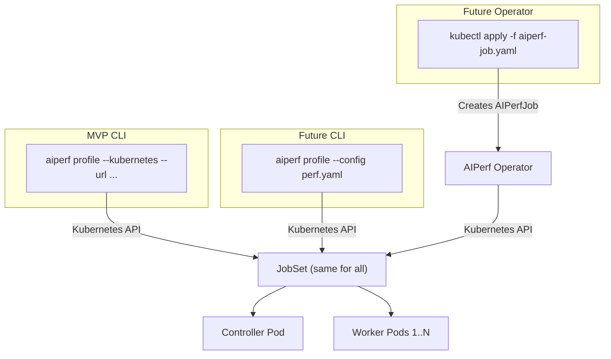

<!--
# SPDX-FileCopyrightText: Copyright (c) 2025-2026 NVIDIA CORPORATION & AFFILIATES. All rights reserved.
# SPDX-License-Identifier: Apache-2.0
-->
# AIPerf Kubernetes Deployment Enhancement

**Status**: Draft

**Authors**: Anthony Casagrande

**Category**: Architecture

**Replaces**: None

**Replaced By**: None

**Sponsor**: Ganesh Kudleppanavar

**Required Reviewers**: Ganesh Kudleppanavar, Nicolas Noble, Biswa Ranjan Panda, Neelay Shah, Hannah Zhang, Itay Neeman, Maksim Khadkevich

**Review Date**: 2026-01-26

**Pull Request**: TBD

**Implementation PR / Tracking Issue**: TBD

> [!NOTE]
> This document is a work in progress. Content may be removed, added, or modified before finalization.

# Summary

This proposal defines a **CLI-driven** approach to deploy AIPerf across multiple Kubernetes pods, enabling benchmarks that scale beyond single-node limits to 1M+ concurrent connections. The design combines **JobSet** with AIPerf's existing ZMQ communication to achieve massive scale with minimal code changes.

**Core Design:**
- **CLI-driven**: `aiperf profile --kubernetes` creates resources, streams progress, and retrieves results
- **JobSet**: Industry-standard multi-component workload management, used by Google on 130K-node clusters<sup>[[6]](#ref-6)</sup>
- **Sidecar pattern**: RecordProcessor co-located with Worker for data locality
- **Memory-mapped datasets**: HTTP download at startup, then mmap for fast local reads

**Prerequisites:**
- Kubernetes 1.33+ (JobSet supports the three most recent K8s minor versions)
- JobSet CRD installed (v1alpha2 API, production-ready per Google/Kubeflow adoption, GA expected 2026)<sup>[[4]](#ref-4)</sup>

# Motivation

Single-node AIPerf is limited to ~28K-60K concurrent connections per source IP due to ephemeral port exhaustion. Production AI inference services require validation at 100K-1M+ concurrency levels, exceeding single-node OS and hardware limits. Kubernetes-based Dynamo inference services need distributed load generation for realistic performance validation.

## Goals

- Scale load generation to 1M+ connections across multiple pods
- Provide simple deployment via `--kubernetes` flag while preserving existing CLI compatibility
- Reuse existing ZMQ TCP transport to minimize code changes
- Automatically calculate worker count from target concurrency at deployment time

### Non-Goals (MVP)

- Automatic pod failure recovery beyond Kubernetes/JobSet built-in mechanisms
- Non-Kubernetes container orchestration platforms
- Web-based UI for job management and visualization
- Cross-cluster or multi-cloud distributed deployments
- Replacing the existing single-node deployment mode (both modes coexist)
- Advanced security features (mTLS, network policies, secret management)

## Requirements

### REQ 1 Distributed Architecture

AIPerf **MUST** support deployment across multiple Kubernetes pods using JobSet, with controller and workers as separate replicatedJobs. Workers **MUST** be deployable as scalable replicas, each paired with a co-located RecordProcessor sidecar (1:1 ratio).

### REQ 2 Kubernetes API Integration

The implementation **MUST** use the Kubernetes API directly. All components **MUST** be managed via JobSet for unified lifecycle management, stable identity, and automatic restart.

### REQ 3 Concurrency Scaling

The distributed deployment **MUST** sustain at least 100K concurrent connections. The system **SHOULD** support scaling to 1M+ concurrent connections given sufficient pod replicas.

### REQ 4 Communication Protocol

The implementation **MUST** preserve compatibility with existing ZMQ-based communication, using TCP for inter-pod and IPC for intra-pod communication.

### REQ 5 Lifecycle Management

The system **MUST** support complete lifecycle management: deployment, execution, and cleanup. The system **SHOULD** support re-attaching to running benchmarks via `aiperf attach` and **SHOULD** automatically clean up failed deployments to prevent resource leaks.

### REQ 6 Developer Experience

The implementation **MUST** provide a simple deployment experience that enables 1M+ concurrent connections with minimal configuration. The system **SHOULD** follow basic Kubernetes security practices while prioritizing ease of use and performance over enterprise complexity.

# Proposal

## Architecture Overview

> [!NOTE]
> The two-pod architecture (controller + workers) is decided. The exact container breakdown within the controller pod may change during implementation.

The architecture uses **JobSet** to manage all components as a unified workload:

1. **Controller ReplicatedJob**: All singleton services in one pod with **4 containers**, communicating via IPC over a shared volume
2. **Workers ReplicatedJob**: Scalable worker pods with RecordProcessor sidecars, using TCP to controller and IPC to sidecar


```
┌──────────────────────────────────────────────────────────────────┐
│ User's Local Machine                                             │
│                                                                  │
│  $ aiperf profile --kubernetes \                                 │
│      --url http://llm-server:8000 \                              │
│      --concurrency 100000 \                                      │
│      --workers-max 200                                           │
│                                                                  │
│  ┌────────────────────────────────────────────────────────────┐  │
│  │ AIPerf CLI (Python)                                        │  │
│  │  - Reads ~/.kube/config                                    │  │
│  │  - Creates namespace, RBAC, ConfigMap via K8s API          │  │
│  │  - Creates JobSet with controller + workers replicatedJobs │  │
│  │  - Monitors via Kubernetes API and WebSocket               │  │
│  │  - Retrieves results via Custom HTTP API                   │  │
│  └────────────────────────────────────────────────────────────┘  │
│                              │ Kubernetes Python API             │
└──────────────────────────────┼───────────────────────────────────┘
                               ▼
┌──────────────────────────────────────────────────────────────────┐
│ Kubernetes Cluster (namespace: benchmarks or aiperf-{job_id})    │
│                                                                  │
│  ┌────────────────────────────────────────────────────────────┐  │
│  │ JobSet: aiperf-benchmark-{job_id}                          │  │
│  │   failurePolicy: maxRestarts=0 (fail fast)                 │  │
│  │   startupPolicy: InOrder (controller → workers)            │  │
│  │                                                            │  │
│  │  ┌─────────────────────────────────────────────────────┐   │  │
│  │  │ ReplicatedJob: controller (backoffLimit: 0)         │   │  │
│  │  │                                                 ZMQ │   │  │
│  │  │  ┌─────────────────────────────────────────────┐IPC │   │  │
│  │  │  │ control-plane                               │◄─┐ │   │  │
│  │  │  │  SysCtrl, WorkerMgr, ProxyManager           │◄─┤ │   │  │
│  │  │  ├─────────────────────┬───────────────────────┤  │ │   │  │
│  │  │  │      TimingMgr      │      DatasetMgr       │◄─┤ │   │  │
│  │  │  ├─────────────────────┴───────────────────────┤  │ │   │  │
│  │  │  │ RecordsMgr, GPUTelemetryMgr, ServerMetrics  │◄─┘ │   │  │
│  │  │  └─────────────────────────────────────────────┘    │   │  │
│  │  │  DNS: aiperf-benchmark-{job_id}-controller-0-0      │   │  │
│  │  └─────────────────────────────────────────────────────┘   │  │
│  │                           │ ZMQ over TCP         ▲         │  │
│  │           ┌───────────────┼───────────────┐      │         │  │
│  │           ▼               ▼               ▼      │         │  │
│  │  ┌───────────────────────────────────────────────┼─────┐   │  │
│  │  │ ReplicatedJob: workers (backoffLimit: 2)      │     │   │  │
│  │  │                                               │ ZMQ │   │  │
│  │  │  Pod 0 (JOB_COMPLETION_INDEX=0)               │ TCP │   │  │
│  │  │  ┌──────────────┐  IPC  ┌──────────────────┐  │     │   │  │
│  │  │  │  Worker      │──────►│ RecordProcessor  │──┘     │   │  │
│  │  │  │ Container    │       │     (sidecar)    │        │   │  │
│  │  │  └──────────────┘       └──────────────────┘        │   │  │
│  │  │   DNS: aiperf-benchmark-{job_id}-workers-0-{N}      │   │  │
│  │  │      Pod 1 ... Pod N-1 (same structure)             │   │  │
│  │  └─────────────────────────────────────────────────────┘   │  │
│  └──────────────┼────────────┼────────────┼───────────────────┘  │
│                 │            │            │                      │
│                 ▼            ▼            ▼                      │
│             ┌──────────────────────────────────┐                 │
│             │     Target Inference Service     │                 │
│             └──────────────────────────────────┘                 │
└──────────────────────────────────────────────────────────────────┘
```


### Why JobSet

| **Aspect** | JobSet | Per-Service Pods | Custom Operator |
|--------|--------|------------------|-----------------|
| **Industry adoption** | Google (130K-node clusters), Kubeflow Trainer V2 | Most common K8s pattern | k6-operator, Locust operator |
| **Coordination primitives** | Built-in (replicatedJobs, startupPolicy, DNS, failure policies) | Must build manually | Must build in operator |
| **CLI effort** | Low (generate YAML + HTTP APIs) | High (YAML + HTTP APIs + coordination logic) | Low (generate CR + HTTP APIs) |
| **Coordination effort** | None (JobSet provides) | High (5+ Deployments, Services, readiness logic) | None (operator handles it) |
| **Maintenance burden** | Low (SIG maintains JobSet) | Medium (more code/YAML to maintain) | High (operator + CRD maintenance) |
| **Cleanup** | Delete 1 JobSet | Delete 7+ resources | Delete 1 CR |
| **Prerequisites** | JobSet CRD | None (native K8s) | Operator deployment |
| **Total effort** | Low (CLI + HTTP APIs) | Medium (CLI + HTTP APIs + coordination) | High (CLI + HTTP APIs + operator + CRD) |

> "Replacing repetitive infrastructure layers with JobSet would help to avoid redundancy and reduce developer toil." - Kubeflow Trainer V2 Proposal<sup>[[1]](#ref-1)</sup>

Following Kubeflow Trainer V2's approach of building on JobSet rather than reinventing coordination primitives, we achieve the lowest total effort: CLI generates YAML while JobSet handles startup ordering, failure policies, and cleanup - infrastructure validated at Google's 130K-node scale.

### Service Distribution

**Controller ReplicatedJob** (replicas: 1, 4 containers)
**Workers ReplicatedJob** (replicas: N, 2 containers)

### Why This Structure

**Hybrid container strategy (4 containers):**
- **Isolated**: `timing-manager`, `dataset-manager`, `records-manager` run in separate containers due to CPU spikes or timing sensitivity
- **Combined**: `control-plane` (SystemController + WorkerManager) groups lightweight coordination services together
- Provides resource isolation where needed: TimingManager requires clean timing; RecordsManager experiences CPU spikes during aggregation
- Containers communicate via IPC over a shared emptyDir volume

**All singletons in one pod:**
- Treats the controller as an atomic unit; any failure terminates the benchmark (fail-fast design)
- Achieves IPC latency (~μs) instead of TCP (~ms)
- Shares IPC sockets via a mounted volume

**RecordProcessor as sidecar:**
- Keeps data local: KB-MB responses stay within the pod via IPC
- Reduces network bandwidth (only <1KB metrics per request cross the network)
- Scales naturally: adding workers automatically adds processors
- Isolates CPU spikes in tokenization from timing-sensitive workers

## Communication Architecture

The existing ZMQ-based communication patterns are preserved with adaptations for distributed deployment:

### ZMQ Communication Flow

| Channel | Pattern | Transport | Purpose |
|---------|---------|-----------|---------|
| CREDIT_ROUTER | ROUTER/DEALER | IPC + TCP | TimingManager ↔ Workers (credit distribution/return) |
| RAW_INFERENCE | PUSH/PULL | IPC only | Worker → RecordProcessor (raw responses, direct sidecar) |
| RECORDS | PUSH/PULL | IPC + TCP | RecordProcessors → RecordsManager (processed metrics), GPUTelemetryMgr → RecordsManager (GPU metrics), ServerMetricsMgr → RecordsManager (server metrics) |
| EVENT_BUS_PROXY | XPUB/XSUB | IPC + TCP | Coordination messages, Progress reporting |

### Network Configuration

**JobSet DNS format:** Hostname is `{jobset-name}-{replicatedJob-name}-{job-index}-{pod-index}`. Full FQDN is `{hostname}.{subdomain}.{namespace}.svc.cluster.local`, where subdomain defaults to the JobSet name.

### Dual-Bind Strategy

ZMQ proxies on the controller pod bind to **both** IPC and TCP simultaneously. This allows local services (within the controller pod) to use low-latency IPC while remote services (worker pods) connect via TCP, all through the same proxy.

```python
# Example: Event bus proxy dual-bind
frontend = ctx.socket(zmq.XSUB)
frontend.bind("ipc:///aiperf/event_bus_proxy_frontend.ipc")  # local singletons
frontend.bind("tcp://0.0.0.0:5663")                           # remote workers
```

**Transport selection logic:** Services select transport based on locality:
- **Controller pod services** (SystemController, TimingManager, etc.): Connect via IPC
- **Worker pod services** (Worker, RecordProcessor): Connect via TCP to controller, IPC to sidecar

This approach delivers IPC latency benefits for co-located services without additional bridging components.

## Deployment Modes

### Current Single-Node vs Proposed Kubernetes

| Aspect | Single-Node | Kubernetes |
|--------|-------------|------------|
| Worker Identity | UUID | `JOB_COMPLETION_INDEX` (0, 1, 2, ...) |
| Worker → RecordProcessor | Via RAW_INFERENCE_PROXY (IPC) | Direct IPC to sidecar |
| Dataset Access | Local filesystem (mmap) | HTTP download to local emptyDir, then mmap |
| Service Discovery | Local addresses | JobSet DNS |
| Progress Streaming | APIService (optional) | APIService via port-forward/LB |
| Cleanup | Process termination | JobSet deletion (cascades) |

## Resource Management

### Pod Resource Allocation

> [!NOTE]
> These resource values are preliminary estimates based on similar workloads. Actual requirements will be validated during Phase 0/1 testing and adjusted based on profiling data.

**Controller pod containers:**

| Container | CPU Request | CPU Limit | Memory Request | Memory Limit |
|-----------|-------------|-----------|----------------|--------------|
| `control-plane` | 200m | 1000m | 256Mi | 512Mi |
| `timing-manager` | 100m | 500m | 128Mi | 256Mi |
| `dataset-manager` | 100m | 500m | 256Mi | 512Mi |
| `records-manager` | 200m | 1000m | 256Mi | 1Gi |
| **Controller total** | **600m** | **3000m** | **896Mi** | **2.25Gi** |

**Worker pod containers:**

| Container | CPU Request | CPU Limit | Memory Request | Memory Limit |
|-----------|-------------|-----------|----------------|--------------|
| `worker` | 250m | 250m | 256Mi | 512Mi |
| `record-processor` | 100m | 250m | 256Mi | 512Mi |
| **Worker total** | **350m** | **500m** | **512Mi** | **1Gi** |

**Rationale:** Workers are I/O-bound (waiting on the asyncio event loop), while CPU-bound tokenization runs in separate processors to avoid timing jitter. Per-container limits enable fine-grained resource control. Worker CPU limit equals request to ensure predictable timing measurements without CPU throttling variance; exact values are TBD based on production profiling.

### Scaling Guidelines

**Worker count formula:** `workers = ceil(target_concurrency / connections_per_worker)`

The default is 500 connections per worker (configurable via `AIPERF_HTTP_CONNECTION_LIMIT`). This  starting point may be adjusted based on production benchmarking; higher values reduce pod count but increase per-worker event loop load.

### Failure Handling

**Fail-fast approach:** Partial restarts skew measurements, so clear failures are better than questionable results.

| Component | backoffLimit | Behavior |
|-----------|--------------|----------|
| Controller | 0 | Fail immediately (cannot recover state) |
| Workers | 2 | Retry transient failures, then fail benchmark |
| JobSet | maxRestarts=0 | No full restart (would corrupt measurements) |

### Error Reporting

TBD

# Implementation Details

## Configuration Strategy

| Type | Delivery | Contents |
|------|----------|----------|
| **ConfigMap** | Static, loaded at pod startup | endpoint, tokenizer, output, telemetry, zmq addresses |
| **ProfileConfigureCommand** | Dynamic, per sweep point | concurrency, request_rate, num_requests, sequence lengths |

This hybrid approach enables parameter sweeps without pod restarts.

### ConfigMap Creation and Loading

Configuration is mounted as JSON/YAML files at `/etc/aiperf/`. The CLI serializes Pydantic models to JSON/YAML, creates a ConfigMap via Kubernetes API, and pods mount it as files. Services load config using `AIPERF_CONFIG_*` environment variable or CLI command.

| Variable | CLI Option | Default | Description |
|----------|------------|---------|-------------|
| `AIPERF_CONFIG_SERVICE_FILE` | `--service-config FILE` | `/etc/aiperf/service_config.json` | Service config filename |
| `AIPERF_CONFIG_USER_FILE` | `--user-config FILE` | `/etc/aiperf/user_config.json` | User config filename |

> **Future:** The `ServiceConfig` + `UserConfig` approach is the MVP solution. It will eventually be replaced by a unified `AIPerfJobSpec` YAML config that the CLI parses to generate both JobSet and ConfigMap. This spec will later become the CRD schema for any future operator.

## Dataset Distribution

> [!NOTE]
> The dataset distribution approach described here is preliminary. The final implementation may differ based on performance testing and operational requirements.

### Dataset Upload to Cluster

The CLI transfers dataset files to the cluster using one of these approaches:

| Dataset Type | Source Method | CLI Usage |
|--------------|---------------|-----------|
| **Local file** | HTTP API upload | `--input-file /local/prompts.jsonl` |
| **PVC-resident** | Mount existing PVC | `--input-file pvc://{pvcname}/path/to/prompts.jsonl` |
| **Remote URL** | DatasetManager downloads | `--input-file https://example.com/prompts.jsonl` |
| **Public dataset** | DatasetManager downloads | `--public-dataset sharegpt` |
| **Synthetic** | Generated in-cluster | `--isl 550`, `--isl-stddev 10`, `--num-dataset-entries 1000`, etc. |

> The `pvc://` URI scheme follows the KServe storage URI convention.<sup>[[2]](#ref-2)</sup>

The HTTP API upload should support chunked transfer and compression (LZ4/ZSTD) for efficient transfer of large dataset files.

### Distribution to Workers

```
Controller Pod                         Worker Pod
┌─────────────────────┐               ┌──────────────────────────────────────┐
│ DatasetManager      │               │ Worker                               │
│   generates dataset │  Event Bus    │   1. Wait for                        │
│   [emptyDir]        │──(broadcast)─►│      DATASET_CONFIGURED_NOTIFICATION │
│                     │               │   2. Download via                    │
│ APIService          │    HTTP       │      `GET /api/dataset`              │
│   GET /api/dataset  │◄──────────────│   3. Save to local emptyDir          │
│                     │               │   4. Open as mmap                    │
│                     │               │   5. Fast local reads (~μs)          │
└─────────────────────┘               └──────────────────────────────────────┘
```

**Why this approach:** Works on any cluster without requiring RWX PVC support. The network cost is paid once at startup, avoiding per-request bottlenecks. Memory-mapped access provides faster reads than network access.

**Optional:** Use `--dataset-pvc NAME` to mount a pre-existing dataset PVC (ReadWriteMany access mode required).

## Time Synchronization

**Credit-based offset measurement:** TimingManager stamps each credit with `issued_at_ns = T1`. When the worker receives it at `T2`, the offset is calculated as `T2 - T1`. Every credit provides a fresh measurement, and workers perform a quick round-trip calibration on first connection to account for network latency.

**Why credit-based sync:** NTP is often unavailable in containers. Since credits already flow from controller to worker, this approach requires no extra messages and adapts to clock drift over time.

## Progress Streaming and CLI Communication

The controller pod exposes ZeroMQ over WebSocket for CLI communication, providing dedicated endpoints rather than overloading the Kubernetes API for data transfer.

### HTTP API Endpoints

The HTTP API is hosted by two services: **RecordsManager** (progress, metrics, artifacts) and **DatasetManager** (dataset download, upload). Artifact downloads support LZ4/ZSTD compression.

### Architecture

```
CLI (outside cluster)                    Controller Pod (inside cluster)
┌─────────────────────┐                  ┌─────────────────────────────────┐
│ ProgressClient      │◄─── WebSocket ───│ RecordsManager                  │
│   └─► Terminal UI   │     /ws          │   /api/progress, /ws            │
│                     │                  │   /api/artifacts, /api/metrics  │
│ ArtifactClient      │◄─── HTTP GET ────│                                 │
│   └─► ./artifacts/  │     /api/...     ├─────────────────────────────────┤
│                     │                  │ DatasetManager                  │
│ DatasetUpload       │──── HTTP POST ──►│   /api/dataset                  │
│   └─► prompts.jsonl │     /api/dataset │                                 │
└─────────────────────┘                  └─────────────────────────────────┘
```

### External Access Methods

| Method | Use Case | Reliability | Setup |
|--------|----------|-------------|-------|
| **port-forward** (default) | Dev, short benchmarks | Low (drops on idle) | None |
| **proxy** | Dev, medium benchmarks | Medium | None |
| **LoadBalancer** | Cloud, long benchmarks | High | Auto (cloud only) |
| **NodePort** | On-prem, bare metal | Medium | None (or `--node-ip`) |
| **Ingress** | Enterprise | High | DNS + TLS config |

> **Recommendation:** For benchmarks longer than a few minutes, use `--api-access loadbalancer` (cloud) or `--api-access nodeport` (on-prem) to avoid connection drops. Use `--api-access proxy` as a more stable alternative to port-forward when LoadBalancer/NodePort are unavailable.

> **Why not use JobSet DNS?** The CLI runs outside the cluster. Cluster-internal DNS is not resolvable externally. The `--api-access` option selects the appropriate access method.

## Results Persistence

| Storage | Content | Persistence | Use Case |
|---------|---------|-------------|----------|
| **emptyDir** (default) | All artifacts | Ephemeral (lost on pod termination) | Dev, short benchmarks, CI/CD |
| **PVC** (optional) | All artifacts | Persistent (survives pod restart) | Long benchmarks, production |
| **ConfigMap** | `profile_export_aiperf.json` only | Persistent | Quick summary access |

> **ConfigMap size limit:** Kubernetes ConfigMaps have a 1MB limit. The `profile_export_aiperf.json` and progress data are designed to stay well under this threshold (typically <10KB); full artifacts are stored in emptyDir/PVC.

**Incremental progress persistence:** RecordsManager periodically updates the ConfigMap with current progress (completed requests, error counts, partial latency statistics).

> Use `--results-pvc` to enable persistent storage. Without it, artifacts must be retrieved via HTTP API before pod terminates.

### Artifact Retrieval Flow

1. CLI retrieves `profile_export_aiperf.json` from ConfigMap (fast, <10KB)
2. CLI downloads artifacts via HTTP API (`GET /api/artifacts/archive` with ZSTD compression, 3-5x smaller)
3. Results written to `./artifacts/{job_id}/`
4. Cleanup: JobSet deleted (cascades to all pods)

## CLI Options

| Option | Type | Default | Description |
|--------|------|---------|-------------|
| `--kubernetes` | flag | false | Enable Kubernetes mode |
| `--namespace` | str | auto | Kubernetes namespace |
| `--image` | str | auto | AIPerf container image (auto = current CLI version tag) |
| `--workers-max` | int | auto | Number of worker pods |
| `--kubeconfig` | path | ~/.kube/config | Kubeconfig file |
| `--kubecontext` | str | current-context | Kubernetes context to use |
| `--dataset-pvc` | str | None | Mount pre-existing dataset PVC (skips HTTP download). Must be ReadWriteMany. |
| `--results-pvc` | str | None | PVC name for persistent results (default: emptyDir) |
| `--api-access` | enum | "port-forward" | External API access method: port-forward, proxy, loadbalancer, nodeport |
| `--node-ip` | str | auto | Node IP for nodeport access (auto-discovers if not specified) |

### Namespace Behavior

| Scenario | Namespace | Cleanup |
|----------|-----------|---------|
| `--namespace` not specified | Auto-generated: `aiperf-{job_id}` | Auto-deleted after benchmark |
| `--namespace benchmarks` specified | Uses existing namespace | Resources deleted, namespace preserved |

### Pre-flight Checks

Pre-flight checks run automatically with `aiperf profile --kubernetes` and are also available standalone via `aiperf preflight` for debugging cluster setup.

| Check | Failure Action |
|-------|----------------|
| cluster-connectivity | Error with connection details |
| rbac-permissions | Error with missing permissions |
| namespace-availability | Error with namespace status |
| resource-quota | Warning with required resources |
| endpoint-reachability | Error with network troubleshooting hints |
| image-pull | Error with registry/auth hints |

Pre-flight checks fail fast with actionable error messages, preventing partial deployments.

## Testing Strategy

- **Unit tests** (mocked K8s client): JobSet/ConfigMap generation, CLI parsing, ZMQ address formatting
- **Integration tests** (kind/minikube): JobSet lifecycle, IPC/TCP communication, dataset distribution, health probes, progress streaming, artifact retrieval
- **E2E tests** (real cluster): 10→200+ workers, 1K→100K+ concurrency, results within ±5% of single-node, failure recovery, long-running stability

## RBAC Requirements

AIPerf requires a Role with permissions for: ConfigMaps, Services (CRUD), Pods/logs (read), Jobs (read), and JobSets (CRUD).

## Container Images

A single container image supports all AIPerf service modes. Each container runs one or more services via `aiperf service`:

```bash
# Controller pod (4 containers) (TBD)
aiperf service --type system-controller --extra-services worker-manager --health-port 8080
aiperf service --type timing-manager --health-port 8081
aiperf service --type dataset-manager --health-port 8082 --api-port 9090
aiperf service --type records-manager --extra-services gpu-telemetry-manager,server-metrics-manager --health-port 8083 --api-port 9091

# Worker pod (2 containers)
aiperf service --type worker --health-port 8080
aiperf service --type record-processor --health-port 8081
```

### Service Command Options

The `aiperf service` command accepts `--type` (required), `--api-port`, `--health-port`, and `--id` options.

## Health Probes

Each container exposes `/healthz` (liveness) and `/readyz` (readiness) endpoints via a minimal HTTP server on the async event loop.

## Deferred to Implementation

The following details are deferred to the implementation phase: exact ZMQ port assignments, StorageClass recommendations per cloud provider, container image registry location, Prometheus metrics endpoint, and log format schema.


# Implementation Phases

## MVP Scope

**Target:** Sustain 100K+ concurrent connections (200+ workers) with results matching single-node quality (±5% variance).

**Deliverables:**

*Container Runtime (M0):*
- [ ] `aiperf service` CLI command for running services in containers
- [ ] Config Pydantic serialization (`to_json()`, `from_json()`)
- [ ] Config loading from `/etc/aiperf/` files
- [ ] HTTP health server (`/healthz`, `/readyz` endpoints)

*Communication (M1):*
- [ ] Configurable ZMQ addresses
- [ ] Dual-bind ZMQ proxies (IPC + TCP simultaneously)

*Kubernetes Resources (M2-M3):*
- [ ] JobSet YAML generation with controller + workers replicatedJobs
- [ ] startupPolicy for controller-first ordering
- [ ] Headless Service DNS for pod discovery
- [ ] ConfigMap creation for user/service config
- [ ] Namespace, RBAC, Service creation
- [ ] Basic CLI integration (`--kubernetes`, `--kubeconfig`, `--image`, `--workers-max`)

*Dataset & Benchmark (M4):*
- [ ] HTTP dataset API (`GET /api/dataset`)
- [ ] Worker dataset download and local mmap access
- [ ] CLI dataset upload (`POST /api/dataset`)

*Progress & Results (M5):*
- [ ] Progress polling (`GET /api/progress`)
- [ ] WebSocket API for progress streaming
- [ ] port-forward setup for CLI↔controller communication
- [ ] HTTP artifact API (`GET /api/artifacts/archive`)
- [ ] ConfigMap summary storage

*Lifecycle (M6):*
- [ ] Automatic cleanup (delete JobSet after benchmark)
- [ ] Ctrl+C cancellation with graceful termination

**Exit Criteria:**
- Small benchmark (50 workers): 10K+ concurrency sustained for 30+ minutes, results within ±5% of single-node
- Large benchmark (200+ workers): 100K+ concurrency sustained for 30+ minutes

## Potential Future Interface Evolution Details

All interfaces converge on the same JobSet abstraction:

- **CLI + Flags (MVP):** `aiperf profile --kubernetes --url ...` for interactive use
- **CLI + Config (Future):** `aiperf profile --config perf.yaml` for CI/CD reproducibility
- **Operator (Future):** `kubectl apply -f aiperf-job.yaml` for GitOps workflows



# Alternate Solutions

## Custom Kubernetes Operator (k6-Operator Pattern)

Build a dedicated AIPerf Kubernetes operator with a custom CRD (`AIPerfJob`), similar to k6-operator<sup>[[9]](#ref-9)</sup>, Locust operator, or other load testing operators.

**Pros:**
- GitOps-native declarative API (`kubectl apply -f benchmark.yaml`)
- Custom status reporting on CRD (`kubectl get aiperfJob` shows progress, metrics)
- Self-healing via reconcile loops
- Multi-tenancy with admission webhooks for resource quotas
- Kubernetes-native user experience

**Cons:**
- Significant development effort for production-quality operator<sup>[[10]](#ref-10)</sup>
- CRD schema versioning complexity (backward compatibility, conversion webhooks, storage version migration)
- Ongoing maintenance burden (must track client-go, controller-runtime, K8s API changes every 4 months)
- Idempotency challenges: "Kubernetes operators are expected to be idempotent, but the k6 API is not"<sup>[[11]](#ref-11)</sup>
- Self-healing can corrupt benchmark results (partial restarts skew timing measurements)
- Technical silos: "Custom operators create technical silos with limited reuse; teams cannot easily compose automation logic from multiple Operators"<sup>[[12]](#ref-12)</sup>

**Rejected:** Kubeflow Trainer V2 explicitly moved away from custom operators toward JobSet, noting that custom operators "introduce redundancy and increase maintenance costs."<sup>[[1]](#ref-1)</sup> For batch workloads like benchmarking, operators add complexity without proportional benefit: the "self-healing" that justifies operators for stateful databases is counterproductive for benchmarks where partial restarts invalidate measurements. JobSet provides the necessary coordination primitives (startup ordering, failure policies, DNS) without custom controller code. AIPerf can still implement an operator option for GitOps use cases, but as a thin JobSet wrapper following the Kubeflow Trainer V2 pattern.

## Per-Service Pod Architecture (Original Proposal)

Separate pods for each service (5 singleton pods + worker Deployment + processor Deployment). See git commit history for the original proposal.

| Aspect | Original | Final |
|--------|----------|-------|
| Singleton pods | 5 separate | 1 co-located |
| Worker↔Processor | TCP (~ms) | IPC (~μs) |
| Dataset access | ZMQ request/reply (~ms) | Local mmap (~μs) |
| Cleanup | Delete 7+ resources | Delete 1 JobSet |

**Pros:**
- Familiar Deployment/ReplicaSet patterns
- Theoretical flexibility for independent service updates

**Cons:**
- False sense of resilience (any singleton failure still fails the benchmark)
- Complex orchestration (5+ Deployments)
- No startup ordering without manual readiness waits

**Rejected:** The microservices pattern does not fit AIPerf's tightly-coupled benchmark semantics, where all components must succeed together. "Independent scalability" is meaningless for singletons that cannot have multiple replicas.

## Raw Indexed Jobs (Instead of JobSet)

**Pros:**
- GA API stability (Indexed Jobs GA since K8s 1.24)<sup>[[7]](#ref-7)</sup>
- No CRD installation required
- Broader K8s version compatibility
- Battle-tested in production

**Cons:**
- Manual multi-component coordination (separate Pod + Job)
- Manual Service creation for DNS
- Manual startup ordering via init containers
- Separate cleanup (delete each resource individually)
- No unified failure policies

**Rejected:** JobSet provides startup ordering, automatic headless services, unified cleanup, and failure policies out of the box.<sup>[[3]](#ref-3)</sup> Google uses JobSet on 130K-node clusters<sup>[[6]](#ref-6)</sup> and Kubeflow Trainer V2 builds on JobSet.<sup>[[1]](#ref-1)</sup>

## Job-Based Deployment Only (No CLI)

**Pros:**
- Native K8s job scheduling and lifecycle
- Simple YAML configuration
- Good CI/CD pipeline integration
- GitOps-friendly

**Cons:**
- No terminal-based progress streaming or Ctrl+C cancellation
- Requires separate `kubectl` commands for monitoring and cleanup
- Results must be retrieved manually via `kubectl cp` or PVC

**Rejected:** The CLI provides integrated progress streaming, automatic result retrieval, and simplified cleanup. Pure YAML-based deployment without CLI orchestration would require users to manually handle these concerns.

## Helm Charts

**Pros:**
- Mature templating ecosystem
- Community-standard approach for long-running services

**Cons:**
- Helm's strengths (release management, upgrades, rollbacks) do not apply to ephemeral benchmark jobs
- Adds chart maintenance burden without corresponding benefit
- Helm provides resource-type ordering and `--wait`, but not multi-component coordination primitives (startup ordering between jobs, unified failure policies, automatic headless DNS); those must still be implemented manually or via JobSet

**Rejected:** Helm is designed for managing long-running services with versioned releases. AIPerf benchmarks are ephemeral jobs: they run, produce results, and are deleted. Helm templating does not solve the coordination challenges that JobSet addresses out of the box. The CLI handles templating internally, making Helm an unnecessary layer.

# Background

AIPerf is NVIDIA's AI inference performance benchmarking tool. The current implementation uses a multi-service architecture where services communicate via ZeroMQ (ZMQ) message passing: system controller (orchestration), dataset manager (data loading), timing manager (request rate control), workers (request execution), and record processors (response processing and metrics).

## References

<span id="ref-1">[1]</span> Kubeflow Trainer V2 Proposal. https://github.com/kubeflow/trainer/blob/master/docs/proposals/2170-kubeflow-trainer-v2/README.md

<span id="ref-2">[2]</span> KServe PVC Storage URI Convention. https://kserve.github.io/website/docs/model-serving/storage/providers/pvc

<span id="ref-3">[3]</span> JobSet Documentation. https://jobset.sigs.k8s.io/docs/overview/

<span id="ref-4">[4]</span> JobSet GitHub. https://github.com/kubernetes-sigs/jobset

<span id="ref-5">[5]</span> Introducing JobSet | Kubernetes Blog. https://kubernetes.io/blog/2025/03/23/introducing-jobset/

<span id="ref-6">[6]</span> Google 130K-Node GKE Cluster. https://cloud.google.com/blog/products/containers-kubernetes/how-we-built-a-130000-node-gke-cluster

<span id="ref-7">[7]</span> Kubernetes Indexed Jobs. https://kubernetes.io/docs/tasks/job/indexed-parallel-processing-static/

<span id="ref-8">[8]</span> ZeroMQ Guide - Chapter 4: Reliable Request-Reply Patterns. https://zguide.zeromq.org/docs/chapter4/

<span id="ref-9">[9]</span> Grafana k6-Operator GitHub. https://github.com/grafana/k6-operator

<span id="ref-10">[10]</span> Red Hat Developer's Guide to Kubernetes Operators. https://developers.redhat.com/articles/2024/01/29/developers-guide-kubernetes-operators

<span id="ref-11">[11]</span> Grafana k6 Operator 1.0 Announcement. https://grafana.com/blog/distributed-performance-testing-for-kubernetes-environments-grafana-k6-operator-1-0-is-here/

<span id="ref-12">[12]</span> Syntasso: What Are Kubernetes Operators and Do You Still Need Them in 2025. https://www.syntasso.io/post/what-are-kubernetes-operators-and-do-you-still-need-them-in-2025

## Terminology

| Term | Definition |
|------|------------|
| **Credit** | Token representing the right to make a single request to an inference server |
| **Ephemeral Port** | Temporary port assigned by the OS for outbound connections, limited to ~28K-60K per source IP (default Linux range: 32768-60999) |
| **Indexed Job** | K8s Job with stable pod identity via `JOB_COMPLETION_INDEX` |
| **JobSet** | Kubernetes API for managing groups of Jobs as a unit with shared lifecycle |
| **Sidecar** | Secondary container sharing pod resources with the main container |
| **ZMQ Proxy** | Service that routes messages between distributed ZeroMQ clients using various patterns |

## Acronyms

- **CRD**: Custom Resource Definition
- **IPC**: Inter-Process Communication
- **PVC**: Persistent Volume Claim
- **RBAC**: Role-Based Access Control
- **ZMQ**: ZeroMQ Messaging Protocol

---
