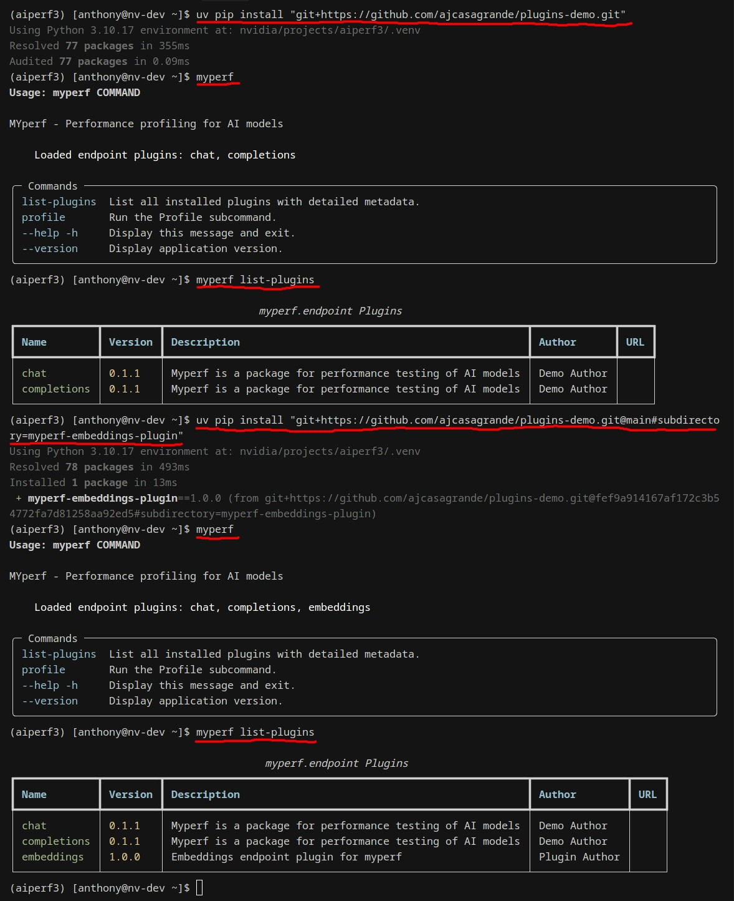
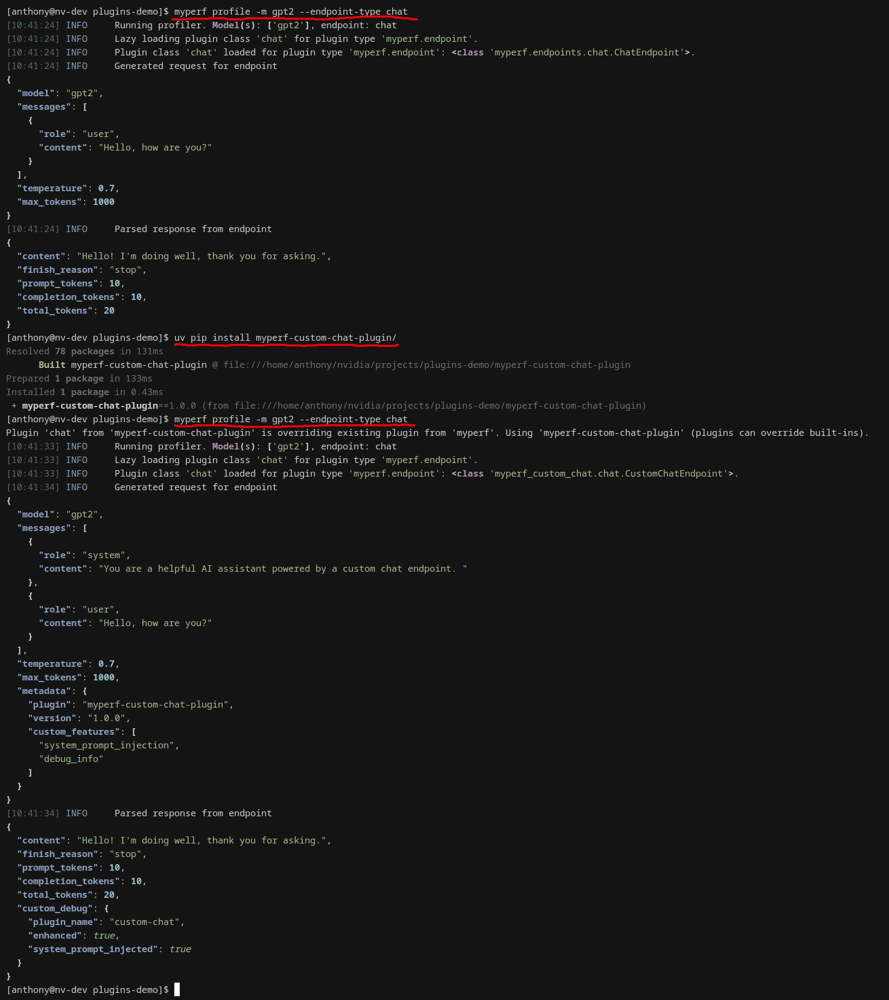

# AIP-001: Plugin Architecture for AIPerf

**Status**: Draft

**Authors**: Anthony Casagrande

**Category**: Architecture

**Sponsor**: Ganesh Kudleppanavar

**Required Reviewers**: Ganesh Kudleppanavar, Elias Bermudez

> [!NOTE]
> All of the following plugin names, endpoints, entry-points, and code examples are placeholders for demonstration purposes. The purpose of them is to demonstrate the proposed plugin architecture, not to dictate real implementations or use cases.

# Summary

Adopt a production-grade plugin architecture for AIPerf based on Python's entry points ecosystem, lazy loading, the [pluggy hook system](https://pluggy.readthedocs.io/), and [dependency injector](https://python-dependency-injector.ets-labs.org/). This enables third-party developers to add new endpoint types, data processors, metrics, exporters, timing strategies, and other functionality as standalone packages with independent release cycles, while maintaining zero-boilerplate plugin authorship and minimal startup overhead for the application.

# Motivation

## Current State: Generic Factory with Registry Pattern

AIPerf currently uses a sophisticated `AIPerfFactory` system in [`aiperf/common`](https://github.com/ai-dynamo/aiperf/tree/main/aiperf/common) with decorator-based registration, priority overrides, and multi-type support.

- Each factory is backed by an enum defining the supported implementations.

```python
class EndpointType(Enum):
    """Supported endpoint types."""

    CHAT = "chat"
    COMPLETIONS = "completions"
    EMBEDDINGS = "embeddings"
    RANKINGS = "rankings"
    RESPONSES = "responses"
    ...
```

- Implementations are registered to the factory via a decorator.
```python
@RequestConverterFactory.register(EndpointType.CHAT)
class OpenAIChatCompletionRequestConverter:
    """Request converter for OpenAI chat completion requests."""

    async def format_payload(self, model_endpoint, turn):
        # ... implementation
```

- Then, the factory is used to get the implementation for a given endpoint type.
```python
converter = RequestConverterFactory.create(user_config.endpoint_type)
converter.format_payload(model_endpoint, turn)
```

This provides significant internal flexibility but creates barriers for third-party extensibility.

**Current Approach Limitations:**

1. **Manual Discovery**: Plugins must be explicitly imported or directory-scanned at runtime
2. **Coupled Deployment**: Plugins live within the core codebase, preventing third-party extensions
3. **No Lazy Loading**: All decorated plugins imported at startup, even if unused
4. **Enum Bottleneck**: New endpoint types require core enum modifications and PRs

**Problem:** Third-party developers must fork core, modify enums, submit PR, wait for release.

## Proposed Solution: Standards-Based Plugin Ecosystem

**Entry Points Approach:**

- Plugin code implements the protocol
```python
class OpenAIChatEndpoint(BaseEndpoint):
    """OpenAI chat endpoint implementation."""

    async def format_payload(self, model_endpoint, turn):
        # ... implementation
```

- Implementations register via standard `pyproject.toml` entry points
```toml
[project.entry-points."aiperf.endpoint"]
chat = "aiperf.endpoints.openai_chat:OpenAIChatEndpoint"
completions = "aiperf.endpoints.openai_completions:OpenAICompletionsEndpoint"
responses = "aiperf.endpoints.openai_responses:OpenAIResponsesEndpoint"
rankings = "aiperf.endpoints.openai_rankings:OpenAIRankingsEndpoint"
embeddings = "aiperf.endpoints.openai_embeddings:OpenAIEmbeddingsEndpoint"
```

- Plugins are lazy loaded on first access.
```python
converter = PluginFactory().create(PluginType.ENDPOINT, user_config.endpoint_type)
converter.format_payload(model_endpoint, turn)
```

**Key Benefits:**
* **Automatic Discovery**: Python packaging standards handle registration
* **Lazy Loading**: Import plugins only when used, and not when the framework starts
* **True Third-Party Extensions**: Plugins as separate PyPI packages with independent release cycles
* **Zero-Touch Core**: Add plugins via `pip install` with no core framework changes
* **Dynamic Validation**: The CLI automatically adapts to installed plugins

**Key Insight**: The current `AIPerfFactory` works well for internal plugins. Entry points enable external ecosystem growth by removing core dependencies and enabling true third-party packages.

**Win-Win**: The current way of writing internal plugins is still valid, and the new way of writing external plugins is just as easy.

## Dependency Injection

The plugin architecture integrates with [`dependency-injector`](https://python-dependency-injector.ets-labs.org/) to provide automatic dependency injection for plugin constructors. This eliminates boilerplate code and allows plugins to declare their dependencies declaratively.

### How It Works

**1. Container Definition** - The core framework defines a DI container:

```python
class Container(containers.DeclarativeContainer):
    user_config = providers.Dependency(instance_of=UserConfig)
    # Add other shared dependencies here
```

**2. Container Registration** - The CLI registers the container at startup:

```python
app = App(name="aiperf")
container = Container()
register_loader_containers(container)  # ← Enables auto-wiring
```

**3. Plugin Usage** - Plugins use the `@inject` decorator to receive dependencies:

```python
class ChatEndpoint(BaseHttpEndpoint):
    @inject
    def __init__(
        self,
        user_config: UserConfig = Provide["user_config"],
    ) -> None:
        """Initialize with auto-injected dependencies."""
        self.user_config = user_config
```

**4. Automatic Injection** - When plugins are instantiated, dependencies are injected automatically:

```python
plugin_cls = PluginFactory().get_plugin_class(PluginType.ENDPOINT, "chat")
endpoint = plugin_cls()  # Dependencies injected automatically
```


## Goals

* Enable third-party developers to extend AIPerf without core modifications
* Maintain fast startup performance independent of plugin count
* Zero-boilerplate plugin authorship through automatic discovery
* Type-safe plugin contracts with IDE support
* Clear separation between framework, plugin system, and implementations
* Dependency injection for automatic configuration and service provisioning to plugins

## Non Goals

* Hot reloading, plugin sandboxing, GUI management (all out of scope)


## Demo




## Key Requirements

1. **Standards-Based Discovery**: Use Python's `importlib.metadata.entry_points()` - no custom registration
2. **Lazy Loading**: Defer imports until first access, extract metadata without loading code
3. **Automatic Metadata**: Extract version/author/description from package metadata
4. **Type Safety**: Protocol and/or Abstract Base Class-based contracts with static type checking
5. **Performance**: Fast factory initialization, minimal first-load overhead, negligible cached access overhead
6. **Thread Safety**: Concurrent access without race conditions
7. **Dependency Injection**: Automatic configuration and service provisioning to plugins

# Proposal

## How It Works

**1. Plugin Implementation**:

```python
class MyCustomEndpoint:
    @staticmethod
    def endpoint_metadata():
        return EndpointMetadata(endpoint_path="/v1/my-endpoint", supports_streaming=False, produces_tokens=False)

    async def format_payload(self, model_endpoint, turn): ...
    async def extract_response_data(self, record): ...

class GrpcTransport:
    @staticmethod
    def transport_metadata():
        return TransportMetadata(transport_name="grpc", supports_streaming=True)

    async def send_request(self, model_endpoint, payload): ...
```

**2. Registration** - Plugins register via standard `pyproject.toml`:
```toml
[project.entry-points."aiperf.endpoint"]
my_endpoint = "my_plugin:MyCustomEndpoint"

[project.entry-points."aiperf.transport"]
grpc = "aiperf_grpc:GrpcTransport"
```


# Implementation


## Core Components

**PluginFactory**: Thread-safe singleton with lazy loading and caching

**Plugin Types** (1 entry-point group per plugin type):
- `aiperf.endpoint` - API format handlers (NVIDIA NIM, OpenAI, etc.)
- `aiperf.transport` - Communication protocols (HTTP, gRPC, etc.)
- `aiperf.data_exporter` - Data exporters (CSV, JSON, etc.)
- `aiperf.processor` - Data processors
- `aiperf.metric` - Metrics (LLM Metrics, etc.)
- `aiperf.collector` - Data collectors (Prometheus, etc.)

**Validation**: The framework validates plugin compatibility before execution.

## Distribution

- **Core**: `pip install aiperf` (core framework with bundled plugins)
- **Optional**: `pip install aiperf[my-plugin]` or `aiperf[all]` (optional plugins)
- **Local**: `pip install -e .` (editable install)
- **Private**: `pip install git+https://...` (private repos)


## CLI Integration: Dynamic Validation

The CLI automatically adapts to installed plugins.

```bash
# Before: Only core plugins available
$ aiperf profile -h
  --endpoint-type          The endpoint type to send requests to on the server.
  [choices: chat, completions, embeddings, rankings, responses] [default: chat]
```
```bash
# Install a new plugin (example: aiperf-my-custom-endpoint)
$ pip install aiperf-my-custom-endpoint
```
```bash
# The CLI automatically adapts to installed plugins
$ aiperf profile -h
  --endpoint-type          The endpoint type to send requests to on the server.
  [choices: chat, completions, embeddings, rankings, responses, my-custom-endpoint] [default: chat]
```

## Overriding Built-in Functionality

Third-party plugins can override built-in functionality by using the same entry point name. This allows users to customize or enhance core functionality without forking.

**Plugin Precedence**: Third-party plugins take precedence over built-in plugins when they share the same name.

**Example**: Override the built-in `chat` endpoint with custom behavior:

```python
class CustomChatEndpoint(BaseHttpEndpoint):
    def format_request(self, request: dict) -> dict:
        # Add custom system prompt injection
        formatted = {
            "model": request.get("model"),
            "messages": [
                {"role": "system", "content": "Custom system prompt..."},
                {"role": "user", "content": request["prompt"]}
            ],
            # Add custom metadata field
            "metadata": {
                "plugin": "my-custom-chat",
                "version": "1.0.0"
            }
        }
        return formatted
```

**Register with same name** in `pyproject.toml`:
```toml
[project.entry-points."aiperf.endpoint"]
chat = "my_custom_chat.chat:CustomChatEndpoint"  # Overrides built-in "chat"
```

**Usage**:
```bash
$ pip install my-custom-chat-plugin
# Warning shown at runtime:
# "Plugin 'chat' from 'my-custom-chat-plugin' is overriding existing plugin from 'aiperf'"

$ aiperf profile --endpoint-type chat  # Uses custom implementation
```

> [!NOTE]
> Users can revert to built-in behavior by uninstalling the override plugin.

### Demo



## Full Example Demo Repo
I have created a full example demo repo that demonstrates the plugin architecture in action. It is available [here](https://github.com/ajcasagrande/plugins-demo). Below is a demo of how to install, use, and uninstall plugins of a
fictitious benchmark application called `myperf`, meant to mimic the AIPerf CLI. 

Keep in mind that the `myperf` CLI is not real, and the plugins are fictitious as well. It is meant to demonstrate the plugin architecture in action, and the data used and returned from it is fictitious as well.

It is open source and can be installed directly from GitHub.

**1. Install the core application and framework.**
```bash
pip install "git+https://github.com/ajcasagrande/plugins-demo.git"
```
**2. List the plugins and check the help text.**
```bash
myperf list-plugins
myperf profile -h
myperf profile --endpoint-type chat -m Qwen/Qwen3-0.6B
```
**3. Install the plugin that adds a fake embeddings endpoint.**
```bash
pip install "git+https://github.com/ajcasagrande/plugins-demo.git@main#subdirectory=myperf-embeddings-plugin"
```
**4. List the plugins, check the help text, and use the new plugin.**
```bash
myperf list-plugins
myperf profile -h
myperf profile --endpoint-type embeddings -m Qwen/Qwen3-0.6B
```
**5. Install the plugin that overrides the built-in `chat` endpoint.**
```bash
pip install "git+https://github.com/ajcasagrande/plugins-demo.git@main#subdirectory=myperf-custom-chat-plugin"
```
**6. List the plugins, check the help text, and use the new plugin that overrides the built-in `chat` endpoint.**
```bash
myperf list-plugins
myperf profile -h
myperf profile --endpoint-type chat -m Qwen/Qwen3-0.6B
```
**7. Uninstall the override plugin**
```bash
pip uninstall myperf-custom-chat-plugin
```
**8. List the plugins, check the help text, and use the built-in `chat` endpoint again.**
```bash
myperf list-plugins
myperf profile -h
myperf profile --endpoint-type chat -m Qwen/Qwen3-0.6B
```
**9. Uninstall the plugins and the core application.**
```bash
pip uninstall myperf-embeddings-plugin myperf-custom-chat-plugin myperf
```


# Alternate Solutions Considered

| Approach | Rejected Because |
|----------|------------------|
| **Custom Discovery System** | Reinvents standard Python packaging mechanism |
| **Class Registry Pattern** | Manual registration, can't support third-party packages, no lazy loading |
| **Manual Decorator Scanning** | Provides lazy loading, but not as easy as entry points, more custom code that needs to be maintained and tested |

# References

- [PEP 566](https://peps.python.org/pep-0566/) - Entry Points
- [PEP 544](https://peps.python.org/pep-0544/) - Protocols
- [Pluggy Docs](https://pluggy.readthedocs.io/) - Hook System
- [Dependency Injector](https://python-dependency-injector.ets-labs.org/) - Dependency Injection
