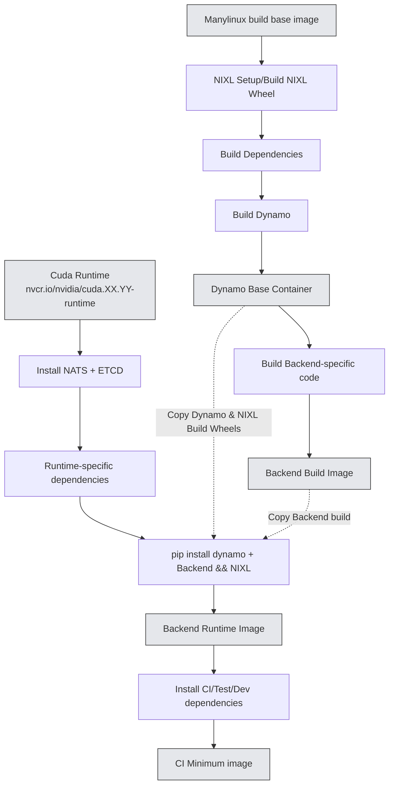

# Container Build Process Optimization

**Status**: Ready for Review

**Authors**: [nv-tusharma] 

**Category**: Architecture

**Replaces**: N/A

**Replaced By**: N/A

**Sponsor**: saturley-hall, nv-anants

**Required Reviewers**: nnshah1, saturley-hall, nv-anants, nvda-mesharma, mc-nv, dmitry-tokarev-nv, pvijayakrish

**Review Date**: 2025-07-15

**Pull Request**: TBD

**Implementation PR / Tracking Issue**: TBD

# Summary

This document outlines a container build process optimization strategy for Dynamo to enhance the developer experience by re-organizing Dockerfiles along with defining a clear and maintainable structure for our Dockerfiles. 

One of the goals for this document is to define a clear and maintainable structure for our Dockerfiles. Specifically, to determine how many Dockerfiles we need and clarify the relationships between base, runtime, development, and CI images. The aim is to ensure each environment's Dockerfile builds upon the previous (as supersets), maximizing environment consistency and coverage during daily development and testing. 

To achieve this goal, this document proposes certain optimizations to improve the current build process:
- Restructuring the build process to provide a base container with a pre-built version of Dynamo + NIXL available on all distributions, enabling splitting of specific backends from the dynamo build process.
- Defining a structure/template for all Dockerfiles to follow to ensure consistent and reproducible builds across backends along with specific roles/use cases targeted for each stage.

# Motivation

Dynamo's current container architecture consists of multiple Dockerfiles in the `/containers` directory of the [Dynamo repository](https://github.com/NVIDIA/Dynamo). These Dockerfiles are organized by backend (vLLM, sglang, TRT-LLM) and contain multiple stages (base, devel, ci, runtime) for different use cases. Each stage includes a Dynamo build, the specific backend, and NIXL - our high-throughput, low-latency point-to-point communication library for accelerating inference. 

The current approach faces several challenges:

1. **Inefficient Build Process**: Components like Dynamo, NIXL, and backends are installed multiple times across stages instead of using a layered approach. Stages do not build upon each other which leads to repeated steps and inefficient build times.

2. **Developer Experience Issues**: The unclear organization of Dockerfiles makes it difficult for developers to choose the right build for their needs, often defaulting to the devel build regardless of use case.

3. **Build Reliability**: The complex layering and repeated steps across stages can lead to intermittent build failures.

4. **Inconsistent Standards**: Without a unified Dockerfile for building Dynamo, NIXL, and dependencies, code is duplicated or missing across backend-specific Dockerfiles, and optimizations aren't shared effectively.

This document proposes solutions to the build process challenges, aiming to improve overall container build efficiency and developer experience.

## Goals

* Remove duplicate code in current dockerfile implementations and define a single build base image which provides a pre-built container with Dynamo + NIXL.

This base image should operate as a single base container which can then be used as base containers for backend-specific images. By leveraging a base container, We can reduce the redundant code across Dockerfiles and establish a single-source of truth for all Dynamo-builds.

* Define the relationships between base, runtime, development, and CI images for each Dockerfile and provide a structure/template to follow for Dockerfiles. 

* Reduce build flakiness by pinning/fixing dependencies in the base image from package managers and squashing/reducing layers as necessary

Pinning/Fixing dependencies will ensure a unified build environment reducing "it works on my machine" problems or "this worked yesterday"

* Minimize effort for providing multi-arch support across various backends for Dynamo by leveraging manylinux to build for multiple distributions

### Non Goals

- Container release strategy and processes (covered in separate DEP)
- Unified build environment
- Outline possible further improvements including external caching/multi-context docker builds to reduce build times. 

## Requirements

### REQ \<\#1\> \<Backend Integration with Base Container\>
The build-base container must be designed such that backend-specific Dockerfiles can integrate with it with minimal changes to their existing build process. This includes:
- Multi-arch support is a P0. The Base container should be able to support both x84_64 and arm64 builds. 
- Clear documentation on how to use the base container
- Standardized environment variables and paths

### REQ \<\#2\> \<Layered Container Structure\>
Dockerfiles must follow a layered, super-set structure to optimize build efficiency:
- Each stage should build upon the previous stage or use artifacts from the previous stage
- Artifacts should be built only once and reused across stages
- Clear separation between build-time and runtime dependencies
- Minimal layer count to reduce build complexity

### REQ \<\#3\> \<Stage Purpose Definition\>
Each build stage must have a clearly defined purpose and scope:
- Base: NIXL + Dynamo build from a manylinux container (Enables support on multiple platforms)
- Backend Build: Builds the specified backend along with any dependencies required for the backend
- Runtime: Minimal production deployment requirements
- CI: Testing tools and validation requirements built on runtime

# Proposal

In order to address the requirements, we propose the following changes to the Dynamo build process:

## Build-Base Container

The base container will be a pre-built container that will be used by the backends to build the final container image. This build base container will contain a Dynamo build for all backends to use for their framework-specific build. The base image will leverage a manylinux base image to enable support for multiple distributions (U22, U24, etc). The container will also include a NIXL build since this is common across all backends. We will create a new Dockerfile in the /containers directory for this container and provide the image through our CI registry for developers to use for local development. The base container must provide multi-arch support.

## Use-case of build stages along with relationship between stages (base, runtime, devel, ci_minimum)

Each backend-specific Dockerfile should follow a specific format. The backend-specific Dockerfiles should be divided up into multiple stages, with each stage inheriting artifacts/leveraging the previous stage as the base container. The following stages should be defined in the backend-specific Dockerfile: 

| Stage    | Targeted User                | Base Image           | Functionality                                                                                                         |
|----------|---------------------|----------------------|----------------------------------------------------------------------------------------------------------------------|
| Backend Build    | Developers          | Cuda base devel image     | Builds targeted backend along with backend-specific dependencies. 
| Runtime  | Customers/Production| Cuda base runtime image| Minimal image with only the dependencies required to deploy and run Dynamo w/backend from the backend build stage; intended for production deployments. Copies dynamo artifacts from base image and backend artifaces from backend build image. |
| CI       | Developers/Internal CI Pipelines/Local Debugging | Runtime image          | Adds CI-specific tools, QA test scripts, internal models, and other dependencies needed for automated testing.         |

The CUDA base images will be used from the [NVIDIA CUDA Container Registry](https://catalog.ngc.nvidia.com/orgs/nvidia/containers/cuda). Please refer to the Pros and Cons section for more details on why we chose to use the cuda runtime image instead of the Deep Learning CUDA image.

# Implementation Details

## Container Build Flow



The diagram above illustrates the proposed container build strategy showing the relationships between:
- Build Base Container with common dependencies
- Backend-specific development containers
- Runtime containers
- CI containers

This layered approach ensures consistent builds, reduces duplication, and improves maintainability across all backend implementations.

## Dockerfile Structure Template

Each backend-specific Dockerfile will follow this standardized structure:

```dockerfile
# Backend Build Stage
FROM nvcr.io/nvidia/cuda:XX.YY-devel-ubuntuXX.XX as backend-build
# Install backend-specific dependencies and build backend

# Runtime Stage  
FROM nvcr.io/nvidia/cuda:XX.YY-runtime-ubuntuXX.XX as runtime
# Copy dynamo and NIXL wheels from base container
# Copy backend artifacts from backend-build stage
# Install runtime dependencies only

# CI Stage
FROM runtime as ci
# Add CI-specific tools and test dependencies
```

## Dependency Management

- **Pinned Dependencies**: All dependencies will be pinned to specific versions in the base container
- **Multi-arch Support**: Base container will support both x86_64 and arm64 architectures
- **Minimal Runtime**: Runtime images will only include necessary dependencies for production deployment
- **Layered Caching**: Build layers will be optimized for Docker build cache efficiency

## Deferred to Implementation

TBD

# Implementation Phases

## Phase \<\#1\> \<Build Base Container Development\>

**Release Target**: TBD

**Release Target**: Date

**Effort Estimate**: \<estimate of time and number of engineers to complete the phase\>

**Work Item(s):** \<one or more links to github issues\>

**Supported API / Behavior:**

* Pre-built Dynamo base container with multi-arch support
* NIXL integration in base container
* Manylinux base for broad distribution compatibility
* Standardized environment variables and paths
* Pinned dependencies for base container

**Not Supported:**

* Advanced caching mechanisms (e.g. multi-context docker builds)

## Phase \<\#2\> \<Restructure backend Dockerfiles to follow proposed structure\>

**Release Target**: Date

**Effort Estimate**: \<estimate of time and number of engineers to complete the phase\>

**Work Item(s):** \<one or more links to github issues\>

**Supported API / Behavior:**

* Updated vLLM, sglang, and TRT-LLM Dockerfiles following new structure
* Clear separation between backend build, runtime, and CI stages
* Integration with base container for Dynamo and NIXL dependencies
* Reduced build times through improved layering
* Backward compatibility with existing Dockerfiles
* Pinned dependencies for backend builds

**Not Supported:**


# Related Proposals

**\[Optional \- if not applicable omit\]**

# Alternate Solutions

**\[Required, if not applicable write N/A\]**

List out solutions that were considered but ultimately rejected. Consider free form \- but a possible format shown below.

## Alt \<\# 1\> \<Using Deep Learning CUDA images as base image instead of cuda runtime\>

**Pros:**

- Dynamo would be in sync with the latest Deep Learning CUDA release
- Deep Learning CUDA image can provide additional libraries such as cuDNN, NCCL, etc which can accelerate deep learning workloads.
- TritonServer is built on top of the Deep Learning CUDA image, so would be a good reference for the use-case.

**Cons:**

- Container Size is too large for the use-case. The cuda runtime image we use is around 6 GB whereas the Deep Learning Cuda runtime is around 11 GB, uncompressed.
- Introduces additional dependencies that are not required for Dynamo, which can increase the container size and build time.
- Dynamo has NIXL as it's communication library, so a dependency on NCCL is not required.

**Reason Rejected:**

- Container Size is too large for the use-case. The cuda runtime image we use is around 6 GB whereas the Deep Learning cuda runtime is around 11 GB, uncompressed.
- Introduces additional dependencies that are not required for Dynamo, which can increase the container size and build time.


# Background

**\[Optional \- if not applicable omit\]**

Add additional context and references as needed to help reviewers and authors understand the context of the problem and solution being proposed.

## References

**\[Optional \- if not applicable omit\]**

Add additional references as needed to help reviewers and authors understand the context of the problem and solution being proposed.

* \<hyper-linked title of an external reference resource\>

## Terminology & Definitions

| Term | Definition |
| :---- | :---- |
| **Base Container** | Pre-built container with Dynamo and NIXL that serves as foundation for backend-specific builds |
| **Backend Build** | Container stage that builds backend-specific code and dependencies |
| **CI Stage** | Container stage with testing tools and validation requirements |
| **Manylinux** | PEP 513 standard for Linux wheel distribution compatibility |
| **NIXL** | High-throughput, low-latency point-to-point communication library for accelerating inference |
| **Runtime Stage** | Minimal container stage with only production deployment requirements |

## Acronyms & Abbreviations

**CI:** Continuous Integration

**DEP:** Design Enhancement Proposal

**NIXL:** NVIDIA Inference Exchange Library


