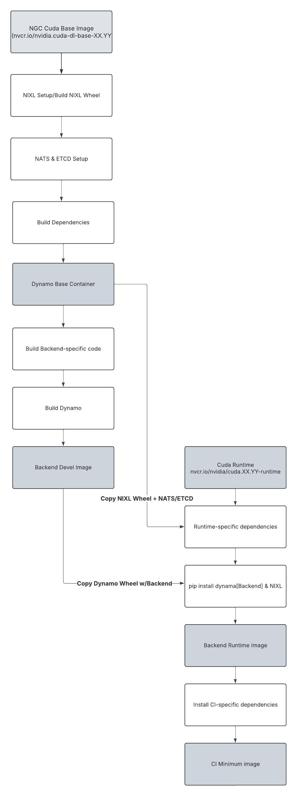

# Container Strategy 

**Status**: Draft

**Authors**: [nv-tusharma] 

**Category**: Architecture

**Replaces**: N/A

**Replaced By**: N/A

**Sponsor**: saturley-hall, nv-anants

**Required Reviewers**: nnshah1, saturley-hall, nv-anants, nvda-mesharma, mc-nv, dmitry-tokarev-nv, pvijayakrish

**Review Date**: 2025-06-03

**Pull Request**: TBD

**Implementation PR / Tracking Issue**: TBD

# Summary

This document outlines a container strategy for Dynamo to enhance the developer experience by 
organizing Dockerfiles to maximize coverage and reuse. The primary goal for this document is to define a clear and maintainable structure for our Dockerfiles—specifically, to determine how many Dockerfiles we need and clarify the relationships between base, runtime, development, and CI images. The aim is to ensure each environment's Dockerfile builds upon the previous (as supersets), maximizing environment consistency and coverage during daily development and testing. 
To achieve this goal, this document proposes certain optimizations to improve the current build process:
- Restructuring the build process to provide a build-base container which contains all build dependencies, enabling specific backends to use the build base container to build the final binary.
- Defining a structure/template for all Dockerfiles to follow to ensure consistent and reproducible builds across backends along with specific roles/use cases targeted for each stage.

# Motivation

Dynamo is primarily built from a collection of Dockerfiles hosted in the /containers directory of the [Dynamo repository](https://github.com/NVIDIA/Dynamo). Dockerfiles are split by backends (vLLM, sglang, TRT-LLM) and each Dockerfile contains multiple stages
(base, devel, ci, runtime) to account for different purposes. Each stage essentially provides a Dynamo build along with the specific backend (vLLM, TRT-LLM, etc) and NIXL, the high-throughput, low-latency point-to-point communication library used by Dynamo to accelerate inference. 
This approach has several drawbacks, including:
1. Inefficient Build Times: Components such as Dynamo, NIXL, and the selected backend are rebuilt multiple times across stages, instead of leveraging a layered, superset structure. For instance, Dynamo is installed three separate times in the Dockerfile.vllm—once each in the base, ci_minimum, and runtime stages.
2. Poor Developer Experience: The lack of clear organization among Dockerfiles makes it difficult for developers to identify which build suits their needs. As a result, the devel build is often used by default, regardless of the use case.
3. Flaky Builds: Due to the large number of layers along with multiple repeated steps across stages, builds can fail intermittently resulting in flaky builds. 
4. Lack of standardization across Dockerfiles: Currently, there is not a single, stand-alone Dockerfile to build Dynamo, NIXL, and dynamo dependencies resulting in duplicated/missing code across multiple Dockerfiles. Optimizations applied to one backend's Dockerfile are not immediately available to other backend-specific Dockerfiles.

As Dynamo continues to scale to support multiple LLM backends along with efforts to provide pre-built Docker containers for external usage, we need to define a structure to our Dockerfiles to improve container usability.

## Goals

* Remove duplicate code in current dockerfile implementations and define a single build base image containing all the necessary dependencies to build Dynamo/NIXL specific dependencies.

This build-base image should operate as a single base container which can then be used as base containers for backend-specific images. By leveraging a build base container, We can reduce the redundant code across Dockerfiles and establish a single-source of truth for all Dynamo-builds.

* Define the relationships between base, runtime, development, and CI images for each Dockerfile and provide a structure/template to follow for Dockerfiles. 

* Reduce build flakiness by pinning/fixing dependencies in the base image from package managers and squashing/reducing layers as necessary

Pinning/Fixing dependencies will ensure a unified build environment reducing "it works on my machine" problems or "this worked yesterday"

* Outline possible further improvements including external caching/multi-context docker builds to reduce build times. 

### Non Goals

- Slim backend-specific runtime containers to use for performance testing. 
- Unified build environment

## Requirements

### REQ \<\#1\> \<Backend Integration with Base Container\>
The build-base container must be designed such that backend-specific Dockerfiles can integrate with it with minimal changes to their existing build process. This includes:
- Clear documentation on how to use the base container
- Standardized environment variables and paths

### REQ \<\#2\> \<Layered Container Structure\>
Dockerfiles must follow a layered, super-set structure to optimize build efficiency:
- Each stage should build upon the previous stage
- Artifacts should be built only once and reused across stages
- Clear separation between build-time and runtime dependencies
- Minimal layer count to reduce build complexity

### REQ \<\#3\> \<Stage Purpose Definition\>
Each build stage must have a clearly defined purpose and scope:
- Base: Common build dependencies and tools
- Development: Additional debugging and development tools
- Runtime: Minimal production deployment requirements
- CI: Testing tools and validation requirements

# Proposal

In order to address the requirements, we propose the following changes to the Dynamo build process:

## Build-Base Container

The build-base container will be a pre-built container that will be used by the backends to build the final container image. This build base container will contain all the necessary dependencies to build Dynamo. The dependencies should either be pinned or fixed to a particular commit SHA to promote reproducibility. The container will also include a NIXL build + NATS + ETCD installation since this is common across all backends. We will create a new Dockerfile in the /containers directory for this container and provide the image through our CI registry for developers to use for local development.

## Use-case of build stages along with relationship between stages (base, runtime, devel, ci_minimum)

Each backend-specific Dockerfile should follow a specific format. The backend-specific Dockerfiles should be divided up into multiple stages, with each stage inheriting artifacts/leveraging the previous stage as the base container. The following stages should be defined in the backend-specific Dockerfile: 

| Stage    | Targeted User                | Base Image           | Functionality                                                                                                         |
|----------|---------------------|----------------------|----------------------------------------------------------------------------------------------------------------------|
| Devel    | Developers          | Dynamo Build base image     | Builds targeted backend and Dynamo; includes development tools for debugging and continuous development.              |
| Runtime  | Customers/Production| Cuda base runtime image| Minimal image with only the dependencies required to deploy and run Dynamo; intended for production deployments.      |
| CI       | Internal CI Pipelines/Local CI Debugging | Runtime image          | Adds CI-specific tools, QA test scripts, internal models, and other dependencies needed for automated testing.         |

# Implementation Details

## Container Build Flow

The diagram above illustrates the proposed container strategy showing the relationships between:
- Build Base Container with common dependencies
- Backend-specific development containers
- Runtime containers
- CI containers

This layered approach ensures consistent builds, reduces duplication, and improves maintainability across all backend implementations.

## Deferred to Implementation

TBD

# Implementation Phases

## Phase \<\#1\> \<Build Base Container Development\>

**Release Target**: TBD

**Release Target**: Date

**Effort Estimate**: \<estimate of time and number of engineers to complete the phase\>

**Work Item(s):** \<one or more links to github issues\>

**Supported API / Behavior:**

* \<name and concise description of the API / behavior\>

**Not Supported:**

* \<name and concise description of the API / behavior\>

## Phase \<\#2\> \<Restructure backend Dockerfiles to follow proposed structure\>

**Release Target**: Date

**Effort Estimate**: \<estimate of time and number of engineers to complete the phase\>

**Work Item(s):** \<one or more links to github issues\>

**Supported API / Behavior:**

* \<name and concise description of the API / behavior\>

**Not Supported:**

* \<name and concise description of the API / behavior\>

# Related Proposals

**\[Optional \- if not applicable omit\]**

* File

* File

* File

* File

* File

# Alternate Solutions

**\[Required, if not applicable write N/A\]**

List out solutions that were considered but ultimately rejected. Consider free form \- but a possible format shown below.

## Alt \<\#\> \<Title\>

**Pros:**

\<bulleted list or pros describing the positive aspects of this solution\>

**Cons:**

\<bulleted list or pros describing the negative aspects of this solution\>

**Reason Rejected:**

\<bulleted list or pros describing why this option was not used\>

**Notes:**

\<optional: additional comments about this solution\>

# Background

**\[Optional \- if not applicable omit\]**

Add additional context and references as needed to help reviewers and authors understand the context of the problem and solution being proposed.

## References

**\[Optional \- if not applicable omit\]**

Add additional references as needed to help reviewers and authors understand the context of the problem and solution being proposed.

* \<hyper-linked title of an external reference resource\>

## Terminology & Definitions

**\[Optional \- if not applicable omit\]**

List out additional terms / definitions (lexicon). Try to keep definitions as concise as possible and use links to external resources when additional information would be useful to the reader.

Keep the list of terms sorted alphabetically to ease looking up definitions by readers.

| \<Term\> | \<Definition\> |
| :---- | :---- |
| **\<Term\>** | \<Definition\> |

## Acronyms & Abbreviations

**\[Optional \- if not applicable omit\]**

Provide a list of frequently used acronyms and abbreviations which are uncommon or unlikely to be known by the reader. Do not include acronyms or abbreviations which the reader is likely to be familiar with.

Keep the list of acronyms and abbreviations sorted alphabetically to ease looking up definitions by readers.

Do not include the full definition in the expanded meaning of an abbreviation or acronym. If the reader needs the definition, please include it in the [Terminology & Definitions](#terminology--definitions) section.

**\<Acronym/Abbreviation\>:** \<Expanded Meaning\>

