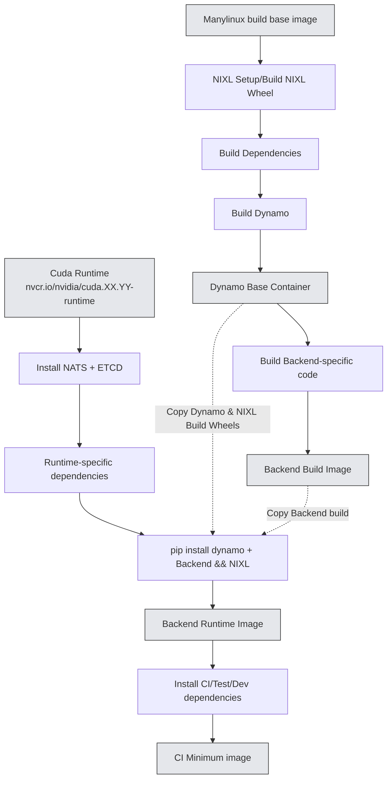
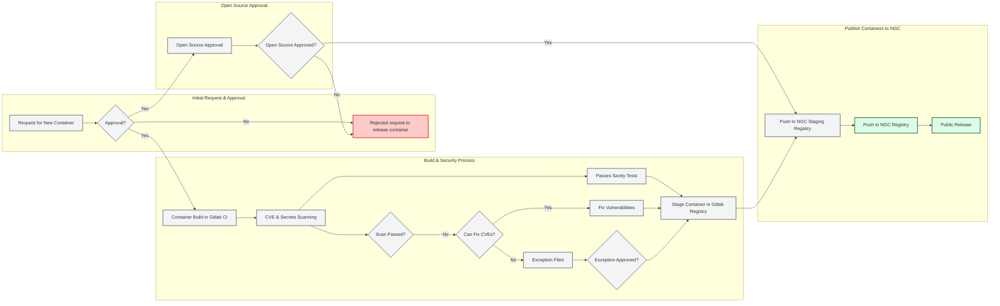

# Container Strategy 

**Status**: Draft

**Authors**: [nv-tusharma] 

**Category**: Architecture

**Replaces**: N/A

**Replaced By**: N/A

**Sponsor**: saturley-hall, nv-anants

**Required Reviewers**: nnshah1, saturley-hall, nv-anants, nvda-mesharma, mc-nv, dmitry-tokarev-nv, pvijayakrish

**Review Date**: 2025-06-03

**Pull Request**: TBD

**Implementation PR / Tracking Issue**: TBD

# Summary

This document outlines a container strategy for Dynamo to enhance the developer experience by 
re-organizing Dockerfile along with defining a strategy for releasing pre-built Dynamo containers publicly. 

One of the goals for this document is to define a clear and maintainable structure for our Dockerfiles. Specifically, to determine how many Dockerfiles we need and clarify the relationships between base, runtime, development, and CI images. The aim is to ensure each environment's Dockerfile builds upon the previous (as supersets), maximizing environment consistency and coverage during daily development and testing. 
To achieve this goal, this document proposes certain optimizations to improve the current build process:
- Restructuring the build process to provide a base container with a pre-built version of Dynamo + NIXL available on all distributions, enabling splitting of specific backends from the dynamo build process.
- Defining a structure/template for all Dockerfiles to follow to ensure consistent and reproducible builds across backends along with specific roles/use cases targeted for each stage.

This DEP also outlines Dynamo's container release process. Since pre-built containers represent an important distribution method, we need to establish clear guidelines for: (1) which containers to release, (2) the requirements and processes for releasing these containers, and (3) the container registry to publish these containers to. 

# Motivation

Dynamo's current container architecture consists of multiple Dockerfiles in the `/containers` directory of the [Dynamo repository](https://github.com/NVIDIA/Dynamo). These Dockerfiles are organized by backend (vLLM, sglang, TRT-LLM) and contain multiple stages (base, devel, ci, runtime) for different use cases. Each stage includes a Dynamo build, the specific backend, and NIXL - our high-throughput, low-latency point-to-point communication library for accelerating inference. 
The current approach faces several challenges:

1. **Inefficient Build Process**: Components like Dynamo, NIXL, and backends are rebuilt across stages instead of using a layered approach. For example, in Dockerfile.vllm, Dynamo is installed three times - in base, ci_minimum, and runtime stages.

2. **Developer Experience Issues**: The unclear organization of Dockerfiles makes it difficult for developers to choose the right build for their needs, often defaulting to the devel build regardless of use case.

3. **Build Reliability**: The complex layering and repeated steps across stages lead to intermittent build failures.

4. **Inconsistent Standards**: Without a unified Dockerfile for building Dynamo, NIXL, and dependencies, code is duplicated or missing across backend-specific Dockerfiles, and optimizations aren't shared effectively.

Additionally, as Dynamo expands its support for multiple LLM backends, we need a clear container release strategy to:
- Provide pre-built backend containers along with Dynamo deploy containers (api-operator, api-store) to a public container registry
- Ensure consistent quality and security across released containers
- Simplify the deployment process for end users
- Maintain version control and compatibility across Dynamo releases

This document proposes solutions to both the build process challenges and establishes a framework for container releases, aiming to improve overall container usability and deployment experience.

## Goals

* Remove duplicate code in current dockerfile implementations and define a single build base image which provides a pre-built container with Dynamo + NIXL.

This base image should operate as a single base container which can then be used as base containers for backend-specific images. By leveraging a base container, We can reduce the redundant code across Dockerfiles and establish a single-source of truth for all Dynamo-builds.

* Define the relationships between base, runtime, development, and CI images for each Dockerfile and provide a structure/template to follow for Dockerfiles. 

* Reduce build flakiness by pinning/fixing dependencies in the base image from package managers and squashing/reducing layers as necessary

Pinning/Fixing dependencies will ensure a unified build environment reducing "it works on my machine" problems or "this worked yesterday"

* Minimize effort for providing multi-arch support across various backends for Dynamo by leveraging manylinux to build for multiple distributions

* Outline a container release strategy which enables Dynamo team to release containers as part of Dynamo releases

### Non Goals

- Slim backend-specific runtime containers to use for performance testing. 
- Unified build environment
- Outline possible further improvements including external caching/multi-context docker builds to reduce build times. 

## Requirements

### REQ \<\#1\> \<Backend Integration with Base Container\>
The build-base container must be designed such that backend-specific Dockerfiles can integrate with it with minimal changes to their existing build process. This includes:
- Multi-arch support is a P0. The Base container should be able to support both x84_64 and arm64 builds. 
- Clear documentation on how to use the base container
- Standardized environment variables and paths

### REQ \<\#2\> \<Layered Container Structure\>
Dockerfiles must follow a layered, super-set structure to optimize build efficiency:
- Each stage should build upon the previous stage or use artifacts from the previous stage
- Artifacts should be built only once and reused across stages
- Clear separation between build-time and runtime dependencies
- Minimal layer count to reduce build complexity

### REQ \<\#3\> \<Stage Purpose Definition\>
Each build stage must have a clearly defined purpose and scope:
- Base: NIXL + Dynamo build from a manylinux container (Enables support on multiple platforms)
- Backend Build: Builds the specified backend along with any dependencies required for the backend
- Runtime: Minimal production deployment requirements
- CI: Testing tools and validation requirements built on runtime

### REQ \<\#4\> \<Container Release Process\>
Define a process on how containers should be released as part of Dynamo releases. This should include:
- Justification and approval process for releasing containers
- The minimum requirements and processes required for releasing these containers
- The container registry to publish these containers to along with location of staged container images.
- The process for releasing the containers to the container registry.

# Proposal

In order to address the requirements, we propose the following changes to the Dynamo build process:

## Build-Base Container

The base container will be a pre-built container that will be used by the backends to build the final container image. This build base container will contain a Dynamo build for all backends to use for their framework-specific build. The base image will leverage a manylinux base image to enable support for multiple distributions (U22, U24, etc). The container will also include a NIXL build since this is common across all backends. We will create a new Dockerfile in the /containers directory for this container and provide the image through our CI registry for developers to use for local development. The base container must provide multi-arch support.

## Use-case of build stages along with relationship between stages (base, runtime, devel, ci_minimum)

Each backend-specific Dockerfile should follow a specific format. The backend-specific Dockerfiles should be divided up into multiple stages, with each stage inheriting artifacts/leveraging the previous stage as the base container. The following stages should be defined in the backend-specific Dockerfile: 

| Stage    | Targeted User                | Base Image           | Functionality                                                                                                         |
|----------|---------------------|----------------------|----------------------------------------------------------------------------------------------------------------------|
| Backend Build    | Developers          | Cuda base devel image     | Builds targeted backend along with backend-specific dependencies. 
| Runtime  | Customers/Production| Cuda base runtime image| Minimal image with only the dependencies required to deploy and run Dynamo w/backend from the backend build stage; intended for production deployments. Copies dynamo artifacts from base image and backend artifaces from backend build image. |
| CI       | Developers/Internal CI Pipelines/Local Debugging | Runtime image          | Adds CI-specific tools, QA test scripts, internal models, and other dependencies needed for automated testing.         |

Although the Dynamo base container is required to have multi-arch support, the backend builds aren't required to have immediate multi-arch support since backends often require different build logic across multiple architectures. 

# Implementation Details

## Container Build Flow

The diagram above illustrates the proposed container strategy showing the relationships between:
- Build Base Container with common dependencies
- Backend-specific development containers
- Runtime containers
- CI containers

This layered approach ensures consistent builds, reduces duplication, and improves maintainability across all backend implementations.

## Container Release Strategy

Which containers to release:
Containers need proper justification and Org3 approval from the team to be released. Approval is required for all containers to be released. The following information is required:
- Development/Operations PIC for the container
- Functionality of the container
- Justification for the container release
- Expected container size
- Name of the container
- The container registry to publish these containers to (NGC, Github, etc) along with location of staged container images.
- When will the container be released?
- Why are we releasing this container?
- OSRB request?

This information can be provided in the Request for new asset form. If the container is not approved, the container will not be released.

## Container Release Process

The container release process follows a structured workflow that ensures quality, security, and proper governance. The process begins with a request for a new container that requires approval before proceeding. Once approved, the container undergoes a build and security process in Gitlab CI, including CVE scanning and vulnerability fixes. If vulnerabilities cannot be fixed, an exception must be filed with the required approval before proceeding with the release process. The container must also receive open source approval before being released to NGC registry for public distribution.

## Deferred to Implementation

TBD

# Implementation Phases

## Phase \<\#1\> \<Build Base Container Development\>

**Release Target**: TBD

**Release Target**: Date

**Effort Estimate**: \<estimate of time and number of engineers to complete the phase\>

**Work Item(s):** \<one or more links to github issues\>

**Supported API / Behavior:**

* \<name and concise description of the API / behavior\>

**Not Supported:**

* \<name and concise description of the API / behavior\>

## Phase \<\#2\> \<Restructure backend Dockerfiles to follow proposed structure\>

**Release Target**: Date

**Effort Estimate**: \<estimate of time and number of engineers to complete the phase\>

**Work Item(s):** \<one or more links to github issues\>

**Supported API / Behavior:**

* \<name and concise description of the API / behavior\>

**Not Supported:**

* \<name and concise description of the API / behavior\>

# Related Proposals

**\[Optional \- if not applicable omit\]**

* File

* File

* File

* File

* File

# Alternate Solutions

**\[Required, if not applicable write N/A\]**

List out solutions that were considered but ultimately rejected. Consider free form \- but a possible format shown below.

## Alt \<\#\> \<Title\>

**Pros:**

\<bulleted list or pros describing the positive aspects of this solution\>

**Cons:**

\<bulleted list or pros describing the negative aspects of this solution\>

**Reason Rejected:**

\<bulleted list or pros describing why this option was not used\>

**Notes:**

\<optional: additional comments about this solution\>

# Background

**\[Optional \- if not applicable omit\]**

Add additional context and references as needed to help reviewers and authors understand the context of the problem and solution being proposed.

## References

**\[Optional \- if not applicable omit\]**

Add additional references as needed to help reviewers and authors understand the context of the problem and solution being proposed.

* \<hyper-linked title of an external reference resource\>

## Terminology & Definitions

**\[Optional \- if not applicable omit\]**

List out additional terms / definitions (lexicon). Try to keep definitions as concise as possible and use links to external resources when additional information would be useful to the reader.

Keep the list of terms sorted alphabetically to ease looking up definitions by readers.

| \<Term\> | \<Definition\> |
| :---- | :---- |
| **\<Term\>** | \<Definition\> |

## Acronyms & Abbreviations

**\[Optional \- if not applicable omit\]**

Provide a list of frequently used acronyms and abbreviations which are uncommon or unlikely to be known by the reader. Do not include acronyms or abbreviations which the reader is likely to be familiar with.

Keep the list of acronyms and abbreviations sorted alphabetically to ease looking up definitions by readers.

Do not include the full definition in the expanded meaning of an abbreviation or acronym. If the reader needs the definition, please include it in the [Terminology & Definitions](#terminology--definitions) section.

**\<Acronym/Abbreviation\>:** \<Expanded Meaning\>

