# Fault Tolerance Definitions and Test Cases

**Status**: Draft 

**Authors**: nnshah1, vikram, biswa, harrison, kkranen

**Category**: Architecture 

**Replaces**: N/A

**Replaced By**: N/A

**Sponsor**: nnshah1

**Required Reviewers**: TBD

**Review Date**: TBD

**Pull Request**: [pull/4](https://github.com/ai-dynamo/enhancements/pull/4)

**Implementation PR / Tracking Issue**: TBD

# Summary

Outline and define fault tolerance definitions, goals and test cases
for dynamo.

This DEP defines fault tolerance requirements and behaviors for the
Dynamo inference serving framework. It establishes how Dynamo should
handle component failures while maintaining service continuity, and
outlines test cases to validate fault recovery mechanisms.

# Motivation

Fault tolerance is a broad area and we want to establish a common set
of terms for describing and discussing different types of fault
tolerance, establish the required behavior of dynamo in the face of
faults, and develop a plan for fault tolerant features and tests.

Having a well defined set of behaviors in the face of different types
of faults is a critical requirement for production deployment of a
distributed inference serving framework. 

Dynamo's distributed architecture with auto-scaling components,
disaggregated prefill/decode components, and stateful KV cache
management introduces multiple potential failure points. Production
deployments require clear guarantees about:

1. Service continuity during individual component failures
2. Service continuity during runtime infrastructure failures
3. Service continuity during GPU HW failure
4. Data consistency for globals state (ex: KV cache prefix tree)

Without formal fault tolerance definitions, users cannot reliably predict system behavior during failures.

## Goals

* Define different types of faults as seen from dynamo users and deployers
* Define the required behavior of dynamo components w.r.t to faults and failures.
* Define test cases and implementation changes needed to address faults.
* Define failure modes specific to Dynamo's components
* Establish resilency and recovery requirements for each failure class
* Create verifiable test cases for fault scenarios
* Preserve SLA guarantees during failure recovery
* Give guidance on how to reduce downtime and speed recovery

### Non Goals

* Define attack vectors or behavior in the face of malicious activity.
* Malicious actor resistance (DDOS protection)
* Data center disaster recovery

## Requirements

### REQ 1 Distributed Runtime Service Failure

For either a local or cloud deployment if a global distributed runtime
service such as nats.io or etcd fails:

* Dynamo components **MUST** detect the scenario, provide proper error
codes

* Dynamo deployment orchestrator **MUST** detect the scenario and
  restart the affected services

* Requests in flight that do not required global services **SHOULD**
  continue

* Components that require global state as persisted in the discovery
  and configuration plane (etcd) **MUST** rebuild the global state in
  the event of a discovery and config plane failure.
    
**Dynamo MUST** detect and withstand temporary failures of etcd or NATS services while maintaining:  
1. **Etcd Unavailability**:  
   - **MUST** continue processing existing requests for ≥X minutes  
   - **SHOULD** buffer component registration changes in memory  
   - **MUST** attempt re-registration with exponential backoff (max Xs interval)  

2. **NATS Outage**:  
   - **MUST** persist undelivered events (Kv and other) locally for ≥X minutes  
   - **SHOULD** retry requests with exponential backoff 
   - **MUST** replay queued messages in-order after reconnection  

**Recovery Requirements**:  
- **MUST** reconcile etcd state fter restoration  
- **MUST** maintain KV cache consistency post-recovery  

### REQ 2 Component Process Failure

- **Dynamo MUST** automatically detect and recover from worker process
failures. 

- Failed workers **MUST** be removed from routing tables.

- **Dynamo MUST** restart workers on healthy nodes according to resource
constraints.

- **Dynamo MUST** remove nodes from consideration if workers fail to
restart.

### REQ 3 LLM Model Instance Failure

- **Dynamo MUST** automatically detect and recover from LLM worker process
failures. 

- **Dynamo MUST** automatically transition queued and inflight requests
to healthy instances for a fixed duration before failing. 

- **Dynamo SHOULD** transition partial state of inflight requests (kv
cache, partial outputs) to healthy instances during request transition.

- **Dynamo MUST** automatically update routing tables, kv cache tree,
auto scaling state after recovery.

### REQ 4 GPU Failure 

- **Dynamo MUST** detect and recover from GPU failure by restarting
model instances with remaining healthy GPUs.

- **LLM Workers SHOULD** checkpoint kv cache periodically to system
memory and storage to speed up recovery. (Coordinate with KVBM)

- **Multi-GPU LLM Workers SHOULD** recover as quickly as possible
ideally without having to re-iniatialize all GPUs within an instance.

   1. NVLINK failures -> nvl72 gpu 

   2. HW GPU detection of failure 

	  be able to detect which node is failing and redeploy as quickly as possible ... for sharded nodes
	
### REQ 5 Node Failure 

- **Dynamo MUST** detect and recover from Node failure by restarting
model instances with remaining healthy nodes.

### REQ 6 LLM Model xP / Shard Failure

- **Multi-GPU LLM Workers SHOULD** recover as quickly as possible
ideally without having to re-iniatialize all GPUs within an instance.

### REQ 7 KV Router Failure

- **Dynamo MUST** fall back to random, round-robin, or pull / capacity
based routing in case of KV Router Failure.

- **Dynamo SHOULD** support multiple redundant KV Router's in the
system.

### REQ 8 Frontend Failure

- **Dynamo MUST** support multiple frontends behind a cluster
orchestrator such as K8s. 

### REQ 9 Inter component request failure

- **Dynamo MUST** identify and retry requests that fail due to component
failure (service failure as seperate from client failures).

- **Dynamo MUST** report errors that are client side vs server side in a
way that requests can be retried or failed.

### REQ 10 LLM Client Request Failure

- **Dynamo SHOULD** retry requests with partial state for a specified
number of attempts with backoff.

### REQ 11 Remote Prefill Failure

- **Dynamo SHOULD** retry requests with partial state for a specified
number of attempts with backoff.

- **Dynamo SHOULD** fall back to local prefill after retry attempts have
been exhausted.

- **Dynamo MUST** continue to handle incoming and inflight decode
requests during failure of a remote prefill request.

### REQ 12 Decode Failure

- **Dynamo SHOULD** retry requests with partial state for a specified
number of attempts with backoff.

### REQ 13 Planner / Auto Scaler Behavior

- **Dynamo SHOULD** automatically roll back scaling decisions that cause
KV cache utilization >95% or prefill queue depth >100 for 3
consecutive intervals.

- **Dynamo SHOULD** automatically recognize failures and re-establish
planner set scaling requirements.

- **Dynamo MUST** Have zero downtime as workers are scaled up and
down. In flight requests should complete successfully.

### REQ 14 Rolling Upgrades with Zero Down Time

- **Dynamo MUST** support rolling upgrades of models and graphs with zero downtime.
(Coordinate with gitops examples)

### REQ 15 Fault Tolerance for Expert Parallelism

- **LLM Workers SHOULD** offer redundancy and fault tolerance through extra experts.

- **LLM Workers SHOULD** offer quick instance reinitialization /
reconfiguration by adding / removing redundant experts.

# Proposal

> **Notes**
> Focus primarily in K8s environment and limited support in local or
> slurm environments.
>
> Focus in two main areas:
>
> 1. Dynamo Software System Resiliency. 
>
>  Enable request transition with partial state recovery. 
>  Enable worker restart using K8s.
>
> 2. LLM Worker Resiliency in face of GPU failures 
>
>  Leverage technologies such as NVRX and see at which layer they can
>  be applied most effectively.

## System Diagram

We'll use the following component diagram to illustrate a typical
dynamo deployment with request flow dependencies and where faults in
the system can be.

## Scenario 1: Decode Worker Failure

Suppose a decode worker fails and a failure is detected on GPU 2.

```mermaid
graph LR
    Client["Client"]
    Frontend["Frontend"]
    Router["Router"]
    Processor["Processor"]
    PrefillQueue["Remote Prefill Queue"]

    Client --> Frontend
    Frontend --> Processor
    Processor <--> Router

    %% Prefill Worker Pool (horizontal layout)
    subgraph PrefillPool["Prefill Worker Pool"]
        direction LR
        subgraph Prefill1["Prefill 1"]
            direction TB
            P1GPU0["GPU 0"]
            P1GPU1["GPU 1"]
        end
        subgraph Prefill2["Prefill 2"]
            direction TB
            P2GPU0["GPU 0"]
            P2GPU1["GPU 1"]
        end
        subgraph Prefill3["Prefill 3"]
            direction TB
            P3GPU0["GPU 0"]
            P3GPU1["GPU 1"]
        end
    end

    %% Decode Worker Pool (vertical layout)
    subgraph DecodePool["Decode Worker Pool"]
        direction TB
        subgraph Decode1["Decode 1"]
            direction TB
            D1GPU0["GPU 0"]
            D1GPU1["GPU 1"]
            D1GPU2["GPU 2"]
            D1GPU3["GPU 3"]
        end
        subgraph Decode2["Decode 2 🚫"]
            direction TB
            D2GPU0["GPU 0"]
            D2GPU1["GPU 1"]
            D2GPU2["GPU 2 🚫"]
            D2GPU3["GPU 3"]
        end
        subgraph Decode3["Decode 3"]
            direction TB
            D3GPU0["GPU 0"]
            D3GPU1["GPU 1"]
            D3GPU2["GPU 2"]
            D3GPU3["GPU 3"]
        end
    end

    %% Connections
    Processor --> Decode1
    Processor --> Decode2
	Processor --> Decode3
	

	PrefillQueue --> PrefillPool
    DecodePool --> PrefillQueue
    PrefillPool -.-> DecodePool
	

    %% Styling
    style PrefillPool stroke:#0066cc,stroke-width:2px
    style DecodePool stroke:#000,stroke-width:2px
	style Decode2 stroke:#ff0000,stroke-width:4px,stroke-dasharray:5
    style D2GPU2 stroke:#ff0000,stroke-width:4px,stroke-dasharray:5

```

#### Resilency

1. The Decode worker's lease should be immediately revoked and removed from the routing table of all components.
2. The **Processor(s)** should immediately restart any inflight requests:
   a) reach out to router for new decode worker.
3. KV Blocks stored in SSD / Network storage should be restored and transfered to new target

#### Recovery

1. Decode worker should be restarted with minimum latency
2. Weights should be loaded via NIXL / RDMA from existing Decode Worker (similar to fast boot)
3. Cuda graph should be reloaded without recompilation if possible
4. If GPU failure is persistent - consider reconfiguring remaining gpus to decode instance.

## Scenario 2: Prefill Worker Failure

Suppose a prefill worker fails and a failure is detected on GPU 0.

```mermaid
graph LR
    Client["Client"]
    Frontend["Frontend"]
    Router["Router"]
    Processor["Processor"]
    PrefillQueue["Remote Prefill Queue"]

    Client --> Frontend
    Frontend --> Processor
    Processor <--> Router

    %% Prefill Worker Pool (horizontal layout)
    subgraph PrefillPool["Prefill Worker Pool"]
        direction LR
        subgraph Prefill1["Prefill 1  🚫"]
            direction TB
            P1GPU0["GPU 0 🚫"]
            P1GPU1["GPU 1"]
        end
        subgraph Prefill2["Prefill 2"]
            direction TB
            P2GPU0["GPU 0"]
            P2GPU1["GPU 1"]
        end
        subgraph Prefill3["Prefill 3"]
            direction TB
            P3GPU0["GPU 0"]
            P3GPU1["GPU 1"]
        end
    end

    %% Decode Worker Pool (vertical layout)
    subgraph DecodePool["Decode Worker Pool"]
        direction TB
        subgraph Decode1["Decode 1"]
            direction TB
            D1GPU0["GPU 0"]
            D1GPU1["GPU 1"]
            D1GPU2["GPU 2"]
            D1GPU3["GPU 3"]
        end
        subgraph Decode2["Decode 2"]
            direction TB
            D2GPU0["GPU 0"]
            D2GPU1["GPU 1"]
            D2GPU2["GPU 2"]
            D2GPU3["GPU 3"]
        end
        subgraph Decode3["Decode 3"]
            direction TB
            D3GPU0["GPU 0"]
            D3GPU1["GPU 1"]
            D3GPU2["GPU 2"]
            D3GPU3["GPU 3"]
        end
    end

    %% Connections
    Processor --> Decode1
    Processor --> Decode2
	Processor --> Decode3
	

	PrefillQueue --> PrefillPool
    DecodePool --> PrefillQueue
    PrefillPool -.-> DecodePool
	

    %% Styling
    style PrefillPool stroke:#0066cc,stroke-width:2px
    style DecodePool stroke:#000,stroke-width:2px
	style Prefill1 stroke:#ff0000,stroke-width:4px,stroke-dasharray:5
    style P1GPU0 stroke:#ff0000,stroke-width:4px,stroke-dasharray:5

```

#### Resilency

1. The Prefill worker's lease should be immediately revoked and removed from the routing table of all components.
2. The **Decode Worker** should immediately restart any inflight requests:
   a) reach out to prefill queue for new prefill worker
3. KV Blocks stored in SSD / Network storage should be restored and transfered to new target
4. Partially transmitted KV blocks should be sent to Prefill worker.

#### Recovery

1. Prefill worker should be restarted with minimum latency
2. Weights should be loaded via NIXL / RDMA from existing Prefill Worker (similar to fast boot)
3. Cuda graph should be reloaded without recompilation if possible
4. If GPU failure is persistent - consider reconfiguring remaining gpus to decode instance.

## Scenario 3: Router Failure

```mermaid
graph LR
    Client["Client"]
    Frontend["Frontend"]
    Router["Router 🚫"]
    Processor["Processor"]
    PrefillQueue["Remote Prefill Queue"]

    Client --> Frontend
    Frontend --> Processor
    Processor <--> Router

    %% Prefill Worker Pool
    subgraph PrefillPool["Prefill Worker Pool"]
        direction LR
        subgraph Prefill1["Prefill 1"]
            direction TB
            P1GPU0["GPU 0"]
            P1GPU1["GPU 1"]
        end
        subgraph Prefill2["Prefill 2"]
            direction TB
            P2GPU0["GPU 0"]
            P2GPU1["GPU 1"]
        end
        subgraph Prefill3["Prefill 3"]
            direction TB
            P3GPU0["GPU 0"]
            P3GPU1["GPU 1"]
        end
    end

    %% Decode Worker Pool
    subgraph DecodePool["Decode Worker Pool"]
        direction TB
        subgraph Decode1["Decode 1"]
            direction TB
            D1GPU0["GPU 0"]
            D1GPU1["GPU 1"]
            D1GPU2["GPU 2"]
            D1GPU3["GPU 3"]
        end
        subgraph Decode2["Decode 2"]
            direction TB
            D2GPU0["GPU 0"]
            D2GPU1["GPU 1"]
            D2GPU2["GPU 2"]
            D2GPU3["GPU 3"]
        end
        subgraph Decode3["Decode 3"]
            direction TB
            D3GPU0["GPU 0"]
            D3GPU1["GPU 1"]
            D3GPU2["GPU 2"]
            D3GPU3["GPU 3"]
        end
    end

    Processor --> Decode1
    Processor --> Decode2
    Processor --> Decode3
    PrefillQueue --> PrefillPool
    DecodePool --> PrefillQueue
    PrefillPool -.-> DecodePool

    style Router stroke:#ff0000,stroke-width:4px,stroke-dasharray:5
```

#### Resilency

1. The router's lease should be immediately revoked and removed from the routing table of all components.
2. The **Processor(s)** should immediately fallback to round-robin or random routing
3. Inflight requests remain unchanged

#### Recovery

1. Router should be able to reach out to LLM workers on restart and rebuild prefix tree
2. If failure is due to OOM - Router will need to consider sharding the tree
3. Need to consider checkpointing prefix tree to long term store for fast recovery

## Scenario 4:. Processor Failure

```mermaid
graph LR
    Client["Client"]
    Frontend["Frontend"]
    Router["Router"]
    Processor["Processor 🚫"]
    PrefillQueue["Remote Prefill Queue"]

    Client --> Frontend
    Frontend --> Processor
    Processor <--> Router

    %% Prefill Worker Pool
    subgraph PrefillPool["Prefill Worker Pool"]
        direction LR
        subgraph Prefill1["Prefill 1"]
            direction TB
            P1GPU0["GPU 0"]
            P1GPU1["GPU 1"]
        end
        subgraph Prefill2["Prefill 2"]
            direction TB
            P2GPU0["GPU 0"]
            P2GPU1["GPU 1"]
        end
        subgraph Prefill3["Prefill 3"]
            direction TB
            P3GPU0["GPU 0"]
            P3GPU1["GPU 1"]
        end
    end

    %% Decode Worker Pool
    subgraph DecodePool["Decode Worker Pool"]
        direction TB
        subgraph Decode1["Decode 1"]
            direction TB
            D1GPU0["GPU 0"]
            D1GPU1["GPU 1"]
            D1GPU2["GPU 2"]
            D1GPU3["GPU 3"]
        end
        subgraph Decode2["Decode 2"]
            direction TB
            D2GPU0["GPU 0"]
            D2GPU1["GPU 1"]
            D2GPU2["GPU 2"]
            D2GPU3["GPU 3"]
        end
        subgraph Decode3["Decode 3"]
            direction TB
            D3GPU0["GPU 0"]
            D3GPU1["GPU 1"]
            D3GPU2["GPU 2"]
            D3GPU3["GPU 3"]
        end
    end

    Processor --> Decode1
    Processor --> Decode2
    Processor --> Decode3
    PrefillQueue --> PrefillPool
    DecodePool --> PrefillQueue
    PrefillPool -.-> DecodePool

    style Processor stroke:#ff0000,stroke-width:4px,stroke-dasharray:5
```

#### Redunancy

1. Processor and Frontend represent a single point of entry for clients and must be redundant

#### Resilency
 
1. Workers should cancel inflight requests but keep KV Cache warm
2. Frontend should restart requests and target new processor (with partial state)
3. Router shoudl route request to best current target. 
3. KV Blocks stored in SSD / Network storage should be restored and transfered to new target

#### Recovery

1. Processor should be restarted immediately
2. If can not be restarted on same node - move processor to new node.

### Scenario 5: Frontend Failure

```mermaid
graph LR
    Client["Client"]
    Frontend["Frontend 🚫"]
    Router["Router"]
    Processor["Processor"]
    PrefillQueue["Remote Prefill Queue"]

    Client --> Frontend
    Frontend --> Processor
    Processor <--> Router

    %% Prefill Worker Pool
    subgraph PrefillPool["Prefill Worker Pool"]
        direction LR
        subgraph Prefill1["Prefill 1"]
            direction TB
            P1GPU0["GPU 0"]
            P1GPU1["GPU 1"]
        end
        subgraph Prefill2["Prefill 2"]
            direction TB
            P2GPU0["GPU 0"]
            P2GPU1["GPU 1"]
        end
        subgraph Prefill3["Prefill 3"]
            direction TB
            P3GPU0["GPU 0"]
            P3GPU1["GPU 1"]
        end
    end

    %% Decode Worker Pool
    subgraph DecodePool["Decode Worker Pool"]
        direction TB
        subgraph Decode1["Decode 1"]
            direction TB
            D1GPU0["GPU 0"]
            D1GPU1["GPU 1"]
            D1GPU2["GPU 2"]
            D1GPU3["GPU 3"]
        end
        subgraph Decode2["Decode 2"]
            direction TB
            D2GPU0["GPU 0"]
            D2GPU1["GPU 1"]
            D2GPU2["GPU 2"]
            D2GPU3["GPU 3"]
        end
        subgraph Decode3["Decode 3"]
            direction TB
            D3GPU0["GPU 0"]
            D3GPU1["GPU 1"]
            D3GPU2["GPU 2"]
            D3GPU3["GPU 3"]
        end
    end

    Processor --> Decode1
    Processor --> Decode2
    Processor --> Decode3
    PrefillQueue --> PrefillPool
    DecodePool --> PrefillQueue
    PrefillPool -.-> DecodePool

    style Frontend stroke:#ff0000,stroke-width:4px,stroke-dasharray:5
```

#### Redunancy

1. Processor and Frontend represent a single point of entry for clients and must be redundant

#### Resilency
 
1. Workers should cancel inflight requests but keep KV Cache warm
2. Client should restart requests and target new frontend (with partial state). Note client behavior is out of the scope of dynamo control.
3. Router should route request to best current target. 
3. KV Blocks stored in SSD / Network storage should be restored and transfered to new target

#### Recovery

1. Frontend should be restarted immediately
2. If can not be restarted on same node - move processor to new node.

## Detecting and Recovering from GPU HW Failures

- NVLINK Failure
- MMU Failures
- From UUIC Reference:
  
  1. (i) Uncontained memory errors, MMU errors, NVLink errors and GSP
     RPC timeouts are the predominant errors, accounting for over 99%
     (62,904 out of 63,253) of the characterized GPU errors (see Table
     1); These errors can lead to a GPU error state, causing
     interruptions to user jobs.
  2. This section characterizes the resilience of Delta’s NVIDIA A40
     and A100 GPUs. Specific resiliency metrics we discuss include
     error statistics, error persistence distribution, and error
     propagation of NVIDIA GPU errors in three categories: (a) GPU
     hardware, (b) NVLink, and (c) GPU memory, as described in Section
     2.2 and Table 1. These errors are critical because they propagate
     to user job, as we show in Section 5. We first highlight key
     findings from our analysis and then discuss GPU error statistics,
     error persistence distributions, and error propagation for each
     of the three error categories.

# Implementation Details

## Test Harness and Failure Simulation

Need a robust way of injecting failures and measuring recovery time as
well as guranteeing required behavior.

## Clear error reporting 

Need a common and standard set of error codes for propagating errors
through the system. Errors should indicate whether requests are
component failures or invalid requests. Errors should indicate whether
they should be retried or restarted.

## GPU Failure Detection

Need robust way of detecting when failures are transient vs
persistent. When should a node be considered offline - 

## Request Cancellation 

Need to verify request cancellation throughout system to stop requests
as quickly as possiblt.

## Request Migration

Need mechanisms to migrate inflight requests from failed components to
health components with low latency. 

# Implementation Phases

## Phase 1 LLM Worker GPU Resilience Basic

**Release Target**: 0.3

**Effort Estimate**: TBD

**Work Item(s):** TBD

**Supported API / Behavior:**

*** Tests covering prioritized scenarios

*** Measurement of failure recovery time

*** Measurement of resilency

*** Detection of Common / Detectable GPU HW Failures

**Not Supported:**

*** Inference Engine / Model Changes 

## Phase 2 System Software Resilience

**Release Target**: 0.4

**Effort Estimate**: TBD

**Work Item(s):** TBD

**Supported API / Behavior:**

*** Tests covering resilience in K8s environment

**Not Supported:**

*** Recovery outside K8s

## Phase 3 LLM Worker GPU Resilience Improvements

**Release Target**: 0.5

**Effort Estimate**: TBD

**Work Item(s):** TBD

**Supported API / Behavior:**

* TBD

**Not Supported:**

* TBD

# Alternate Solutions

**\[Required, if not applicable write N/A\]**

List out solutions that were considered but ultimately rejected. Consider free form \- but a possible format shown below.

## Alt \<\#\> \<Title\>

**Pros:**

\<bulleted list or pros describing the positive aspects of this solution\>

**Cons:**

\<bulleted list or pros describing the negative aspects of this solution\>

**Reason Rejected:**

\<bulleted list or pros describing why this option was not used\>

**Notes:**

\<optional: additional comments about this solution\>

## References

* [DéjàVu: KV-cache Streaming for Fast, Fault-tolerant Generative LLM Serving] (https://arxiv.org/pdf/2403.01876)
* [Insights into DeepSeek-V3: Scaling Challenges and Reflections on Hardware for AI Architectures] (https://arxiv.org/pdf/2505.09343)
* [Characterizing GPU Resilience and Impact on AI/HPC Systems] (https://arxiv.org/pdf/2503.11901v2)

# Additional Notes 

## Recovery Strategies
1. **Worker Health Checks**: Etcd lease-based liveness monitoring
2. **State Management**: KV cache versioning with hash chain validation
3. **Retry Queues**: Prefill queue persistence through NATS JetStream
4. **Plan Rollbacks**: TensorBoard-integrated planner decision audit trail

## Test Cases
1. **TC-1**: SIGKILL decode worker during high load
   - Verify: Planner scales up replacement within 60s
   - Verify: In-flight requests complete or restart

2. **TC-2**: Simulate network partition between prefill/decode
   - Verify: NIXL transfers buffer to local SSD
   - Verify: Queued prefills process post-recovery

3. **TC-3**: Force planner over-scale (-30% workers)
   - Verify: Auto-rollback triggers within 3 intervals
   - Verify: Metrics show stable KV cache utilization

# Alternate Solutions

## Alt 1 Immediate Shutdown on Failure
**Pros:** Simplifies failure modes  
**Cons:** Violates SLA requirements during recovery  
**Rejected:** Conflicts with REQ 2 continuity requirements

## Alt 2 External Orchestration Only  
**Pros:** Leverages Kubernetes health checks  
**Cons:** Lacks Dynamo-specific KV cache awareness  
**Rejected:** Fails REQ 3 for stateful recovery
