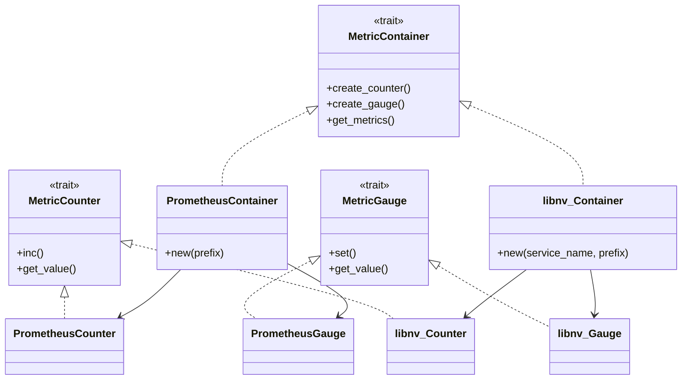

# Observability - Component Metrics

**Status:** Draft

**Authors:** nnshah1, keivenchang, whoisj

**Category:** Architecture

**Replaces:** N/A

**Replaced By:** N/A

**Sponsor:** keivenchang

**Required Reviewers:** TBD

**Review Date:** [Date for review]

**Pull Request:** [Link to Pull Request of the Proposal itself]

**Implementation PR / Tracking Issue:** TBD

# Summary

This document outlines and defines the Component Metrics framework for Dynamo, providing a unified approach to collecting, exposing, and managing component performance metrics.

# Motivation

The Dynamo system currently lacks a unified approach to component metrics collection, with different components implementing their own monitoring solutions using disparate libraries. This fragmentation results in compatibility issues, performance and safety concerns, and inconsistent data formats that impact service reliability and system visibility.

Relying on various different libraries often results in interoperability problems between components, making it difficult to correlate metrics data across the system and maintain consistent monitoring practices. This approach also increases maintenance costs due to varying coding styles and introduces potential performance and safety risks.

## Goals

The Component Metrics framework addresses these challenges by providing a unified approach that:

* Improves consistent component metrics visibility across the system
* Promotes best practices in metrics collection and exposure across all components
* Avoids the use of disparate raw libraries that could compromise safety, performance, consistency, and maintainability

## Requirements

### REQ 1: Consistent Profiling Endpoint with Prometheus Support

* **Description:** Each component/process in Dynamo MUST expose an HTTP endpoint in Prometheus format to support the Prometheus server, and to support components that query the Prometheus server (e.g. Grafana and even other Dynamo components).
* **Rationale:** This ensures that all components can be monitored uniformly and profiling data can be collected without discrepancies. Prometheus output format is a widely adopted standard that enables seamless integration with existing monitoring ecosystems, including Grafana dashboards, alerting systems, and other visualization tools. This approach leverages established tooling for historical analysis, trend identification, and operational monitoring without requiring custom dashboard implementation within the framework itself.
* **Measurability:** Verify that each component has a /metrics endpoint accessible via HTTP, and that it follows a standardized format. Verify that the API can export profiling data in Prometheus format with proper metric naming conventions and labels. Test that external dashboard tools (such as Grafana) can successfully consume the Prometheus output and display meaningful visualizations. Ensure that the Prometheus endpoint responds efficiently to scraping requests.

### REQ 2: Profiling Declaration and Registration

* **Description:** Each component MUST declare a struct that contains profiling types and register what metrics they are profiling with the observability framework.
* **Rationale:** Standardizing how components declare and register their profiling structure ensures consistency in the data reported across different components and enables the framework to properly manage and expose these metrics.
* **Measurability:** Confirm that each component has a defined profiling struct, registers its metrics with the observability framework, and that the registered metrics are used for reporting profiling data.

### REQ 3: Common Profiling Interface

* **Description:** Each component MUST use the common interface for counts, gauges, and histograms.
* **Rationale:** A common interface ensures that profiling data collection is consistent and reliable across all components.
* **Measurability:** Check that all components use the common interface for profiling operations and that the profiling data collected are consistent.

### REQ 4: Pluggable Backend Interface

* **Description:** The profiling interface (API) MUST support pluggable backends, such as Prometheus library, OpenTelemetry (OTel), and/or custom C++ implementations, etc. The common profiling libraries will be exposed through the Dynamo Rust runtime via PyO3 to ensure consistent access across both Rust and Python components.
* **Rationale:** Pluggable backends provide flexibility in how profiling data are collected and reported, enabling integration with various monitoring tools. Exposing these through the Dynamo Rust runtime ensures a unified interface regardless of the underlying implementation language.
* **Measurability:** Validate that the API can switch between different backend implementations without requiring changes to the components, and verify that both Rust and Python components can access the profiling libraries through the Dynamo runtime interface.

### REQ 5: Python Bindings

* **Description:** The common API MUST provide Python bindings to ensure compatibility with Python components in Dynamo.
* **Rationale:** Python bindings ensure that components written in Python can also utilize Rust structs (with well-defined profiling types) and interfaces, maintaining consistency across different layers.
* **Measurability:** Verify the existence and functionality of Python bindings for the profiling interface, and ensure that Python components can use these bindings to report profiling data.

### REQ 6: Support for Callback API

* **Description:** The profiling interface (API) MUST include a callback mechanism to support components that require immediate feedback instead of relying on periodic polling updates (such as those provided by the Prometheus server). The callback mechanism can also publish to NATS if desired for distributed event notification.
* **Rationale:** Immediate feedback allows components to react to critical profiling data changes in real-time, enhancing system responsiveness and fault tolerance. While callbacks for same-process updates may not be necessary since components can directly access shared metric structures, they are used in loosely coupled architectures (e.g. different processes, machines, or pods). Additionally, explicit callback definitions clarify component relationships rather than inferring them through scattered call graphs in the code.
* **Measurability:** Verify that the API includes a callback mechanism and that components can register for immediate feedback. Test that callbacks provide timely updates when profiling data changes, especially across process or network boundaries.

### REQ 7: Support for Composite Profiling

* **Description:** The profiling interface (API) MUST support composite profiling data, such as average, minimum, and maximum values, for certain clients that need to react to changes quickly, without having to wait for Prometheus to poll periodically.
* **Rationale:** Providing immediate access to composite profiling data enables components to make timely decisions based on real-time data, improving overall system performance and responsiveness.
* **Measurability:** Confirm that the API can calculate and provide composite profiling data (avg, min, max) on-demand. Test that clients, such as the Planner, can access these profiling data directly through the API without relying on periodic polling.

These requirements ensure that the observability framework in Dynamo is consistent, flexible, and easy to implement across all components, supporting the overall goal of enhanced fault tolerance and system reliability.


# Proposal

Create a common library that allows each component/process to:

* Expose component metrics and/or health profiling data on an HTTP endpoint.
* Create an observability struct containing profiling data (e.g., incr counter, gauge, and histogram).
* Call a common API that mutates the observability struct.
* Automatically export the observability struct to a Prometheus key-val format.

## System Diagram

Below is a diagram showing the architecture of the observability framework. The design uses trait-based abstractions to support pluggable backends: 1) Core traits (`MetricContainer`, `MetricCounter`, `MetricGauge`) define the common interface for metric operations, 2) Backend-specific implementations (Prometheus and OpenTelemetry) provide concrete implementations of these traits, and 3) The container pattern allows components to create and manage metrics through a unified API regardless of the underlying backend.

Note that libnv is an NVIDIA implementation in libnv.so that can gather metrics in C++ layers (e.g. NIXL).



```Rust
    // Example usage:
    pub struct DynamoHTTPMetrics {
        // BaseComponentMetrics, MetricCounter, MetricGauge are part of the framework
        pub base: BaseComponentMetrics,
        pub http_requests_count: Box<dyn MetricCounter>,
        pub http_requests_ms: Box<dyn MetricGauge>,
    }

    impl DynamoHTTPMetrics {
        /// Create a new DynamoHTTPMetrics instance using the parent's new_prometheus
        pub fn new(prefix: &str) -> Self {
            let base = BaseComponentMetrics::new_prometheus(prefix);
            let request_counter = base.container.create_counter(
                "requests_total",
                "Total number of requests",
                &[("service", "api"), ("version", "v1")]
            );
            
            let response_time_gauge = base.container.create_gauge(
                "response_time_seconds",
                "Response time in seconds",
                &[("service", "api"), ("version", "v1")]
            );
            
            DynamoHTTPMetrics {
                base,
                http_requests_count: request_counter,
                http_requests_ms: response_time_gauge,
            }
        }
    }

    #[test]
    fn test_component_metrics_struct() {
        println!("=== Testing ServiceMetrics Struct with Prometheus Backend ===");
        
        // Create a new ServiceMetrics instance
        let metrics = DynamoHTTPMetrics::new("MyHTTP");
        
        println!("Created ServiceMetrics with Prometheus backend");
        println!("Initial metrics:");
        metrics.print_metrics();
        
        // Simulate some API requests using direct access to public fields
        println!("\n--- Simulating API Requests (Direct Access) ---");
        
        // Record individual requests directly
        metrics.http_requests_count.inc(); // Request 1
        
        // Record batch of requests directly
        metrics.http_requests_count.inc_by(5); // 5 more requests
        
        // Set response times directly
        metrics.http_requests_ms.set(0.15); // 150ms
        metrics.http_requests_ms.inc(0.05); // Add 50ms
        
        println!("\nFinal metrics after simulation:");
        metrics.print_metrics();
        
        // Export to Prometheus format (for HTTP service)
        println!("\n--- Prometheus Format Export ---");
        let prometheus_output = metrics.base.container.export_prometheus();
        println!("{}", prometheus_output);
        // Expected output would look like:
        // # HELP myapp_requests_total Total number of requests
        // # TYPE myapp_requests_total counter
        // myapp_requests_total{service="api",version="v1"} 6
        // # HELP myapp_response_time_seconds Response time in seconds
        // # TYPE myapp_response_time_seconds gauge
        // myapp_response_time_seconds{service="api",version="v1"} 0.2
     }
```

# Alternate Solutions

## Alt 1: Separate HTTP metrics endpoints into another process

An alternative implementation could involve separating the HTTP metrics endpoints into a dedicated process. This could leverage an existing Dynamo monitor sidecar that already handles component restarts and lifecycle management. In this scenario, the sidecar process would be responsible for exposing the metrics endpoint while the main components would communicate their metrics data through the established interface.

This approach would still require the same interface and instrumentation library as proposed, but the metrics exposure mechanism would be delegated to the sidecar process, potentially through a NATS-based communication channel. However, this introduces additional complexity by routing metrics data through an intermediate messaging layer rather than direct HTTP exposure.

**Pros:**
* Separation of concerns - main components focus on business logic while sidecar handles metrics exposure
* Reduced complexity individual components, as it will no longer need to launch an http server

**Cons:**
* Dependency on messaging channel (e.g. NATS) availability and performance, with potential data loss if messaging channel experiences issues
* Introduces additional communication overhead (e.g. NATS)
* Increased latency, reliability concerns, and additional failure points in the metrics pipeline
* More complex debugging and troubleshooting if/when metrics collection fails


## Alt 2: Use Third Party Libraries Directly
**Pros:**
* Utilizes well-tested, existing libraries.
* Potentially quicker initial setup.

**Cons:**
* Profiling data may not be interoperable between components (e.g., different types and semantics).
* Changing the library would require significant refactoring.
* Increased maintenance costs due to varying coding styles among developers.
* Higher flexibility can introduce performance and safety risks.

**Reason Rejected:**
* Inconsistent profiling data and potential interoperability issues.
* High refactoring effort if a library change is needed.
* Increased maintenance complexity and potential performance/safety concerns.

## Alt 3: Custom Library
**Pros:**
* Tailored to specific needs.
* Full control over implementation.

**Cons:**
* Requires more time and resources to develop and test.
* Not suitable for immediate needs.

**Reason Rejected:**
* Immediate solution needed.
* Feasible in the long term, and which we may consider later.
