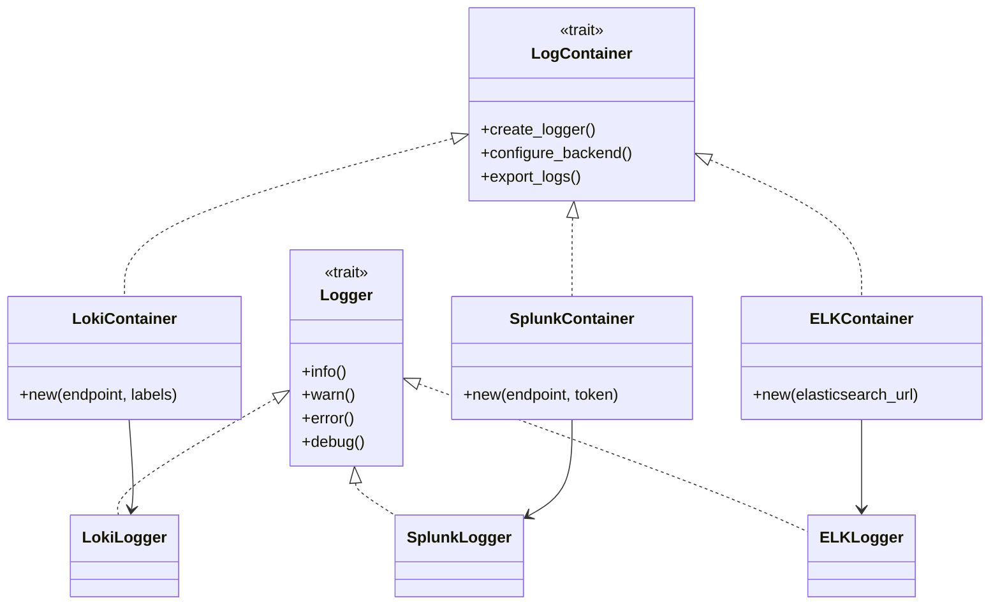

# Observability - Logging

**Status:** Draft

**Authors:** nnshah1, keivenchang, whoisj

**Category:** Architecture

**Replaces:** N/A

**Replaced By:** N/A

**Sponsor:** keivenchang

**Required Reviewers:** TBD

**Review Date:** [Date for review]

**Pull Request:** [Link to Pull Request of the Proposal itself]

**Implementation PR / Tracking Issue:** TBD

# Summary

This document outlines and defines the Logging framework for Dynamo, providing a unified approach to structured logging, log aggregation, and event correlation across components.

# Motivation

The Dynamo system currently lacks a unified approach to logging, with different components implementing their own logging solutions using disparate conventions and string formats. This fragmentation results in inconsistent log formats, making it difficult to search, filter, and analyze log data across the system.

Relying on various different logging approaches often results in interoperability problems between components, making it difficult to correlate log events across the system and maintain consistent logging practices. This approach also increases maintenance costs due to varying coding styles and introduces potential performance and safety risks.

## Goals

The Logging framework addresses these challenges by providing a unified approach that:

* Improves consistent logging visibility across the system
* Promotes best practices in structured logging and log management across all components
* Avoids the use of direct raw logging libraries that could compromise consistency and maintainability

## Goals

Current Python logging and Rust tracing capabilities (info/debug/warn) provide basic functionality for many use cases. However, alternative solutions such as Loki, Splunk, ELK Stack (Elasticsearch, Logstash, Kibana), Fluentd, and other centralized logging platforms offer enhanced capabilities including structured log aggregation, search, and analysis.

The Logging framework provides:

* Structured logging standards for improved searchability and analysis
* Integration options with centralized logging platforms
* Cross-language compatibility between Rust and Python components
* Flexible backend implementations to support different operational requirements

## Requirements

Logging requirements and implementation details are still evolving. Below are current requirements but are subject to change on a weekly basis.

### REQ 1: Structured Logging Standards

* **Description:** The logging framework MUST implement structured logging standards for consistent data format across all components.
* **Rationale:** Structured logging ensures that log data is consistently formatted and easily parseable, enabling better search, filtering, and analysis capabilities across the entire system.
* **Measurability:** Verify that all components produce logs in a consistent structured format and that log parsing tools can reliably extract structured data from log entries.

### REQ 2: Pluggable Backends

* **Description:** The logging framework MUST support pluggable backends to accommodate both Loki (for cost-effective aggregation) and Splunk (for enterprise features when needed).
* **Rationale:** Pluggable backends provide flexibility in log storage and analysis solutions, allowing organizations to choose the most appropriate backend based on their requirements, budget, and existing infrastructure.
* **Measurability:** Validate that the logging framework can switch between different backend implementations without requiring changes to the components, and confirm that both Loki and Splunk backends function correctly.

### REQ 3: Lightweight Implementation

* **Description:** The logging framework MUST provide a lightweight implementation to minimize performance overhead on system components.
* **Rationale:** Logging should not significantly impact system performance or resource utilization, ensuring that observability features do not degrade the primary functionality of components.
* **Measurability:** Measure the performance impact of logging operations on component throughput and resource usage, ensuring overhead remains within acceptable limits.

### REQ 4: Integration with Tracing

* **Description:** The logging framework MUST support integration with the tracing framework to enable correlation between logs and traces.
* **Rationale:** Correlating logs with traces provides comprehensive observability by linking log events to specific request flows, enabling better debugging and performance analysis.
* **Measurability:** Verify that logs can include trace context (trace ID, span ID) and that log entries can be correlated with corresponding trace spans in the tracing system.

# Logging vs Tracing

Logging captures discrete events; tracing tracks request flows. Use together for comprehensive observability.

**Log in traces for:** errors, business events, external interactions, performance anomalies
**Avoid logging:** high-volume debug info, redundant data, hot paths, sensitive data

**Guidelines:** Always log errors, sample debug logs (1-5%), use async logging, buffer within spans.

# Proposals

Create a common logging API that allows each component/process to:

* Use structured logging with consistent format across all components
* Support pluggable backends for log aggregation and storage
* Integrate with existing observability stack (metrics and tracing)
* Provide Python bindings for cross-language compatibility

## System Diagram

Below is a diagram showing the architecture of the logging framework. The design uses trait-based abstractions to support pluggable backends: 1) Core traits (`LogContainer`, `Logger`) define the common interface for logging operations, 2) Backend-specific implementations (Loki, Splunk, ELK) provide concrete implementations of these traits, and 3) The container pattern allows components to create and manage logs through a unified API regardless of the underlying backend.

# Alternate Solutions

## Alt 1: Use Third Party Libraries Directly

**Pros:**
* Utilizes well-tested, existing libraries.
* Potentially quicker initial setup.

**Cons:**
* Logging data may not be interoperable between components (e.g., different formats and semantics).
* Changing the library would require significant refactoring.
* Increased maintenance costs due to varying coding styles among developers.
* Higher flexibility can introduce performance and safety risks.

**Reason Rejected:**
* Inconsistent logging data and potential interoperability issues.
* High refactoring effort if a library change is needed.
* Increased maintenance complexity and potential performance/safety concerns.

## Alt 2: Custom Library

**Pros:**
* Tailored to specific needs.
* Full control over implementation.

**Cons:**
* Requires more time and resources to develop and test.
* Not suitable for immediate needs.

**Reason Rejected:**
* Immediate solution needed.
* Feasible in the long term, and which we may consider later.

# Common Industry Solutions

Several established solutions exist for centralized logging and log management, each with their own strengths and trade-offs:

## Splunk

**Overview:** Splunk is a comprehensive log management and analytics platform that provides powerful search, analysis, and visualization capabilities for machine-generated data.

**Pros:**
- Enterprise-grade security and compliance features (SOC2, HIPAA, PCI DSS)
- Powerful search and analytics with SPL (Splunk Processing Language)
- Extensive ecosystem of integrations and apps
- Built-in machine learning and anomaly detection
- Strong visualization and dashboarding tools
- Excellent support for complex queries and correlations
- Real-time alerting and monitoring capabilities
- Advanced data parsing and field extraction
- Support for structured and unstructured data

**Cons:**
- High licensing costs, especially at scale (based on data volume)
- Resource-intensive deployment and operation
- Complex configuration and management
- Vendor lock-in concerns
- May be overkill for smaller deployments
- Steep learning curve for advanced features

**Use Cases:** Large enterprises requiring comprehensive log analytics, compliance-heavy environments, organizations needing advanced security monitoring and threat detection.

## Loki (Grafana)

**Overview:** Loki is a horizontally scalable, highly available log aggregation system inspired by Prometheus, designed to be cost-effective and easy to operate.

**Pros:**
- Cost-effective storage using object storage (S3, GCS, Azure Blob)
- Horizontal scalability with simple architecture
- Efficient log indexing and querying with LogQL
- Integration with Grafana for visualization
- Lower resource requirements compared to Splunk
- Open-source with enterprise support options
- No data parsing at ingestion (logs stored as-is)
- Multi-tenancy support
- Easy deployment with Docker/Kubernetes

**Cons:**
- Limited built-in analytics and ML capabilities
- Requires additional components for full observability (Prometheus for metrics, Jaeger for tracing)
- Less mature ecosystem compared to Splunk
- No native data parsing at ingestion
- Limited alerting capabilities without Grafana integration

**Use Cases:** Organizations looking for cost-effective log aggregation, cloud-native deployments, teams already using Grafana ecosystem, Kubernetes-native applications.

## Elasticsearch + Logstash + Kibana (ELK Stack)

**Overview:** The ELK stack is a popular open-source solution for log aggregation, processing, and visualization.

**Pros:**
- Open-source with enterprise support available
- Powerful full-text search capabilities
- Flexible data processing with Logstash
- Rich visualization with Kibana
- Horizontal scalability
- Strong community support
- Extensive plugin ecosystem

**Cons:**
- Complex setup and maintenance
- Resource-intensive, especially Elasticsearch
- Requires expertise in multiple components
- Data retention and storage costs can be high
- Performance tuning can be challenging

**Use Cases:** Organizations with technical expertise, those requiring full-text search capabilities, teams comfortable with managing complex distributed systems.

## Fluentd/Fluent Bit

**Overview:** Lightweight log collectors and forwarders designed for high-performance log aggregation.

**Pros:**
- High performance and low resource usage
- Extensive plugin ecosystem
- Support for multiple output destinations
- Easy integration with various systems
- Good for edge computing and IoT scenarios

**Cons:**
- Limited built-in storage and querying
- Requires additional components for full logging solution
- Configuration can be complex for advanced use cases

**Use Cases:** Log collection and forwarding, edge computing, IoT applications, integration with existing logging infrastructure.

## Comparison: Splunk vs Loki vs ELK

**Similarities:**
- All provide centralized log aggregation and search capabilities
- All support structured logging and log correlation
- All offer integration with external systems and APIs
- All can be deployed on-premises or in the cloud

**Key Differences:**

| Aspect | Splunk | Loki | ELK Stack |
|--------|--------|------|-----------|
| **Cost Model** | High licensing costs, volume-based | Lower costs, primarily storage-based | Moderate, primarily infrastructure costs |
| **Complexity** | High - extensive features | Lower - focused on core functionality | High - multiple components |
| **Scalability** | Vertical scaling with enterprise features | Horizontal scaling with simple architecture | Horizontal scaling with complex coordination |
| **Analytics** | Advanced analytics and ML built-in | Basic querying with LogQL | Full-text search and basic analytics |
| **Ecosystem** | Extensive marketplace | Growing, Grafana-focused | Large open-source community |
| **Learning Curve** | Steep due to feature richness | Moderate, simpler architecture | Steep due to multiple components |
| **Storage** | Proprietary, optimized for search | Object storage (S3, GCS, etc.) | Elasticsearch with various storage options |
| **Security** | Enterprise-grade security features | Basic security, requires additional setup | Good security with proper configuration |

## Other Notable Solutions

**Datadog Logs:** Cloud-native log management with strong APM integration, but vendor lock-in concerns.

**New Relic Logs:** Application-focused logging with good correlation to application performance, similar vendor lock-in considerations.

**Graylog:** Open-source log management with good security features and alerting capabilities.

**Sumo Logic:** Cloud-native log analytics with strong compliance features, but subscription-based pricing.

