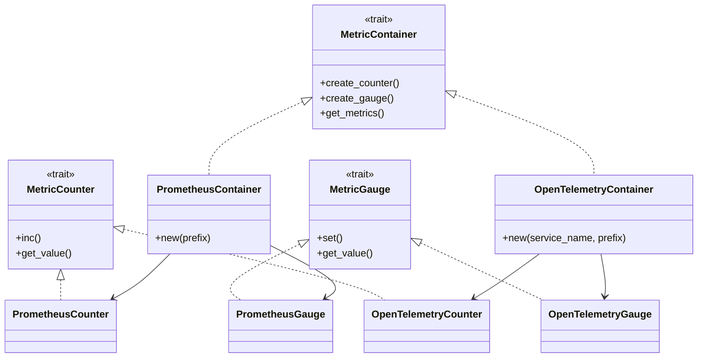

# Profiling Structure Diagram

```mermaid
classDiagram
    %% Core Traits
    class MetricContainer {
        <<trait>>
        +create_counter()
        +create_gauge()
        +get_metrics()
    }
    
    class MetricCounter {
        <<trait>>
        +inc()
        +get_value()
    }
    
    class MetricGauge {
        <<trait>>
        +set()
        +get_value()
    }
    
    %% Implementations
    class PrometheusContainer {
        +new(prefix)
    }
    
    class OpenTelemetryContainer {
        +new(service_name, prefix)
    }
    
    class PrometheusCounter
    class PrometheusGauge
    class OpenTelemetryCounter
    class OpenTelemetryGauge
    
    %% Relationships
    MetricContainer <|.. PrometheusContainer
    MetricContainer <|.. OpenTelemetryContainer
    
    MetricCounter <|.. PrometheusCounter
    MetricCounter <|.. OpenTelemetryCounter
    
    MetricGauge <|.. PrometheusGauge
    MetricGauge <|.. OpenTelemetryGauge
    
    PrometheusContainer --> PrometheusCounter
    PrometheusContainer --> PrometheusGauge
    
    OpenTelemetryContainer --> OpenTelemetryCounter
    OpenTelemetryContainer --> OpenTelemetryGauge
``` 