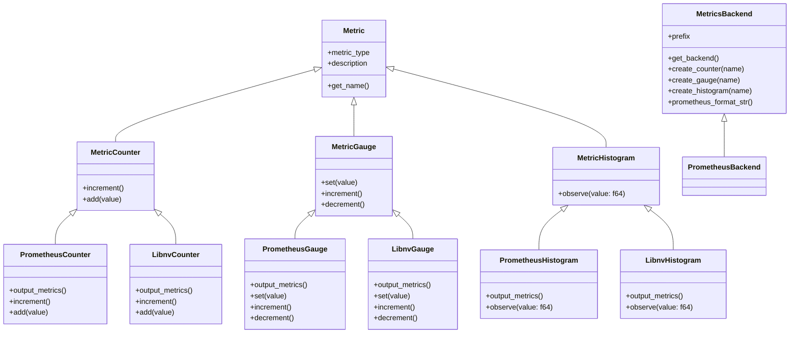

# Observability - Metrics

**Status:** Draft

**Authors:** nnshah1, keivenchang, whoisj

**Category:** Architecture

**Replaces:** N/A

**Replaced By:** N/A

**Sponsor:** keivenchang

**Required Reviewers:** TBD

**Review Date:** [Date for review]

**Pull Request:** [Link to Pull Request of the Proposal itself]

**Implementation PR / Tracking Issue:** TBD

# Summary

This document outlines and defines the Metrics API for Dynamo.

# Motivation

Dynamo's current metrics collection is fragmented, using various libraries across components. This leads to compatibility issues, inconsistent data formats, and increased maintenance costs.

## Goals

This proposal offers a unified way to collect, expose, and manage performance metrics across various backends.

The Metrics API achieves this by:

* Ensuring consistent metrics visibility
* Encouraging best practices in metrics handling
* Avoiding unsafe and inconsistent raw libraries
* Providing a flexible abstraction layer for current and future implementations

## Requirements

### REQ 1: Prometheus Server

* **Description:** A Prometheus server MUST be operational and continuously polling each Dynamo component/process to collect and aggregate metrics data for a comprehensive system overview.
* **Rationale:** Ensuring that a Prometheus server is operational and polling components guarantees that metrics data is consistently aggregated and available for analysis. This setup facilitates seamless integration with existing monitoring ecosystems, such as Grafana dashboards and alerting systems.
* **Measurability:** Confirm that the Prometheus server is configured to poll each component's /metrics endpoint and that it successfully collects and stores the metrics data. Verify that the collected data can be accessed and visualized through external tools like Grafana.

### REQ 2: HTTP Endpoint Exposure for Metrics

* **Description:** Each component/process in Dynamo MUST expose an HTTP endpoint in Prometheus format to support the Prometheus server and other components that query the Prometheus server (e.g., Grafana and even other Dynamo components).
* **Rationale:** Exposing an HTTP endpoint in Prometheus format ensures that all components can be monitored uniformly, and profiling data can be collected without discrepancies. This approach leverages established tooling for historical analysis, trend identification, and operational monitoring.
* **Measurability:** Verify that each component has a /metrics endpoint accessible via HTTP, and that it follows a standardized format. Ensure that the API can export profiling data in Prometheus format with proper metric naming conventions and labels. Test that external dashboard tools (such as Grafana) can successfully consume the Prometheus output and display meaningful visualizations. Ensure that the Prometheus endpoint responds efficiently to scraping requests.

### REQ 3: Common Profiling Interface

* **Description:** Each component MUST use the common Rust trait for counts, gauges, and histograms.
* **Rationale:** A common Rust trait ensures that profiling data collection is consistent and reliable across all components.
* **Measurability:** Check that all components use the common Rust trait for profiling operations and that the profiling data collected are consistent.

### REQ 4: Profiling Declaration and Registration

* **Description:** Each component MUST declare a struct that contains profiling types and register what metrics they are profiling with the Metrics API.
* **Rationale:** Standardizing how components declare and register their profiling structure ensures consistency in the data reported across different components and enables the API to properly manage and expose these metrics.
* **Measurability:** Confirm that each component has a defined profiling struct, registers its metrics with the Metrics API, and that the registered metrics are used for reporting profiling data.

### REQ 5: Pluggable Backend Interface

* **Description:** The profiling Rust trait (API) MUST support pluggable backends, such as Prometheus library, OpenTelemetry (OTel), and/or custom C++ implementations, etc. The Metrics API provides an abstraction layer that can work with any of these backend implementations. The common profiling libraries will be exposed through the Dynamo Rust runtime via PyO3 to ensure consistent access across both Rust and Python components.
* **Rationale:** Pluggable backends provide flexibility in how profiling data are collected and reported, enabling integration with various monitoring tools. Exposing these through the Dynamo Rust runtime ensures a unified Rust trait regardless of the underlying implementation language.
* **Measurability:** Validate that the API can switch between different backend implementations without requiring changes to the components, and verify that both Rust and Python components can access the profiling libraries through the Dynamo runtime Rust trait.

### REQ 6: Python Bindings

* **Description:** The common API MUST provide Python bindings to ensure compatibility with Python components in Dynamo.
* **Rationale:** Python bindings ensure that components written in Python can also utilize Rust structs (with well-defined profiling types) and Rust traits, maintaining consistency across different layers.
* **Measurability:** Verify the existence and functionality of Python bindings for the profiling Rust trait, and ensure that Python components can use these bindings to report profiling data.


# Proposal

Create a common Metrics API that allows each component/process to:

* Expose component metrics and/or health profiling data on an HTTP endpoint.
* Create a metrics struct containing profiling data (e.g., incr counter, gauge, and histogram).
* Call a common API that mutates the metrics struct.
* Automatically export the metrics struct to a Prometheus key-val format.

## System Diagram

This diagram shows a system for handling different types of metrics, like counters, gauges, and histograms. At the core is a class called Metric, which holds basic information like the metric’s name, type, and description.

From this base, three specific metric types are created: counters that can be increased, gauges that can go up or down or be set to a value, and histograms that record values. Each of these metric types has two versions: one for Prometheus and one for Libnv. These versions add the ability to output their data in a specific format.

There’s also a MetricsBackend class that manages how metrics are created and formatted. It includes methods to create each type of metric and to format them for Prometheus. A specialized version of this backend, called PrometheusBackend, inherits from it and likely customizes some of its behavior.

Note that libnv is an NVIDIA implementation in libnv.so that can gather metrics in C++ layers (e.g. NIXL).



```Rust
/*
    THIS IS WORK IN PROGRESS -- DO NOT REVIEW

    TODO (maybe):
    1) Define Metrics struct/traits/etc
    2) Add a Metrics struct in lib/runtime/src/config.rs (or equivalent)
    3) Initialize/register Metrics struct in lib/runtime/src/{lib.rs, distributed.rs} (or equivalent)
    4) HTTP service to register the Metrics struct (perhaps in stats_handler/handler?)
*/

    pub struct DynamoHTTPMetrics {
        // MetricCounter, MetricGauge are traits from the Metrics API
        pub http_requests_count: Box<dyn MetricCounter>,
        pub http_requests_ms: Box<dyn MetricGauge>,
    }

    impl DynamoHTTPMetrics {
        /// Create a new DynamoHTTPMetrics instance using the parent's new_prometheus
        pub fn new(prefix: &str) -> Self {
            let request_counter = base.container.create_counter(
                "requests_total",
                "Total number of requests",
                &[("service", "api"), ("version", "v1")]
            );
            
            let response_time_gauge = base.container.create_gauge(
                "response_time_seconds",
                "Response time in seconds",
                &[("service", "api"), ("version", "v1")]
            );
            
            DynamoHTTPMetrics {
                http_requests_count: request_counter,
                http_requests_ms: response_time_gauge,
            }
        }
    }

    #[test]
    fn test_component_metrics_struct() {
        println!("=== Testing ServiceMetrics Struct with Prometheus Backend ===");
        
        // Create a new ServiceMetrics instance
        let metrics = MetricType::new("MyHTTP", enum::Prometheus);
        
        println!("Created ServiceMetrics with Prometheus backend");
        println!("Initial metrics:");
        metrics.print_metrics();
        
        // Simulate some API requests using direct access to public fields
        println!("\n--- Simulating API Requests (Direct Access) ---");
        
        // Record individual requests directly
        metrics.http_requests_count.inc(); // Request 1
        
        // Record batch of requests directly
        metrics.http_requests_count.inc_by(5); // 5 more requests
        
        // Set response times directly
        metrics.http_requests_ms.set(0.15); // 150ms
        metrics.http_requests_ms.inc(0.05); // Add 50ms
        
        println!("\nFinal metrics after simulation:");
        metrics.print_metrics();
        
        // Export to Prometheus format (for HTTP service)
        println!("\n--- Prometheus Format Export ---");
        let prometheus_output = metrics.base.container.export_prometheus();
        println!("{}", prometheus_output);
        // Expected output would look like:
        // # HELP myapp_requests_total Total number of requests
        // # TYPE myapp_requests_total counter
        // myapp_requests_total{service="api",version="v1"} 6
        // # HELP myapp_response_time_seconds Response time in seconds
        // # TYPE myapp_response_time_seconds gauge
        // myapp_response_time_seconds{service="api",version="v1"} 0.2
     }
```

# Alternate Solutions

## Alt 1: Separate HTTP metrics endpoints into another process

An alternative implementation could involve separating the HTTP metrics endpoints into a dedicated process. This could leverage an existing Dynamo monitor sidecar that already handles component restarts and lifecycle management. In this scenario, the sidecar process would be responsible for exposing the metrics endpoint while the main components would communicate their metrics data through the established interface.

This approach would still require the same trait interface and instrumentation library as proposed, but the metrics exposure mechanism would be delegated to the sidecar process, potentially through a NATS-based communication channel. However, this introduces additional complexity by routing metrics data through an intermediate messaging layer rather than direct HTTP exposure.

**Pros:**
* Separation of concerns - main components focus on business logic while sidecar handles metrics exposure
* Reduced complexity individual components, as it will no longer need to launch an http server

**Cons:**
* Dependency on messaging channel (e.g. NATS) availability and performance, with potential data loss if messaging channel experiences issues
* Introduces additional communication overhead (e.g. NATS)
* Increased latency, reliability concerns, and additional failure points in the metrics pipeline
* More complex debugging and troubleshooting if/when metrics collection fails


## Alt 2: Use Third Party Libraries Directly
**Pros:**
* Utilizes well-tested, existing libraries.
* Potentially quicker initial setup.

**Cons:**
* Profiling data may not be interoperable between components (e.g., different types and semantics).
* Changing the library would require significant refactoring.
* Increased maintenance costs due to varying coding styles among developers.
* Higher flexibility can introduce performance and safety risks.

**Reason Rejected:**
* Inconsistent profiling data and potential interoperability issues.
* High refactoring effort if a library change is needed.
* Increased maintenance complexity and potential performance/safety concerns.

## Alt 3: Custom Library
**Pros:**
* Tailored to specific needs.
* Full control over implementation.

**Cons:**
* Requires more time and resources to develop and test.
* Not suitable for immediate needs.

**Reason Rejected:**
* Immediate solution needed.
* Feasible in the long term, and which we may consider later.
