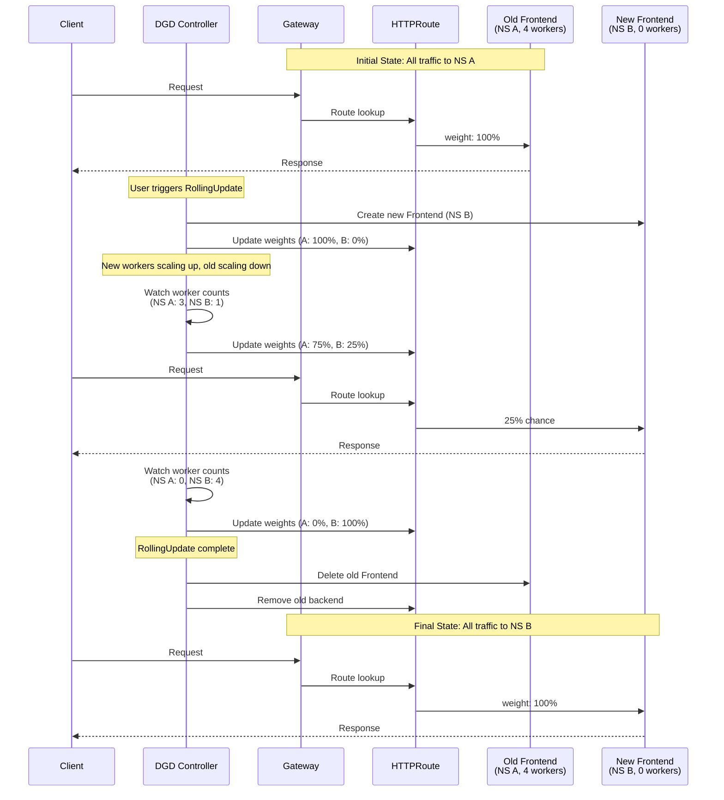
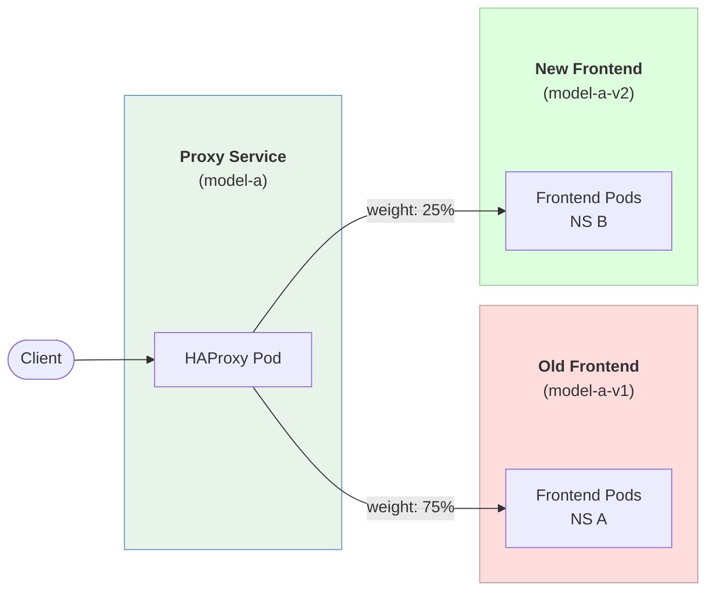
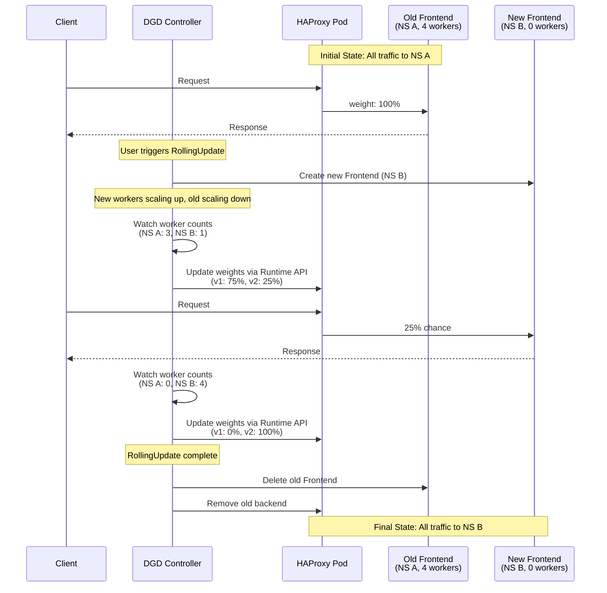

# Rollout Support for DynamoGraphDeployments (DGDs)

**Status**: Under Review

**Authors**: Thomas Montfort

**Category**: Architecture

**Required Reviewers**: Biswa Panda, Neelay Shah, Maksim Khadkevich, Julien Mancuso, Itay Neeman, Rohan Varma

**Review Date**: January 14, 2026

**Pull Request**: https://github.com/ai-dynamo/enhancements/pull/49

**Implementation PR / Tracking Issue**: [Link to Pull Request or Tracking Issue for Implementation]

# 1. Summary

This enhancement proposal is meant to address the issues faced when performing a Rollout of a DGD.

A RollingUpdate refers to a specific type of Kubernetes resource Rollout where Pods owned by the resource are updated sequentially. A Rollout refers more broadly to the strategy in which a resource is updated.

To learn more about Rollout strategies, see the [Appendix](#appendix).

# 2. Scenarios

- **Update Dynamo Worker Version** - Updating the Dynamo framework runtime image (e.g., vllm-runtime:0.6.0 to 0.7.0) for a Worker service.
- **Update Dynamo Frontend Version** - Updating the Dynamo framework runtime image for the Frontend service.
- **Update Dynamo Worker Configuration** - Changing command, args, or environment variables passed to workers (e.g., block size, context length, KV cache connector).

# 3. Problems

These scenarios become problematic when old and new workers coexist during a RollingUpdate. The dynamo namespace groups workers together into a fungible pool, meaning the frontend and workers discover and communicate with each other regardless of version. This causes three distinct issues:

## 3.1 Different MDC Checksums

When configuration changes affect the ModelDeploymentCard (MDC) checksum (e.g., `--block-size 32`):

_Applies to both aggregated and disaggregated deployments._


_The current behavior silently discards the new MDC but the new workers are added to the client instance list. This results in new workers having requests preprocessed with the old MDC, which can result in request errors or unexpected behaviors._

_Why this behavior exists: The decision to discard conflicting MDCs was made at the runtime level to keep the logic simple—accepting only one MDC per model key avoided complexity around MDC versioning and selection. This works fine for initial deployments but breaks down during rolling updates when multiple versions coexist._

## 3.2 Incompatible KV Cache Transfer

When configuration changes affect KV cache transfer (e.g., `--tensor-parallel-size 2`):

_Applies to disaggregated deployments only._


_The discovery of old prefill/decode workers by the new set of workers can result in KV block shape incompatibilities, KV transfer API breaking changes, etc. that result in request errors or unexpected behaviors._

## 3.3 Runtime API Incompatibilities

When upgrading the Dynamo framework runtime image (e.g., vllm-runtime:0.6.0 to 0.7.0), the internal APIs between frontend and workers may have breaking changes. During a RollingUpdate, an old frontend may route requests to new workers (or vice versa) using incompatible API versions. This can manifest as serialization errors, missing fields, or protocol mismatches that cause request failures.

_Applies to both aggregated and disaggregated deployments._

# 4. Solution: Isolate New/Old Worker Deployments

Currently during an in-place RollingUpdate, new and old workers coexist in the same dynamo namespace sharing the same frontend. The dynamo namespace groups these workers together, making them a fungible pool of workers. This results in the MDC checksum and KV cache incompatibility issues described above.


The proposed solution is to have the new and old worker deployments to be in separate dynamo namespaces, with isolated frontends.


**Solves**:

- **Different MDC Checksums**: having local frontends to new and old workers ensures that for the Model A, only one MDC checksum is being stored and used.
- **Incompatible KV Cache Transfer**: new and old workers do not discover each other since they are in separate dynamo namespaces.
- **Runtime API Incompatibilities**: frontends and workers within each isolated namespace are always at the same version, preventing cross-version API mismatches.

**Pros**:

- No need to modify the frontend logic, this would be purely handled via the Kubernetes controller.

## 4.1 Case A: Traditional Frontend and Worker Deployment

This is the most common case where a DGD is defined with a Frontend service and either an aggregated worker service or prefill and decode worker services.

For this example, there are 3 frontend replicas, 4 prefill workers, and 2 decode workers.

### 4.1.1 Solution A: Modify Worker Resource In-Place

In this solution, the controller will do the following:

- Create a new frontend resource (Deployment/PodClique), matching the replica count of the old frontend resource, with a new DYN_NAMESPACE B.
- Wait until at least one of, or all of, the new frontend replicas are ready.
- Apply user-defined updates to the worker resource (Deployment/PodClique/PodCliqueScalingGroup/LWS) along with updating the controller-determined DYN_NAMESPACE to B.
- This will trigger the worker resource's underlying RollingUpdate.
- As new workers are ready in DYN_NAMESPACE B, they will be registered with the new frontend resource in DYN_NAMESPACE B, and old workers will be deregistered from the old frontend resource in DYN_NAMESPACE A as they are terminated.


**Pros:**

- Logic is much simpler. Controller just needs to account for new/old frontend resource groups. Takes advantage of the underlying worker resource's rolling update mechanism.

**Cons:**

- Adding configurability to RollingUpdate behavior in the future is beholden to the underlying worker resource. For instance, maxUnavailable, maxSurge, partition do not have full support within Grove but do in Deployments/LWS.
- The default RollingUpdate behavior differs between Deployment/LWS and PodClique/PodCliqueScalingGroup.
- Having pause functionality for the rolling update relies on the underlying worker resource supporting partition/controller revision.
- Ensuring maintenance of P/D ratio during the rolling update is not possible.

### 4.1.2 Solution B: Controller Manages New/Old Worker Resource

_Assumes default RollingUpdate behavior where maxSurge is 1 and maxUnavailable is 0_

In this solution, the controller will do the following:

- The same as Solution A, create a new frontend resource with a new DYN_NAMESPACE B.
- Instead of modifying the worker resources in-place, the controller will create new worker resources with each set to 1 replica.
- The controller will then iteratively scale down the old worker resource by 1 and scale up the new worker resource by 1 until the old worker resource has scaled to 0 and the new worker resource has scaled to the desired replica count.
  _The rate of scaling up and down could be exposed as a part of the DGD CRD_


**Pros:**

- Can expose an API for configuring things such as maxUnavailable, maxSurge
- Can maintain P/D ratio during the rolling update due to the controller's ability to synchronize the rolling update between old/new and prefill/decode.
- Can enable pause functionality for the rolling update easily.

**Cons:**

- Logic becomes more complex. Controller needs to account for new/old worker resources. Controller needs to synchronize the rolling update between old/new and prefill/decode.

### 4.1.3 Solution Selection

**Solution B** where Controller Manages New/Old Worker Resource is the preferred solution as it provides maximum flexibility to support the following:

- Configurability of the RollingUpdate behavior such as maxSurge, maxUnavailable, partition.
- P/D ratio maintenance during the RollingUpdate.
- Pause functionality for the RollingUpdate.

Furthermore, it will enable consistent behavior regardless of if the worker underlying resource is a Deployment, PodClique, PodCliqueScalingGroup, or LWS.

## 4.2 Case B: Shared Frontend Deployment

The problem here is that at the DGD level for one of the model deployments, the DGD will only contain workers. It doesn't have the ability to create a new frontend resource with a new DYN_NAMESPACE.


_The global frontend uses the special `dynamo` namespace keyword which allows it to discover workers and MDCs from all dynamo namespaces. Each model's workers are deployed in separate DGDs with their own unique dynamo namespace._

For rolling the workers, either **4.1.1 Solution A: Modify Worker Resource In-Place** or **4.1.2 Solution B: Controller Manages New/Old Worker Resource** can be used.

The problem with the shared frontend is that if we do a RollingUpdate of a DGD for Model A, the shared frontend would need to be able to support a router client for Model A in dynamo namespace X and Model A in dynamo namespace Y, with potentially differing MDC checksums, and load balance between the two clients.

**We should remove the shared frontend pattern. It creates additional complexity to support multiple MDCs per model key and load balancing effectively between them.**

## 4.3 Load Balancing

During the RollingUpdate, we will essentially have two deployments, each with a set of frontends, that need to be load balanced across. The question is what will effectively handle load balancing between these two sets of frontends? Naively configuring a Kubernetes Service for both the new and old set of frontends will result in a 50/50 split of traffic which does not represent the shifting ratio of old/new workers.

### 4.3.1 Solution A: Gateway Load Balancing

Use a Gateway with HTTPRoute to load balance between old and new frontends, with weights dynamically updated based on the ratio of old/new workers.

#### Gateway Provisioning

Two options for Gateway provisioning:

1. **User brings their own Gateway**: User provides the Gateway name via the DGD spec. User is responsible for Gateway configuration and lifecycle.
2. **Controller creates the Gateway**: Controller creates and manages the Gateway. Requires user to have installed a GatewayClass (e.g., Istio, Envoy Gateway).

#### Service URL Stability

Currently, deploying a DGD creates a Kubernetes Service that internal clients can use to reach the frontend pods.

With Gateway-based load balancing, the controller cannot guarantee a stable in-cluster service URL for the entire DGD unless using GAMMA. The Gateway handles external traffic, but internal service-to-service routing requires additional configuration:

- **User configures Gateway for internal access**: User brings their own Gateway and attaches a ClusterIP Service to expose it internally.
- **GAMMA (Service-attached HTTPRoute)**: Controller creates an HTTPRoute with the Service as `parentRef`. Service mesh intercepts traffic and applies weights. Requires a GAMMA-compatible service mesh (Istio, Cilium, Linkerd, or Kuma).

#### How It Works

During a RollingUpdate, the controller watches worker replica counts and dynamically adjusts HTTPRoute backend weights. As new workers come online and old workers terminate, traffic shifts proportionally until 100% flows to the new deployment.



**Key Controller Logic:**

1. **Watch Loop**: Controller continuously monitors worker replica counts across both namespaces
2. **Weight Calculation**: `weight_new = new_ready_workers / (old_ready_workers + new_ready_workers)`
3. **HTTPRoute Update**: Controller patches HTTPRoute `backendRefs` with calculated weights
4. **Cleanup**: Once old workers reach 0, controller removes old frontend and its backend reference from HTTPRoute

**Pros:**

- No changes needed at the runtime level. Just orchestration and resource management by the controller.
- Simple to implement.

**Cons:**

- Cannot guarantee a stable in-cluster service URL for a single DGD unless using GAMMA, which requires:
  - Gateway API CRDs installed
  - A GAMMA-compatible service mesh (Istio, Cilium, Linkerd, or Kuma)
  - Namespace configured for mesh (e.g., sidecar injection enabled)
- Controller will now need to manage a Gateway resource. Will need to provide configurability of the Gateway resource via the DGD API (or another CRD).
- Will either need to:
  - Always have a Gateway resource to manage in front of a frontend. This introduces an extra hop. OR
  - Allow user to enable/disable Gateway. However, if Gateway is disabled, we'd prevent in-place RollingUpdates.
- Introduces additional dependencies for the Dynamo Kubernetes platform:
  - Gateway API
  - Gateway controller installed (Istio, Envoy Gateway, etc.)

#### Supporting Internal Traffic (East/West) with GAMMA (Gateway API for Mesh)

GAMMA allows HTTPRoutes to attach directly to Services (rather than Gateways), enabling the service mesh to intercept traffic to the standard service DNS and apply routing rules.

```yaml
apiVersion: gateway.networking.k8s.io/v1
kind: HTTPRoute
metadata:
  name: frontend-internal-route
spec:
  parentRefs:
    - name: frontend # The service internal clients call
      kind: Service
      group: "" # Must be empty string, NOT "core"
      port: 8000
  rules:
    - backendRefs:
        - name: frontend-old
          port: 8000
          weight: 75
        - name: frontend-new
          port: 8000
          weight: 25
```

**User Brings Their Own Gateway and GatewayClass**

The user is responsible for deploying a Gateway implementation that supports GAMMA. The DGD controller creates the HTTPRoute resources; the mesh infrastructure is a prerequisite provided by the user.

**GAMMA Support Requirements**

For a Gateway implementation to support this solution, it must be conformant with the GAMMA mesh profile:

| Requirement                          | Description                                                   |
| ------------------------------------ | ------------------------------------------------------------- |
| **HTTPRoute with Service parentRef** | Must support `parentRef` targeting a Service with `group: ""` |
| **Weighted backendRefs**             | Must support traffic splitting via weighted `backendRefs`     |
| **Path-agnostic routing**            | Must work without requiring path-based matching rules         |

**Conformant Implementations**

| Implementation | Architecture       | Notes                                                        |
| -------------- | ------------------ | ------------------------------------------------------------ |
| **Istio**      | Sidecar or Ambient | Supports both sidecar injection and sidecarless ambient mode |
| **Cilium**     | Sidecarless (eBPF) | CNCF graduated. No sidecar overhead                          |
| **Linkerd**    | Sidecar (Rust)     | CNCF graduated. Lightweight, simpler operational model       |
| **Kuma**       | Sidecar            | CNCF project. Built on Envoy                                 |

**Non-conformant implementations** (Traefik, NGINX Gateway Fabric, Envoy Gateway, Contour, Kong) do not support GAMMA and cannot be used for internal traffic routing with HTTPRoute weights.

### 4.3.2 Solution B: Frontend Proxy Based Load Balancing

In this solution, the old frontend deployment will receive all of the traffic. The old frontend deployment will then proxy a weighted percentage of the requests to the new frontend deployment.

The two main issues:

- **Discovery**: How does the old frontend deployment discover the new frontend deployment and route to it?
- **Proxying**: Where/how is the traffic being proxied from the old frontend(s) to the new frontend(s)?

#### 4.3.2.1 Discovery Option A: New DynamoUpdateConfig CRD

The controller can create a DynamoUpdateConfig CR that contains the new frontend service URL and traffic split percentage.

```yaml
apiVersion: nvidia.com/v1alpha1
kind: DynamoUpdateConfig
metadata:
  name: my-dgd-update
  namespace: default
spec:
  # Target frontend service for traffic proxying
  newFrontendService: "frontend-new.default.svc.cluster.local:8000"

  # Traffic split percentage (0-100)
  trafficSplitPercent: 25

  # Dynamo namespace for the new deployment
  newDynamoNamespace: "dynamo-v2"

  # Source and target deployment info
  sourceDeployment: "dgd-old"
  targetDeployment: "dgd-new"
```

The old frontend(s) watch this resource and can then configure proxying at the HTTP layer.

**Pros:**

- Simple to implement. Controller has complete information of the new frontend service URL, amount of workers to determine the traffic split ratio.

**Cons:**

- Introducing a new CRD.

#### 4.3.2.2 Discovery Option B: Leverage the DynamoWorkerMetadata CRD

The new frontend deployment replicas will each publish a DWM that contains the amount of workers they have and models being served.

**TODO:** Need to evaluate the feasibility of this approach.

#### 4.3.2.3 Proxying Option A: HTTP Server Layer

At the Rust HTTP server layer, we can configure a handler to proxy requests to the new frontend deployment. The difficulty is that LLM inference is mainly SSE streaming, so the proxy implementation is more involved in this case.

#### 4.3.2.4 Proxying Option B: Frontend Envoy Sidecar

Each of the Frontend Pods would have a sidecar Envoy container that is configured to proxy requests to the new frontend deployment.

This bypasses the need for discoverability because the ConfigMap that the controller creates for the Envoy sidecar container will embed the traffic split and new frontend service URL.

### 4.3.3 Solution C: Simple Proxy Load Balancing

The Gateway-based solution (4.3.1) introduces significant infrastructure dependencies (Gateway API, Gateway controller, GAMMA-compatible service mesh for east/west traffic). A simpler alternative is to deploy a lightweight reverse proxy that performs weighted routing between the old and new frontend services.

#### How It Works

The controller deploys a reverse proxy (e.g., HAProxy) with a Service in front. Internal and external clients connect to this Service, and the proxy routes requests to the old and new frontend services based on configured weights. The controller updates the weights dynamically as workers scale up/down during the rolling update.





#### Proxy Selection

HAProxy is recommended due to its runtime API that allows instant weight updates without reload, proven reliability at scale, and minimal latency overhead.

| Proxy       | Update Mechanism      | Latency Overhead | Notes                                                                |
| ----------- | --------------------- | ---------------- | -------------------------------------------------------------------- |
| **HAProxy** | Runtime socket API    | ~0.1-0.3ms       | Instant updates, battle-tested at GitHub/Reddit/Stack Overflow scale |
| **Caddy**   | Admin REST API        | ~0.5-1ms         | Instant updates, beginner-friendly JSON config                       |
| **Traefik** | File watch (fsnotify) | ~0.5-1.5ms       | Near-instant (~100ms detection delay), Kubernetes-native             |

#### Pros

- **Minimal dependencies**: No Gateway API, no service mesh, no GAMMA required
- **Works for both internal and external traffic**: Single proxy Service handles all clients
- **Instant weight updates**: HAProxy/Caddy APIs allow immediate changes without pod restarts
- **Low latency overhead**: HAProxy adds ~0.1-0.3ms per request
- **Battle-tested**: HAProxy powers GitHub, Reddit, Stack Overflow at massive scale
- **Simple mental model**: Just a reverse proxy with weighted backends

#### Cons

- **Additional component to manage**: Controller must deploy and configure the proxy
- **Single point of failure**: Proxy pods must be replicated for HA (though this is straightforward)
- **Extra network hop**: All requests pass through the proxy (same as Gateway solutions)
- **Limited routing features**: No advanced traffic management (retries, circuit breaking, etc.) unless proxy supports it

#### Comparison with Gateway Solution (4.3.1)

| Aspect                     | Gateway + GAMMA                                        | Simple Proxy (HAProxy) |
| -------------------------- | ------------------------------------------------------ | ---------------------- |
| **Dependencies**           | Gateway API, Gateway Controller, GAMMA-compatible mesh | HAProxy only           |
| **East/West Traffic**      | Requires GAMMA (Istio, Cilium, Linkerd)                | Works out of the box   |
| **Config Update**          | HTTPRoute resource updates                             | Runtime API (instant)  |
| **Latency Overhead**       | ~0.5-1ms + sidecar overhead                            | ~0.1-0.3ms             |
| **Operational Complexity** | High (mesh infrastructure)                             | Low (single proxy)     |
| **Advanced Features**      | Full service mesh capabilities                         | Basic load balancing   |

### 4.3.4 Solution Selection

**Solution C** with Simple Proxy Load Balancing (HAProxy) is the preferred solution. The Gateway-based approach (Solution A) requires cluster-level dependencies (Gateway API CRDs, a GatewayClass controller like Istio or Envoy Gateway) and additional complexity for internal traffic routing (GAMMA-compatible service mesh). This is heavyweight infrastructure for what is fundamentally simple HTTP weighted routing.

HAProxy provides:
- **No cluster dependencies**: Just a Deployment and Service managed by the controller
- **Instant weight updates**: Runtime socket API allows immediate changes without pod restarts
- **Works for both internal and external traffic**: Single proxy Service handles all clients
- **Battle-tested reliability**: Powers GitHub, Reddit, Stack Overflow at massive scale
- **Minimal latency overhead**: ~0.1-0.3ms per request

Solution B (Frontend Proxy Based Load Balancing) is not recommended as it requires adding discovery logic and potentially hand-rolling proxying for SSE streaming within the Dynamo runtime itself.

### Future Considerations

- Adding ControllerRevisions for the ability to pause a deployment and rollback.
- Adding configurability to the RollingUpdate behavior such as maxSurge, maxUnavailable, partition.
- Coordinating the rollout of the prefill and decode workers to maintain the configured P/D ratio.

# Appendix

## 1 Rollout Strategies in K8s AI Model Deployment Ecosystem

### 1.1 Deployments

The core Kubernetes `Deployment` resource has [two strategies for rolling out updates:](https://kubernetes.io/docs/concepts/workloads/controllers/deployment/#strategy) `RollingUpdate` and `Recreate`.

- `RollingUpdate` is the default strategy where Pods are updated by gradually scaling down the old `ReplicaSet` and scaling up the new `ReplicaSet`.
  - Optional field `maxUnavailable` specifies the maximum number of Pods that can be unavailable during the update.
  - Optional field `maxSurge` specifies the maximum number of Pods that can be created above the desired number of Pods.
- `Recreate` strategy will delete all existing Pods before the new ones are created.

### 1.2 StatefulSets

The core [Kubernetes `StatefulSet` resource](https://kubernetes.io/docs/reference/kubernetes-api/workload-resources/stateful-set-v1/) has two `updateStrategy` options: `RollingUpdate` and `OnDelete`.

- `RollingUpdate` is the default strategy where Pods are updated in sequence (highest index -> lowest index) one Pod at a time.
  - Optional field `maxUnavailable` specifies the maximum number of Pods that can be unavailable during the update (default is 1).
  - Optional field `partition` indicates the ordinal at which the StatefulSet should be partitioned for updates (default is 0 - all Pods are updated).
- `OnDelete` is the legacy behavior where Pods are only updated when they are manually deleted.

_Note that there is no `maxSurge` for `RollingUpdate` strategy as stable Pod identity (index) is important for exclusive PVCs and deterministic startup/shutdown ordering_

### 1.3 LeaderWorkerSet

The `LeaderWorkerSet` resource has a single [`RolloutStrategy` `RollingUpdate`](https://github.com/kubernetes-sigs/lws/blob/main/api/leaderworkerset/v1/leaderworkerset_types.go)

- Optional field `partition` behaves the same as StatefulSet `RollingUpdate` `partition` field.
- Optional field `maxUnavailable` behaves the same as StatefulSet `RollingUpdate` `maxUnavailable` field.
- Optional field `maxSurge` behaves the same as Deployment `RollingUpdate` `maxSurge` field.

_Note that LWS does support `maxSurge`. Example of how it works [here](https://lws.sigs.k8s.io/docs/concepts/rollout-strategy/)_

### 1.4 Gateway API Inference Extension

The Gateway API Inference Extension (GAIE) does not control the `Model Server` itself (the piece that is actually running the model inference). Example of a [vllm Model Server Deployment](https://github.com/kubernetes-sigs/gateway-api-inference-extension/blob/main/config/manifests/vllm/gpu-deployment.yaml)

Since GAIE is just a Gateway that is routing between `InferencePool`s (`Model Server` grouping for a single model), they [expect the user to create another `Model Server` Deployment themselves and use an `HTTPRoute` to split traffic between the new and old `InferencePool`](https://gateway-api-inference-extension.sigs.k8s.io/guides/inferencepool-rollout/). This enables canary or blue/green rollout strategies but the way the `Model Server` is rolled out for updates is on the user.

_Note that llm-d uses GAIE and Deployment (single-node) and LeaderWorkerSet (multi-node) for model serving so it inherits both of their rollout strategies._

### 1.5 CentML Platform

The CentML Platform leverages [`Argo Rollouts`](https://argo-rollouts.readthedocs.io/en/stable/) to enable an [automated canary rollout strategy](https://github.com/CentML/platform/blob/main/catalog/src/catalog/inference_deployment_v3/templates/rollout.yaml).

Argo Rollouts are designed to be a drop in replacement of `Deployment` where the PodSpec is the same but the `.spec.strategy` has more powerful capabilities.

- An example is a canary style rollout where you can define an [`Analysis`](https://argo-rollouts.readthedocs.io/en/stable/features/analysis/) that can query custom metrics and define success/failure conditions, the step size, traffic weighting and rollout speed

_Future inspiration for how a user can perform a canary rollout that monitors SLOs (TTFT, ITL) of new set of workers during rollout._

### 1.6 Grove Rolling Update Strategy

The Dynamo Kubernetes Operator leverages the [Grove API](https://github.com/ai-dynamo/grove/tree/main) for gang-scheduling and topology awareness. It relies on Grove for the underlying rollout mechanism of `DGD` resources.

### 1.6.1 Single-Node Deployment

[Single-Node Deployment Grove Example](./dynamo-grove-single-node.png)

- `Frontend`, `Decode` and `Prefill` workers are each `PodClique` (`PC`) resources.
- Each `PC` follows a `RollingUpdate` rollout strategy, where it deletes a `Pod` index and recreates, waits until the new `Pod` is `Ready` before proceeding to the next `Pod` index.

### 1.6.2 Multi-Node Deployment

[Multi-Node Deployment Grove Example](./dynamo-grove-multi-node.png)

- `Frontend` is a `PC`, and `Decode` and `Prefill` workers are multiple `PC` resources managed by a `PodCliqueScalingGroup` (`PCSG`) (similar to `LeaderWorkerSet` group of Pods).
- Each `PCSG` also follows a `RollingUpdate` rollout strategy, where instead of deleting/recreating a single `Pod` it's deleting/recreating a single `PCSG` replica

**Notes**:

- This is the default rolling update strategy for Grove. There currently is no way to configure the rolling update strategy for a `PCSG` for things like `maxSurge`, `maxUnavailable`. Discussion [here](https://github.com/ai-dynamo/grove/issues/212) on supporting additional rolling update configuration/strategies.
- Grove's rollout strategy would be the same as `Deployment` `RollingUpdate` where `maxSurge` is 0 and `maxUnavailable` is 1.
- Need multiple replicas for standalone `PC` or `PCSG` to ensure availability during the rollout process.

### 1.7 AIBrix

### 1.8 OME

### 1.9 Canary Rollout

### 1.10 Blue/Green Rollout
