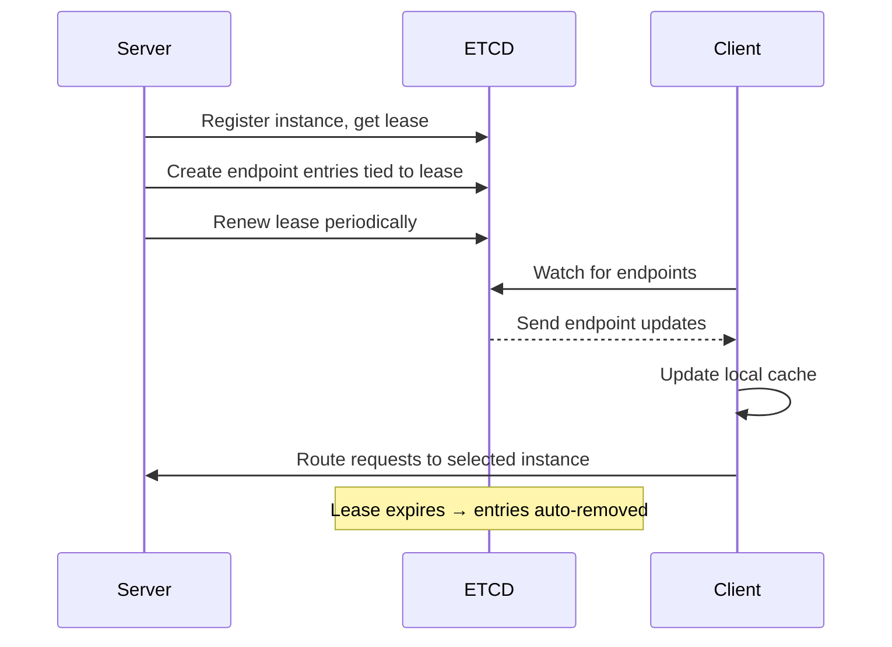
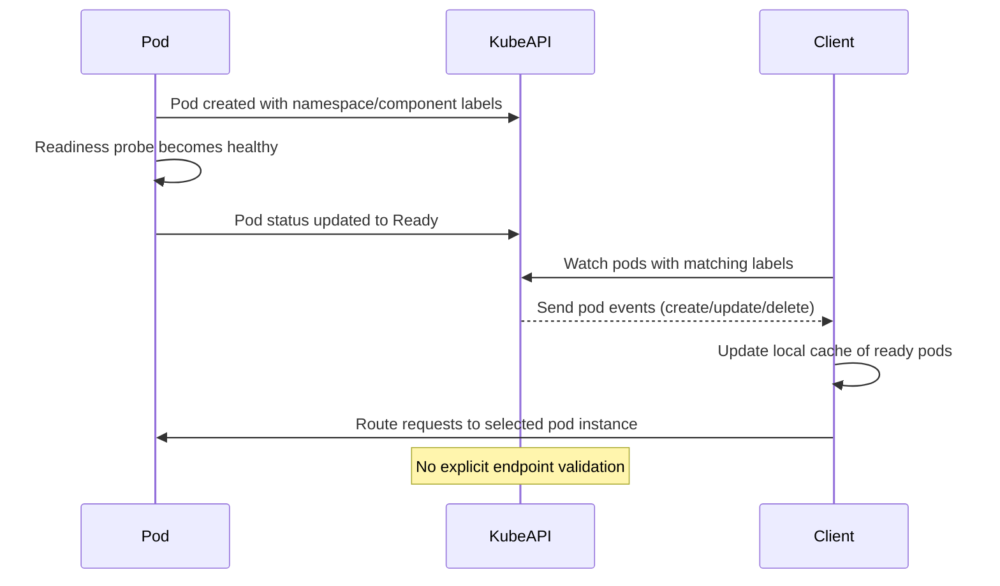
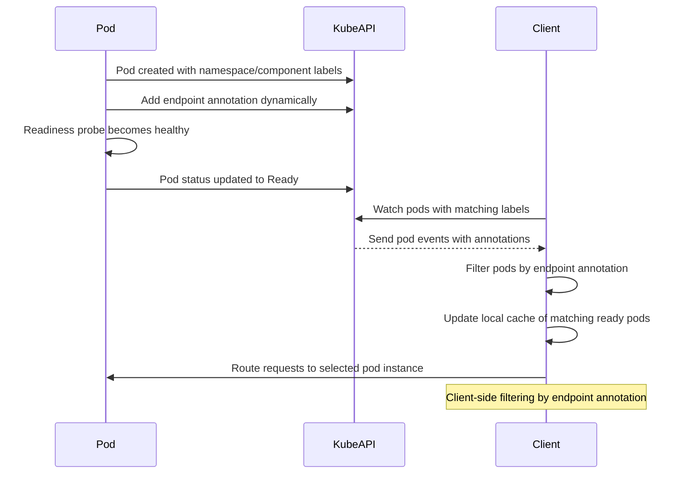

# ETCD-less Dynamo in Kubernetes: Endpoint Instance Discovery

## Background

This document is part of a series of deps attempting to eliminate the ETCD dependency in Dynamo. 

Source: https://github.com/ai-dynamo/enhancements/blob/neelays/runtime/XXXX-runtime-infrastructure.md

ETCD usage in Dynamo can be categorized into the following:
- Endpoint Instance Discovery (Current focus)
- Model / Worker Discovery
- Worker Port Conflict Resolution
- Router State Sharing Synchronization

Here we resolve how we can achieve endpoint instance discovery without ETCD in Kubernetes environments.


## Current Implementation of Endpoint Instance Discovery

Here is a primer on the current implementation of endpoint instance discovery between a server and a client.

### APIs
```python
# server side
endpoint = runtime.namespace("dynamo").component("backend")
service = await component.create_service()
endpoint = service.endpoint("generate")
await endpoint.serve_endpoint(RequestHandler().generate)

# client side
endpoint = runtime.namespace("dynamo").component("backend").endpoint("generate")
client = await endpoint.client()
await client.wait_for_instances()
stream = await client.generate("request")
```

### Server Side:
1. Server registers with DRT, receiving a primary lease (unique instance identifier) from ETCD
2. Server creates one or more entries in ETCD advertising its endpoint. The entry is tied to the lease of the instance.
3. Server continues to renew the lease. This keeps its associated endpoint entries alive. If a lease fails to renew, associated endpoint entries are automatically removed by ETCD.

### Client Side:
1. Client asks ETCD for a watch of endpoints 
2. Client maintains a cache of such entries, updating its cache as it receives updates from ETCD.
3. Client selects one of the endpoint instances in its cache and routes requests to it.

```bash
# Example of an etcd key showing an endpoint entry associated with an instance
$ etcdctl get --prefix instances/
instances/dynamo/worker/generate:5fc98e41ac8ce3b
{
    "endpoint":"generate",
    "namespace":"dynamo",
    "component":"worker",
    "endpoint_id":"generate",
    "instance_id":"worker-abc123",
    "transport":"nats..."
}
```



**How do we achieve these (or roughly similar) APIs in Kubernetes?**

## Approach 1: Ready pod <=> Ready component (No explicit endpoint entity)

High level ideas:
- Each pod is a unique instance of a component. The operator attaches labels for namespace, component to the pod.
- The readiness probe of the pod reflects the health of the instance. If it is ready, clients can route traffic to it.
- The readiness probe is only 200 when all endpoints are ready.
- The pod name is the unique instance identifier for internal use. When using NATS based transport, the topic is a function of the pod name.
- Clients simply set a watch for ready pods matching the labels for namespace, component. They update their cache of instances as events arrive (pod creation, pod deletion, pod readiness change).
- ***NOTE***: There is no explicit entity for endpoint. Clients know apriori which endpoints are available for a component. If the client made a mistake this will be known at request time.


### APIs

APIs stay the same

```python
# SERVER SIDE

# Operator creates a pod with labels for namespace, component. The namespace, component, and pod name are injected into the pod.
# get_component() returns a struct with info on the current instance's namespace, component, and pod name.
endpoint = get_component().endpoint("generate")
# subscribes to a NATS topic that is a function of (namespace, component, endpoint, pod name)
await endpoint.serve_endpoint(RequestHandler().generate)

# CLIENT SIDE

# setup a kube watch for pods matching the labels for namespace, component
# block until a ready pod is found that matches the labels for namespace, component
# NOTE: No validation is done that the pod actually serves the endpoint that we are interested in
endpoint = runtime.namespace("dynamo").component("backend").endpoint("generate")
client = await endpoint.client()
await client.wait_for_instances()

# write to the NATS topic that is a function of (namespace, component, endpoint, pod name)
# errors out if the component doesn't actually have such an endpoint
stream = await client.generate("request")
```



Notes:
- Assumes that all components serve the same set of endpoints.
- If a client makes a mistake and requests a non-existent endpoint, it will error out at request time.
- Addressing relies on convention. I know the names of the endpoints that are available on a given component.
- Assumes each pod holds exactly 1 instance of a component (TODO: what setups is this not true for?)

## Approach 2: Endpoints are dynamically exposed and discovered on components

This approach is very similar to the first approach, but we components dynamically expose endpoints. Idea from Julien M.

High level ideas:
- Pod adds an annotation on itself to list out the endpoints it exposes. The labels for namespace and component are injected as before.
- Clients watch for pod events on the tuple (namespace, component) and do a client side filter to check if there is an annotation on the pod matching the endpoint they are interested in.

```yaml
# Example pod annotation
apiVersion: v1
kind: Pod
metadata:
  name: dynamo-pod-abc123
  labels:
    nvidia.com/dynamo-namespace: dynamo # set by pod
    nvidia.com/dynamo-component: backend
  annotations:
    dynamo.nvidia.com/endpoint/generate="{...}" # pod dynamically adds and updates this annotatino
    dynamo.nvidia.com/endpoint/generate_tokens="{...}"

```

### APIs

APIs stay the same

```python
# SERVER SIDE

# Operator creates a pod with labels for namespace, component. The namespace, component, and pod name are injected into the pod.
# get_component() returns a struct with info on the current instance's namespace, component, and pod name.
endpoint = get_component().endpoint("generate")
# NEW: Modifies its own annotation to add the endpoint to the list of endpoints it serves
# subscribes to a NATS topic that is a function of (namespace, component, endpoint, pod name)
await endpoint.serve_endpoint(RequestHandler().generate)

# CLIENT SIDE

# setup a kube watch for pods matching the labels for namespace, component
# filter the pods to only include ones that have the endpoint in their annotation
# block until a READY pod is found that matches the labels for namespace, component and has the endpoint in their annotation
endpoint = runtime.namespace("dynamo").component("backend").endpoint("generate")
client = await endpoint.client()
await client.wait_for_instances()

# write to the NATS topic that is a function of (namespace, component, endpoint, pod name)
stream = await client.generate("request")
```



Notes:
- Allows for storage of metadata associated with the endpoint in the annotation
- Allows for dynamic updates of endpoints
- Client side parsing and filtering of the annotation may add overhead
- Honors the API, blocks until we know for sure an endpoint is available on the given component

## Approach 3: Endpoints associated with a component are statically defined on the DGD

This approach is similar to the first approach, but the endpoints and any metadata about them are statically defined on the DGD.

Instead of a pod dynamically adding and updating its own annotations, the operator can define a set of labels on pod start that enable it to be watched by clients.

```yaml
# Example DGD
apiVersion: v1
kind: DGD
metadata:
  name: dynamo-dgd-abc123
  labels:
    nvidia.com/dynamo-namespace: dynamo
    nvidia.com/dynamo-component: backend
    nvidia.com/expose-dynamo-endpoint/generate: true
    nvidia.com/expose-dynamo-endpoint/generate_tokens: true
```

Notes:
- Endpoints of the component are codified in the spec itself
- TODO: enforce that the application logic exposes the endpoints that it is supposed to according to what is defined in the spec
