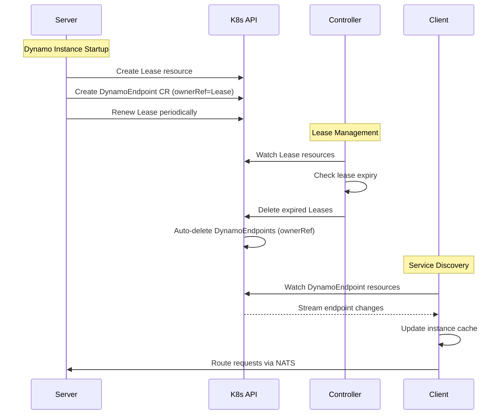
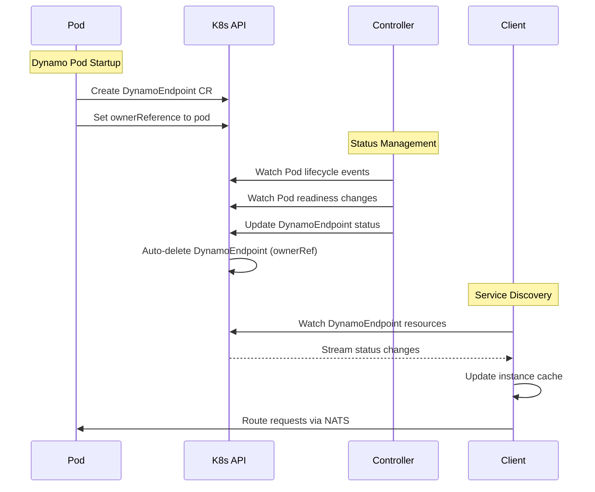
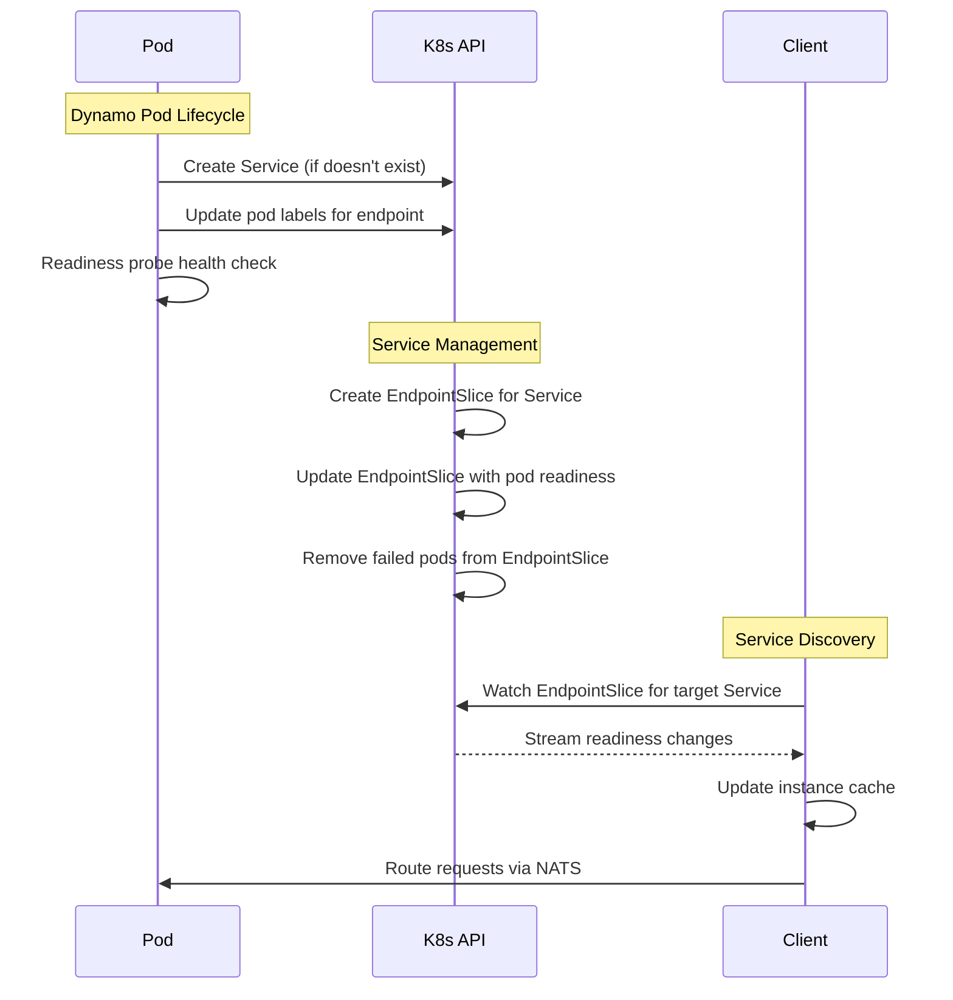

# Alternative Approach to ETCD Dependency in Kubernetes

## Problem

Customers are hesitant to stand up and maintain dedicated etcd clusters to deploy Dynamo. ETCD, however, is a hard dependency of the Dynamo Runtime.

It enables the following functionalities within DRT:

- Heartbeats/leases
- Component Registry/Service Discovery
- Cleanup on Shutdown
- General Key-value storage for various purposes (KVCache Metadata, Model Metadata, etc.)

## ETCD and Kubernetes

Kubernetes stores its own state in ETCD. With a few tradeoffs, we can use native Kubernetes APIs and Resources to achieve the same functionality. Under the hood, these operations are still backed by etcd. This amounts to an alternative implementation of the Dynamo Runtime interface that can run without needing ETCD in K8s environments.

This document explores a few approaches to achieve this.

Note: This document is only to explore alternative approaches to eliminating the ETCD dependency. Decoupling from NATS (the transport layer) is a separate concern.

## DRT Component Registry Primer

Here is a primer on the core workflow that ETCD is used for in DRT:

```python
# server.py - Server side workflow
from dynamo.runtime import DistributedRuntime, dynamo_worker

@dynamo_worker(static=False)
async def worker(runtime: DistributedRuntime):
    component = runtime.namespace(ns).component("backend")
    await component.create_service()
    endpoint = component.endpoint("generate")

    await endpoint.serve_endpoint(RequestHandler().generate)
```

```python
# client.py - Client side workflow
from dynamo.runtime import DistributedRuntime, dynamo_worker

@dynamo_worker(static=False)
async def worker(runtime: DistributedRuntime):
    await init(runtime, "dynamo")

    endpoint = runtime.namespace(ns).component("backend").endpoint("generate")

    # Create client and wait for an endpoint to be ready
    client = await endpoint.client()
    await client.wait_for_instances()

    stream = await client.generate("hello world")
    async for char in stream:
        print(char)
```

### Server Side:
1. Server registers with DRT, receiving a primary lease (unique instance identifier) from ETCD
2. Server creates an entry in ETCD advertising its endpoint. The entry is tied to the lease of the instance.
3. Server continues to renew the lease. This keeps its associated endpoint entries alive. If a lease fails to renew, associated endpoint entries are automatically removed by ETCD.

### Client Side:
1. Client asks ETCD for a watch of endpoints.
2. Client maintains a cache of such entries, updating its cache as it receives updates from ETCD.
3. Client uses the transport to target one of the instances in its cache.

```bash
# Example etcd keys showing endpoints
$ etcdctl get --prefix instances/
instances/dynamo/worker/generate:5fc98e41ac8ce3b
{
    "endpoint":"generate",
    "namespace":"dynamo",
    "component":"worker",
    "endpoint_id":"generate",
    "instance_id":"worker-abc123",
    "transport":"nats..."
}
```

Summary of entities:
- Leases: Unique identifier for an instance with TTL and auto-renewal
- Endpoints: Service registration entries associated with a lease
- Watches: Real-time subscription to key prefix changes

Summary of operations:
- Creating/renewing leases: create_lease(), keep_alive background task
- Creating endpoints: kv_create() with lease attachment
- Watching endpoints: kv_get_and_watch_prefix() for real-time updates
- Automatic cleanup: Lease expiration removes associated keys

Key ETCD APIs used in Dynamo Runtime (from lib/runtime/src/transports/etcd.rs):

Lease Management:
- create_lease() - Create lease with TTL
- revoke_lease() - Revoke lease explicitly

Key-Value Operations:
- kv_create() - Create key if it doesn't exist
- kv_create_or_validate() - Create or validate existing key
- kv_get_and_watch_prefix() - Get initial values and watch for changes


## Approach 1: Lease-Based Endpoint Registry

We use the kubectl `watch` API and Custom Resources for Lease and DynamoEndpoint to achieve similar functionality.

### Server side:
1. Server registers with DRT, creating a Lease resource in K8s
2. Server creates a DynamoEndpoint CR in K8s with the owner ref set to its Lease resource
3. Server renews its Lease, keeping the controller/operator from terminating it (and the associated DynamoEndpoint CR)

### Client side:
1. Client asks K8s for a watch of DynamoEndpoints (using the kubectl `watch` API).
2. Client maintains a cache of such entries, updating its cache as it receives updates from K8s
3. Client uses the transport to target one of the instances in its cache.

### Controller:
1. Dynamo controller is responsible for deleting leases that have not been renewed.
2. When a lease is deleted, all associated DynamoEndpoint CRs are also deleted.



```yaml
# Example Lease resource
apiVersion: coordination.k8s.io/v1
kind: Lease
metadata:
  name: dynamo-lease
  namespace: dynamo
  ownerReferences:
    - apiVersion: pods/v1
      kind: Pod
      name: dynamo-pod-abc123
spec:
  holderIdentity: dynamo-pod-abc123
  leaseDurationSeconds: 30
  renewDeadlineSeconds: 20
```

```yaml
# Example DynamoEndpoint CR
apiVersion: dynamo.nvidia.com/v1alpha1
kind: DynamoEndpoint
metadata:
  name: dynamo-endpoint
  namespace: dynamo
  ownerReferences:
    - apiVersion: coordination.k8s.io/v1
      kind: Lease
      name: dynamo-lease
  labels:
    dynamo-namespace: dynamo
    dynamo-component: backend
    dynamo-endpoint: generate
spec:
    ...
```

Kubernetes concepts:
- Lease: Existing Kubernetes resource in the coordination.k8s.io API group
- Owner references: Metadata establishing parent-child relationships for automatic cleanup
- kubectl watch API: Real-time subscription to resource changes
- Custom resources: Extension mechanism for arbitrary data storage. We can introduce a new CRD for DynamoEndpoint and DynamoModel and similar to store state associated with a lese.

Notes:
- Requires a controller to delete leases on expiry. This is not something k8s automatically handles for us.
- prefix-based watching for changes is not supported by the kubectl `watch` api. We can however watch on a set of labels that correspond to the endpoints we are interested in.
- Unavoidable: overhead of going through kube api as opposed to direct etcd calls.
- Need to work out atomicity of operations


## Approach 2: Controller-managed DynamoEndpoint Resources

Pods create DynamoEndpoint resources directly, but a controller keeps status in sync with underlying pod readiness status. Instead of using leases, we sync with the readiness status of the pod (as advertised by the probe).

### Server side:
1. Dynamo pods create DynamoEndpoint CRs directly when they start serving an endpoint
2. Pods set ownerReferences to themselves on the DynamoEndpoint resources
3. DynamoEndpoint resources are automatically cleaned up when pods terminate

### Controller:
1. Dynamo controller watches pod lifecycle events and readiness status
2. Controller updates the status field of DynamoEndpoint resources based on pod readiness
3. Controller maintains instance lists and transport information in DynamoEndpoint status

### Client side:
1. Client watches DynamoEndpoint resources using kubectl watch API
2. Client maintains cache of available instances from DynamoEndpoint status
3. Client routes requests to healthy instances via NATS transport



```yaml
# Example DynamoEndpoint resource
apiVersion: dynamo.nvidia.com/v1alpha1
kind: DynamoEndpoint
metadata:
  name: dynamo-generate-endpoint
  namespace: dynamo
  labels:
    dynamo-namespace: dynamo
    dynamo-component: backend
    dynamo-endpoint: generate
  ownerReferences:
  - apiVersion: v1
    kind: Pod
    name: dynamo-pod-abc123
    uid: abc123-def456
spec:
  endpoint: generate
  namespace: dynamo
  component: backend
status:
    ready: true # controller updates this on readiness change events
```

Kubernetes concepts:
- Custom Resource Definitions: Define the schema for DynamoEndpoint resources
- Owner references: Automatic cleanup when pods terminate

Notes:
- Controller is in charge of updating the status of the DynamoEndpoint as underlying pod readiness changes.


## Approach 3: EndpointSlice based discovery

Disclaimer: This idea is still WIP. It is similar to Approach 2, but eliminates the need for a controller relying on the Kubernetes Service controller to keep EndpointSlices up to date.

### Server side:
1. Dynamo operator creates server instances. Pods are labeled with `dynamo-namespace` and `dynamo-component`.
2. When a pod wants to serve an endpoint, it performs two actions:
   - Creates a Service for that endpoint (if it doesn't exist) with selectors:
     - `dynamo-namespace`
     - `dynamo-component`
     - `dynamo-endpoint-<NAME>: true`
   - Patches its own labels to add `dynamo-endpoint-<NAME>: true`
3. Readiness probe status reflects the health of this specific endpoint.

### Client side:
1. Client watches EndpointSlices associated with the target Kubernetes Service.
2. EndpointSlices maintain the current state of pods serving the endpoint and their readiness status.
3. Client maintains a cache of available instances, updating as EndpointSlice changes arrive.
4. Client routes requests to healthy instances via NATS transport.



Kubernetes concepts:
- Services and EndpointSlices: Services define pod sets, EndpointSlices track pod addresses and readiness
- Readiness probes: Health checks that determine pod readiness for traffic

```yaml
# Example Service and EndpointSlice
apiVersion: v1
kind: Service
metadata:
  name: dynamo-generate-service
  namespace: dynamo
  labels:
    dynamo-namespace: dynamo
    dynamo-component: backend
    dynamo-endpoint: generate
spec:
  selector:
    dynamo-namespace: dynamo
    dynamo-component: backend
    dynamo-endpoint-generate: "true"
  ports: # dummy port since transport isn't actually taking place through this
  - ...
  type: ClusterIP

---
apiVersion: discovery.k8s.io/v1
kind: EndpointSlice
metadata:
  name: dynamo-generate-service-abc12
  namespace: dynamo
  labels:
    kubernetes.io/service-name: dynamo-generate-service
addressType: IPv4
ports:
- ... # dummy port since transport isn't actually taking place through this
endpoints:
- addresses:
  - "10.0.1.100"
  conditions:
    ready: true
  targetRef:
    apiVersion: pods/v1
    kind: Pod
    name: dynamo-pod-abc123
- addresses:
  - "10.0.1.101"
  conditions:
    ready: false  # Pod failed readiness probe
  targetRef:
    apiVersion: pods/v1
    kind: Pod
    name: dynamo-pod-def456
```

Notes:
- Pro: We don't need a dedicated controller to delete leases on expiry. (No leases)
- We need to find a better pattern for a pod to influence the services it is part of than mutating its label set. Potentially a controller could be involved.
- The service is not actually used for transport here. Only to manage the EndpointSlices which are doing book keeping for which pods are backing the endpoint.
