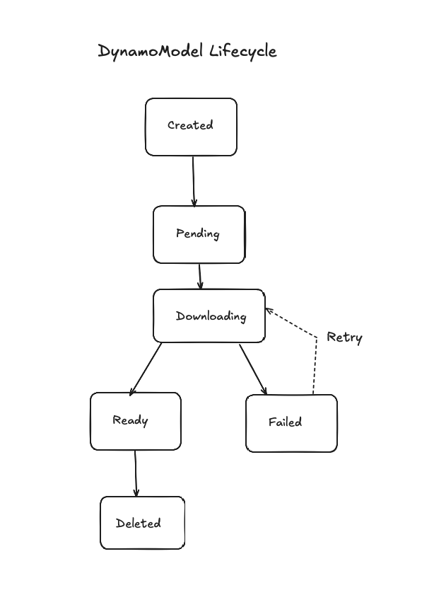
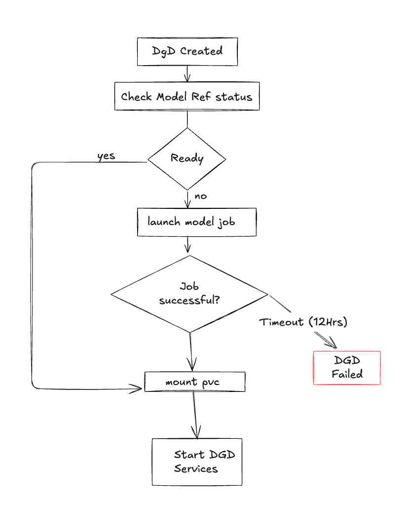

# DynamoModel: Kubernetes Custom Resource to simplify Model Lifecycle Management UX

**Status**: In-review

**Authors**: [biswapanda](https://github.com/biswapanda)

**Category**: Architecture

**Required Reviewers**: [Maksim, Itay, Anish, Ganesh, Neelay, Kavin]

**Review Date**: [targeted: Oct 9, 2025]


**Slack thread**: [link](https://nvidia.slack.com/archives/C06850J381Y/p1758647954211439?thread_ts=1758613631.539669&cid=C06850J381Y)

# Summary

This proposal introduces `DynamoModel`, a dedicated Kubernetes Custom Resource (CR) for managing model lifecycle in the Dynamo ecosystem. DynamoModel decouples model downloading, versioning, and caching from DynamoGraphDeployment (DGD), enabling consistent model references across deployments, benchmarks, and services while eliminating boilerplate code and preventing model version drift.

# Motivation

Currently, Dynamo users face three critical challenges:

1. **Model Version Drift**: Inconsistent behavior occurs when AI-perf benchmarks use different model versions than deployments. This was observed during 70B model benchmarking where the deployment used stale weights while the benchmark job pulled the latest commit from HuggingFace.

2. **No Cross-Deployment/perf job Model Reuse**: Multiple DGDs or aiperf jobs cannot easily share the same model weights, leading to duplicated operational overhead managing PVCs, secrets, and Jobs.

3. **Boilerplate Code**: Each deployment requires *manual* setup of PVCs, secrets, and Jobs to download models before starting DGD, adding complexity and maintenance burden.

These issues stem from tightly coupling model management with deployment lifecycle, making it difficult to:
- Pin specific model versions across the ecosystem
- Share models between multiple deployments and benchmarks
- Verify model weights readiness before starting workers (Currently, this is done by users manually)

## Goals

- Decouple model lifecycle from DynamoGraphDeployment lifecycle
- Enable model version pinning and eliminate version drift
- Provide model sharing across multiple DynamoGraphDeployments and aiperf jobs
- Simplify model download operations through operator-managed automation
- Ensure services or aiperf workers only start after model weights are fully downloaded and verified

### Non Goals

- Providing model registry functionality (models still sourced from HF/S3/NGC)

# Requirements

### Model Source Flexibility
DynamoModel MUST support multiple model sources including HuggingFace Hub, S3-compatible storage, NVIDIA NGC, and local file systems. The CR MUST use URI schemes (e.g., `hf://`, `s3://`, `ngc://`, `file://`) to specify sources.

### Version Immutability
Once a DynamoModel CR references a specific model version (e.g., HuggingFace commit SHA), that version MUST NOT change unless the CR is explicitly updated. This ensures deployment consistency.

### Status-Based Readiness
DynamoModel MUST expose a status field indicating readiness states (`Pending`, `Downloading`, `Ready`, `Failed`). Dependent resources (DGD, AIperf Job) SHOULD be able to wait for `Ready` state before proceeding.

### Storage Persistence
Downloaded model weights MUST be stored in Persistent Volume Claims (PVCs) that persist beyond the lifecycle of individual DGDs, enabling reuse across multiple deployments.

### Credential Management
DynamoModel MUST support Kubernetes Secret references for authenticated model sources (private HuggingFace repos, S3 buckets with credentials).

# Proposal

## DynamoModel Custom Resource Definition

```yaml
apiVersion: nvidia.com/v1alpha1
kind: DynamoModel
metadata:
  name: llama-3-70b-instruct-v1
  namespace: dynamo-system
spec:
  # Model identification
  modelName: meta-llama/Llama-3.3-70B-Instruct
  version: 8a4556b53a7d81d7e07db15eafb5af5dcd321b33  # HuggingFace commit SHA
  # Source configuration
  source:
    uri: hf://meta-llama/Llama-3.3-70B-Instruct
    secretRef:
      name: huggingface-token
      key: token
  # Storage configuration
  storage:
    pvc:
      create: true                       # Auto-create PVC
      name: llama-3-70b-instruct-v1-pvc  # Optional explicit name override defaults to <cr-name>-pvc
      storageClassName: fast-nvme        # Simple field for convenience
      size: 150Gi                        # Simple field for convenience
      accessModes:
          - ReadWriteMany
      extraPvcSpec: {}
    # OR reference existing PVC
    # pvc:
    #   name: existing-model-cache
    #   subPath: llama-3-70b

  # Optional: Download configuration (defaults to HF Downloader or Base Dynamo image with HF)
  downloader:
    image: my-registry/hf-downloader:my-tag # HF Downloader
    resources: {}
    retryLimit: 5
    timeout: 3600s
```


Status is updated as follows after the model is downloaded:
```yaml
status:
  phase: Ready  # Pending | Downloading | Ready | Failed
  conditions:
    - type: Downloaded
      status: "True"
      lastTransitionTime: "2025-10-07T10:30:00Z"
      reason: DownloadComplete
      message: "Model downloaded successfully"
  # Storage details
  storageRef:
    pvcName: llama-3-70b-instruct-v1-pvc
    path: /models/llama-3-70b-instruct-v1
  # Metadata
  modelSize: 140Gi
  downloadStartTime: "2025-10-07T10:00:00Z"
  downloadCompleteTime: "2025-10-07T10:30:00Z"
  lastAccessTime: "2025-10-07T12:15:00Z"
  # Usage tracking
  referencedBy:
    - kind: DynamoGraphDeployment
      name: vllm-disagg
      namespace: dynamo-system
```

## DynamoGraphDeployment Integration

DGDs reference models using `modelRef`:

```yaml
apiVersion: nvidia.com/v1alpha1
kind: DynamoGraphDeployment
metadata:
  name: vllm-disagg
  namespace: dynamo-system
spec:
  services:
    VllmPrefillWorker:
      modelRef:
        name: llama-3-70b-instruct-v1
        mountPath: /models              # Where to mount in container
      replicas: 2
      image: my-registry/vllm:my-tag

    VllmDecodeWorker:
      modelRef:
        name: llama-3-70b-instruct-v1
        mountPath: /models
      replicas: 4
```

# Lifecycle

## DynamoModel Lifecycle

DynamoModel States and Transitions

State: Created
 - Transition: Created -> Pending
  When the DynamoModel resource is created and accepted by the controller

State: Pending
 - Transition: Pending -> Downloading
   When the controller starts the model download job

State: Downloading
 - Transition: Downloading -> Ready
    When the model is downloaded successfully
 - Transition: Downloading -> Failed
     When the model download fails

State: Failed
 - Transition: Failed -> Downloading
   When a retry is triggered after a failure

State: Ready
 - Transition: Ready -> Deleted
   When the DynamoModel resource is deleted

State: Deleted
   Terminal state; no further transitions

## DGD Lifecycle with Model Dependencies



### DGD Controller Changes

The existing DynamoGraphDeployment controller needs modifications:

1. **Model Reference Resolution**: When a service spec contains `modelRef`, resolve it to the actual DynamoModel CR
2. **Readiness Gating**: Before creating worker Deployments, check that the referenced model's `Ready` condition is `True`
3. **PVC Mounting**: Automatically mount the model's PVC to worker pods
4. **Environment Variables**: Set `MODEL_PATH` environment variable to the model's mount path
5. **Reference Counting**: Increment/decrement the model's `referenceCount` when DGDs are created/deleted
6. **Watch Events**: Watch for DynamoModel status changes to trigger DGD reconciliation


# Benefits

- Eliminates boilerplate (PVC/Job init) by centralizing model operations in the operator
- Prevents model version drift with immutable version pinning
- Enables sharing across DGDs and aiperf jobs (single PVC, multiple mounts)
- Improves observability via status conditions
- Extensible to multiple sources (HF/S3/NGC/File) and future features (LoRA, air-gapped deployments from private model registries)


## Additional Considerations

- Model verification:
  - We can add verification of the entire folder (sorted by file path)
  - Problem: HF doesn't provide folder checksums - these neeed to be pre-computed
  - verification:
    - enabled: true
    - checksum: sha256:abc123 

```yaml
apiVersion: nvidia.com/v1alpha1
kind: DynamoModel
metadata:
  name: llama-3-70b-instruct-v1
  namespace: dynamo-system
spec:
  # Additional verification
  verification:
    enabled: true
    checksum: sha256:abc123 
  status:
    conditions:
    - type: Verified
      status: "True"
      lastTransitionTime: "2025-10-07T10:30:00Z"
      reason: ChecksumValid
      message: "Model verification passed"

```